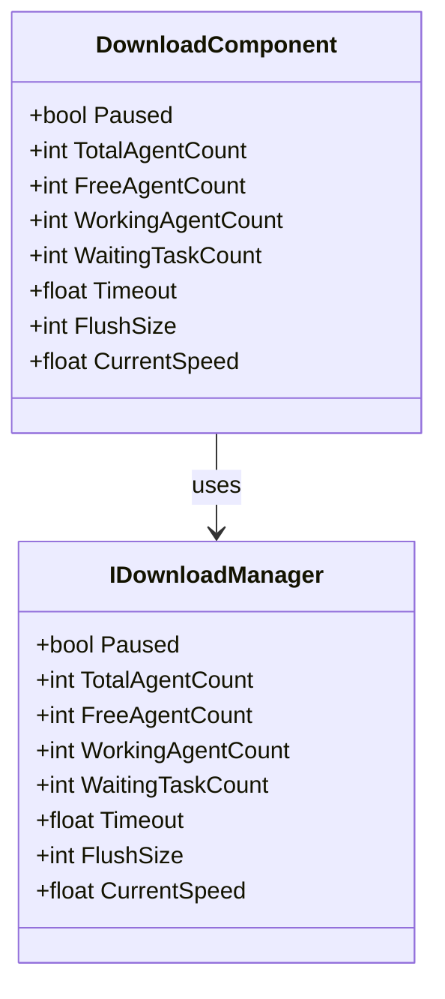
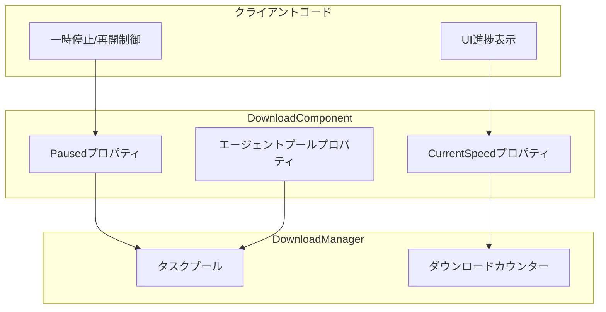

# プロパティ

このドキュメントでは、DownloadComponentコンポーネント及其関連するインターフェース、イベントパラメータで公開されているすべてのパブリックプロパティについて詳しく説明します。

## 概要

ダウンロードモジュールはダウンロードタスクの状態を監視・制御するための豊富なプロパティを提供します。主要なプロパティは以下のカテゴリに分類されます：

1. **状態制御プロパティ** - ダウンロードの一時停止/再開を制御
2. **エージェントプールプロパティ** - ダウンロードエージェントの使用状況を監視
3. **パフォーマンス設定プロパティ** - タイムアウトとバッファサイズを設定
4. **監視プロパティ** - リアルタイムのダウンロード状態を取得



## DownloadComponentプロパティ

DownloadComponentはダウンロードシステムのコアコンポーネントであり、GameFrameworkComponentを継承しています。以下はすべてのパブリックプロパティの詳細な説明です：

> 出典: [DownloadComponent.cs](https://github.com/GameFrameX/com.gameframex.unity.download/blob/main/Runtime/Download/DownloadComponent.cs#L46-L108)

### `Paused`

```csharp
public bool Paused
{
    get { return m_DownloadManager.Paused; }
    set { m_DownloadManager.Paused = value; }
}
```

**型：** `bool`
**読み取り/書き込み：** 読み取り・書き込み可能
**説明：** ダウンロードが一時停止されているかどうかを取得または設定します。`true`に設定すると、すべての進行中のダウンロードタスクと待機中のタスクが一時停止されます。`false`に設定すると、一時停止されたタスクの実行が再開されます。

**使用例：**

```csharp
// すべてのダウンロードを一時停止
var downloadComponent = GameEntry.GetComponent<DownloadComponent>();
downloadComponent.Paused = true;

// ダウンロードを再開
downloadComponent.Paused = false;
```

### `TotalAgentCount`

```csharp
public int TotalAgentCount
{
    get { return m_DownloadManager.TotalAgentCount; }
}
```

**型：** `int`
**読み取り/書き込み：** 読み取り専用
**説明：** ダウンロードエージェントの総数を取得します。これはシステムが起動時に作成したダウンロードエージェントインスタンスの合計数であり、システムが並列処理できる最大ダウンロードタスク数を反映します。

### `FreeAgentCount`

```csharp
public int FreeAgentCount
{
    get { return m_DownloadManager.FreeAgentCount; }
}
```

**型：** `int`
**読み取り/書き込み：** 読み取り専用
**説明：** 使用可能（空き）ダウンロードエージェント数を取得します。この値が0より大きい場合、新しいダウンロードタスクを即座に追加でき、待機する必要がありません。

### `WorkingAgentCount`

```csharp
public int WorkingAgentCount
{
    get { return m_DownloadManager.WorkingAgentCount; }
}
```

**型：** `int`
**読み取り/書き込み：** 読み取り専用
**説明：** 作業中（_busy）ダウンロードエージェント数を取得します。現在ダウンロードタスクを実行しているエージェント数を表します。

### `WaitingTaskCount`

```csharp
public int WaitingTaskCount
{
    get { return m_DownloadManager.WaitingTaskCount; }
}
```

**型：** `int`
**読み取り/書き込み：** 読み取り専用
**説明：** 待機中のダウンロードタスク数を取得します。システムにはダウンロードエージェント数が限られているため、すべてのエージェントが_busyの場合、新しく追加されたタスクは待機キューに入ります。

### `Timeout`

```csharp
public float Timeout
{
    get { return m_DownloadManager.Timeout; }
    set { m_DownloadManager.Timeout = m_Timeout = value; }
}
```

**型：** `float`
**読み取り/書き込み：** 読み取り・書き込み可能
**デフォルト値：** `30.0f`（30秒）
**説明：** ダウンロードタイムアウト時間を秒単位で取得または設定します。単一のダウンロードタスクがこの時間を超えて完了しない場合、ダウンロード失敗イベントがトリガーされます。

### `FlushSize`

```csharp
public int FlushSize
{
    get { return m_DownloadManager.FlushSize; }
    set { m_DownloadManager.FlushSize = m_FlushSize = value; }
}
```

**型：** `int`
**読み取り/書き込み：** 読み取り・書き込み可能
**デフォルト値：** `1048576`（1MB、1024 * 1024）
**説明：** バッファをディスクに書き込む閾値を取得または設定します。レジューム機能を有効にしている場合のみ有効です。この値はデータが最終ファイルに書き込まれる前にメモリバッファに蓄積する必要があるサイズを決定し、大きい値は書き込みパフォーマンスを向上させますがメモリ使用量が増加します。

### `CurrentSpeed`

```csharp
public float CurrentSpeed
{
    get { return m_DownloadManager.CurrentSpeed; }
}
```

**型：** `float`
**読み取り/書き込み：** 読み取り専用
**単位：** バイト/秒（B/s）
**説明：** 現在のダウンロード速度を取得します。これはシステムがリアルタイムで計算した下り速率であり、ダウンロード進捗UIの表示に使用できます。

## イベントパラメータプロパティ

ダウンロードモジュールはイベントシステムを通じて外部にダウンロード状態の変化を通知します。以下は各イベントパラメータクラスで公開されているプロパティです：

### DownloadStartEventArgs

ダウンロード開始時にトリガーされるイベントパラメータです。

> 出典: [DownloadStartEventArgs.cs](https://github.com/GameFrameX/com.gameframex.unity.download/blob/main/Runtime/EventArgs/DownloadStartEventArgs.cs#L35-L55)

| プロパティ | 型 | 説明 |
|------|------|------|
| `SerialId` | `int` | ダウンロードタスクのシリアル番号。一意にダウンロードタスクを識別するために使用 |
| `DownloadPath` | `string` | ダウンロード後のローカルパス |
| `DownloadUri` | `string` | 元のダウンロードアドレス（URL） |
| `CurrentLength` | `long` | 現在ダウンロード済みのサイズ（バイト） |
| `UserData` | `object` | ユーザー定義データ |

### DownloadUpdateEventArgs

ダウンロード進捗更新時にトリガーされるイベントパラメータです。

> 出典: [DownloadUpdateEventArgs.cs](https://github.com/GameFrameX/com.gameframex.unity.download/blob/main/Runtime/EventArgs/DownloadUpdateEventArgs.cs#L35-L55)

| プロパティ | 型 | 説明 |
|------|------|------|
| `SerialId` | `int` | ダウンロードタスクのシリアル番号 |
| `DownloadPath` | `string` | ダウンロード後のローカルパス |
| `DownloadUri` | `string` | 元のダウンロードアドレス |
| `CurrentLength` | `long` | 現在ダウンロード済みのサイズ |
| `UserData` | `object` | ユーザー定義データ |

### DownloadSuccessEventArgs

ダウンロードが正常に完了した時にトリガーされるイベントパラメータです。

> 出典: [DownloadSuccessEventArgs.cs](https://github.com/GameFrameX/com.gameframex.unity.download/blob/main/Runtime/EventArgs/DownloadSuccessEventArgs.cs#L35-L56)

| プロパティ | 型 | 説明 |
|------|------|------|
| `SerialId` | `int` | ダウンロードタスクのシリアル番号 |
| `DownloadPath` | `string` | ダウンロード後のローカルパス |
| `DownloadUri` | `string` | 元のダウンロードアドレス |
| `CurrentLength` | `long` | 最終ダウンロードファイルのサイズ |
| `UserData` | `object` | ユーザー定義データ |

### DownloadFailureEventArgs

ダウンロード失敗時にトリガーされるイベントパラメータです。

> 出典: [DownloadFailureEventArgs.cs](https://github.com/GameFrameX/com.gameframex.unity.download/blob/main/Runtime/EventArgs/DownloadFailureEventArgs.cs#L35-L55)

| プロパティ | 型 | 説明 |
|------|------|------|
| `SerialId` | `int` | ダウンロードタスクのシリアル番号 |
| `DownloadPath` | `string` | ダウンロード後のローカルパス |
| `DownloadUri` | `string` | 元のダウンロードアドレス |
| `ErrorMessage` | `string` | エラーメッセージの説明 |
| `UserData` | `object` | ユーザー定義データ |

## プロパティの関係とデータフロー

以下の図は各プロパティの関係とデータフローを示しています：



## 使用例

### ダウンロード状態を監視

以下の例はプロパティを使用してダウンロードシステム状態を監視する方法を示しています：

```csharp
public class DownloadStatusMonitor : MonoBehaviour
{
    private DownloadComponent _downloadComponent;

    private void Start()
    {
        _downloadComponent = GameEntry.GetComponent<DownloadComponent>();
    }

    private void Update()
    {
        // リアルタイムダウンロード速度を取得
        float speed = _downloadComponent.CurrentSpeed;

        // エージェントプール状態を取得
        int total = _downloadComponent.TotalAgentCount;
        int free = _downloadComponent.FreeAgentCount;
        int working = _downloadComponent.WorkingAgentCount;
        int waiting = _downloadComponent.WaitingTaskCount;

        // UI表示を更新
        UpdateDownloadUI(speed, total, free, working, waiting);
    }

    private void UpdateDownloadUI(float speed, int total, int free, int working, int waiting)
    {
        // バイトをMB/sに変換
        float speedMB = speed / (1024 * 1024);
        Debug.Log($"ダウンロード速度: {speedMB:F2} MB/s | エージェント状態: {free}/{total} 空き | 作業中: {working} | 待機: {waiting}");
    }
}
```
> 出典: [DownloadComponent.cs](https://github.com/GameFrameX/com.gameframex.unity.download/blob/main/Runtime/Download/DownloadComponent.cs#L100-L108)

### ダウンロードの一時停止と再開

```csharp
public class DownloadController
{
    private DownloadComponent _downloadComponent;

    public void PauseAllDownloads()
    {
        _downloadComponent = GameEntry.GetComponent<DownloadComponent>();
        _downloadComponent.Paused = true;
        Debug.Log("すべてのダウンロードを一時停止しました");
    }

    public void ResumeAllDownloads()
    {
        if (_downloadComponent == null)
        {
            _downloadComponent = GameEntry.GetComponent<DownloadComponent>();
        }
        _downloadComponent.Paused = false;
        Debug.Log("ダウンロードを再開しました");
    }
}
```
> 出典: [DownloadComponent.cs](https://github.com/GameFrameX/com.gameframex.unity.download/blob/main/Runtime/Download/DownloadComponent.cs#L46-L50)

### ダウンロードパラメータを設定

```csharp
public void ConfigureDownload()
{
    var downloadComponent = GameEntry.GetComponent<DownloadComponent>();

    // タイムアウト時間を60秒に設定
    downloadComponent.Timeout = 60f;

    // バッファフラッシュサイズを2MBに設定
    downloadComponent.FlushSize = 2 * 1024 * 1024;

    Debug.Log($"タイムアウト: {downloadComponent.Timeout}s, バッファ: {downloadComponent.FlushSize} bytes");
}
```
> 出典: [DownloadComponent.cs](https://github.com/GameFrameX/com.gameframex.unity.download/blob/main/Runtime/Download/DownloadComponent.cs#L87-L100)

## 設定オプションまとめ

| プロパティ | 型 | デフォルト値 | 説明 |
|------|------|--------|------|
| `Paused` | `bool` | `false` | ダウンロードが一時停止されているか |
| `TotalAgentCount` | `int` | 設定による | ダウンロードエージェント総数 |
| `FreeAgentCount` | `int` | - | 使用可能なダウンロードエージェント数 |
| `WorkingAgentCount` | `int` | - | 作業中のダウンロードエージェント数 |
| `WaitingTaskCount` | `int` | - | 待機中のダウンロードタスク数 |
| `Timeout` | `float` | `30.0f` | ダウンロードタイムアウト時間（秒） |
| `FlushSize` | `int` | `1048576` | バッファからディスクへの書き込み閾値（バイト） |
| `CurrentSpeed` | `float` | - | 現在のダウンロード速度（バイト/秒） |

## 関連リンク

- [メソッド](./5-api-reference.methods) - DownloadComponentのすべてのメソッドについて
- [ダウンロードイベント](./6-events.download-events) - ダウンロードイベントシステムの詳細
- [アーキテクチャ概要](./4-core-concepts.architecture) - ダウンロードモジュール全体の構造
- [DownloadComponent](./4-core-concepts.download-component) - DownloadComponentコア概念