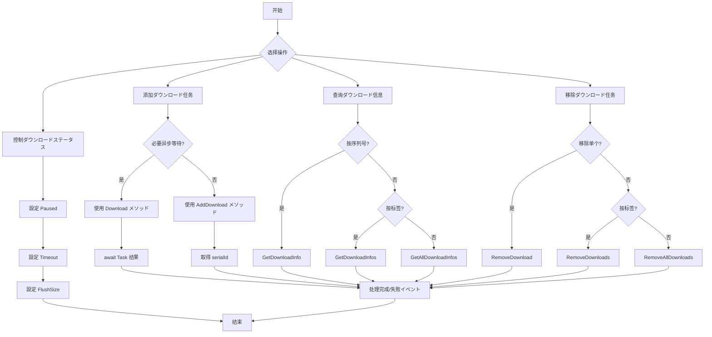

# メソッド

本文档详细介绍 DownloadComponent コンポーネント提供的所有公共メソッド。这些メソッドに使用管理ダウンロード任务、查询ダウンロードステータス和控制ダウンロード行为。

## 概要

DownloadComponent 是ゲームダウンロード機能的コアコンポーネント，提供します一套完整的异步ダウンロード任务管理 API。を通じて这些メソッド，開発者可能：

- 添加ダウンロード任务（サポート优先级、标签、用户自定义数据）
- 查询ダウンロード任务ステータス和进度
- 暂停/恢复ダウンロード
- 移除单个或批量ダウンロード任务
- 取得实时ダウンロード速度

## ダウンロード任务管理

### 添加ダウンロード任务

DownloadComponent 提供します 8 个 `AddDownload` メソッド重载，以满足不同的使用シーン。所有重载都返回新增ダウンロード任务的序列编号（serialId）。

#### 基础添加メソッド

```csharp
public int AddDownload(string downloadPath, string downloadUri)
```

添加一个基本的ダウンロード任务。

**参数：**
- `downloadPath` (string): ダウンロードファイル在本地存储的路径
- `downloadUri` (string): 远程ファイル的ダウンロード地址

**返回值：** 新增ダウンロード任务的序列编号

**示例：**
```csharp
var downloadComponent = GameEntry.GetComponent<DownloadComponent>();
int serialId = downloadComponent.AddDownload(Application.persistentDataPath + "/file.dat", "https://example.com/file.dat");
```

> Source: [DownloadComponent.cs](https://github.com/GameFrameX/com.gameframex.unity.download/blob/main/Runtime/Download/DownloadComponent.cs#L238-L241)

---

#### 带标签的添加メソッド

```csharp
public int AddDownload(string downloadPath, string downloadUri, string tag)
```

添加一个带标签的ダウンロード任务，便于按组管理。

**参数：**
- `downloadPath` (string): ダウンロードファイル在本地存储的路径
- `downloadUri` (string): 远程ファイル的ダウンロード地址
- `tag` (string): ダウンロード任务的标签，に使用分组管理

**返回值：** 新增ダウンロード任务的序列编号

**示例：**
```csharp
int serialId = downloadComponent.AddDownload(path, uri, "resources");
```

> Source: [DownloadComponent.cs](https://github.com/GameFrameX/com.gameframex.unity.download/blob/main/Runtime/Download/DownloadComponent.cs#L250-L253)

---

#### 带优先级的添加メソッド

```csharp
public int AddDownload(string downloadPath, string downloadUri, int priority)
```

添加一个带优先级的ダウンロード任务。

**参数：**
- `downloadPath` (string): ダウンロードファイル在本地存储的路径
- `downloadUri` (string): 远程ファイル的ダウンロード地址
- `priority` (int): ダウンロード任务的优先级，数值越高越优先

**返回值：** 新增ダウンロード任务的序列编号

> Source: [DownloadComponent.cs](https://github.com/GameFrameX/com.gameframex.unity.download/blob/main/Runtime/Download/DownloadComponent.cs#L262-L265)

---

#### 带用户数据的添加メソッド

```csharp
public int AddDownload(string downloadPath, string downloadUri, object userData)
```

添加一个带用户自定义数据的ダウンロード任务。

**参数：**
- `downloadPath` (string): ダウンロードファイル在本地存储的路径
- `downloadUri` (string): 远程ファイル的ダウンロード地址
- `userData` (object): 用户自定义数据，会在イベント中传递

**返回值：** 新增ダウンロード任务的序列编号

**示例：**
```csharp
var userData = new { fileType = "texture", version = "1.0" };
int serialId = downloadComponent.AddDownload(path, uri, userData);
```

> Source: [DownloadComponent.cs](https://github.com/GameFrameX/com.gameframex.unity.download/blob/main/Runtime/Download/DownloadComponent.cs#L291-L294)

---

#### 完整参数添加メソッド

```csharp
public int AddDownload(string downloadPath, string downloadUri, string tag, int priority, object userData)
```

添加一个包含所有参数的ダウンロード任务。

**参数：**
- `downloadPath` (string): ダウンロードファイル在本地存储的路径
- `downloadUri` (string): 远程ファイル的ダウンロード地址
- `tag` (string): ダウンロード任务的标签
- `priority` (int): ダウンロード任务的优先级
- `userData` (object): 用户自定义数据

**返回值：** 新增ダウンロード任务的序列编号

> Source: [DownloadComponent.cs](https://github.com/GameFrameX/com.gameframex.unity.download/blob/main/Runtime/Download/DownloadComponent.cs#L344-L350)

---

### 异步ダウンロードメソッド

```csharp
public Task<bool> Download(string downloadPath, string downloadUri)
```

添加ダウンロード任务并返回 Task 对象，方便使用 async/await 模式。

**参数：**
- `downloadPath` (string): ダウンロードファイル在本地存储的路径
- `downloadUri` (string): 远程ファイル的ダウンロード地址

**返回值：** Task&lt;bool&gt;，ダウンロード完成后返回 true，失败返回 false

**示例：**
```csharp
var downloadComponent = GameEntry.GetComponent<DownloadComponent>();
bool success = await downloadComponent.Download(Application.persistentDataPath + "/file.dat", "https://example.com/file.dat");
```

> Source: [DownloadComponent.cs](https://github.com/GameFrameX/com.gameframex.unity.download/blob/main/Runtime/Download/DownloadComponent.cs#L273-L282)

---

### 移除ダウンロード任务

#### 按序列编号移除

```csharp
public bool RemoveDownload(int serialId)
```

に基づいてダウンロード任务的序列编号移除指定的ダウンロード任务。

**参数：**
- `serialId` (int): 要移除的ダウンロード任务的序列编号

**返回值：** bool，是否移除成功

**示例：**
```csharp
bool removed = downloadComponent.RemoveDownload(serialId);
```

> Source: [DownloadComponent.cs](https://github.com/GameFrameX/com.gameframex.unity.download/blob/main/Runtime/Download/DownloadComponent.cs#L357-L361)

---

#### 按标签移除

```csharp
public int RemoveDownloads(string tag)
```

に基づいてダウンロード任务的标签移除所有匹配的ダウンロード任务。

**参数：**
- `tag` (string): 要移除ダウンロード任务的标签

**返回值：** int，移除的任务数量

**示例：**
```csharp
// 移除所有标记为 "resources" 的ダウンロード任务
int removedCount = downloadComponent.RemoveDownloads("resources");
```

> Source: [DownloadComponent.cs](https://github.com/GameFrameX/com.gameframex.unity.download/blob/main/Runtime/Download/DownloadComponent.cs#L368-L382)

---

#### 移除所有任务

```csharp
public int RemoveAllDownloads()
```

移除所有ダウンロード任务。

**返回值：** int，移除的任务数量

**示例：**
```csharp
int removedCount = downloadComponent.RemoveAllDownloads();
```

> Source: [DownloadComponent.cs](https://github.com/GameFrameX/com.gameframex.unity.download/blob/main/Runtime/Download/DownloadComponent.cs#L388-L392)

---

## ダウンロード信息查询

### 按序列编号查询

```csharp
public TaskInfo GetDownloadInfo(int serialId)
```

に基づいてダウンロード任务的序列编号取得ダウンロード任务的信息。

**参数：**
- `serialId` (int): 要取得信息的ダウンロード任务的序列编号

**返回值：** TaskInfo，包含ダウンロード任务的详细信息

> Source: [DownloadComponent.cs](https://github.com/GameFrameX/com.gameframex.unity.download/blob/main/Runtime/Download/DownloadComponent.cs#L189-L192)

---

### 按标签查询

```csharp
public TaskInfo[] GetDownloadInfos(string tag)
```

に基づいてダウンロード任务的标签取得所有匹配的ダウンロード任务信息。

**参数：**
- `tag` (string): 要取得信息的ダウンロード任务的标签

**返回值：** TaskInfo[]，匹配的ダウンロード任务信息数组

```csharp
public void GetDownloadInfos(string tag, List<TaskInfo> results)
```

将匹配的ダウンロード任务信息添加到指定的列表中（避免内存分配）。

**参数：**
- `tag` (string): 要取得信息的ダウンロード任务的标签
- `results` (List&lt;TaskInfo&gt;): に使用存储结果的任务信息列表

> Source: [DownloadComponent.cs](https://github.com/GameFrameX/com.gameframex.unity.download/blob/main/Runtime/Download/DownloadComponent.cs#L199-L212)

---

### 查询所有任务

```csharp
public TaskInfo[] GetAllDownloadInfos()
```

取得所有ダウンロード任务的信息。

**返回值：** TaskInfo[]，所有ダウンロード任务的信息数组

```csharp
public void GetAllDownloadInfos(List<TaskInfo> results)
```

将所有ダウンロード任务信息添加到指定的列表中（避免内存分配）。

**参数：**
- `results` (List&lt;TaskInfo&gt;): に使用存储结果的任务信息列表

> Source: [DownloadComponent.cs](https://github.com/GameFrameX/com.gameframex.unity.download/blob/main/Runtime/Download/DownloadComponent.cs#L218-L230)

---

## ダウンロード控制プロパティ

### 暂停/恢复控制

```csharp
public bool Paused { get; set; }
```

取得或設定ダウンロード是否被暂停。当設定为 true 时，所有等待中的ダウンロード任务将暂停执行。

**プロパティ值：** bool，true 表示暂停，false 表示继续

**示例：**
```csharp
// 暂停所有ダウンロード
downloadComponent.Paused = true;

// 恢复ダウンロード
downloadComponent.Paused = false;
```

> Source: [DownloadComponent.cs](https://github.com/GameFrameX/com.gameframex.unity.download/blob/main/Runtime/Download/DownloadComponent.cs#L46-L50)

---

### 超时設定

```csharp
public float Timeout { get; set; }
```

取得或設定ダウンロード超时时长，以秒为单位。默认值为 30 秒。

**プロパティ值：** float，超时时长（秒）

**示例：**
```csharp
// 設定ダウンロード超时为 60 秒
downloadComponent.Timeout = 60f;
```

> Source: [DownloadComponent.cs](https://github.com/GameFrameX/com.gameframex.unity.download/blob/main/Runtime/Download/DownloadComponent.cs#L87-L91)

---

### 缓冲区大小設定

```csharp
public int FlushSize { get; set; }
```

取得或設定将缓冲区写入磁盘的临界大小。仅当开启断点续传时有效。默认值为 1MB。

**プロパティ值：** int，缓冲区大小（字节）

> Source: [DownloadComponent.cs](https://github.com/GameFrameX/com.gameframex.unity.download/blob/main/Runtime/Download/DownloadComponent.cs#L96-L100)

---

## ステータス查询プロパティ

### 代理ステータス

```csharp
public int TotalAgentCount { get; }
```

取得ダウンロード代理总数量。

---

```csharp
public int FreeAgentCount { get; }
```

取得可用（空闲）ダウンロード代理数量。

---

```csharp
public int WorkingAgentCount { get; }
```

取得工作中ダウンロード代理数量。

---

```csharp
public int WaitingTaskCount { get; }
```

取得等待ダウンロード任务数量。

---

### ダウンロード速度

```csharp
public float CurrentSpeed { get; }
```

取得当前ダウンロード速度（字节/秒）。

**示例：**
```csharp
float speed = downloadComponent.CurrentSpeed;
Debug.Log($"当前ダウンロード速度: {speed / 1024 / 1024:F2} MB/s");
```

> Source: [DownloadComponent.cs](https://github.com/GameFrameX/com.gameframex.unity.download/blob/main/Runtime/Download/DownloadComponent.cs#L105-L108)

---

## メソッド使用フロー



---

## 完整使用示例

```csharp
using UnityEngine;
using GameFrameX.Runtime;
using GameFrameX.Download.Runtime;

public class DownloadExample : MonoBehaviour
{
    private DownloadComponent downloadComponent;
    
    private void Start()
    {
        downloadComponent = GameEntry.GetComponent<DownloadComponent>();
        
        // 示例1: 基础ダウンロード
        int serialId = downloadComponent.AddDownload(
            Application.persistentDataPath + "/data.bin",
            "https://example.com/data.bin"
        );
        
        // 示例2: 带优先级和标签的ダウンロード
        int serialId2 = downloadComponent.AddDownload(
            Application.persistentDataPath + "/texture.png",
            "https://example.com/texture.png",
            "resources",  // 标签
            100,         // 优先级
            null         // 用户数据
        );
        
        // 示例3: 异步ダウンロード
        _ = AsyncDownload();
    }
    
    private async Task AsyncDownload()
    {
        bool success = await downloadComponent.Download(
            Application.persistentDataPath + "/config.json",
            "https://example.com/config.json"
        );
        
        Debug.Log($"ダウンロード结果: {(success ? "成功" : "失败")}");
    }
    
    private void Update()
    {
        // 查询ダウンロードステータス
        if (downloadComponent != null)
        {
            TaskInfo[] allTasks = downloadComponent.GetAllDownloadInfos();
            foreach (var task in allTasks)
            {
                Debug.Log($"任务 {task.SerialId}: {task.Status} - {task.Description}");
            }
            
            // 显示ダウンロード速度
            Debug.Log($"速度: {downloadComponent.CurrentSpeed / 1024:F2} KB/s");
        }
    }
}
```

---

## よくある質問

### 如何実装断点续传？

断点续传默认已启用。当ダウンロード中断后重新添加相同路径的ダウンロード任务时，系统会自动检测已ダウンロード的部分并从断点处继续ダウンロード。

### 如何限制同时ダウンロード的数量？

在 DownloadComponent 的 Inspector 面板中設定 `Download Agent Helper Count` プロパティ。该值决定了同时执行的最大ダウンロード任务数。

### ダウンロード失败后如何重试？

可能を通じて监听 `DownloadFailure` イベント取得失败信息，然后在回调中重新呼び出し `AddDownload` メソッド添加重试任务。

---

## 関連リンク

- [プロパティ](./5-api-reference.properties) - DownloadComponent プロパティ文档
- [ダウンロードイベント](./6-events.download-events) - ダウンロード関連イベント
- [代理イベント](./6-events.agent-events) - ダウンロード代理関連イベント
- [ダウンロード代理配置](./7-configuration.agent-configuration) - ダウンロード代理配置
- [DownloadComponent コア概念](./4-core-concepts.download-component) - コンポーネント详细介绍
