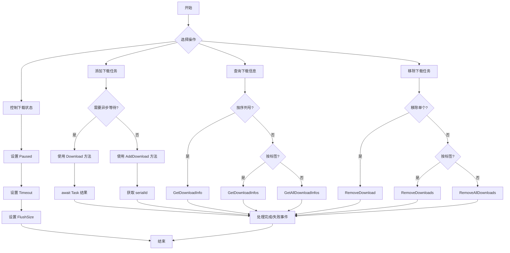

# メソッド

このドキュメント詳細介绍 DownloadComponent コンポーネント提供的所有公共メソッド。这些メソッド用于管理下载任务、查询下载ステータス和控制下载行为。

## 概要

DownloadComponent 是游戏下载機能的コアコンポーネント，提供します一套完全な的异步下载任务管理 API。通过这些メソッド，開発者〜できます：

- 追加下载任务（サポート优先级、标签、ユーザー自定義数据）
- 查询下载任务ステータス和進捗
- 暂停/恢复下载
- 移除单个或批量下载任务
- 取得实时下载速度

## 下载任务管理

### 追加下载任务

DownloadComponent 提供します 8 个 `AddDownload` メソッドオーバーロード，以满足不同的使用シーン。所有オーバーロード都返す新增下载任务的序列编号（serialId）。

#### 基本追加メソッド

```csharp
public int AddDownload(string downloadPath, string downloadUri)
```

追加一个基本的下载任务。

**パラメータ：**
- `downloadPath` (string): 下载ファイル在本地存储的路径
- `downloadUri` (string): 远程ファイル的下载地址

**戻り値：** 新增下载任务的序列编号

**例：**
```csharp
var downloadComponent = GameEntry.GetComponent<DownloadComponent>();
int serialId = downloadComponent.AddDownload(Application.persistentDataPath + "/file.dat", "https://example.com/file.dat");
```

> Source: [DownloadComponent.cs](https://github.com/GameFrameX/com.gameframex.unity.download/blob/main/Runtime/Download/DownloadComponent.cs#L238-L241)

---

#### 带标签的追加メソッド

```csharp
public int AddDownload(string downloadPath, string downloadUri, string tag)
```

追加一个带标签的下载任务，便于按组管理。

**パラメータ：**
- `downloadPath` (string): 下载ファイル在本地存储的路径
- `downloadUri` (string): 远程ファイル的下载地址
- `tag` (string): 下载任务的标签，用于分组管理

**戻り値：** 新增下载任务的序列编号

**例：**
```csharp
int serialId = downloadComponent.AddDownload(path, uri, "resources");
```

> Source: [DownloadComponent.cs](https://github.com/GameFrameX/com.gameframex.unity.download/blob/main/Runtime/Download/DownloadComponent.cs#L250-L253)

---

#### 带优先级的追加メソッド

```csharp
public int AddDownload(string downloadPath, string downloadUri, int priority)
```

追加一个带优先级的下载任务。

**パラメータ：**
- `downloadPath` (string): 下载ファイル在本地存储的路径
- `downloadUri` (string): 远程ファイル的下载地址
- `priority` (int): 下载任务的优先级，数值越高越优先

**戻り値：** 新增下载任务的序列编号

> Source: [DownloadComponent.cs](https://github.com/GameFrameX/com.gameframex.unity.download/blob/main/Runtime/Download/DownloadComponent.cs#L262-L265)

---

#### 带ユーザー数据的追加メソッド

```csharp
public int AddDownload(string downloadPath, string downloadUri, object userData)
```

追加一个带ユーザー自定義数据的下载任务。

**パラメータ：**
- `downloadPath` (string): 下载ファイル在本地存储的路径
- `downloadUri` (string): 远程ファイル的下载地址
- `userData` (object): ユーザー自定義数据，会在イベント中传递

**戻り値：** 新增下载任务的序列编号

**例：**
```csharp
var userData = new { fileType = "texture", version = "1.0" };
int serialId = downloadComponent.AddDownload(path, uri, userData);
```

> Source: [DownloadComponent.cs](https://github.com/GameFrameX/com.gameframex.unity.download/blob/main/Runtime/Download/DownloadComponent.cs#L291-L294)

---

#### 完全なパラメータ追加メソッド

```csharp
public int AddDownload(string downloadPath, string downloadUri, string tag, int priority, object userData)
```

追加一个パッケージ含所有パラメータ的下载任务。

**パラメータ：**
- `downloadPath` (string): 下载ファイル在本地存储的路径
- `downloadUri` (string): 远程ファイル的下载地址
- `tag` (string): 下载任务的标签
- `priority` (int): 下载任务的优先级
- `userData` (object): ユーザー自定義数据

**戻り値：** 新增下载任务的序列编号

> Source: [DownloadComponent.cs](https://github.com/GameFrameX/com.gameframex.unity.download/blob/main/Runtime/Download/DownloadComponent.cs#L344-L350)

---

### 异步下载メソッド

```csharp
public Task<bool> Download(string downloadPath, string downloadUri)
```

追加下载任务并返す Task 对象，方便使用 async/await モード。

**パラメータ：**
- `downloadPath` (string): 下载ファイル在本地存储的路径
- `downloadUri` (string): 远程ファイル的下载地址

**戻り値：** Task&lt;bool&gt;，下载完成后返す true，失敗返す false

**例：**
```csharp
var downloadComponent = GameEntry.GetComponent<DownloadComponent>();
bool success = await downloadComponent.Download(Application.persistentDataPath + "/file.dat", "https://example.com/file.dat");
```

> Source: [DownloadComponent.cs](https://github.com/GameFrameX/com.gameframex.unity.download/blob/main/Runtime/Download/DownloadComponent.cs#L273-L282)

---

### 移除下载任务

#### 按序列编号移除

```csharp
public bool RemoveDownload(int serialId)
```

根据下载任务的序列编号移除指定的下载任务。

**パラメータ：**
- `serialId` (int): 要移除的下载任务的序列编号

**戻り値：** bool，是否移除成功

**例：**
```csharp
bool removed = downloadComponent.RemoveDownload(serialId);
```

> Source: [DownloadComponent.cs](https://github.com/GameFrameX/com.gameframex.unity.download/blob/main/Runtime/Download/DownloadComponent.cs#L357-L361)

---

#### 按标签移除

```csharp
public int RemoveDownloads(string tag)
```

根据下载任务的标签移除所有匹配的下载任务。

**パラメータ：**
- `tag` (string): 要移除下载任务的标签

**戻り値：** int，移除的任务数量

**例：**
```csharp
// 移除所有标记为 "resources" 的下载任务
int removedCount = downloadComponent.RemoveDownloads("resources");
```

> Source: [DownloadComponent.cs](https://github.com/GameFrameX/com.gameframex.unity.download/blob/main/Runtime/Download/DownloadComponent.cs#L368-L382)

---

#### 移除所有任务

```csharp
public int RemoveAllDownloads()
```

移除所有下载任务。

**戻り値：** int，移除的任务数量

**例：**
```csharp
int removedCount = downloadComponent.RemoveAllDownloads();
```

> Source: [DownloadComponent.cs](https://github.com/GameFrameX/com.gameframex.unity.download/blob/main/Runtime/Download/DownloadComponent.cs#L388-L392)

---

## 下载情報查询

### 按序列编号查询

```csharp
public TaskInfo GetDownloadInfo(int serialId)
```

根据下载任务的序列编号取得下载任务的情報。

**パラメータ：**
- `serialId` (int): 要取得情報的下载任务的序列编号

**戻り値：** TaskInfo，パッケージ含下载任务的詳細情報

> Source: [DownloadComponent.cs](https://github.com/GameFrameX/com.gameframex.unity.download/blob/main/Runtime/Download/DownloadComponent.cs#L189-L192)

---

### 按标签查询

```csharp
public TaskInfo[] GetDownloadInfos(string tag)
```

根据下载任务的标签取得所有匹配的下载任务情報。

**パラメータ：**
- `tag` (string): 要取得情報的下载任务的标签

**戻り値：** TaskInfo[]，匹配的下载任务情報数组

```csharp
public void GetDownloadInfos(string tag, List<TaskInfo> results)
```

将匹配的下载任务情報追加到指定的列表中（避免内存分配）。

**パラメータ：**
- `tag` (string): 要取得情報的下载任务的标签
- `results` (List&lt;TaskInfo&gt;): 用于存储結果的任务情報列表

> Source: [DownloadComponent.cs](https://github.com/GameFrameX/com.gameframex.unity.download/blob/main/Runtime/Download/DownloadComponent.cs#L199-L212)

---

### 查询所有任务

```csharp
public TaskInfo[] GetAllDownloadInfos()
```

取得所有下载任务的情報。

**戻り値：** TaskInfo[]，所有下载任务的情報数组

```csharp
public void GetAllDownloadInfos(List<TaskInfo> results)
```

将所有下载任务情報追加到指定的列表中（避免内存分配）。

**パラメータ：**
- `results` (List&lt;TaskInfo&gt;): 用于存储結果的任务情報列表

> Source: [DownloadComponent.cs](https://github.com/GameFrameX/com.gameframex.unity.download/blob/main/Runtime/Download/DownloadComponent.cs#L218-L230)

---

## 下载控制プロパティ

### 暂停/恢复控制

```csharp
public bool Paused { get; set; }
```

取得或設定下载是否被暂停。当設定为 true 时，所有等待中的下载任务将暂停执行。

**プロパティ值：** bool，true 表示暂停，false 表示继续

**例：**
```csharp
// 暂停所有下载
downloadComponent.Paused = true;

// 恢复下载
downloadComponent.Paused = false;
```

> Source: [DownloadComponent.cs](https://github.com/GameFrameX/com.gameframex.unity.download/blob/main/Runtime/Download/DownloadComponent.cs#L46-L50)

---

### 超时設定

```csharp
public float Timeout { get; set; }
```

取得或設定下载超时时长，以秒为单位。デフォルト值为 30 秒。

**プロパティ值：** float，超时时长（秒）

**例：**
```csharp
// 设置下载超时为 60 秒
downloadComponent.Timeout = 60f;
```

> Source: [DownloadComponent.cs](https://github.com/GameFrameX/com.gameframex.unity.download/blob/main/Runtime/Download/DownloadComponent.cs#L87-L91)

---

### 缓冲区大小設定

```csharp
public int FlushSize { get; set; }
```

取得或設定将缓冲区写入磁盘的临界大小。仅当开启断点续传时有效。デフォルト值为 1MB。

**プロパティ值：** int，缓冲区大小（字节）

> Source: [DownloadComponent.cs](https://github.com/GameFrameX/com.gameframex.unity.download/blob/main/Runtime/Download/DownloadComponent.cs#L96-L100)

---

## ステータス查询プロパティ

### 代理ステータス

```csharp
public int TotalAgentCount { get; }
```

取得下载代理总数量。

---

```csharp
public int FreeAgentCount { get; }
```

取得可用（空闲）下载代理数量。

---

```csharp
public int WorkingAgentCount { get; }
```

取得工作中下载代理数量。

---

```csharp
public int WaitingTaskCount { get; }
```

取得等待下载任务数量。

---

### 下载速度

```csharp
public float CurrentSpeed { get; }
```

取得当前下载速度（字节/秒）。

**例：**
```csharp
float speed = downloadComponent.CurrentSpeed;
Debug.Log($"当前下载速度: {speed / 1024 / 1024:F2} MB/s");
```

> Source: [DownloadComponent.cs](https://github.com/GameFrameX/com.gameframex.unity.download/blob/main/Runtime/Download/DownloadComponent.cs#L105-L108)

---

## メソッド使用フロー



---

## 完全な使用例

```csharp
using UnityEngine;
using GameFrameX.Runtime;
using GameFrameX.Download.Runtime;

public class DownloadExample : MonoBehaviour
{
    private DownloadComponent downloadComponent;
    
    private void Start()
    {
        downloadComponent = GameEntry.GetComponent<DownloadComponent>();
        
        // 示例1: 基础下载
        int serialId = downloadComponent.AddDownload(
            Application.persistentDataPath + "/data.bin",
            "https://example.com/data.bin"
        );
        
        // 示例2: 带优先级和标签的下载
        int serialId2 = downloadComponent.AddDownload(
            Application.persistentDataPath + "/texture.png",
            "https://example.com/texture.png",
            "resources",  // 标签
            100,         // 优先级
            null         // 用户数据
        );
        
        // 示例3: 异步下载
        _ = AsyncDownload();
    }
    
    private async Task AsyncDownload()
    {
        bool success = await downloadComponent.Download(
            Application.persistentDataPath + "/config.json",
            "https://example.com/config.json"
        );
        
        Debug.Log($"下载结果: {(success ? "成功" : "失败")}");
    }
    
    private void Update()
    {
        // 查询下载状态
        if (downloadComponent != null)
        {
            TaskInfo[] allTasks = downloadComponent.GetAllDownloadInfos();
            foreach (var task in allTasks)
            {
                Debug.Log($"任务 {task.SerialId}: {task.Status} - {task.Description}");
            }
            
            // 显示下载速度
            Debug.Log($"速度: {downloadComponent.CurrentSpeed / 1024:F2} KB/s");
        }
    }
}
```

---

## よくある問題

### 如何実装断点续传？

断点续传デフォルト已启用。当下载中断后重新追加相同路径的下载任务时，系统会自动检测已下载的部分并从断点处继续下载。

### 如何限制同時に下载的数量？

在 DownloadComponent 的 Inspector パネル中設定 `Download Agent Helper Count` プロパティ。该值决定了同時に执行的最大下载任务数。

### 下载失敗后如何重试？

〜できます通过监听 `DownloadFailure` イベント取得失敗情報，次に在コールバック中重新呼び出し `AddDownload` メソッド追加重试任务。

---

## 関連リンク

- [プロパティ](./5-api-reference.properties) - DownloadComponent プロパティドキュメント
- [下载イベント](./6-events.download-events) - 下载相关イベント
- [代理イベント](./6-events.agent-events) - 下载代理相关イベント
- [下载代理設定](./7-configuration.agent-configuration) - 下载代理設定
- [DownloadComponent コアコンセプト](./4-core-concepts.download-component) - コンポーネント詳細介绍
