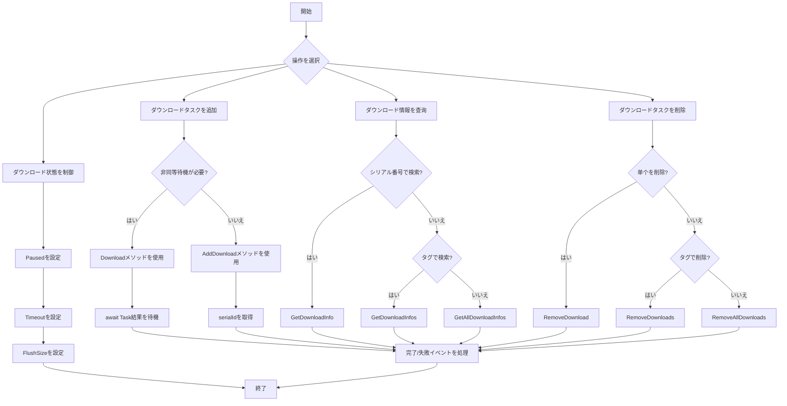

# メソッド

このドキュメントでは、DownloadComponentコンポーネントが提供するすべてのパブリックメソッドについて詳しく説明します。これらのメソッドはダウンロードタスクの管理、ダウンロード状態の查询、ダウンロード行動の制御に使用されます。

## 概要

DownloadComponentはゲームダウンロード機能の中核コンポーネントであり、完全な非同期ダウンロードタスク管理APIを提供します。これらのメソッドを通じて、開発者は以下のことを行えます：

- ダウンロードタスクを追加（優先順位、タグ、ユーザー定義データをサポート）
- ダウンロードタスクの状態と進捗を查询
- ダウンロードの一時停止/再開
- 単一または一括ダウンロードタスクの削除
- リアルタイムダウンロード速度の取得

## ダウンロードタスク管理

### ダウンロードタスクの追加

DownloadComponentは8つの`AddDownload`メソッドオーバーロードを提供し、異なる使用シナリオに対応します。すべてのオーバーロードは追加されたダウンロードタスクのシリアル番号（serialId）を返します。

#### 基本的な追加メソッド

```csharp
public int AddDownload(string downloadPath, string downloadUri)
```

基本的なダウンロードタスクを追加します。

**パラメータ：**
- `downloadPath` (string): ダウンロードファイルをローカルに保存するパス
- `downloadUri` (string): リモートファイルのダウンロードアドレス

**戻り値：** 新規追加されたダウンロードタスクのシリアル番号

**例：**
```csharp
var downloadComponent = GameEntry.GetComponent<DownloadComponent>();
int serialId = downloadComponent.AddDownload(Application.persistentDataPath + "/file.dat", "https://example.com/file.dat");
```

> 出典: [DownloadComponent.cs](https://github.com/GameFrameX/com.gameframex.unity.download/blob/main/Runtime/Download/DownloadComponent.cs#L238-L241)

---

#### タグ付き追加メソッド

```csharp
public int AddDownload(string downloadPath, string downloadUri, string tag)
```

タグ付きダウンロードタスクを追加し、グループ化管理を容易にします。

**パラメータ：**
- `downloadPath` (string): ダウンロードファイルをローカルに保存するパス
- `downloadUri` (string): リモートファイルのダウンロードアドレス
- `tag` (string): ダウンロードタスクのタグ。グループ化管理に使用

**戻り値：** 新規追加されたダウンロードタスクのシリアル番号

**例：**
```csharp
int serialId = downloadComponent.AddDownload(path, uri, "resources");
```

> 出典: [DownloadComponent.cs](https://github.com/GameFrameX/com.gameframex.unity.download/blob/main/Runtime/Download/DownloadComponent.cs#L250-L253)

---

#### 優先順位付き追加メソッド

```csharp
public int AddDownload(string downloadPath, string downloadUri, int priority)
```

優先順位付きダウンロードタスクを追加します。

**パラメータ：**
- `downloadPath` (string): ダウンロードファイルをローカルに保存するパス
- `downloadUri` (string): リモートファイルのダウンロードアドレス
- `priority` (int): ダウンロードタスクの優先順位。数値が大きいほど優先度が高い

**戻り値：** 新規追加されたダウンロードタスクのシリアル番号

> 出典: [DownloadComponent.cs](https://github.com/GameFrameX/com.gameframex.unity.download/blob/main/Runtime/Download/DownloadComponent.cs#L262-L265)

---

#### ユーザーデータ付き追加メソッド

```csharp
public int AddDownload(string downloadPath, string downloadUri, object userData)
```

ユーザー定義データ付きダウンロードタスクを追加します。

**パラメータ：**
- `downloadPath` (string): ダウンロードファイルをローカルに保存するパス
- `downloadUri` (string): リモートファイルのダウンロードアドレス
- `userData` (object): ユーザー定義データ。イベントで渡される

**戻り値：** 新規追加されたダウンロードタスクのシリアル番号

**例：**
```csharp
var userData = new { fileType = "texture", version = "1.0" };
int serialId = downloadComponent.AddDownload(path, uri, userData);
```

> 出典: [DownloadComponent.cs](https://github.com/GameFrameX/com.gameframex.unity.download/blob/main/Runtime/Download/DownloadComponent.cs#L291-L294)

---

#### 完全パラメータ追加メソッド

```csharp
public int AddDownload(string downloadPath, string downloadUri, string tag, int priority, object userData)
```

すべてのパラメータを含むダウンロードタスクを追加します。

**パラメータ：**
- `downloadPath` (string): ダウンロードファイルをローカルに保存するパス
- `downloadUri` (string): リモートファイルのダウンロードアドレス
- `tag` (string): ダウンロードタスクのタグ
- `priority` (int): ダウンロードタスクの優先順位
- `userData` (object): ユーザー定義データ

**戻り値：** 新規追加されたダウンロードタスクのシリアル番号

> 出典: [DownloadComponent.cs](https://github.com/GameFrameX/com.gameframex.unity.download/blob/main/Runtime/Download/DownloadComponent.cs#L344-L350)

---

### 非同期ダウンロードメソッド

```csharp
public Task<bool> Download(string downloadPath, string downloadUri)
```

ダウンロードタスクを追加してTaskオブジェクトを返します。async/awaitパターンの使用に便利です。

**パラメータ：**
- `downloadPath` (string): ダウンロードファイルをローカルに保存するパス
- `downloadUri` (string): リモートファイルのダウンロードアドレス

**戻り値：** Task&lt;bool&gt;。ダウンロード完了後true、失敗時false

**例：**
```csharp
var downloadComponent = GameEntry.GetComponent<DownloadComponent>();
bool success = await downloadComponent.Download(Application.persistentDataPath + "/file.dat", "https://example.com/file.dat");
```

> 出典: [DownloadComponent.cs](https://github.com/GameFrameX/com.gameframex.unity.download/blob/main/Runtime/Download/DownloadComponent.cs#L273-L282)

---

### ダウンロードタスクの削除

#### シリアル番号で削除

```csharp
public bool RemoveDownload(int serialId)
```

ダウンロードタスクのシリアル番号に基づいて指定されたダウンロードタスクを削除します。

**パラメータ：**
- `serialId` (int): 削除するダウンロードタスクのシリアル番号

**戻り値：** bool。削除成功かどうか

**例：**
```csharp
bool removed = downloadComponent.RemoveDownload(serialId);
```

> 出典: [DownloadComponent.cs](https://github.com/GameFrameX/com.gameframex.unity.download/blob/main/Runtime/Download/DownloadComponent.cs#L357-L361)

---

#### タグで削除

```csharp
public int RemoveDownloads(string tag)
```

ダウンロードタスクのタグに基づいて一致するすべてのダウンロードタスクを削除します。

**パラメータ：**
- `tag` (string): 削除するダウンロードタスクのタグ

**戻り値：** int。削除されたタスク数

**例：**
```csharp
// 「resources」タグを持つすべてのダウンロードタスクを削除
int removedCount = downloadComponent.RemoveDownloads("resources");
```

> 出典: [DownloadComponent.cs](https://github.com/GameFrameX/com.gameframex.unity.download/blob/main/Runtime/Download/DownloadComponent.cs#L368-L382)

---

#### すべてのタスクを削除

```csharp
public int RemoveAllDownloads()
```

すべてのダウンロードタスクを削除します。

**戻り値：** int。削除されたタスク数

**例：**
```csharp
int removedCount = downloadComponent.RemoveAllDownloads();
```

> 出典: [DownloadComponent.cs](https://github.com/GameFrameX/com.gameframex.unity.download/blob/main/Runtime/Download/DownloadComponent.cs#L388-L392)

---

## ダウンロード情報查询

### シリアル番号で查询

```csharp
public TaskInfo GetDownloadInfo(int serialId)
```

ダウンロードタスクのシリアル番号に基づいてダウンロードタスク情報を取得します。

**パラメータ：**
- `serialId` (int): 情報を取得するダウンロードタスクのシリアル番号

**戻り値：** TaskInfo。ダウンロードタスクの詳細情報を含む

> 出典: [DownloadComponent.cs](https://github.com/GameFrameX/com.gameframex.unity.download/blob/main/Runtime/Download/DownloadComponent.cs#L189-L192)

---

### タグで查询

```csharp
public TaskInfo[] GetDownloadInfos(string tag)
```

ダウンロードタスクのタグに基づいて一致するすべてのダウンロードタスク情報を取得します。

**パラメータ：**
- `tag` (string): 情報を取得するダウンロードタスクのタグ

**戻り値：** TaskInfo[]。一致するダウンロードタスク情報の配列

```csharp
public void GetDownloadInfos(string tag, List<TaskInfo> results)
```

一致するダウンロードタスク情報を指定されたリストに追加します（メモリ割り当てを回避）。

**パラメータ：**
- `tag` (string): 情報を取得するダウンロードタスクのタグ
- `results` (List&lt;TaskInfo&gt;): 結果を存储するタスク情報リスト

> 出典: [DownloadComponent.cs](https://github.com/GameFrameX/com.gameframex.unity.download/blob/main/Runtime/Download/DownloadComponent.cs#L199-L212)

---

### すべてのタスクを查询

```csharp
public TaskInfo[] GetAllDownloadInfos()
```

すべてのダウンロードタスクの情報を取得します。

**戻り値：** TaskInfo[]。すべてのダウンロードタスク情報の配列

```csharp
public void GetAllDownloadInfos(List<TaskInfo> results)
```

すべてのダウンロードタスク情報を指定されたリストに追加します（メモリ割り当てを回避）。

**パラメータ：**
- `results` (List&lt;TaskInfo&gt;): 結果を存储するタスク情報リスト

> 出典: [DownloadComponent.cs](https://github.com/GameFrameX/com.gameframex.unity.download/blob/main/Runtime/Download/DownloadComponent.cs#L218-L230)

---

## ダウンロード制御プロパティ

### 一時停止/再開制御

```csharp
public bool Paused { get; set; }
```

ダウンロードが一時停止されているかどうかを取得または設定します。trueに設定すると、すべての待機中のダウンロードタスクが一時停止されます。

**プロパティ値：** bool。trueは一時停止、falseは続行

**例：**
```csharp
// すべてのダウンロードを一時停止
downloadComponent.Paused = true;

// ダウンロードを再開
downloadComponent.Paused = false;
```

> 出典: [DownloadComponent.cs](https://github.com/GameFrameX/com.gameframex.unity.download/blob/main/Runtime/Download/DownloadComponent.cs#L46-L50)

---

### タイムアウト設定

```csharp
public float Timeout { get; set; }
```

ダウンロードタイムアウト時間を秒単位で取得または設定します。デフォルト値は30秒です。

**プロパティ値：** float。タイムアウト時間（秒）

**例：**
```csharp
// ダウンロードタイムアウトを60秒に設定
downloadComponent.Timeout = 60f;
```

> 出典: [DownloadComponent.cs](https://github.com/GameFrameX/com.gameframex.unity.download/blob/main/Runtime/Download/DownloadComponent.cs#L87-L91)

---

### バッファサイズ設定

```csharp
public int FlushSize { get; set; }
```

バッファをディスクに書き込む閾値を取得または設定します。レジューム機能を有効にしている場合のみ有効です。デフォルト値は1MBです。

**プロパティ値：** int。バッファサイズ（バイト）

> 出典: [DownloadComponent.cs](https://github.com/GameFrameX/com.gameframex.unity.download/blob/main/Runtime/Download/DownloadComponent.cs#L96-L100)

---

## 状態查询プロパティ

### エージェント状態

```csharp
public int TotalAgentCount { get; }
```

ダウンロードエージェントの総数を取得します。

---

```csharp
public int FreeAgentCount { get; }
```

使用可能（空き）ダウンロードエージェント数を取得します。

---

```csharp
public int WorkingAgentCount { get; }
```

作業中のダウンロードエージェント数を取得します。

---

```csharp
public int WaitingTaskCount { get; }
```

待機中のダウンロードタスク数を取得します。

---

### ダウンロード速度

```csharp
public float CurrentSpeed { get; }
```

現在のダウンロード速度（バイト/秒）を取得します。

**例：**
```csharp
float speed = downloadComponent.CurrentSpeed;
Debug.Log($"現在のダウンロード速度: {speed / 1024 / 1024:F2} MB/s");
```

> 出典: [DownloadComponent.cs](https://github.com/GameFrameX/com.gameframex.unity.download/blob/main/Runtime/Download/DownloadComponent.cs#L105-L108)

---

## メソッド使用フロー



---

## 完全使用例

```csharp
using UnityEngine;
using GameFrameX.Runtime;
using GameFrameX.Download.Runtime;

public class DownloadExample : MonoBehaviour
{
    private DownloadComponent downloadComponent;

    private void Start()
    {
        downloadComponent = GameEntry.GetComponent<DownloadComponent>();

        // 例1: 基本的なダウンロード
        int serialId = downloadComponent.AddDownload(
            Application.persistentDataPath + "/data.bin",
            "https://example.com/data.bin"
        );

        // 例2: 優先順位とタグ付きダウンロード
        int serialId2 = downloadComponent.AddDownload(
            Application.persistentDataPath + "/texture.png",
            "https://example.com/texture.png",
            "resources",  // タグ
            100,         // 優先順位
            null         // ユーザーデータ
        );

        // 例3: 非同期ダウンロード
        _ = AsyncDownload();
    }

    private async Task AsyncDownload()
    {
        bool success = await downloadComponent.Download(
            Application.persistentDataPath + "/config.json",
            "https://example.com/config.json"
        );

        Debug.Log($"ダウンロード結果: {(success ? "成功" : "失敗")}");
    }

    private void Update()
    {
        // ダウンロード状態を查询
        if (downloadComponent != null)
        {
            TaskInfo[] allTasks = downloadComponent.GetAllDownloadInfos();
            foreach (var task in allTasks)
            {
                Debug.Log($"タスク {task.SerialId}: {task.Status} - {task.Description}");
            }

            // ダウンロード速度を表示
            Debug.Log($"速度: {downloadComponent.CurrentSpeed / 1024:F2} KB/s");
        }
    }
}
```

---

## よくある質問

### レジュームを実装するには？

レジュームはデフォルトで有効になっています。ダウンロードが中断した後、同一パスのダウンロードタスクを再度追加すると、システムは自動的にダウンロード済み部分を検出して停止位置からダウンロードを継続します。

### 同時ダウンロード数を制限するには？

DownloadComponentのInspectorパネルで`Download Agent Helper Count`プロパティを設定します。この値は同時に実行される最大ダウンロードタスク数を決定します。

### ダウンロード失敗後に再試行するには？

`DownloadFailure`イベントを監視して失敗情報を取得し、コールバックで`AddDownload`メソッドを再度呼び出して再試行タスクを追加できます。

---

## 関連リンク

- [プロパティ](./5-api-reference.properties) - DownloadComponentプロパティドキュメント
- [ダウンロードイベント](./6-events.download-events) - ダウンロード関連イベント
- [エージェントイベント](./6-events.agent-events) - ダウンロードエージェント関連イベント
- [ダウンロードエージェント設定](./7-configuration.agent-configuration) - ダウンロードエージェント設定
- [DownloadComponentコア概念](./4-core-concepts.download-component) - コンポーネントの詳細説明