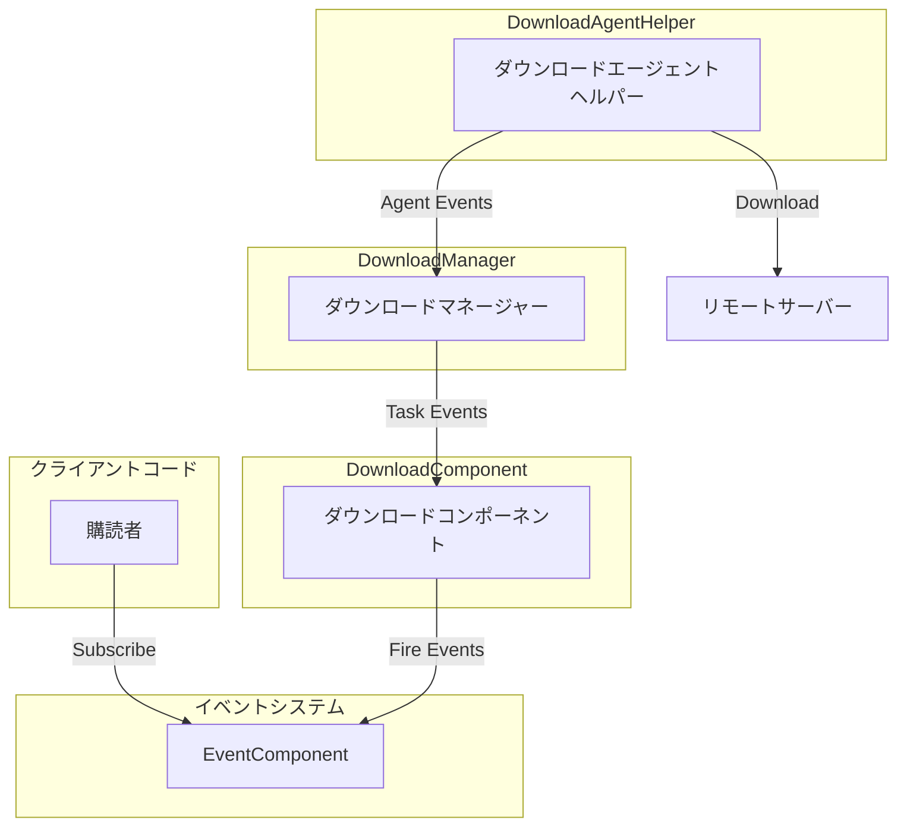
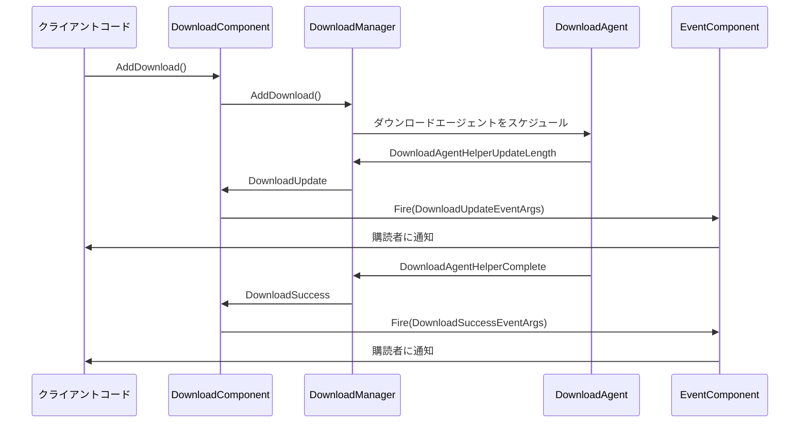

# ダウンロードイベント

このドキュメントでは、GameFrameXダウンロードモジュールにおけるイベントシステムについて詳しく説明します。ダウンロードタスクイベントとダウンロードエージェントイベントの2つのカテゴリを含みます。

## 概要

GameFrameXダウンロードモジュールはイベント駆動アーキテクチャを採用しており、統一されたイベントシステムを通じてダウンロード状態のリアルタイム通知を実現します。イベントシステムは2つの階層で構成されます：

1. **ダウンロードタスクイベント** - ダウンロードタスク全体の状態変更通知
2. **ダウンロードエージェントイベント** - ダウンロードエージェントヘルパーの底部状態通知

この階層化設計により、開発者は必要に応じて異なる粒度のイベント監視を選択できます。高階層のダウンロードタスク状態を監視することも、底部エージェントのデータ転送状態を監視することもできます。

## イベントアーキテクチャ

ダウンロードイベントシステムはパブリッシュ・サブスクライバパターンを採用し、`EventComponent`を通じて統一的に管理和配信イベントを行います。



### イベントフロー説明

1. クライアントは`EventComponent`を通じて関心のあるダウンロードイベントを購読者
2. `DownloadComponent.AddDownload()`を呼び出してダウンロードタスクを追加すると、タスクはダウンロードキューに入ります
3. `DownloadManager`がダウンロードエージェントを実行に移し、実際のダウンロード操作を行います
4. ダウンロード過程で発生する各種イベントは`DownloadComponent`を通じて`EventComponent`に転送されます
5. 購読者收到イベント通知を実行し、相应のロジックを実行します

## ダウンロードタスクイベント

ダウンロードタスクイベントは`IDownloadManager`インターフェースで定義され、`DownloadComponent`を通じて外部に統一的に公開されます。これらのイベントにはダウンロードタスクの完全なライフサイクルにおける主要な状態変更通知が含まれています。

> 出典: [IDownloadManager.cs](https://github.com/GameFrameX/com.gameframex.unity.download/blob/main/Runtime/Download/Download/IDownloadManager.cs#L86-L104)

### イベント一覧

| イベント名 | イベントパラメータクラス | トリガータイミング |
|---------|-----------|---------|
| ダウンロード開始 | `DownloadStartEventArgs` | ダウンロードタスクが実行を開始した時 |
| ダウンロード更新 | `DownloadUpdateEventArgs` | ダウンロード進捗が更新された時 |
| ダウンロード成功 | `DownloadSuccessEventArgs` | ダウンロードが正常に完了した時 |
| ダウンロード失敗 | `DownloadFailureEventArgs` | ダウンロードが失敗した時 |

### DownloadStartEventArgs

ダウンロード開始イベント。ダウンロードタスクがダウンロードエージェントに受信され、処理を開始する時にトリガーされます。

```csharp
//------------------------------------------------------------
// Game Framework
// Copyright © 2013-2021 Jiang Yin. All rights reserved.
//------------------------------------------------------------

using GameFrameX.Event.Runtime;
using GameFrameX.Runtime;

namespace GameFrameX.Download.Runtime
{
    /// <summary>
    /// ダウンロード開始イベント。
    /// </summary>
    public sealed class DownloadStartEventArgs : GameEventArgs
    {
        public static readonly string EventId = typeof(DownloadStartEventArgs).FullName;

        /// <summary>
        /// ダウンロード開始イベントの新規インスタンスを初期化します。
        /// </summary>
        public DownloadStartEventArgs()
        {
            SerialId = 0;
            DownloadPath = null;
            DownloadUri = null;
            CurrentLength = 0L;
            UserData = null;
        }

        /// <summary>
        /// ダウンロードタスクのシリアル番号を取得します。
        /// </summary>
        public int SerialId { get; private set; }

        /// <summary>
        /// ダウンロード後の保存パスを取得します。
        /// </summary>
        public string DownloadPath { get; private set; }

        /// <summary>
        /// ダウンロードアドレスを取得します。
        /// </summary>
        public string DownloadUri { get; private set; }

        /// <summary>
        /// 現在のサイズを取得します。
        /// </summary>
        public long CurrentLength { get; private set; }

        /// <summary>
        /// ユーザー定義データを取得します。
        /// </summary>
        public object UserData { get; private set; }

        /// <summary>
        /// ダウンロード開始イベントを作成します。
        /// </summary>
        public static DownloadStartEventArgs Create(int serialId, string downloadPath, string downloadUri, long currentLength, object userData)
        {
            DownloadStartEventArgs downloadStartEventArgs = ReferencePool.Acquire<DownloadStartEventArgs>();
            downloadStartEventArgs.SerialId = serialId;
            downloadStartEventArgs.DownloadPath = downloadPath;
            downloadStartEventArgs.DownloadUri = downloadUri;
            downloadStartEventArgs.CurrentLength = currentLength;
            downloadStartEventArgs.UserData = userData;
            return downloadStartEventArgs;
        }

        /// <summary>
        /// ダウンロード開始イベントをクリアします。
        /// </summary>
        public override void Clear()
        {
            SerialId = 0;
            DownloadPath = null;
            DownloadUri = null;
            CurrentLength = 0L;
            UserData = null;
        }

        public override string Id
        {
            get { return EventId; }
        }
    }
}
```
> 出典: [DownloadStartEventArgs.cs](https://github.com/GameFrameX/com.gameframex.unity.download/blob/main/Runtime/EventArgs/DownloadStartEventArgs.cs#L1-L94)

### DownloadUpdateEventArgs

ダウンロード更新イベント。ダウンロード過程で継続的にトリガーされ、現在のダウンロード進捗を報告するために使用されます。

```csharp
/// <summary>
/// ダウンロード更新イベント。
/// </summary>
public sealed class DownloadUpdateEventArgs : GameEventArgs
{
    public static readonly string EventId = typeof(DownloadUpdateEventArgs).FullName;

    /// <summary>
    /// ダウンロード更新イベントの新規インスタンスを初期化します。
    /// </summary>
    public DownloadUpdateEventArgs()
    {
        SerialId = 0;
        DownloadPath = null;
        DownloadUri = null;
        CurrentLength = 0L;
        UserData = null;
    }

    /// <summary>
    /// ダウンロードタスクのシリアル番号を取得します。
    /// </summary>
    public int SerialId { get; private set; }

    /// <summary>
    /// ダウンロード後の保存パスを取得します。
    /// </summary>
    public string DownloadPath { get; private set; }

    /// <summary>
    /// ダウンロードアドレスを取得します。
    /// </summary>
    public string DownloadUri { get; private set; }

    /// <summary>
    /// 現在のサイズを取得します。
    /// </summary>
    public long CurrentLength { get; private set; }

    /// <summary>
    /// ユーザー定義データを取得します。
    /// </summary>
    public object UserData { get; private set; }

    /// <summary>
    /// ダウンロード更新イベントを作成します。
    /// </summary>
    public static DownloadUpdateEventArgs Create(int serialId, string downloadPath, string downloadUri, long currentLength, object userData)
    {
        DownloadUpdateEventArgs downloadUpdateEventArgs = ReferencePool.Acquire<DownloadUpdateEventArgs>();
        downloadUpdateEventArgs.SerialId = serialId;
        downloadUpdateEventArgs.DownloadPath = downloadPath;
        downloadUpdateEventArgs.DownloadUri = downloadUri;
        downloadUpdateEventArgs.CurrentLength = currentLength;
        downloadUpdateEventArgs.UserData = userData;
        return downloadUpdateEventArgs;
    }

    /// <summary>
    /// ダウンロード更新イベントをクリアします。
    /// </summary>
    public override void Clear()
    {
        SerialId = 0;
        DownloadPath = null;
        DownloadUri = null;
        CurrentLength = 0L;
        UserData = null;
    }

    public override string Id
    {
        get { return EventId; }
    }
}
```
> 出典: [DownloadUpdateEventArgs.cs](https://github.com/GameFrameX/com.gameframex.unity.download/blob/main/Runtime/EventArgs/DownloadUpdateEventArgs.cs#L1-L94)

### DownloadSuccessEventArgs

ダウンロード成功イベント。ダウンロードタスクが正常に完了した時にトリガーされます。

```csharp
/// <summary>
/// ダウンロード成功イベント。
/// </summary>
public sealed class DownloadSuccessEventArgs : GameEventArgs
{
    public static readonly string EventId = typeof(DownloadSuccessEventArgs).FullName;

    /// <summary>
    /// ダウンロード成功イベントの新規インスタンスを初期化します。
    /// </summary>
    public DownloadSuccessEventArgs()
    {
        SerialId = 0;
        DownloadPath = null;
        DownloadUri = null;
        CurrentLength = 0L;
        UserData = null;
    }

    /// <summary>
    /// ダウンロードタスクのシリアル番号を取得します。
    /// </summary>
    public int SerialId { get; private set; }

    /// <summary>
    /// ダウンロード後の保存パスを取得します。
    /// </summary>
    public string DownloadPath { get; private set; }

    /// <summary>
    /// ダウンロードアドレスを取得します。
    /// </summary>
    public string DownloadUri { get; private set; }

    /// <summary>
    /// 現在のサイズを取得します。
    /// </summary>
    public long CurrentLength { get; private set; }

    /// <summary>
    /// ユーザー定義データを取得します。
    /// </summary>
    public object UserData { get; private set; }

    /// <summary>
    /// ダウンロード成功イベントを作成します。
    /// </summary>
    public static DownloadSuccessEventArgs Create(int serialId, string downloadPath, string downloadUri, long currentLength, object userData)
    {
        DownloadSuccessEventArgs downloadSuccessEventArgs = ReferencePool.Acquire<DownloadSuccessEventArgs>();
        downloadSuccessEventArgs.SerialId = serialId;
        downloadSuccessEventArgs.DownloadPath = downloadPath;
        downloadSuccessEventArgs.DownloadUri = downloadUri;
        downloadSuccessEventArgs.CurrentLength = currentLength;
        downloadSuccessEventArgs.UserData = userData;
        return downloadSuccessEventArgs;
    }

    /// <summary>
    /// ダウンロード成功イベントをクリアします。
    /// </summary>
    public override void Clear()
    {
        SerialId = 0;
        DownloadPath = null;
        DownloadUri = null;
        CurrentLength = 0L;
        UserData = null;
    }

    public override string Id
    {
        get { return EventId; }
    }
}
```
> 出典: [DownloadSuccessEventArgs.cs](https://github.com/GameFrameX/com.gameframex.unity.download/blob/main/Runtime/EventArgs/DownloadSuccessEventArgs.cs#L1-L95)

### DownloadFailureEventArgs

ダウンロード失敗イベント。ダウンロード過程でエラーが発生した時にトリガーされます。

```csharp
/// <summary>
/// ダウンロード失敗イベント。
/// </summary>
public sealed class DownloadFailureEventArgs : GameEventArgs
{
    public static readonly string EventId = typeof(DownloadFailureEventArgs).FullName;

    /// <summary>
    /// ダウンロード失敗イベントの新規インスタンスを初期化します。
    /// </summary>
    public DownloadFailureEventArgs()
    {
        SerialId = 0;
        DownloadPath = null;
        DownloadUri = null;
        ErrorMessage = null;
        UserData = null;
    }

    /// <summary>
    /// ダウンロードタスクのシリアル番号を取得します。
    /// </summary>
    public int SerialId { get; private set; }

    /// <summary>
    /// ダウンロード後の保存パスを取得します。
    /// </summary>
    public string DownloadPath { get; private set; }

    /// <summary>
    /// ダウンロードアドレスを取得します。
    /// </summary>
    public string DownloadUri { get; private set; }

    /// <summary>
    /// エラーメッセージを取得します。
    /// </summary>
    public string ErrorMessage { get; private set; }

    /// <summary>
    /// ユーザー定義データを取得します。
    /// </summary>
    public object UserData { get; private set; }

    /// <summary>
    /// ダウンロード失敗イベントを作成します。
    /// </summary>
    public static DownloadFailureEventArgs Create(int serialId, string downloadPath, string downloadUri, string errorMessage, object userData)
    {
        DownloadFailureEventArgs downloadFailureEventArgs = ReferencePool.Acquire<DownloadFailureEventArgs>();
        downloadFailureEventArgs.SerialId = serialId;
        downloadFailureEventArgs.DownloadPath = downloadPath;
        downloadFailureEventArgs.DownloadUri = downloadUri;
        downloadFailureEventArgs.ErrorMessage = errorMessage;
        downloadFailureEventArgs.UserData = userData;
        return downloadFailureEventArgs;
    }

    /// <summary>
    /// ダウンロード失敗イベントをクリアします。
    /// </summary>
    public override void Clear()
    {
        SerialId = 0;
        DownloadPath = null;
        DownloadUri = null;
        ErrorMessage = null;
        UserData = null;
    }

    public override string Id
    {
        get { return EventId; }
    }
}
```
> 出典: [DownloadFailureEventArgs.cs](https://github.com/GameFrameX/com.gameframex.unity.download/blob/main/Runtime/EventArgs/DownloadFailureEventArgs.cs#L1-L94)

## ダウンロードエージェントイベント

ダウンロードエージェントイベントは`DownloadAgentHelperBase`抽象クラスで定義されており、より底部のダウンロード状態通知を提供します。これらのイベントは主に`DownloadManager`内部使用され、ダウンロードエージェントの作业状態を追跡するために使用されます。

> 出典: [DownloadAgentHelperBase.cs](https://github.com/GameFrameX/com.gameframex.unity.download/blob/main/Runtime/Download/DownloadAgentHelperBase.cs#L19-L42)

### イベント一覧

| イベント名 | イベントパラメータクラス | トリガータイミング |
|---------|-----------|---------|
| エージェント更新バイトストリーム | `DownloadAgentHelperUpdateBytesEventArgs` | ダウンロードエージェントが新しいデータブロックを受信した時 |
| エージェント更新データサイズ | `DownloadAgentHelperUpdateLengthEventArgs` | ダウンロードエージェントがダウンロードデータサイズを変更した時 |
| エージェント完了 | `DownloadAgentHelperCompleteEventArgs` | ダウンロードエージェントがダウンロードを完了した時 |
| エージェントエラー | `DownloadAgentHelperErrorEventArgs` | ダウンロードエージェントがエラーを発生させた時 |

### DownloadAgentHelperUpdateBytesEventArgs

エージェント更新バイトストリームイベント。ダウンロードデータの元のバイト内容を提供します。

```csharp
/// <summary>
/// ダウンロードエージェントヘルパー更新バイトストリームイベント。
/// </summary>
public sealed class DownloadAgentHelperUpdateBytesEventArgs : GameEventArgs
{
    public static readonly string EventId = typeof(DownloadAgentHelperUpdateBytesEventArgs).FullName;

    private byte[] m_Bytes;

    /// <summary>
    /// ダウンロードエージェントヘルパー更新バイトストリームイベントの新規インスタンスを初期化します。
    /// </summary>
    public DownloadAgentHelperUpdateBytesEventArgs()
    {
        m_Bytes = null;
        Offset = 0;
        Length = 0;
    }

    /// <summary>
    /// バイトストリームのオフセットを取得します。
    /// </summary>
    public int Offset { get; private set; }

    /// <summary>
    /// バイトストリームの長さを取得します。
    /// </summary>
    public int Length { get; private set; }

    /// <summary>
    /// ダウンロードエージェントヘルパー更新バイトストリームイベントを作成します。
    /// </summary>
    public static DownloadAgentHelperUpdateBytesEventArgs Create(byte[] bytes, int offset, int length)
    {
        if (bytes == null)
        {
            throw new GameFrameworkException("Bytes is invalid.");
        }

        if (offset < 0 || offset >= bytes.Length)
        {
            throw new GameFrameworkException("Offset is invalid.");
        }

        if (length <= 0 || offset + length > bytes.Length)
        {
            throw new GameFrameworkException("Length is invalid.");
        }

        DownloadAgentHelperUpdateBytesEventArgs downloadAgentHelperUpdateBytesEventArgs = ReferencePool.Acquire<DownloadAgentHelperUpdateBytesEventArgs>();
        downloadAgentHelperUpdateBytesEventArgs.m_Bytes = bytes;
        downloadAgentHelperUpdateBytesEventArgs.Offset = offset;
        downloadAgentHelperUpdateBytesEventArgs.Length = length;
        return downloadAgentHelperUpdateBytesEventArgs;
    }

    /// <summary>
    /// ダウンロードしたバイトストリームを取得します。
    /// </summary>
    public byte[] GetBytes()
    {
        return m_Bytes;
    }

    public override string Id
    {
        get { return EventId; }
    }
}
```
> 出典: [DownloadAgentHelperUpdateBytesEventArgs.cs](https://github.com/GameFrameX/com.gameframex.unity.download/blob/main/Runtime/EventArgs/DownloadAgentHelperUpdateBytesEventArgs.cs#L1-L104)

### DownloadAgentHelperUpdateLengthEventArgs

エージェント更新データサイズイベント。ダウンロードデータの增量サイズを提供します。

```csharp
/// <summary>
/// ダウンロードエージェントヘルパー更新データサイズイベント。
/// </summary>
public sealed class DownloadAgentHelperUpdateLengthEventArgs : GameEventArgs
{
    public static readonly string EventId = typeof(DownloadAgentHelperUpdateLengthEventArgs).FullName;

    /// <summary>
    /// ダウンロードエージェントヘルパー更新データサイズイベントの新規インスタンスを初期化します。
    /// </summary>
    public DownloadAgentHelperUpdateLengthEventArgs()
    {
        DeltaLength = 0;
    }

    /// <summary>
    /// ダウンロードの増分データサイズを取得します。
    /// </summary>
    public int DeltaLength { get; private set; }

    /// <summary>
    /// ダウンロードエージェントヘルパー更新データサイズイベントを作成します。
    /// </summary>
    public static DownloadAgentHelperUpdateLengthEventArgs Create(int deltaLength)
    {
        if (deltaLength <= 0)
        {
            throw new GameFrameworkException("Delta length is invalid.");
        }

        DownloadAgentHelperUpdateLengthEventArgs downloadAgentHelperUpdateLengthEventArgs = ReferencePool.Acquire<DownloadAgentHelperUpdateLengthEventArgs>();
        downloadAgentHelperUpdateLengthEventArgs.DeltaLength = deltaLength;
        return downloadAgentHelperUpdateLengthEventArgs;
    }

    /// <summary>
    /// ダウンロードエージェントヘルパー更新データサイズイベントをクリアします。
    /// </summary>
    public override void Clear()
    {
        DeltaLength = 0;
    }

    public override string Id
    {
        get { return EventId; }
    }
}
```
> 出典: [DownloadAgentHelperUpdateLengthEventArgs.cs](https://github.com/GameFrameX/com.gameframex.unity.download/blob/main/Runtime/EventArgs/DownloadAgentHelperUpdateLengthEventArgs.cs#L1-L63)

### DownloadAgentHelperCompleteEventArgs

エージェント完了イベント。ダウンロードエージェントがダウンロードを完了した時にトリガーされます。

```csharp
/// <summary>
/// ダウンロードエージェントヘルパー完了イベント。
/// </summary>
public sealed class DownloadAgentHelperCompleteEventArgs : GameEventArgs
{
    public static readonly string EventId = typeof(DownloadAgentHelperCompleteEventArgs).FullName;

    /// <summary>
    /// ダウンロードエージェントヘルパー完了イベントの新規インスタンスを初期化します。
    /// </summary>
    public DownloadAgentHelperCompleteEventArgs()
    {
        Length = 0L;
    }

    /// <summary>
    /// ダウンロードしたデータサイズを取得します。
    /// </summary>
    public long Length { get; private set; }

    /// <summary>
    /// ダウンロードエージェントヘルパー完了イベントを作成します。
    /// </summary>
    public static DownloadAgentHelperCompleteEventArgs Create(long length)
    {
        if (length < 0L)
        {
            throw new GameFrameworkException("Length is invalid.");
        }

        DownloadAgentHelperCompleteEventArgs downloadAgentHelperCompleteEventArgs = ReferencePool.Acquire<DownloadAgentHelperCompleteEventArgs>();
        downloadAgentHelperCompleteEventArgs.Length = length;
        return downloadAgentHelperCompleteEventArgs;
    }

    /// <summary>
    /// ダウンロードエージェントヘルパー完了イベントをクリアします。
    /// </summary>
    public override void Clear()
    {
        Length = 0L;
    }

    public override string Id
    {
        get { return EventId; }
    }
}
```
> 出典: [DownloadAgentHelperCompleteEventArgs.cs](https://github.com/GameFrameX/com.gameframex.unity.download/blob/main/Runtime/EventArgs/DownloadAgentHelperCompleteEventArgs.cs#L1-L63)

### DownloadAgentHelperErrorEventArgs

エージェントエラーイベント。ダウンロードエージェントがエラーを発生させた時にトリガーされます。

```csharp
/// <summary>
/// ダウンロードエージェントヘルパーエラーイベント。
/// </summary>
public sealed class DownloadAgentHelperErrorEventArgs : GameEventArgs
{
    public static readonly string EventId = typeof(DownloadAgentHelperErrorEventArgs).FullName;

    /// <summary>
    /// ダウンロードエージェントヘルパーエラーイベントの新規インスタンスを初期化します。
    /// </summary>
    public DownloadAgentHelperErrorEventArgs()
    {
        DeleteDownloading = false;
        ErrorMessage = null;
    }

    /// <summary>
    /// ダウンロード中のファイルを削除する必要があるかどうかを取得します。
    /// </summary>
    public bool DeleteDownloading { get; private set; }

    /// <summary>
    /// エラーメッセージを取得します。
    /// </summary>
    public string ErrorMessage { get; private set; }

    /// <summary>
    /// ダウンロードエージェントヘルパーエラーイベントを作成します。
    /// </summary>
    public static DownloadAgentHelperErrorEventArgs Create(bool deleteDownloading, string errorMessage)
    {
        DownloadAgentHelperErrorEventArgs downloadAgentHelperErrorEventArgs = ReferencePool.Acquire<DownloadAgentHelperErrorEventArgs>();
        downloadAgentHelperErrorEventArgs.DeleteDownloading = deleteDownloading;
        downloadAgentHelperErrorEventArgs.ErrorMessage = errorMessage;
        return downloadAgentHelperErrorEventArgs;
    }

    /// <summary>
    /// ダウンロードエージェントヘルパーエラーイベントをクリアします。
    /// </summary>
    public override void Clear()
    {
        DeleteDownloading = false;
        ErrorMessage = null;
    }

    public override string Id
    {
        get { return EventId; }
    }
}
```
> 出典: [DownloadAgentHelperErrorEventArgs.cs](https://github.com/GameFrameX/com.gameframex.unity.download/blob/main/Runtime/EventArgs/DownloadAgentHelperErrorEventArgs.cs#L1-L67)

## イベントの購読と使用

開発者は`EventComponent`を通じてダウンロードイベントを購読し、ダウンロード状態の変化を監視できます。

### イベント購読の例

```csharp
using GameFrameX.Download.Runtime;
using GameFrameX.Event.Runtime;
using UnityEngine;

public class DownloadExample : MonoBehaviour
{
    private EventComponent m_EventComponent;

    private void Start()
    {
        m_EventComponent = GameEntry.GetComponent<EventComponent>();

        // ダウンロード開始イベントを購読
        m_EventComponent.Subscribe(DownloadStartEventArgs.EventId, OnDownloadStart);

        // ダウンロード更新イベントを購読
        m_EventComponent.Subscribe(DownloadUpdateEventArgs.EventId, OnDownloadUpdate);

        // ダウンロード成功イベントを購読
        m_EventComponent.Subscribe(DownloadSuccessEventArgs.EventId, OnDownloadSuccess);

        // ダウンロード失敗イベントを購読
        m_EventComponent.Subscribe(DownloadFailureEventArgs.EventId, OnDownloadFailure);
    }

    private void OnDownloadStart(object sender, GameEventArgs e)
    {
        var args = (DownloadStartEventArgs)e;
        Debug.Log($"ダウンロード開始: SerialId={args.SerialId}, Path={args.DownloadPath}");
    }

    private void OnDownloadUpdate(object sender, GameEventArgs e)
    {
        var args = (DownloadUpdateEventArgs)e;
        Debug.Log($"ダウンロード進捗: SerialId={args.SerialId}, CurrentLength={args.CurrentLength}");
    }

    private void OnDownloadSuccess(object sender, GameEventArgs e)
    {
        var args = (DownloadSuccessEventArgs)e;
        Debug.Log($"ダウンロード成功: SerialId={args.SerialId}, Path={args.DownloadPath}");
    }

    private void OnDownloadFailure(object sender, GameEventArgs e)
    {
        var args = (DownloadFailureEventArgs)e;
        Debug.LogError($"ダウンロード失敗: SerialId={args.SerialId}, Error={args.ErrorMessage}");
    }
}
```

> 出典: [DownloadComponent.cs](https://github.com/GameFrameX/com.gameframex.unity.download/blob/main/Runtime/Download/DownloadComponent.cs#L415-L442)

### イベントトリガーフロー



## イベントパラメータプロパティリファレンス

### ダウンロードタスクイベントプロパティ

| プロパティ | 型 | 説明 | 所属イベント |
|-----|------|------|---------|
| `SerialId` | `int` | ダウンロードタスクのユニークなシリアル番号 | すべて |
| `DownloadPath` | `string` | ダウンロード後のローカルパス | すべて |
| `DownloadUri` | `string` | リモートダウンロードアドレス | すべて |
| `CurrentLength` | `long` | 現在ダウンロード済みのデータサイズ（バイト） | Start/Update/Success |
| `ErrorMessage` | `string` | エラーの説明情報 | Failure |
| `UserData` | `object` | ユーザー定義データ | すべて |

### エージェントイベントプロパティ

| プロパティ | 型 | 説明 | 所属イベント |
|-----|------|------|---------|
| `Bytes[]` | `byte[]` | ダウンロードした元のデータバイト | UpdateBytes |
| `Offset` | `int` | バイトストリームのオフセット量 | UpdateBytes |
| `Length` | `int` | バイトストリームの長さ | UpdateBytes/Complete |
| `DeltaLength` | `int` | 今回のダウンロード增量サイズ | UpdateLength |
| `DeleteDownloading` | `bool` | ダウンロード中のファイルを削除する必要があるかどうか | Error |
| `ErrorMessage` | `string` | エラーの説明情報 | Error |

## イベント使用の推奨事項

1. **適切なイベント粒度を選択する**
   - ダウンロードタスクイベント（`DownloadStart`/`DownloadUpdate`/`DownloadSuccess`/`DownloadFailure`）を監視してビジネスロジック処理に使用
   - エージェントイベントを監視してダウンロード進捗条の実装またはデバッグに使用

2. **イベントパラメータのプール化**
   - すべてのイベントパラメータは`ReferencePool`を通じてプール化管理されます
   - `Create()`メソッドを使用してイベントを作成し、`Clear()`メソッドで回收

3. **エラー処理**
   - `DownloadFailure`イベントを常に購読してダウンロード失敗状況をキャプチャ
   - 失敗イベントの`ErrorMessage`には詳細なエラー情報が含まれています

## 関連リンク

- [エージェントイベント](./6-events.agent-events) - ダウンロードエージェント底部イベントの詳細
- [DownloadComponent](./4-core-concepts.download-component) - ダウンロードコンポーネントの詳細
- [ダウンロードエージェント](./4-core-concepts.download-agent) - ダウンロードエージェントの概念説明
- [APIリファレンス](./5-api-reference) - 完全なAPIリファレンスドキュメント