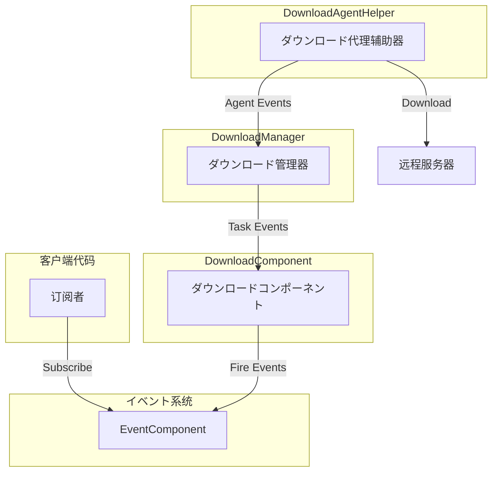
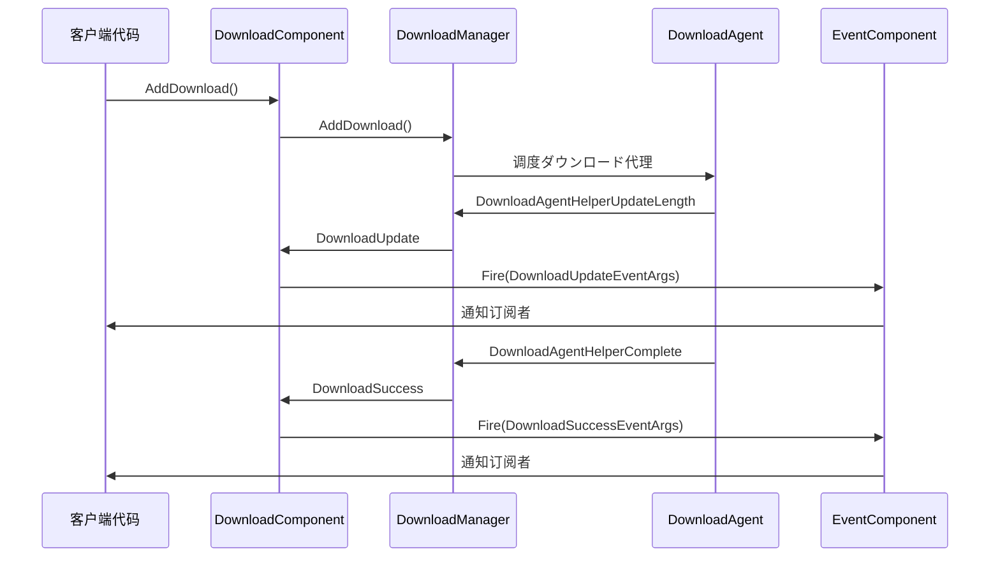

# ダウンロードイベント

本文档详细介绍 GameFrameX ダウンロード模块中的イベント系统，包括ダウンロード任务イベント和ダウンロード代理イベント两大クラス。

## 概要

GameFrameX ダウンロード模块采用イベント驱动架构，を通じて统一的イベント系统実装ダウンロードステータス的实时通知。イベント系统分为两个层次：

1. **ダウンロード任务イベント** - 针对整个ダウンロード任务的ステータス变更通知
2. **ダウンロード代理イベント** - 针对ダウンロード代理辅助器的底层ステータス通知

这种分层设计使得開発者可能に基づいて需求选择不同粒度的イベント监听，既可能监听高层ダウンロード任务ステータス，也可能监听底层代理数据传输ステータス。

## イベント架构

ダウンロードイベント系统采用发布-订阅模式，を通じて `EventComponent` 统一管理和分发イベント。



### イベントフロー説明

1. 客户端を通じて `EventComponent` 订阅感兴趣的ダウンロードイベント
2. 当呼び出し `DownloadComponent.AddDownload()` 添加ダウンロード任务时，任务进入ダウンロード队列
3. `DownloadManager` 调度ダウンロード代理执行实际ダウンロード操作
4. ダウンロード过程中产生的各クラスイベントを通じて `DownloadComponent` 转发到 `EventComponent`
5. 订阅者收到イベント通知并执行相应逻辑

## ダウンロード任务イベント

ダウンロード任务イベント在 `IDownloadManager` インターフェース中定义，由 `DownloadComponent` 统一暴露给外部使用。这些イベント提供しますダウンロード任务完整生命周期中的关键ステータス变更通知。

> Source: [IDownloadManager.cs](https://github.com/GameFrameX/com.gameframex.unity.download/blob/main/Runtime/Download/Download/IDownloadManager.cs#L86-L104)

### イベント列表

| イベント名称 | イベント参数クラス | 触发时机 |
|---------|-----------|---------|
| ダウンロード开始 | `DownloadStartEventArgs` | ダウンロード任务开始执行时 |
| ダウンロード更新 | `DownloadUpdateEventArgs` | ダウンロード进度更新时 |
| ダウンロード成功 | `DownloadSuccessEventArgs` | ダウンロード成功完成时 |
| ダウンロード失败 | `DownloadFailureEventArgs` | ダウンロード失败时 |

### DownloadStartEventArgs

ダウンロード开始イベント，在ダウンロード任务被ダウンロード代理接收并开始处理时触发。

```csharp
//------------------------------------------------------------
// Game Framework
// Copyright © 2013-2021 Jiang Yin. All rights reserved.
//------------------------------------------------------------

using GameFrameX.Event.Runtime;
using GameFrameX.Runtime;

namespace GameFrameX.Download.Runtime
{
    /// <summary>
    /// ダウンロード开始イベント。
    /// </summary>
    public sealed class DownloadStartEventArgs : GameEventArgs
    {
        public static readonly string EventId = typeof(DownloadStartEventArgs).FullName;

        /// <summary>
        /// 初期化ダウンロード开始イベント的新インスタンス。
        /// </summary>
        public DownloadStartEventArgs()
        {
            SerialId = 0;
            DownloadPath = null;
            DownloadUri = null;
            CurrentLength = 0L;
            UserData = null;
        }

        /// <summary>
        /// 取得ダウンロード任务的序列编号。
        /// </summary>
        public int SerialId { get; private set; }

        /// <summary>
        /// 取得ダウンロード后存放路径。
        /// </summary>
        public string DownloadPath { get; private set; }

        /// <summary>
        /// 取得ダウンロード地址。
        /// </summary>
        public string DownloadUri { get; private set; }

        /// <summary>
        /// 取得当前大小。
        /// </summary>
        public long CurrentLength { get; private set; }

        /// <summary>
        /// 取得用户自定义数据。
        /// </summary>
        public object UserData { get; private set; }

        /// <summary>
        /// 作成ダウンロード开始イベント。
        /// </summary>
        public static DownloadStartEventArgs Create(int serialId, string downloadPath, string downloadUri, long currentLength, object userData)
        {
            DownloadStartEventArgs downloadStartEventArgs = ReferencePool.Acquire<DownloadStartEventArgs>();
            downloadStartEventArgs.SerialId = serialId;
            downloadStartEventArgs.DownloadPath = downloadPath;
            downloadStartEventArgs.DownloadUri = downloadUri;
            downloadStartEventArgs.CurrentLength = currentLength;
            downloadStartEventArgs.UserData = userData;
            return downloadStartEventArgs;
        }

        /// <summary>
        /// 清理ダウンロード开始イベント。
        /// </summary>
        public override void Clear()
        {
            SerialId = 0;
            DownloadPath = null;
            DownloadUri = null;
            CurrentLength = 0L;
            UserData = null;
        }

        public override string Id
        {
            get { return EventId; }
        }
    }
}
```
> Source: [DownloadStartEventArgs.cs](https://github.com/GameFrameX/com.gameframex.unity.download/blob/main/Runtime/EventArgs/DownloadStartEventArgs.cs#L1-L94)

### DownloadUpdateEventArgs

ダウンロード更新イベント，在ダウンロード过程中持续触发，に使用报告当前ダウンロード进度。

```csharp
/// <summary>
/// ダウンロード更新イベント。
/// </summary>
public sealed class DownloadUpdateEventArgs : GameEventArgs
{
    public static readonly string EventId = typeof(DownloadUpdateEventArgs).FullName;

    /// <summary>
    /// 初期化ダウンロード更新イベント的新インスタンス。
    /// </summary>
    public DownloadUpdateEventArgs()
    {
        SerialId = 0;
        DownloadPath = null;
        DownloadUri = null;
        CurrentLength = 0L;
        UserData = null;
    }

    /// <summary>
    /// 取得ダウンロード任务的序列编号。
    /// </summary>
    public int SerialId { get; private set; }

    /// <summary>
    /// 取得ダウンロード后存放路径。
    /// </summary>
    public string DownloadPath { get; private set; }

    /// <summary>
    /// 取得ダウンロード地址。
    /// </summary>
    public string DownloadUri { get; private set; }

    /// <summary>
    /// 取得当前大小。
    /// </summary>
    public long CurrentLength { get; private set; }

    /// <summary>
    /// 取得用户自定义数据。
    /// </summary>
    public object UserData { get; private set; }

    /// <summary>
    /// 作成ダウンロード更新イベント。
    /// </summary>
    public static DownloadUpdateEventArgs Create(int serialId, string downloadPath, string downloadUri, long currentLength, object userData)
    {
        DownloadUpdateEventArgs downloadUpdateEventArgs = ReferencePool.Acquire<DownloadUpdateEventArgs>();
        downloadUpdateEventArgs.SerialId = serialId;
        downloadUpdateEventArgs.DownloadPath = downloadPath;
        downloadUpdateEventArgs.DownloadUri = downloadUri;
        downloadUpdateEventArgs.CurrentLength = currentLength;
        downloadUpdateEventArgs.UserData = userData;
        return downloadUpdateEventArgs;
    }

    /// <summary>
    /// 清理ダウンロード更新イベント。
    /// </summary>
    public override void Clear()
    {
        SerialId = 0;
        DownloadPath = null;
        DownloadUri = null;
        CurrentLength = 0L;
        UserData = null;
    }

    public override string Id
    {
        get { return EventId; }
    }
}
```
> Source: [DownloadUpdateEventArgs.cs](https://github.com/GameFrameX/com.gameframex.unity.download/blob/main/Runtime/EventArgs/DownloadUpdateEventArgs.cs#L1-L94)

### DownloadSuccessEventArgs

ダウンロード成功イベント，在ダウンロード任务成功完成时触发。

```csharp
/// <summary>
/// ダウンロード成功イベント。
/// </summary>
public sealed class DownloadSuccessEventArgs : GameEventArgs
{
    public static readonly string EventId = typeof(DownloadSuccessEventArgs).FullName;

    /// <summary>
    /// 初期化ダウンロード成功イベント的新インスタンス。
    /// </summary>
    public DownloadSuccessEventArgs()
    {
        SerialId = 0;
        DownloadPath = null;
        DownloadUri = null;
        CurrentLength = 0L;
        UserData = null;
    }

    /// <summary>
    /// 取得ダウンロード任务的序列编号。
    /// </summary>
    public int SerialId { get; private set; }

    /// <summary>
    /// 取得ダウンロード后存放路径。
    /// </summary>
    public string DownloadPath { get; private set; }

    /// <summary>
    /// 取得ダウンロード地址。
    /// </summary>
    public string DownloadUri { get; private set; }

    /// <summary>
    /// 取得当前大小。
    /// </summary>
    public long CurrentLength { get; private set; }

    /// <summary>
    /// 取得用户自定义数据。
    /// </summary>
    public object UserData { get; private set; }

    /// <summary>
    /// 作成ダウンロード成功イベント。
    /// </summary>
    public static DownloadSuccessEventArgs Create(int serialId, string downloadPath, string downloadUri, long currentLength, object userData)
    {
        DownloadSuccessEventArgs downloadSuccessEventArgs = ReferencePool.Acquire<DownloadSuccessEventArgs>();
        downloadSuccessEventArgs.SerialId = serialId;
        downloadSuccessEventArgs.DownloadPath = downloadPath;
        downloadSuccessEventArgs.DownloadUri = downloadUri;
        downloadSuccessEventArgs.CurrentLength = currentLength;
        downloadSuccessEventArgs.UserData = userData;
        return downloadSuccessEventArgs;
    }

    /// <summary>
    /// 清理ダウンロード成功イベント。
    /// </summary>
    public override void Clear()
    {
        SerialId = 0;
        DownloadPath = null;
        DownloadUri = null;
        CurrentLength = 0L;
        UserData = null;
    }

    public override string Id
    {
        get { return EventId; }
    }
}
```
> Source: [DownloadSuccessEventArgs.cs](https://github.com/GameFrameX/com.gameframex.unity.download/blob/main/Runtime/EventArgs/DownloadSuccessEventArgs.cs#L1-L95)

### DownloadFailureEventArgs

ダウンロード失败イベント，在ダウンロード过程中发生错误时触发。

```csharp
/// <summary>
/// ダウンロード失败イベント。
/// </summary>
public sealed class DownloadFailureEventArgs : GameEventArgs
{
    public static readonly string EventId = typeof(DownloadFailureEventArgs).FullName;

    /// <summary>
    /// 初期化ダウンロード失败イベント的新インスタンス。
    /// </summary>
    public DownloadFailureEventArgs()
    {
        SerialId = 0;
        DownloadPath = null;
        DownloadUri = null;
        ErrorMessage = null;
        UserData = null;
    }

    /// <summary>
    /// 取得ダウンロード任务的序列编号。
    /// </summary>
    public int SerialId { get; private set; }

    /// <summary>
    /// 取得ダウンロード后存放路径。
    /// </summary>
    public string DownloadPath { get; private set; }

    /// <summary>
    /// 取得ダウンロード地址。
    /// </summary>
    public string DownloadUri { get; private set; }

    /// <summary>
    /// 取得错误信息。
    /// </summary>
    public string ErrorMessage { get; private set; }

    /// <summary>
    /// 取得用户自定义数据。
    /// </summary>
    public object UserData { get; private set; }

    /// <summary>
    /// 作成ダウンロード失败イベント。
    /// </summary>
    public static DownloadFailureEventArgs Create(int serialId, string downloadPath, string downloadUri, string errorMessage, object userData)
    {
        DownloadFailureEventArgs downloadFailureEventArgs = ReferencePool.Acquire<DownloadFailureEventArgs>();
        downloadFailureEventArgs.SerialId = serialId;
        downloadFailureEventArgs.DownloadPath = downloadPath;
        downloadFailureEventArgs.DownloadUri = downloadUri;
        downloadFailureEventArgs.ErrorMessage = errorMessage;
        downloadFailureEventArgs.UserData = userData;
        return downloadFailureEventArgs;
    }

    /// <summary>
    /// 清理ダウンロード失败イベント。
    /// </summary>
    public override void Clear()
    {
        SerialId = 0;
        DownloadPath = null;
        DownloadUri = null;
        ErrorMessage = null;
        UserData = null;
    }

    public override string Id
    {
        get { return EventId; }
    }
}
```
> Source: [DownloadFailureEventArgs.cs](https://github.com/GameFrameX/com.gameframex.unity.download/blob/main/Runtime/EventArgs/DownloadFailureEventArgs.cs#L1-L94)

## ダウンロード代理イベント

ダウンロード代理イベント定义在 `DownloadAgentHelperBase` 抽象クラス中，提供更底层的ダウンロードステータス通知。这些イベント主要被 `DownloadManager` 内部使用，に使用追踪ダウンロード代理的工作ステータス。

> Source: [DownloadAgentHelperBase.cs](https://github.com/GameFrameX/com.gameframex.unity.download/blob/main/Runtime/Download/DownloadAgentHelperBase.cs#L19-L42)

### イベント列表

| イベント名称 | イベント参数クラス | 触发时机 |
|---------|-----------|---------|
| 代理更新数据流 | `DownloadAgentHelperUpdateBytesEventArgs` | ダウンロード代理接收到新的数据块时 |
| 代理更新数据大小 | `DownloadAgentHelperUpdateLengthEventArgs` | ダウンロード代理ダウンロード数据大小变化时 |
| 代理完成 | `DownloadAgentHelperCompleteEventArgs` | ダウンロード代理完成ダウンロード时 |
| 代理错误 | `DownloadAgentHelperErrorEventArgs` | ダウンロード代理发生错误时 |

### DownloadAgentHelperUpdateBytesEventArgs

代理更新数据流イベント，提供ダウンロード数据的原始字节内容。

```csharp
/// <summary>
/// ダウンロード代理辅助器更新数据流イベント。
/// </summary>
public sealed class DownloadAgentHelperUpdateBytesEventArgs : GameEventArgs
{
    public static readonly string EventId = typeof(DownloadAgentHelperUpdateBytesEventArgs).FullName;
    
    private byte[] m_Bytes;

    /// <summary>
    /// 初期化ダウンロード代理辅助器更新数据流イベント的新インスタンス。
    /// </summary>
    public DownloadAgentHelperUpdateBytesEventArgs()
    {
        m_Bytes = null;
        Offset = 0;
        Length = 0;
    }

    /// <summary>
    /// 取得数据流的偏移。
    /// </summary>
    public int Offset { get; private set; }

    /// <summary>
    /// 取得数据流的长度。
    /// </summary>
    public int Length { get; private set; }

    /// <summary>
    /// 作成ダウンロード代理辅助器更新数据流イベント。
    /// </summary>
    public static DownloadAgentHelperUpdateBytesEventArgs Create(byte[] bytes, int offset, int length)
    {
        if (bytes == null)
        {
            throw new GameFrameworkException("Bytes is invalid.");
        }

        if (offset < 0 || offset >= bytes.Length)
        {
            throw new GameFrameworkException("Offset is invalid.");
        }

        if (length <= 0 || offset + length > bytes.Length)
        {
            throw new GameFrameworkException("Length is invalid.");
        }

        DownloadAgentHelperUpdateBytesEventArgs downloadAgentHelperUpdateBytesEventArgs = ReferencePool.Acquire<DownloadAgentHelperUpdateBytesEventArgs>();
        downloadAgentHelperUpdateBytesEventArgs.m_Bytes = bytes;
        downloadAgentHelperUpdateBytesEventArgs.Offset = offset;
        downloadAgentHelperUpdateBytesEventArgs.Length = length;
        return downloadAgentHelperUpdateBytesEventArgs;
    }

    /// <summary>
    /// 取得ダウンロード的数据流。
    /// </summary>
    public byte[] GetBytes()
    {
        return m_Bytes;
    }
    
    public override string Id
    {
        get { return EventId; }
    }
}
```
> Source: [DownloadAgentHelperUpdateBytesEventArgs.cs](https://github.com/GameFrameX/com.gameframex.unity.download/blob/main/Runtime/EventArgs/DownloadAgentHelperUpdateBytesEventArgs.cs#L1-L104)

### DownloadAgentHelperUpdateLengthEventArgs

代理更新数据大小イベント，提供ダウンロード数据的增量大小。

```csharp
/// <summary>
/// ダウンロード代理辅助器更新数据大小イベント。
/// </summary>
public sealed class DownloadAgentHelperUpdateLengthEventArgs : GameEventArgs
{
    public static readonly string EventId = typeof(DownloadAgentHelperUpdateLengthEventArgs).FullName;

    /// <summary>
    /// 初期化ダウンロード代理辅助器更新数据大小イベント的新インスタンス。
    /// </summary>
    public DownloadAgentHelperUpdateLengthEventArgs()
    {
        DeltaLength = 0;
    }

    /// <summary>
    /// 取得ダウンロード的增量数据大小。
    /// </summary>
    public int DeltaLength { get; private set; }

    /// <summary>
    /// 作成ダウンロード代理辅助器更新数据大小イベント。
    /// </summary>
    public static DownloadAgentHelperUpdateLengthEventArgs Create(int deltaLength)
    {
        if (deltaLength <= 0)
        {
            throw new GameFrameworkException("Delta length is invalid.");
        }

        DownloadAgentHelperUpdateLengthEventArgs downloadAgentHelperUpdateLengthEventArgs = ReferencePool.Acquire<DownloadAgentHelperUpdateLengthEventArgs>();
        downloadAgentHelperUpdateLengthEventArgs.DeltaLength = deltaLength;
        return downloadAgentHelperUpdateLengthEventArgs;
    }

    /// <summary>
    /// 清理ダウンロード代理辅助器更新数据大小イベント。
    /// </summary>
    public override void Clear()
    {
        DeltaLength = 0;
    }

    public override string Id
    {
        get { return EventId; }
    }
}
```
> Source: [DownloadAgentHelperUpdateLengthEventArgs.cs](https://github.com/GameFrameX/com.gameframex.unity.download/blob/main/Runtime/EventArgs/DownloadAgentHelperUpdateLengthEventArgs.cs#L1-L63)

### DownloadAgentHelperCompleteEventArgs

代理完成イベント，在ダウンロード代理完成ダウンロード时触发。

```csharp
/// <summary>
/// ダウンロード代理辅助器完成イベント。
/// </summary>
public sealed class DownloadAgentHelperCompleteEventArgs : GameEventArgs
{
    public static readonly string EventId = typeof(DownloadAgentHelperCompleteEventArgs).FullName;

    /// <summary>
    /// 初期化ダウンロード代理辅助器完成イベント的新インスタンス。
    /// </summary>
    public DownloadAgentHelperCompleteEventArgs()
    {
        Length = 0L;
    }

    /// <summary>
    /// 取得ダウンロード的数据大小。
    /// </summary>
    public long Length { get; private set; }

    /// <summary>
    /// 作成ダウンロード代理辅助器完成イベント。
    /// </summary>
    public static DownloadAgentHelperCompleteEventArgs Create(long length)
    {
        if (length < 0L)
        {
            throw new GameFrameworkException("Length is invalid.");
        }

        DownloadAgentHelperCompleteEventArgs downloadAgentHelperCompleteEventArgs = ReferencePool.Acquire<DownloadAgentHelperCompleteEventArgs>();
        downloadAgentHelperCompleteEventArgs.Length = length;
        return downloadAgentHelperCompleteEventArgs;
    }

    /// <summary>
    /// 清理ダウンロード代理辅助器完成イベント。
    /// </summary>
    public override void Clear()
    {
        Length = 0L;
    }

    public override string Id
    {
        get { return EventId; }
    }
}
```
> Source: [DownloadAgentHelperCompleteEventArgs.cs](https://github.com/GameFrameX/com.gameframex.unity.download/blob/main/Runtime/EventArgs/DownloadAgentHelperCompleteEventArgs.cs#L1-L63)

### DownloadAgentHelperErrorEventArgs

代理错误イベント，在ダウンロード代理发生错误时触发。

```csharp
/// <summary>
/// ダウンロード代理辅助器错误イベント。
/// </summary>
public sealed class DownloadAgentHelperErrorEventArgs : GameEventArgs
{
    public static readonly string EventId = typeof(DownloadAgentHelperErrorEventArgs).FullName;

    /// <summary>
    /// 初期化ダウンロード代理辅助器错误イベント的新インスタンス。
    /// </summary>
    public DownloadAgentHelperErrorEventArgs()
    {
        DeleteDownloading = false;
        ErrorMessage = null;
    }

    /// <summary>
    /// 取得是否必要删除正在ダウンロード的ファイル。
    /// </summary>
    public bool DeleteDownloading { get; private set; }

    /// <summary>
    /// 取得错误信息。
    /// </summary>
    public string ErrorMessage { get; private set; }

    /// <summary>
    /// 作成ダウンロード代理辅助器错误イベント。
    /// </summary>
    public static DownloadAgentHelperErrorEventArgs Create(bool deleteDownloading, string errorMessage)
    {
        DownloadAgentHelperErrorEventArgs downloadAgentHelperErrorEventArgs = ReferencePool.Acquire<DownloadAgentHelperErrorEventArgs>();
        downloadAgentHelperErrorEventArgs.DeleteDownloading = deleteDownloading;
        downloadAgentHelperErrorEventArgs.ErrorMessage = errorMessage;
        return downloadAgentHelperErrorEventArgs;
    }

    /// <summary>
    /// 清理ダウンロード代理辅助器错误イベント。
    /// </summary>
    public override void Clear()
    {
        DeleteDownloading = false;
        ErrorMessage = null;
    }

    public override string Id
    {
        get { return EventId; }
    }
}
```
> Source: [DownloadAgentHelperErrorEventArgs.cs](https://github.com/GameFrameX/com.gameframex.unity.download/blob/main/Runtime/EventArgs/DownloadAgentHelperErrorEventArgs.cs#L1-L67)

## イベント订阅与使用

開発者可能を通じて `EventComponent` 订阅ダウンロードイベント，监听ダウンロードステータス的变化。

### イベント订阅示例

```csharp
using GameFrameX.Download.Runtime;
using GameFrameX.Event.Runtime;
using UnityEngine;

public class DownloadExample : MonoBehaviour
{
    private EventComponent m_EventComponent;
    
    private void Start()
    {
        m_EventComponent = GameEntry.GetComponent<EventComponent>();
        
        // 订阅ダウンロード开始イベント
        m_EventComponent.Subscribe(DownloadStartEventArgs.EventId, OnDownloadStart);
        
        // 订阅ダウンロード更新イベント
        m_EventComponent.Subscribe(DownloadUpdateEventArgs.EventId, OnDownloadUpdate);
        
        // 订阅ダウンロード成功イベント
        m_EventComponent.Subscribe(DownloadSuccessEventArgs.EventId, OnDownloadSuccess);
        
        // 订阅ダウンロード失败イベント
        m_EventComponent.Subscribe(DownloadFailureEventArgs.EventId, OnDownloadFailure);
    }
    
    private void OnDownloadStart(object sender, GameEventArgs e)
    {
        var args = (DownloadStartEventArgs)e;
        Debug.Log($"ダウンロード开始: SerialId={args.SerialId}, Path={args.DownloadPath}");
    }
    
    private void OnDownloadUpdate(object sender, GameEventArgs e)
    {
        var args = (DownloadUpdateEventArgs)e;
        Debug.Log($"ダウンロード进度: SerialId={args.SerialId}, CurrentLength={args.CurrentLength}");
    }
    
    private void OnDownloadSuccess(object sender, GameEventArgs e)
    {
        var args = (DownloadSuccessEventArgs)e;
        Debug.Log($"ダウンロード成功: SerialId={args.SerialId}, Path={args.DownloadPath}");
    }
    
    private void OnDownloadFailure(object sender, GameEventArgs e)
    {
        var args = (DownloadFailureEventArgs)e;
        Debug.LogError($"ダウンロード失败: SerialId={args.SerialId}, Error={args.ErrorMessage}");
    }
}
```

> Source: [DownloadComponent.cs](https://github.com/GameFrameX/com.gameframex.unity.download/blob/main/Runtime/Download/DownloadComponent.cs#L415-L442)

### イベント触发フロー



## イベント参数プロパティ参考

### ダウンロード任务イベントプロパティ

| プロパティ | クラス型 | 説明 | 所属イベント |
|-----|------|------|---------|
| `SerialId` | `int` | ダウンロード任务的唯一序列编号 | 全部 |
| `DownloadPath` | `string` | ダウンロード后存放的本地路径 | 全部 |
| `DownloadUri` | `string` | 远程ダウンロード地址 | 全部 |
| `CurrentLength` | `long` | 当前已ダウンロード的数据大小（字节） | Start/Update/Success |
| `ErrorMessage` | `string` | 错误説明信息 | Failure |
| `UserData` | `object` | 用户自定义数据 | 全部 |

### 代理イベントプロパティ

| プロパティ | クラス型 | 説明 | 所属イベント |
|-----|------|------|---------|
| `Bytes[]` | `byte[]` | ダウンロード的原始数据字节 | UpdateBytes |
| `Offset` | `int` | 数据流的偏移量 | UpdateBytes |
| `Length` | `int` | 数据流的长度 | UpdateBytes/Complete |
| `DeltaLength` | `int` | 本次ダウンロード的增量大小 | UpdateLength |
| `DeleteDownloading` | `bool` | 是否必要删除正在ダウンロード的ファイル | Error |
| `ErrorMessage` | `string` | 错误説明信息 | Error |

## イベント使用建议

1. **选择适当的イベント粒度**
   - 监听ダウンロード任务イベント（`DownloadStart`/`DownloadUpdate`/`DownloadSuccess`/`DownloadFailure`）に使用业务逻辑处理
   - 监听代理イベントに使用実装ダウンロード进度条或调试

2. **イベント参数池化**
   - 所有イベント参数を通じて `ReferencePool` 进行池化管理
   - 使用 `Create()` メソッド作成イベント，を通じて `Clear()` メソッド回收

3. **错误处理**
   - 始终订阅 `DownloadFailure` イベント以捕获ダウンロード失败情况
   - 失败イベント中的 `ErrorMessage` 包含详细的错误信息

## 関連リンク

- [代理イベント](./6-events.agent-events) - ダウンロード代理底层イベント详解
- [DownloadComponent](./4-core-concepts.download-component) - ダウンロードコンポーネント详解
- [ダウンロード代理](./4-core-concepts.download-agent) - ダウンロード代理概念説明
- [API 参考](./5-api-reference) - 完整的 API 参考文档
