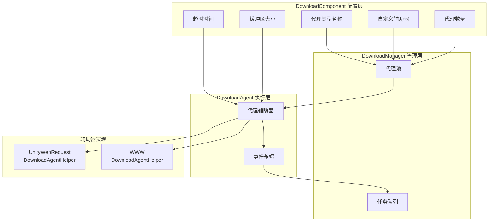

# 下载代理設定

下载代理設定用于設定下载系统的コア行为，含みます代理タイプ选择、并发数量、超时設定等关键パラメータ。

## 概要

下载代理（Download Agent）是下载系统的コア执行单元，负责实际的网络请求和数据写入操作。每个下载代理通过一个下载代理辅助器（DownloadAgentHelper）来実装具体的下载機能。系统サポート設定多个并行工作的下载代理，以提升多ファイル下载的效率。

下载代理設定主な通过 `DownloadComponent` コンポーネント在 Unity エディタ中进行設定，也〜できます通过コード动态调整。

## 設定项详解

### 代理辅助器タイプ設定

代理辅助器タイプ决定了实际执行下载操作的具体実装类。

| 設定项 | タイプ | デフォルト值 | 説明 |
|--------|------|--------|------|
| 辅助器タイプ名称 | string | "GameFrameX.Download.Runtime.UnityWebRequestDownloadAgentHelper" | 辅助器类的完全なタイプ名 |
| 自定義辅助器インスタンス | DownloadAgentHelperBase | null | 直接参照的自定義辅助器对象 |

```csharp
// DownloadComponent.cs 中的配置定义
[SerializeField] private string m_DownloadAgentHelperTypeName = "GameFrameX.Download.Runtime.UnityWebRequestDownloadAgentHelper";

[SerializeField] private DownloadAgentHelperBase m_CustomDownloadAgentHelper = null;
```
> Source: [DownloadComponent.cs](https://github.com/GameFrameX/com.gameframex.unity.download/blob/main/Runtime/Download/DownloadComponent.cs#L33-L35)

**使用説明：**
- 通过タイプ名称作成：系统会根据字符串タイプ名反射作成辅助器インスタンス
- 直接参照自定義インスタンス：〜できます预先作成自定義辅助器并赋值给 `m_CustomDownloadAgentHelper`

### 代理数量設定

```csharp
// 默认创建3个并行下载代理
[SerializeField] private int m_DownloadAgentHelperCount = 3;
```
> Source: [DownloadComponent.cs](https://github.com/GameFrameX/com.gameframex.unity.download/blob/main/Runtime/Download/DownloadComponent.cs#L37)

```csharp
// 启动时创建所有下载代理
for (int i = 0; i < m_DownloadAgentHelperCount; i++)
{
    AddDownloadAgentHelper(i);
}
```
> Source: [DownloadComponent.cs](https://github.com/GameFrameX/com.gameframex.unity.download/blob/main/Runtime/Download/DownloadComponent.cs#L178-L181)

| 設定项 | タイプ | デフォルト值 | 取值范围 | 説明 |
|--------|------|--------|----------|------|
| 代理数量 | int | 3 | 1-16 | 同時に工作的下载代理数量 |

**性能お勧め：**
- 数量越多，并行下载能力越强，但网络带宽消耗越大
- お勧め根据实际网络条件和服务器限制設定
- 移动端お勧め 2-4 个，PC端可設定 4-8 个

### 超时設定

```csharp
// 下载超时时间（秒）
[SerializeField] private float m_Timeout = 30f;
```
> Source: [DownloadComponent.cs](https://github.com/GameFrameX/com.gameframex.unity.download/blob/main/Runtime/Download/DownloadComponent.cs#L39)

| 設定项 | タイプ | デフォルト值 | 取值范围 | 説明 |
|--------|------|--------|----------|------|
| 超时时间 | float | 30秒 | 0-120秒 | 单次下载请求的最大等待时间 |

**超时判断逻辑：**
```csharp
// DownloadAgent.cs 中，超时判断
m_WaitTime += realElapseSeconds;
if (m_WaitTime >= m_Task.Timeout)
{
    // 触发超时错误
    DownloadAgentHelperErrorEventArgs.Create(false, "Timeout");
}
```
> Source: [DownloadManager.DownloadAgent.cs](https://github.com/GameFrameX/com.gameframex.unity.download/blob/main/Runtime/Download/Download/DownloadManager.DownloadAgent.cs#L127-L138)

### 缓冲区設定

```csharp
// 缓冲区大小（字节），默认 1MB
private const int OneMegaBytes = 1024 * 1024;
[SerializeField] private int m_FlushSize = OneMegaBytes;
```
> Source: [DownloadComponent.cs](https://github.com/GameFrameX/com.gameframex.unity.download/blob/main/Runtime/Download/DownloadComponent.cs#L25-L41)

| 設定项 | タイプ | デフォルト值 | 説明 |
|--------|------|--------|------|
| 缓冲区大小 | int | 1048576 (1MB) | トリガー磁盘写入的缓冲区临界值 |

**断点续传原理：**
```csharp
// 数据写入时累积缓冲区，达到阈值后刷新到磁盘
m_FileStream.Write(e.GetBytes(), e.Offset, e.Length);
m_WaitFlushSize += e.Length;
if (m_WaitFlushSize >= m_Task.FlushSize)
{
    m_FileStream.Flush();  // 刷新到磁盘
    m_WaitFlushSize = 0;
}
```
> Source: [DownloadManager.DownloadAgent.cs](https://github.com/GameFrameX/com.gameframex.unity.download/blob/main/Runtime/Download/Download/DownloadManager.DownloadAgent.cs#L270-L291)

## 内置代理辅助器

### UnityWebRequestDownloadAgentHelper

这是系统デフォルト的下载代理辅助器，基于 Unity 的 `UnityWebRequest` 実装。

**特性：**
- サポート断点续传（Range 请求）
- サポート HTTPS/SSL
- 自动処理证书（デフォルト接受所有证书）
- 兼容 Unity 2017.2+

**关键実装：**
```csharp
public partial class UnityWebRequestDownloadAgentHelper : DownloadAgentHelperBase, IDisposable
{
    // 支持三种下载模式：
    // 1. 完整下载
    public override void Download(string downloadUri, object userData);
    
    // 2. 从指定位置开始断点续传
    public override void Download(string downloadUri, long fromPosition, object userData);
    
    // 3. 指定范围下载
    public override void Download(string downloadUri, long fromPosition, long toPosition, object userData);
}
```
> Source: [UnityWebRequestDownloadAgentHelper.cs](https://github.com/GameFrameX/com.gameframex.unity.download/blob/main/Runtime/Download/UnityWebRequestDownloadAgentHelper.cs#L26-L147)

**证书処理：**
```csharp
// 默认接受所有 SSL 证书（开发环境使用）
public sealed class DownloadCertificateHandler : CertificateHandler
{
    protected override bool ValidateCertificate(byte[] certificateData)
    {
        return true; // 接受所有证书
    }
}
```
> Source: [UnityWebRequestDownloadAgentHelper.cs](https://github.com/GameFrameX/com.gameframex.unity.download/blob/main/Runtime/Download/UnityWebRequestDownloadAgentHelper.cs#L14-L21)

### WWWDownloadAgentHelper

传统下载辅助器，基于 `WWW` 类実装，仅在 Unity 2018.3 之前的バージョン可用。

```csharp
#if !UNITY_2018_3_OR_NEWER
public class WWWDownloadAgentHelper : DownloadAgentHelperBase, IDisposable
{
    // 与 UnityWebRequestDownloadAgentHelper 相同的接口
}
#endif
```
> Source: [WWWDownloadAgentHelper.cs](https://github.com/GameFrameX/com.gameframex.unity.download/blob/main/Runtime/Download/WWWDownloadAgentHelper.cs#L8-L22)

**注意：** お勧め使用 `UnityWebRequestDownloadAgentHelper`，`WWW` 类已在 Unity 2018.3 中废弃。

## アーキテクチャ图



## 代理辅助器インターフェース

所有下载代理辅助器〜しなければなりません実装 `IDownloadAgentHelper` インターフェース：

```csharp
public interface IDownloadAgentHelper
{
    /// 下载代理辅助器更新数据流事件
    event EventHandler<DownloadAgentHelperUpdateBytesEventArgs> DownloadAgentHelperUpdateBytes;

    /// 下载代理辅助器更新数据大小事件
    event EventHandler<DownloadAgentHelperUpdateLengthEventArgs> DownloadAgentHelperUpdateLength;

    /// 下载代理辅助器完成事件
    event EventHandler<DownloadAgentHelperCompleteEventArgs> DownloadAgentHelperComplete;

    /// 下载代理辅助器错误事件
    event EventHandler<DownloadAgentHelperErrorEventArgs> DownloadAgentHelperError;

    /// 通过下载代理辅助器下载指定地址的数据
    void Download(string downloadUri, object userData);
    void Download(string downloadUri, long fromPosition, object userData);
    void Download(string downloadUri, long fromPosition, long toPosition, object userData);

    /// 重置下载代理辅助器
    void Reset();
}
```
> Source: [IDownloadAgentHelper.cs](https://github.com/GameFrameX/com.gameframex.unity.download/blob/main/Runtime/Download/Download/IDownloadAgentHelper.cs#L15-L65)

## 自定義代理辅助器

〜できます通过継承 `DownloadAgentHelperBase` 作成自定義下载代理辅助器：

```csharp
public abstract class DownloadAgentHelperBase : MonoBehaviour, IDownloadAgentHelper
{
    /// 范围不适用错误码
    protected const int RangeNotSatisfiableErrorCode = 416;

    /// 必须实现的四个事件
    public abstract event EventHandler<DownloadAgentHelperUpdateBytesEventArgs> DownloadAgentHelperUpdateBytes;
    public abstract event EventHandler<DownloadAgentHelperUpdateLengthEventArgs> DownloadAgentHelperUpdateLength;
    public abstract event EventHandler<DownloadAgentHelperCompleteEventArgs> DownloadAgentHelperComplete;
    public abstract event EventHandler<DownloadAgentHelperErrorEventArgs> DownloadAgentHelperError;

    /// 必须实现的三个下载方法（支持断点续传）
    public abstract void Download(string downloadUri, object userData);
    public abstract void Download(string downloadUri, long fromPosition, object userData);
    public abstract void Download(string downloadUri, long fromPosition, long toPosition, object userData);

    /// 重置辅助器状态
    public abstract void Reset();
}
```
> Source: [DownloadAgentHelperBase.cs](https://github.com/GameFrameX/com.gameframex.unity.download/blob/main/Runtime/Download/DownloadAgentHelperBase.cs#L17-L72)

## エディタ設定

在 Unity エディタ中，〜できます通过 `DownloadComponent` コンポーネント的パネル进行可视化設定：

```csharp
// Inspector 中的配置项
EditorGUILayout.PropertyField(m_InstanceRoot);  // 实例根节点
m_DownloadAgentHelperInfo.Draw();               // 代理辅助器类型选择
m_DownloadAgentHelperCount.intValue = EditorGUILayout.IntSlider("Download Agent Helper Count", ...); // 代理数量
EditorGUILayout.Slider("Timeout", ...);        // 超时时间
EditorGUILayout.DelayedIntField("Flush Size", ...); // 缓冲区大小
```
> Source: [DownloadComponentInspector.cs](https://github.com/GameFrameX/com.gameframex.unity.download/blob/main/Editor/Inspector/DownloadComponentInspector.cs#L38-L69)

## イベント系统

下载代理辅助器通过イベント向上层报告下载ステータス：

| イベント | パラメータタイプ | トリガー时机 |
|------|----------|----------|
| DownloadAgentHelperUpdateBytes | DownloadAgentHelperUpdateBytesEventArgs | 收到下载数据时 |
| DownloadAgentHelperUpdateLength | DownloadAgentHelperUpdateLengthEventArgs | 数据大小アップデート时 |
| DownloadAgentHelperComplete | DownloadAgentHelperCompleteEventArgs | 下载完成时 |
| DownloadAgentHelperError | DownloadAgentHelperErrorEventArgs | 下载出错时 |

这些イベント被 `DownloadAgent` 受信并処理，最终トリガー更上层的下载イベント。

## 関連リンク

- [エディタ設定](./7-configuration.editor-configuration) - エディタ相关設定説明
- [コアコンセプト - 下载代理](./4-core-concepts.download-agent) - 下载代理コアコンセプト详解
- [API リファレンス - プロパティ](./5-api-reference.properties) - DownloadComponent プロパティAPI
- [API リファレンス - メソッド](./5-api-reference.methods) - DownloadComponent メソッドAPI
- [下载イベント](./6-events.download-events) - 下载相关イベント説明
- [代理イベント](./6-events.agent-events) - 代理相关イベント説明
