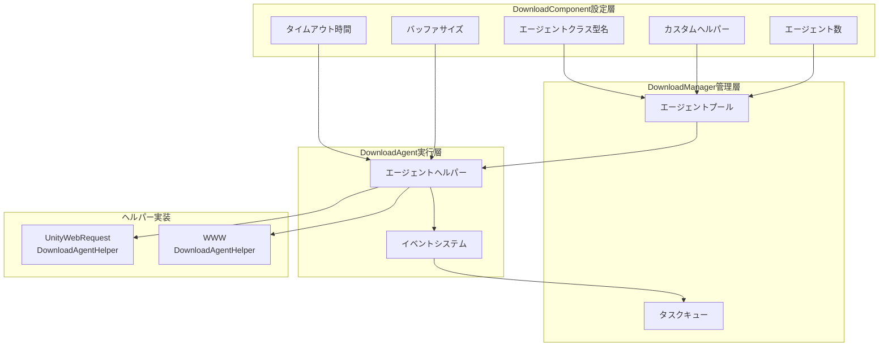

# ダウンロードエージェント設定

ダウンロードエージェント設定は、ダウンロードシステムのコア動作を設定するために使用されます。エージェントタイプ選択、同時実行数、タイムアウト設定などの主要パラメータを含みます。

## 概要

ダウンロードエージェント（Download Agent）はダウンロードシステムのコア実行ユニットであり、実際のネットワークリクエストとデータ書き込みを担当します。各ダウンロードエージェントはダウンロードエージェントヘルパー（DownloadAgentHelper）を通じて具体的なダウンロード機能を実装します。システムは複数の並列動作するダウンロードエージェントの設定をサポートし、複数のファイルダウンロードの効率を向上させます。

ダウンロードエージェント設定は主に`DownloadComponent`コンポーネントを通じてUnityエディタで行われ、コードを通じて動的に調整することもできます。

## 設定項目の詳細

### エージェントヘルパークラス型設定

エージェントヘルパークラス型は実際のダウンロード操作を実行する конкретный実装クラスを決定します。

| 設定項目 | 型 | デフォルト値 | 説明 |
|--------|------|--------|------|
| ヘルパークラス型名 | string | "GameFrameX.Download.Runtime.UnityWebRequestDownloadAgentHelper" | ヘルパークラスの完全なクラス型名 |
| カスタムヘルパーインスタンス | DownloadAgentHelperBase | null | 直接参照するカスタムヘルパーオブジェクト |

```csharp
// DownloadComponent.cs内の設定定義
[SerializeField] private string m_DownloadAgentHelperTypeName = "GameFrameX.Download.Runtime.UnityWebRequestDownloadAgentHelper";

[SerializeField] private DownloadAgentHelperBase m_CustomDownloadAgentHelper = null;
```
> 出典: [DownloadComponent.cs](https://github.com/GameFrameX/com.gameframex.unity.download/blob/main/Runtime/Download/DownloadComponent.cs#L33-L35)

**使用方法：**
- クラス型名で作成：システムは文字列クラス型名でリフレクションを使用してヘルパーインスタンスを作成します
- カスタムインスタンスを直接参照：カスタムヘルパーを事前に作成して`m_CustomDownloadAgentHelper`に代入できます

### エージェント数設定

```csharp
// デフォルトで3つの並列ダウンロードエージェントを作成
[SerializeField] private int m_DownloadAgentHelperCount = 3;
```
> 出典: [DownloadComponent.cs](https://github.com/GameFrameX/com.gameframex.unity.download/blob/main/Runtime/Download/DownloadComponent.cs#L37)

```csharp
// 起動時にすべてのダウンロードエージェントを作成
for (int i = 0; i < m_DownloadAgentHelperCount; i++)
{
    AddDownloadAgentHelper(i);
}
```
> 出典: [DownloadComponent.cs](https://github.com/GameFrameX/com.gameframex.unity.download/blob/main/Runtime/Download/DownloadComponent.cs#L178-L181)

| 設定項目 | 型 | デフォルト値 | 取値範囲 | 説明 |
|--------|------|--------|----------|------|
| エージェント数 | int | 3 | 1-16 | 同時に動作するダウンロードエージェント数 |

**パフォーマンス推奨：**
- 数が多くなるほど並列ダウンロード能力が向上しますが、ネットワーク帯域幅の消費も大きくなります
- 実際のネットワーク条件とサーバー制限に基づいて設定することを推奨
- モバイル端は2-4個、PC端は4-8個に設定することを推奨

### タイムアウト設定

```csharp
// ダウンロードタイムアウト時間（秒）
[SerializeField] private float m_Timeout = 30f;
```
> 出典: [DownloadComponent.cs](https://github.com/GameFrameX/com.gameframex.unity.download/blob/main/Runtime/Download/DownloadComponent.cs#L39)

| 設定項目 | 型 | デフォルト値 | 取値範囲 | 説明 |
|--------|------|--------|----------|------|
| タイムアウト時間 | float | 30秒 | 0-120秒 | 単一ダウンロードリクエストの最大待機時間 |

**タイムアウト判断ロジック：**
```csharp
// DownloadAgent.cs内のタイムアウト判断
m_WaitTime += realElapseSeconds;
if (m_WaitTime >= m_Task.Timeout)
{
    // タイムアウトエラーをトリガー
    DownloadAgentHelperErrorEventArgs.Create(false, "Timeout");
}
```
> 出典: [DownloadManager.DownloadAgent.cs](https://github.com/GameFrameX/com.gameframex.unity.download/blob/main/Runtime/Download/Download/DownloadManager.DownloadAgent.cs#L127-L138)

### バッファ設定

```csharp
// バッファサイズ（バイト）、デフォルト1MB
private const int OneMegaBytes = 1024 * 1024;
[SerializeField] private int m_FlushSize = OneMegaBytes;
```
> 出典: [DownloadComponent.cs](https://github.com/GameFrameX/com.gameframex.unity.download/blob/main/Runtime/Download/DownloadComponent.cs#L25-L41)

| 設定項目 | 型 | デフォルト値 | 説明 |
|--------|------|--------|------|
| バッファサイズ | int | 1048576 (1MB) | ディスク書き込みをトリガーするバッファ閾値 |

**レジューム原理：**
```csharp
// データ書き込み時にバッファを蓄積し、閾値に達するとディスクにフラッシュ
m_FileStream.Write(e.GetBytes(), e.Offset, e.Length);
m_WaitFlushSize += e.Length;
if (m_WaitFlushSize >= m_Task.FlushSize)
{
    m_FileStream.Flush();  // ディスクにフラッシュ
    m_WaitFlushSize = 0;
}
```
> 出典: [DownloadManager.DownloadAgent.cs](https://github.com/GameFrameX/com.gameframex.unity.download/blob/main/Runtime/Download/Download/DownloadManager.DownloadAgent.cs#L270-L291)

## 内蔵エージェントヘルパー

### UnityWebRequestDownloadAgentHelper

これはシステムのデフォルトのダウンロードエージェントヘルパーであり、Unityの`UnityWebRequest`に基づいて実装されています。

**特性：**
- レジューム（Rangeリクエスト）をサポート
- HTTPS/SSLをサポート
- 証明書を自動処理（デフォルトではすべての証明書を受け入れる）
- Unity 2017.2+と互換

**主要な実装：**
```csharp
public partial class UnityWebRequestDownloadAgentHelper : DownloadAgentHelperBase, IDisposable
{
    // 3つのダウンロードモードをサポート：
    // 1. 完全ダウンロード
    public override void Download(string downloadUri, object userData);

    // 2. 指定位置からレジューム開始
    public override void Download(string downloadUri, long fromPosition, object userData);

    // 3. 指定範囲ダウンロード
    public override void Download(string downloadUri, long fromPosition, long toPosition, object userData);
}
```
> 出典: [UnityWebRequestDownloadAgentHelper.cs](https://github.com/GameFrameX/com.gameframex.unity.download/blob/main/Runtime/Download/UnityWebRequestDownloadAgentHelper.cs#L26-L147)

**証明書処理：**
```csharp
// デフォルトではすべてのSSL証明書を受け入れる（開発環境で使用）
public sealed class DownloadCertificateHandler : CertificateHandler
{
    protected override bool ValidateCertificate(byte[] certificateData)
    {
        return true; // すべての証明書を受け入れる
    }
}
```
> 出典: [UnityWebRequestDownloadAgentHelper.cs](https://github.com/GameFrameX/com.gameframex.unity.download/blob/main/Runtime/Download/UnityWebRequestDownloadAgentHelper.cs#L14-L21)

### WWWDownloadAgentHelper

従来のダウンロードヘルパーであり、`WWW`クラスに基づいて実装され、Unity 2018.3より前のバージョンでのみ使用可能です。

```csharp
#if !UNITY_2018_3_OR_NEWER
public class WWWDownloadAgentHelper : DownloadAgentHelperBase, IDisposable
{
    // UnityWebRequestDownloadAgentHelperと同じインターフェース
}
#endif
```
> 出典: [WWWDownloadAgentHelper.cs](https://github.com/GameFrameX/com.gameframex.unity.download/blob/main/Runtime/Download/WWWDownloadAgentHelper.cs#L8-L22)

**注意：** `UnityWebRequestDownloadAgentHelper`の使用を推奨します。`WWW`クラスはUnity 2018.3で廃止されました。

## アーキテクチャ図



## エージェントヘルパーインターフェース

すべてのダウンロードエージェントヘルパーは`IDownloadAgentHelper`インターフェースを実装する必要があります：

```csharp
public interface IDownloadAgentHelper
{
    /// ダウンロードエージェントヘルパー更新バイトストリームイベント
    event EventHandler<DownloadAgentHelperUpdateBytesEventArgs> DownloadAgentHelperUpdateBytes;

    /// ダウンロードエージェントヘルパー更新データサイズイベント
    event EventHandler<DownloadAgentHelperUpdateLengthEventArgs> DownloadAgentHelperUpdateLength;

    /// ダウンロードエージェントヘルパー完了イベント
    event EventHandler<DownloadAgentHelperCompleteEventArgs> DownloadAgentHelperComplete;

    /// ダウンロードエージェントヘルパーエラーイベント
    event EventHandler<DownloadAgentHelperErrorEventArgs> DownloadAgentHelperError;

    /// ダウンロードエージェントヘルパーを使用して指定アドレスのデータをダウンロード
    void Download(string downloadUri, object userData);
    void Download(string downloadUri, long fromPosition, object userData);
    void Download(string downloadUri, long fromPosition, long toPosition, object userData);

    /// ダウンロードエージェントヘルパーをリセット
    void Reset();
}
```
> 出典: [IDownloadAgentHelper.cs](https://github.com/GameFrameX/com.gameframex.unity.download/blob/main/Runtime/Download/Download/IDownloadAgentHelper.cs#L15-L65)

## カスタムエージェントヘルパー

`DownloadAgentHelperBase`を継承してカスタムダウンロードエージェントヘルパーを作成できます：

```csharp
public abstract class DownloadAgentHelperBase : MonoBehaviour, IDownloadAgentHelper
{
    /// 範囲不適用エラーコード
    protected const int RangeNotSatisfiableErrorCode = 416;

    /// 必ず実装する4つのイベント
    public abstract event EventHandler<DownloadAgentHelperUpdateBytesEventArgs> DownloadAgentHelperUpdateBytes;
    public abstract event EventHandler<DownloadAgentHelperUpdateLengthEventArgs> DownloadAgentHelperUpdateLength;
    public abstract event EventHandler<DownloadAgentHelperCompleteEventArgs> DownloadAgentHelperComplete;
    public abstract event EventHandler<DownloadAgentHelperErrorEventArgs> DownloadAgentHelperError;

    /// 必ず実装する3つのキーポイント（レジュームサポート）
    public abstract void Download(string downloadUri, object userData);
    public abstract void Download(string downloadUri, long fromPosition, object userData);
    public abstract void Download(string downloadUri, long fromPosition, long toPosition, object userData);

    /// ヘルパーの状態をリセット
    public abstract void Reset();
}
```
> 出典: [DownloadAgentHelperBase.cs](https://github.com/GameFrameX/com.gameframex.unity.download/blob/main/Runtime/Download/DownloadAgentHelperBase.cs#L17-L72)

## エディタ設定

Unityエディタでは、`DownloadComponent`コンポーネントのパネルを通じてビジュアル設定を行えます：

```csharp
// Inspector内の設定項目
EditorGUILayout.PropertyField(m_InstanceRoot);  // インスタンスルートノード
m_DownloadAgentHelperInfo.Draw();               // エージェントヘルパークラス型選択
m_DownloadAgentHelperCount.intValue = EditorGUILayout.IntSlider("Download Agent Helper Count", ...); // エージェント数
EditorGUILayout.Slider("Timeout", ...);        // タイムアウト時間
EditorGUILayout.DelayedIntField("Flush Size", ...); // バッファサイズ
```
> 出典: [DownloadComponentInspector.cs](https://github.com/GameFrameX/com.gameframex.unity.download/blob/main/Editor/Inspector/DownloadComponentInspector.cs#L38-L69)

## イベントシステム

ダウンロードエージェントヘルパーはイベントを通じて上層にダウンロード状態を報告します：

| イベント | パラメータクラス型 | トリガータイミング |
|------|----------|----------|
| DownloadAgentHelperUpdateBytes | DownloadAgentHelperUpdateBytesEventArgs | ダウンロードデータを受信した時 |
| DownloadAgentHelperUpdateLength | DownloadAgentHelperUpdateLengthEventArgs | データサイズが更新された時 |
| DownloadAgentHelperComplete | DownloadAgentHelperCompleteEventArgs | ダウンロードが完了した時 |
| DownloadAgentHelperError | DownloadAgentHelperErrorEventArgs | ダウンロードエラーが発生した時 |

これらのイベントは無効`DownloadAgent`に受信されて処理され、最終的にはより上層のダウンロードイベントをトリガーします。

## 関連リンク

- [エディタ設定](./7-configuration.editor-configuration) - エディタ関連設定の説明
- [コア概念 - ダウンロードエージェント](./4-core-concepts.download-agent) - ダウンロードエージェントコア概念の詳細
- [APIリファレンス - プロパティ](./5-api-reference.properties) - DownloadComponentプロパティAPI
- [APIリファレンス - メソッド](./5-api-reference.methods) - DownloadComponentメソッドAPI
- [ダウンロードイベント](./6-events.download-events) - ダウンロード関連イベントの説明
- [エージェントイベント](./6-events.agent-events) - エージェント関連イベントの説明