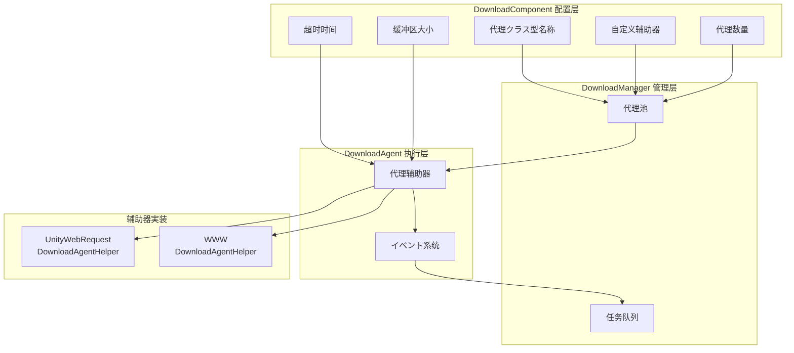

# ダウンロード代理配置

ダウンロード代理配置に使用設定ダウンロード系统的コア行为，包括代理クラス型选择、并发数量、超时設定等关键参数。

## 概要

ダウンロード代理（Download Agent）是ダウンロード系统的コア执行单元，负责实际的网络お願いします求和数据写入操作。每个ダウンロード代理を通じて一个ダウンロード代理辅助器（DownloadAgentHelper）来実装具体的ダウンロード機能。系统サポート配置多个并行工作的ダウンロード代理，以提升多ファイルダウンロード的效率。

ダウンロード代理配置主要を通じて `DownloadComponent` コンポーネント在 Unity 编辑器中进行設定，也可能を通じて代码动态调整。

## 設定项详解

### 代理辅助器クラス型配置

代理辅助器クラス型决定了实际执行ダウンロード操作的具体実装クラス。

| 配置项 | クラス型 | 默认值 | 説明 |
|--------|------|--------|------|
| 辅助器クラス型名称 | string | "GameFrameX.Download.Runtime.UnityWebRequestDownloadAgentHelper" | 辅助器クラス的完整クラス型名 |
| 自定义辅助器インスタンス | DownloadAgentHelperBase | null | 直接引用的自定义辅助器对象 |

```csharp
// DownloadComponent.cs 中的配置定义
[SerializeField] private string m_DownloadAgentHelperTypeName = "GameFrameX.Download.Runtime.UnityWebRequestDownloadAgentHelper";

[SerializeField] private DownloadAgentHelperBase m_CustomDownloadAgentHelper = null;
```
> Source: [DownloadComponent.cs](https://github.com/GameFrameX/com.gameframex.unity.download/blob/main/Runtime/Download/DownloadComponent.cs#L33-L35)

**使用説明：**
- を通じてクラス型名称作成：系统会に基づいて字符串クラス型名反射作成辅助器インスタンス
- 直接引用自定义インスタンス：可能预先作成自定义辅助器并赋值给 `m_CustomDownloadAgentHelper`

### 代理数量配置

```csharp
// 默认作成3个并行ダウンロード代理
[SerializeField] private int m_DownloadAgentHelperCount = 3;
```
> Source: [DownloadComponent.cs](https://github.com/GameFrameX/com.gameframex.unity.download/blob/main/Runtime/Download/DownloadComponent.cs#L37)

```csharp
// 启动时作成所有ダウンロード代理
for (int i = 0; i < m_DownloadAgentHelperCount; i++)
{
    AddDownloadAgentHelper(i);
}
```
> Source: [DownloadComponent.cs](https://github.com/GameFrameX/com.gameframex.unity.download/blob/main/Runtime/Download/DownloadComponent.cs#L178-L181)

| 配置项 | クラス型 | 默认值 | 取值范围 | 説明 |
|--------|------|--------|----------|------|
| 代理数量 | int | 3 | 1-16 | 同时工作的ダウンロード代理数量 |

**性能建议：**
- 数量越多，并行ダウンロード能力越强，但网络带宽消耗越大
- 建议に基づいて实际网络条件和服务器限制設定
- 移动端建议 2-4 个，PC端可設定 4-8 个

### 超时配置

```csharp
// ダウンロード超时时间（秒）
[SerializeField] private float m_Timeout = 30f;
```
> Source: [DownloadComponent.cs](https://github.com/GameFrameX/com.gameframex.unity.download/blob/main/Runtime/Download/DownloadComponent.cs#L39)

| 配置项 | クラス型 | 默认值 | 取值范围 | 説明 |
|--------|------|--------|----------|------|
| 超时时间 | float | 30秒 | 0-120秒 | 单次ダウンロードお願いします求的最大等待时间 |

**超时判断逻辑：**
```csharp
// DownloadAgent.cs 中，超时判断
m_WaitTime += realElapseSeconds;
if (m_WaitTime >= m_Task.Timeout)
{
    // 触发超时错误
    DownloadAgentHelperErrorEventArgs.Create(false, "Timeout");
}
```
> Source: [DownloadManager.DownloadAgent.cs](https://github.com/GameFrameX/com.gameframex.unity.download/blob/main/Runtime/Download/Download/DownloadManager.DownloadAgent.cs#L127-L138)

### 缓冲区配置

```csharp
// 缓冲区大小（字节），默认 1MB
private const int OneMegaBytes = 1024 * 1024;
[SerializeField] private int m_FlushSize = OneMegaBytes;
```
> Source: [DownloadComponent.cs](https://github.com/GameFrameX/com.gameframex.unity.download/blob/main/Runtime/Download/DownloadComponent.cs#L25-L41)

| 配置项 | クラス型 | 默认值 | 説明 |
|--------|------|--------|------|
| 缓冲区大小 | int | 1048576 (1MB) | 触发磁盘写入的缓冲区临界值 |

**断点续传原理：**
```csharp
// 数据写入时累积缓冲区，达到阈值后刷新到磁盘
m_FileStream.Write(e.GetBytes(), e.Offset, e.Length);
m_WaitFlushSize += e.Length;
if (m_WaitFlushSize >= m_Task.FlushSize)
{
    m_FileStream.Flush();  // 刷新到磁盘
    m_WaitFlushSize = 0;
}
```
> Source: [DownloadManager.DownloadAgent.cs](https://github.com/GameFrameX/com.gameframex.unity.download/blob/main/Runtime/Download/Download/DownloadManager.DownloadAgent.cs#L270-L291)

## 内置代理辅助器

### UnityWebRequestDownloadAgentHelper

这是系统默认的ダウンロード代理辅助器，基づく Unity 的 `UnityWebRequest` 実装。

**特性：**
- サポート断点续传（Range お願いします求）
- サポート HTTPS/SSL
- 自动处理证书（默认接受所有证书）
- 兼容 Unity 2017.2+

**关键実装：**
```csharp
public partial class UnityWebRequestDownloadAgentHelper : DownloadAgentHelperBase, IDisposable
{
    // サポート三种ダウンロード模式：
    // 1. 完整ダウンロード
    public override void Download(string downloadUri, object userData);
    
    // 2. 从指定位置开始断点续传
    public override void Download(string downloadUri, long fromPosition, object userData);
    
    // 3. 指定范围ダウンロード
    public override void Download(string downloadUri, long fromPosition, long toPosition, object userData);
}
```
> Source: [UnityWebRequestDownloadAgentHelper.cs](https://github.com/GameFrameX/com.gameframex.unity.download/blob/main/Runtime/Download/UnityWebRequestDownloadAgentHelper.cs#L26-L147)

**证书处理：**
```csharp
// 默认接受所有 SSL 证书（开发环境使用）
public sealed class DownloadCertificateHandler : CertificateHandler
{
    protected override bool ValidateCertificate(byte[] certificateData)
    {
        return true; // 接受所有证书
    }
}
```
> Source: [UnityWebRequestDownloadAgentHelper.cs](https://github.com/GameFrameX/com.gameframex.unity.download/blob/main/Runtime/Download/UnityWebRequestDownloadAgentHelper.cs#L14-L21)

### WWWDownloadAgentHelper

传统ダウンロード辅助器，基づく `WWW` クラス実装，仅在 Unity 2018.3 之前的版本可用。

```csharp
#if !UNITY_2018_3_OR_NEWER
public class WWWDownloadAgentHelper : DownloadAgentHelperBase, IDisposable
{
    // 与 UnityWebRequestDownloadAgentHelper 相同的インターフェース
}
#endif
```
> Source: [WWWDownloadAgentHelper.cs](https://github.com/GameFrameX/com.gameframex.unity.download/blob/main/Runtime/Download/WWWDownloadAgentHelper.cs#L8-L22)

**注意：** 建议使用 `UnityWebRequestDownloadAgentHelper`，`WWW` クラス已在 Unity 2018.3 中废弃。

## 架构图



## 代理辅助器インターフェース

所有ダウンロード代理辅助器必須実装 `IDownloadAgentHelper` インターフェース：

```csharp
public interface IDownloadAgentHelper
{
    /// ダウンロード代理辅助器更新数据流イベント
    event EventHandler<DownloadAgentHelperUpdateBytesEventArgs> DownloadAgentHelperUpdateBytes;

    /// ダウンロード代理辅助器更新数据大小イベント
    event EventHandler<DownloadAgentHelperUpdateLengthEventArgs> DownloadAgentHelperUpdateLength;

    /// ダウンロード代理辅助器完成イベント
    event EventHandler<DownloadAgentHelperCompleteEventArgs> DownloadAgentHelperComplete;

    /// ダウンロード代理辅助器错误イベント
    event EventHandler<DownloadAgentHelperErrorEventArgs> DownloadAgentHelperError;

    /// を通じてダウンロード代理辅助器ダウンロード指定地址的数据
    void Download(string downloadUri, object userData);
    void Download(string downloadUri, long fromPosition, object userData);
    void Download(string downloadUri, long fromPosition, long toPosition, object userData);

    /// 重置ダウンロード代理辅助器
    void Reset();
}
```
> Source: [IDownloadAgentHelper.cs](https://github.com/GameFrameX/com.gameframex.unity.download/blob/main/Runtime/Download/Download/IDownloadAgentHelper.cs#L15-L65)

## 自定义代理辅助器

可能を通じて继承 `DownloadAgentHelperBase` 作成自定义ダウンロード代理辅助器：

```csharp
public abstract class DownloadAgentHelperBase : MonoBehaviour, IDownloadAgentHelper
{
    /// 范围不适用错误码
    protected const int RangeNotSatisfiableErrorCode = 416;

    /// 必須実装的四个イベント
    public abstract event EventHandler<DownloadAgentHelperUpdateBytesEventArgs> DownloadAgentHelperUpdateBytes;
    public abstract event EventHandler<DownloadAgentHelperUpdateLengthEventArgs> DownloadAgentHelperUpdateLength;
    public abstract event EventHandler<DownloadAgentHelperCompleteEventArgs> DownloadAgentHelperComplete;
    public abstract event EventHandler<DownloadAgentHelperErrorEventArgs> DownloadAgentHelperError;

    /// 必須実装的三个ダウンロードメソッド（サポート断点续传）
    public abstract void Download(string downloadUri, object userData);
    public abstract void Download(string downloadUri, long fromPosition, object userData);
    public abstract void Download(string downloadUri, long fromPosition, long toPosition, object userData);

    /// 重置辅助器ステータス
    public abstract void Reset();
}
```
> Source: [DownloadAgentHelperBase.cs](https://github.com/GameFrameX/com.gameframex.unity.download/blob/main/Runtime/Download/DownloadAgentHelperBase.cs#L17-L72)

## 编辑器配置

在 Unity 编辑器中，可能を通じて `DownloadComponent` コンポーネント的面板进行可视化配置：

```csharp
// Inspector 中的配置项
EditorGUILayout.PropertyField(m_InstanceRoot);  // インスタンス根节点
m_DownloadAgentHelperInfo.Draw();               // 代理辅助器クラス型选择
m_DownloadAgentHelperCount.intValue = EditorGUILayout.IntSlider("Download Agent Helper Count", ...); // 代理数量
EditorGUILayout.Slider("Timeout", ...);        // 超时时间
EditorGUILayout.DelayedIntField("Flush Size", ...); // 缓冲区大小
```
> Source: [DownloadComponentInspector.cs](https://github.com/GameFrameX/com.gameframex.unity.download/blob/main/Editor/Inspector/DownloadComponentInspector.cs#L38-L69)

## イベント系统

ダウンロード代理辅助器を通じてイベント向上层报告ダウンロードステータス：

| イベント | 参数クラス型 | 触发时机 |
|------|----------|----------|
| DownloadAgentHelperUpdateBytes | DownloadAgentHelperUpdateBytesEventArgs | 收到ダウンロード数据时 |
| DownloadAgentHelperUpdateLength | DownloadAgentHelperUpdateLengthEventArgs | 数据大小更新时 |
| DownloadAgentHelperComplete | DownloadAgentHelperCompleteEventArgs | ダウンロード完成时 |
| DownloadAgentHelperError | DownloadAgentHelperErrorEventArgs | ダウンロード出错时 |

这些イベント被 `DownloadAgent` 接收并处理，最终触发更上层的ダウンロードイベント。

## 関連リンク

- [编辑器配置](./7-configuration.editor-configuration) - 编辑器関連配置説明
- [コア概念 - ダウンロード代理](./4-core-concepts.download-agent) - ダウンロード代理コア概念详解
- [API 参考 - プロパティ](./5-api-reference.properties) - DownloadComponent プロパティAPI
- [API 参考 - メソッド](./5-api-reference.methods) - DownloadComponent メソッドAPI
- [ダウンロードイベント](./6-events.download-events) - ダウンロード関連イベント説明
- [代理イベント](./6-events.agent-events) - 代理関連イベント説明
