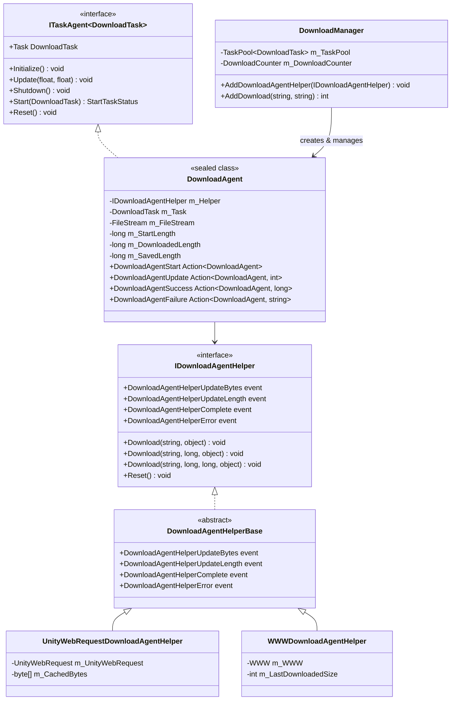
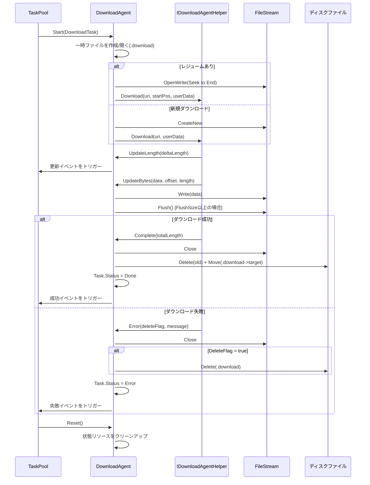

# ダウンロードエージェント

ダウンロードエージェント（Download Agent）はGameFrameXダウンロードシステムのコア実行ユニットであり、ダウンロードタスクの実際の実行を担当します。各ダウンロードエージェントインスタンスは具体的なダウンロード操作に対応し、ダウンロードエージェントヘルパー（Download Agent Helper）と連携してネットワークリクエストとデータ保存を完了します。

## 概要

ダウンロードエージェントは`DownloadManager`内部のタスクエグゼキューターであり、`ITaskAgent<DownloadTask>`インターフェースを実装しています。単一ダウンロードタスクの完全なライフサイクルを管理します：

- **タスク起動**：ファイルストリームの初期化、レジュームのチェック、ダウンロードの開始
- **進捗監視**：ダウンロード進捗のリアルタイム追跡、タイムアウト処理、ダウンロード速度の計算
- **データ書き込み**：ダウンロードデータブロックを一時ファイル（.downloadサフィックス）に書き込み
- **タスク完了**：一時ファイルの名前をターゲットファイルに変更
- **エラー処理**：ネットワークエラー、タイムアウトエラー、IOエラーの処理

ダウンロードエージェントはストラテジーパターン設計を採用し、異なるダウンロードエージェントヘルパー（`IDownloadAgentHelper`）の依存性注入を通じて異なるダウンロード実装をサポートします。フレームワークは以下の2つの内置実装を提供します：
- `UnityWebRequestDownloadAgentHelper`：Unityの`UnityWebRequest` APIに基づく（推奨、Unity 2017.2+と互換）
- `WWWDownloadAgentHelper`：伝統的な`WWW`クラスに基づく（Unity 2018.3以下バージョンのみサポート）

## アーキテクチャ

ダウンロードエージェントシステムは階層化アーキテクチャ設計を採用し、コアコンポーネントは以下の通りです：



**アーキテクチャ設計ポイント：**

1. **タスクエージェントパターン**：`DownloadAgent`は`ITaskAgent<DownloadTask>`インターフェースを実装し、`TaskPool`タスクプールシステムに溶け込み、タスクの統一スケジューリング与管理を実現します。

2. **依存性注入**：`DownloadAgent`はコンストラクタを通じて`IDownloadAgentHelper`インスタンスを受け取り、底部ダウンロード実装を抽象化して拡張性とテスト容易性を高めます。

3. **イベント駆動**：`DownloadAgent`は`IDownloadAgentHelper`のイベントを購読してダウンロード進捗と状態の変化を感知し、具体的なダウンロード実装との結合を維持しません。

4. **ライフサイクル管理**：`DownloadAgent`は`IDisposable`インターフェースを実装し、リソース（特にファイルストリームとネットワークリクエスト）が正しく解放されることを確保します。

## コアフロー

ダウンロードエージェントが単一ダウンロードタスクの完全なフローを処理します：



**主要な設計上の決定：**

1. **一時ファイルメカニズム**：ダウンロードデータはまず`.download`サフィックスの一時ファイルに書き込み、完了后才目标ファイルに名前を変更します。これにより以下を確保：
   - ダウンロードの中断時に元の目標ファイルが破損しない
   - レジュームをサポート（一時ファイルのサイズをチェック）

2. **バッファ書き込み**：`DownloadAgent`は内部バッファを維持し、`FlushSize`（デフォルト1MB）に達した場合のみ物理書き込みを実行し、IO操作回数を減少させます。

3. **タイムアウト検出**：データや進捗更新を受け取るたびに待機タイマーをリセットし、`Timeout`（デフォルト30秒）を超えてデータを受信しない場合、タイムアウトエラーと判断します。

## コアプロパティ

`DownloadAgent`は以下のパブリックプロパティを外部 쿼エリのために提供します：

| プロパティ | 型 | 説明 |
|------|------|------|
| `Task` | `DownloadTask` | 現在処理中のダウンロードタスク |
| `WaitTime` | `float` | 前回データを受信してからの時間（秒） |
| `StartLength` | `long` | ダウンロード開始時の既存ファイルサイズ（レジューム用） |
| `DownloadedLength` | `long` | 今回のダウンロードで取得したデータサイズ |
| `CurrentLength` | `long` | 現在の合計サイズ（StartLength + DownloadedLength） |
| `SavedLength` | `long` | ディスクに永続化されたデータサイズ |

```csharp
// 使用例：ダウンロード進捗をクエリ
DownloadAgent agent = /* イベントまたはプールから取得 */;
long totalSize = agent.CurrentLength;
long downloaded = agent.DownloadedLength;
float progress = (float)downloaded / totalSize * 100f;
Debug.Log($"ダウンロード進捗: {progress:F1}% ({downloaded}/{totalSize} bytes)");
```

## イベントシステム

ダウンロードエージェントは以下のコールバックイベントを通じて外部と通信します：

```csharp
// ダウンロード開始イベント
public Action<DownloadAgent> DownloadAgentStart;

// ダウンロード進捗更新イベント（新しいデータブロックを受け取るたびに）
public Action<DownloadAgent, int> DownloadAgentUpdate;

// ダウンロード成功完了イベント
public Action<DownloadAgent, long> DownloadAgentSuccess;

// ダウンロード失敗イベント
public Action<DownloadAgent, string> DownloadAgentFailure;
```

これらのイベントは`DownloadManager.AddDownloadAgentHelper()`時にマネージャーのイベントシステムにバインドされ、統一されたイベントフローを形成します。

## ダウンロードエージェントヘルパー

### IDownloadAgentHelperインターフェース

`IDownloadAgentHelper`はダウンロードエージェントヘルパーのコア契約を定義します：

> 出典: [IDownloadAgentHelper.cs](https://github.com/GameFrameX/com.gameframex.unity.download/blob/main/Runtime/Download/Download/IDownloadAgentHelper.cs#L15-L65)

```csharp
public interface IDownloadAgentHelper
{
    // イベント：ダウンロードデータストリーム更新
    event EventHandler<DownloadAgentHelperUpdateBytesEventArgs> DownloadAgentHelperUpdateBytes;

    // イベント：ダウンロード長さ更新（增量）
    event EventHandler<DownloadAgentHelperUpdateLengthEventArgs> DownloadAgentHelperUpdateLength;

    // イベント：ダウンロード完了
    event EventHandler<DownloadAgentHelperCompleteEventArgs> DownloadAgentHelperComplete;

    // イベント：ダウンロードエラー
    event EventHandler<DownloadAgentHelperErrorEventArgs> DownloadAgentHelperError;

    // メソッド：最初からダウンロード
    void Download(string downloadUri, object userData);

    // メソッド：指定位置から継続（レジューム）
    void Download(string downloadUri, long fromPosition, object userData);

    // メソッド：指定範囲のデータをダウンロード
    void Download(string downloadUri, long fromPosition, long toPosition, object userData);

    // メソッド：ヘルパーの状態をリセット
    void Reset();
}
```

### UnityWebRequestDownloadAgentHelper

UnityWebRequestに基づく実装 сучас Unityバージョン（2017.2+）をサポート：

> 出典: [UnityWebRequestDownloadAgentHelper.cs](https://github.com/GameFrameX/com.gameframex.unity.download/blob/main/Runtime/Download/UnityWebRequestDownloadAgentHelper.cs#L26-L229)

**特性：**
- `DownloadHandlerScript`サブクラスを使用して增量データコールバックを実装
- 内蔵SSL証明書検証ハンドラー（デフォルトではすべての証明書を受け入れる）
- HTTP Rangeヘッダーをサポートしてレジュームを実装
- Unity 2017.2から最新バージョンまで互換

**使用方法：**

```csharp
// UnityWebRequestヘルパーインスタンスを作成
var helper = gameObject.AddComponent<UnityWebRequestDownloadAgentHelper>();

// ダウンロードマネージャーに追加
var downloadManager = GameEntry.GetComponent<DownloadManager>();
downloadManager.AddDownloadAgentHelper(helper);
```

### WWWDownloadAgentHelper

伝統的なWWWに基づく実装。Unity 2018.3以下バージョンにのみ適しています（过时としてマーク）：

> 出典: [WWWDownloadAgentHelper.cs](https://github.com/GameFrameX/com.gameframex.unity.download/blob/main/Runtime/Download/WWWDownloadAgentHelper.cs#L21-L244)

**注意：** この実装は`#if !UNITY_2018_3_OR_NEWER`条件コンパイルで保護されており、Unity 2018.3以上では使用できません。

## カスタムダウンロードエージェントヘルパー

開発者は`DownloadAgentHelperBase`を継承してカスタムダウンロードロジックを実装できます：

```csharp
using UnityEngine;
using GameFrameX.Download.Runtime;

public class CustomDownloadAgentHelper : DownloadAgentHelperBase
{
    // 継承するイベントと抽象メソッドを実装...

    public override void Download(string downloadUri, object userData)
    {
        // カスタムダウンロードロジックを実装
        // 重要：適切な時にイベントをトリガー
    }

    public override void Reset()
    {
        // リソースをクリーンアップ
    }
}
```

## イベントパラメータ

### DownloadAgentHelperUpdateBytesEventArgs

ダウンロードデータストリーム更新イベントパラメータ：

> 出典: [DownloadAgentHelperUpdateBytesEventArgs.cs](https://github.com/GameFrameX/com.gameframex.unity.download/blob/main/Runtime/EventArgs/DownloadAgentHelperUpdateBytesEventArgs.cs#L16-L62)

| プロパティ | 型 | 説明 |
|------|------|------|
| `Bytes` | `byte[]` | ダウンロードしたデータブロック |
| `Offset` | `int` | データの開始オフセット |
| `Length` | `int` | データの長さ |

### DownloadAgentHelperUpdateLengthEventArgs

ダウンロード增量サイズイベントパラメータ：

> 出典: [DownloadAgentHelperUpdateLengthEventArgs.cs](https://github.com/GameFrameX/com.gameframex.unity.download/blob/main/Runtime/EventArgs/DownloadAgentHelperUpdateLengthEventArgs.cs#L16-L47)

| プロパティ | 型 | 説明 |
|------|------|------|
| `DeltaLength` | `int` | 今回の新規ダウンロードデータサイズ |

### DownloadAgentHelperCompleteEventArgs

ダウンロード完了イベントパラメータ：

> 出典: [DownloadAgentHelperCompleteEventArgs.cs](https://github.com/GameFrameX/com.gameframex.unity.download/blob/main/Runtime/EventArgs/DownloadAgentHelperCompleteEventArgs.cs#L16-L62)

| プロパティ | 型 | 説明 |
|------|------|------|
| `Length` | `long` | ダウンロードした総データサイズ |

### DownloadAgentHelperErrorEventArgs

ダウンロードエラーイベントパラメータ：

> 出典: [DownloadAgentHelperErrorEventArgs.cs](https://github.com/GameFrameX/com.gameframex.unity.download/blob/main/Runtime/EventArgs/DownloadAgentHelperErrorEventArgs.cs#L16-L66)

| プロパティ | 型 | 説明 |
|------|------|------|
| `DeleteDownloading` | `bool` | ダウンロード中の一時ファイルを削除する必要があるかどうか |
| `ErrorMessage` | `string` | エラーの説明情報 |

## よくある質問

### レジュームが動作しない

**症状**：ゲームを 再起動 後、ダウンロードタスクが前回中断した位置からではなく最初から開始されます。

**考えられる原因**：
1. サーバーがHTTP Rangeヘッダーをサポートしていない
2. 一時ファイル（.download）が誤って削除された
3. ダウンロードパスが不一致

**排查方法**：
```csharp
// ダウンロードエージェントのStartLengthプロパティを確認
DownloadAgent agent = /* エージェントを取得 */;
Debug.Log($"StartLength: {agent.StartLength}");
// 0の場合、レジュームが検出されていないことを意味します
```

### ダウンロードタイムアウト

**症状**：ダウンロードが長時間応答せず、最終的に「Timeout」エラーが発生します。

**解決策**：
```csharp
// ダウンロードタイムアウト設定を調整
var downloadManager = GameEntry.GetComponent<DownloadManager>();
downloadManager.Timeout = 120f; // 120秒に調整
```

### メモリ使用量过多

**症状**：大容量ファイルのダウンロード時にメモリ使用量が急増します。

**原因分析**：
`UnityWebRequestDownloadAgentHelper`は4KBの固定バッファを使用します。ダウンロード速度が非常に速く、適時に処理されない場合、データの蓄積が発生する可能性があります。

**最適化提案**：
- `FlushSize`を低く設定してディスク書き込み頻度を増やす
- `WorkingAgentCount`を監視して同時ダウンロード数を制限

## 関連リンク

- [ダウンロードコンポーネント](./4-core-concepts.download-component) - ダウンロードコンポーネントの使用
- [アーキテクチャ概要](./4-core-concepts.architecture) - 全体システムアーキテクチャ
- [ダウンロードイベント](./6-events.download-events) - ダウンロード関連イベントの詳細
- [エージェントイベント](./6-events.agent-events) - エージェント関連イベントの詳細
- [APIリファレンス](./5-api-reference.properties) - プロパティとメソッドの完全な定義