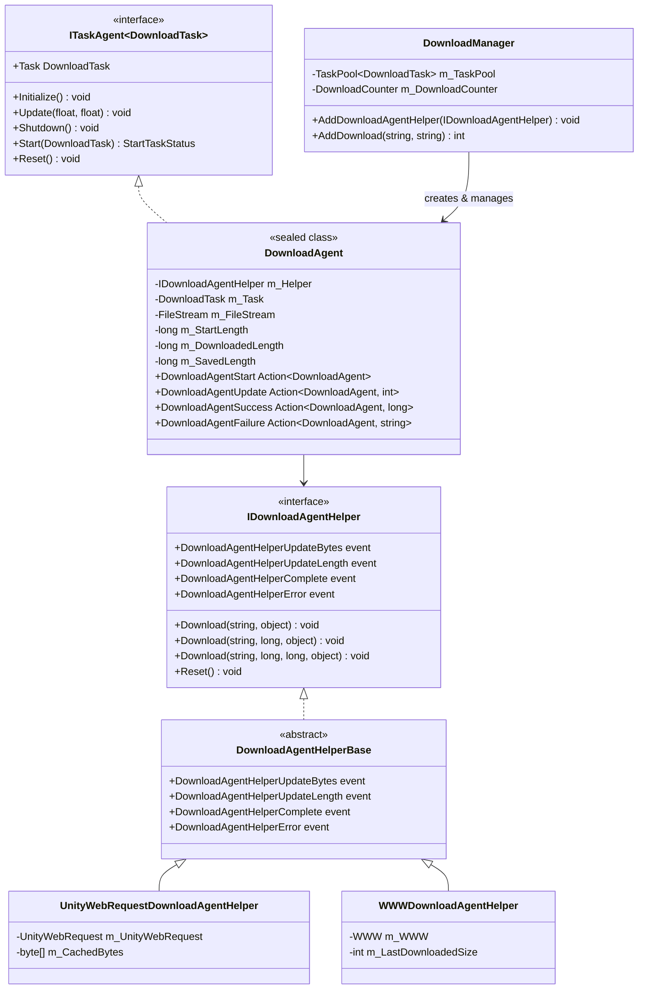

# ダウンロード代理

ダウンロード代理（Download Agent）是 GameFrameX ダウンロード系统的コア执行单元，负责实际执行ダウンロード任务。每个ダウンロード代理インスタンス对应一个具体的ダウンロード操作，を通じて与ダウンロード代理辅助器（Download Agent Helper）交互完成网络お願いします求和数据存储。

## 概要

ダウンロード代理是 `DownloadManager` 内部的任务执行器，実装了 `ITaskAgent<DownloadTask>` インターフェース。它管理单个ダウンロード任务的完整生命周期，包括：

- **任务启动**：初期化ファイル流、检查断点续传、启动ダウンロード
- **进度监控**：实时追踪ダウンロード进度、处理超时、计算ダウンロード速度
- **数据写入**：将ダウンロード的数据块写入临时ファイル（.download 后缀）
- **任务完成**：将临时ファイル重名前を付ける目标ファイル
- **错误处理**：处理网络错误、超时错误、IO 错误

ダウンロード代理采用策略模式设计，を通じて依赖注入不同的ダウンロード代理辅助器（`IDownloadAgentHelper`）来サポート不同的ダウンロード実装。フレームワーク提供します两个内置実装：
- `UnityWebRequestDownloadAgentHelper`：基づく Unity 的 `UnityWebRequest` API（推荐，兼容 Unity 2017.2+）
- `WWWDownloadAgentHelper`：基づく传统的 `WWW` クラス（仅サポート Unity 2018.3 以下版本）

## 架构

ダウンロード代理系统采用分层アーキテクチャ設計，コアコンポーネント包括：



**アーキテクチャ設計要点：**

1. **任务代理模式**：`DownloadAgent` 実装 `ITaskAgent<DownloadTask>` インターフェース，融入 `TaskPool` 任务池系统，実装任务的统一调度和管理。

2. **依赖注入**：`DownloadAgent` を通じて构造函数接收 `IDownloadAgentHelper` インスタンス，将底层ダウンロード実装抽象化，便于扩展和测试。

3. **イベント驱动**：`DownloadAgent` を通じて订阅 `IDownloadAgentHelper` 的イベント来感知ダウンロード进度和ステータス变化，保持与具体ダウンロード実装解耦。

4. **生命周期管理**：`DownloadAgent` 実装 `IDisposable` インターフェース，确保リソース（特别是ファイル流和网络お願いします求）正确释放。

## コアフロー

ダウンロード代理处理单个ダウンロード任务的完整フロー如下：


**关键设计决策：**

1. **临时ファイル机制**：ダウンロード数据先写入 `.download` 后缀的临时ファイル，完成后才重名前を付ける目标ファイル。这确保了：
   - ダウンロード中断时不会损坏原有的目标ファイル
   - サポート断点续传（を通じて检查临时ファイル大小）

2. **缓冲区写入**：`DownloadAgent` 维护一个内部缓冲区，达到 `FlushSize`（默认 1MB）时才执行物理写入，减少 IO 操作次数。

3. **超时检测**：每次收到数据或进度更新时重置等待タイマー，如果超过 `Timeout`（默认 30 秒）未收到任何数据，判定为超时错误。

## コアプロパティ

`DownloadAgent` 提供します以下公开プロパティ供外部查询：

| プロパティ | クラス型 | 説明 |
|------|------|------|
| `Task` | `DownloadTask` | 当前正在处理的ダウンロード任务 |
| `WaitTime` | `float` | 距离上次收到数据的时间（秒） |
| `StartLength` | `long` | 开始ダウンロード时ファイル已存在的大小（断点续传用） |
| `DownloadedLength` | `long` | 本次ダウンロード已取得的数据大小 |
| `CurrentLength` | `long` | 当前总大小（StartLength + DownloadedLength） |
| `SavedLength` | `long` | 已持久化到磁盘的数据大小 |

```csharp
// 使用示例：查询ダウンロード进度
DownloadAgent agent = /* 从イベント或池中取得 */;
long totalSize = agent.CurrentLength;
long downloaded = agent.DownloadedLength;
float progress = (float)downloaded / totalSize * 100f;
Debug.Log($"ダウンロード进度: {progress:F1}% ({downloaded}/{totalSize} bytes)");
```

## イベント系统

ダウンロード代理を通じて以下回调イベント与外部通信：

```csharp
// ダウンロード开始イベント
public Action<DownloadAgent> DownloadAgentStart;

// ダウンロード进度更新イベント（每次收到新数据块）
public Action<DownloadAgent, int> DownloadAgentUpdate;

// ダウンロード成功完成イベント
public Action<DownloadAgent, long> DownloadAgentSuccess;

// ダウンロード失败イベント
public Action<DownloadAgent, string> DownloadAgentFailure;
```

这些イベント在 `DownloadManager.AddDownloadAgentHelper()` 时被绑定到管理器的イベント系统，形成统一的イベント流。

## ダウンロード代理辅助器

### IDownloadAgentHelper インターフェース

`IDownloadAgentHelper` 定义了ダウンロード代理辅助器的コア契约：

> Source: [IDownloadAgentHelper.cs](https://github.com/GameFrameX/com.gameframex.unity.download/blob/main/Runtime/Download/Download/IDownloadAgentHelper.cs#L15-L65)

```csharp
public interface IDownloadAgentHelper
{
    // イベント：ダウンロード数据流更新
    event EventHandler<DownloadAgentHelperUpdateBytesEventArgs> DownloadAgentHelperUpdateBytes;
    
    // イベント：ダウンロード长度更新（增量）
    event EventHandler<DownloadAgentHelperUpdateLengthEventArgs> DownloadAgentHelperUpdateLength;
    
    // イベント：ダウンロード完成
    event EventHandler<DownloadAgentHelperCompleteEventArgs> DownloadAgentHelperComplete;
    
    // イベント：ダウンロード错误
    event EventHandler<DownloadAgentHelperErrorEventArgs> DownloadAgentHelperError;

    // メソッド：从头开始ダウンロード
    void Download(string downloadUri, object userData);
    
    // メソッド：从指定位置继续ダウンロード（断点续传）
    void Download(string downloadUri, long fromPosition, object userData);
    
    // メソッド：ダウンロード指定范围的数据
    void Download(string downloadUri, long fromPosition, long toPosition, object userData);
    
    // メソッド：重置辅助器ステータス
    void Reset();
}
```

### UnityWebRequestDownloadAgentHelper

基づく UnityWebRequest 的実装，サポート现代 Unity 版本（2017.2+）：

> Source: [UnityWebRequestDownloadAgentHelper.cs](https://github.com/GameFrameX/com.gameframex.unity.download/blob/main/Runtime/Download/UnityWebRequestDownloadAgentHelper.cs#L26-L229)

**特性：**
- 使用 `DownloadHandlerScript` サブクラス実装增量数据回调
- 内置 SSL 证书验证处理器（默认接受所有证书）
- サポート HTTP Range 头部実装断点续传
- 兼容 Unity 2017.2 至最新版本

**使用方法：**

```csharp
// 作成 UnityWebRequest 辅助器インスタンス
var helper = gameObject.AddComponent<UnityWebRequestDownloadAgentHelper>();

// 添加到ダウンロード管理器
var downloadManager = GameEntry.GetComponent<DownloadManager>();
downloadManager.AddDownloadAgentHelper(helper);
```

### WWWDownloadAgentHelper

基づく传统 WWW 的実装，仅适に使用 Unity 2018.3 以下版本（已标记为过时）：

> Source: [WWWDownloadAgentHelper.cs](https://github.com/GameFrameX/com.gameframex.unity.download/blob/main/Runtime/Download/WWWDownloadAgentHelper.cs#L21-L244)

**注意：** 此実装被 `#if !UNITY_2018_3_OR_NEWER` 条件编译保护，在 Unity 2018.3 及以上版本中不可用。

## 自定义ダウンロード代理辅助器

開発者可能を通じて继承 `DownloadAgentHelperBase` 来実装自定义ダウンロード逻辑：

```csharp
using UnityEngine;
using GameFrameX.Download.Runtime;

public class CustomDownloadAgentHelper : DownloadAgentHelperBase
{
    // 実装继承的イベント和抽象メソッド...
    
    public override void Download(string downloadUri, object userData)
    {
        // 実装自定义ダウンロード逻辑
        // 重要：在适当的时候触发イベント
    }
    
    public override void Reset()
    {
        // 清理リソース
    }
}
```

## イベント参数

### DownloadAgentHelperUpdateBytesEventArgs

ダウンロード数据流更新イベント参数：

> Source: [DownloadAgentHelperUpdateBytesEventArgs.cs](https://github.com/GameFrameX/com.gameframex.unity.download/blob/main/Runtime/EventArgs/DownloadAgentHelperUpdateBytesEventArgs.cs#L16-L62)

| プロパティ | クラス型 | 説明 |
|------|------|------|
| `Bytes` | `byte[]` | ダウンロード的数据块 |
| `Offset` | `int` | 数据起始偏移 |
| `Length` | `int` | 数据长度 |

### DownloadAgentHelperUpdateLengthEventArgs

ダウンロード增量大小イベント参数：

> Source: [DownloadAgentHelperUpdateLengthEventArgs.cs](https://github.com/GameFrameX/com.gameframex.unity.download/blob/main/Runtime/EventArgs/DownloadAgentHelperUpdateLengthEventArgs.cs#L16-L47)

| プロパティ | クラス型 | 説明 |
|------|------|------|
| `DeltaLength` | `int` | 本次新增的ダウンロード数据大小 |

### DownloadAgentHelperCompleteEventArgs

ダウンロード完成イベント参数：

> Source: [DownloadAgentHelperCompleteEventArgs.cs](https://github.com/GameFrameX/com.gameframex.unity.download/blob/main/Runtime/EventArgs/DownloadAgentHelperCompleteEventArgs.cs#L16-L62)

| プロパティ | クラス型 | 説明 |
|------|------|------|
| `Length` | `long` | ダウンロード的总数据大小 |

### DownloadAgentHelperErrorEventArgs

ダウンロード错误イベント参数：

> Source: [DownloadAgentHelperErrorEventArgs.cs](https://github.com/GameFrameX/com.gameframex.unity.download/blob/main/Runtime/EventArgs/DownloadAgentHelperErrorEventArgs.cs#L16-L66)

| プロパティ | クラス型 | 説明 |
|------|------|------|
| `DeleteDownloading` | `bool` | 是否必要删除正在ダウンロード的临时ファイル |
| `ErrorMessage` | `string` | 错误説明信息 |

## よくある質問

### 断点续传不工作

**症状**：重新启动ゲーム后，ダウンロード任务从头开始而非从上次中断处继续。

**可能原因**：
1. 服务器不サポート HTTP Range 头部
2. 临时ファイル（.download）被意外删除
3. ダウンロード路径不一致

**排查メソッド**：
```csharp
// 检查ダウンロード代理的 StartLength プロパティ
DownloadAgent agent = /* 取得代理 */;
Debug.Log($"StartLength: {agent.StartLength}");
// 如果为 0，説明未检测到断点
```

### ダウンロード超时

**症状**：ダウンロード长时间无响应，最终报错 "Timeout"。

**解決策**：
```csharp
// 调整ダウンロード超时設定
var downloadManager = GameEntry.GetComponent<DownloadManager>();
downloadManager.Timeout = 120f; // 调整为 120 秒
```

### 内存占用过高

**症状**：大ファイルダウンロード时内存使用量激增。

**原因分析**：
`UnityWebRequestDownloadAgentHelper` 使用 4KB 的固定缓冲区，如果ダウンロード速度极快且未及时处理，可能导致数据积压。

**优化建议**：
- 降低 `FlushSize` 以增加磁盘写入频率
- 监控 `WorkingAgentCount`，限制并发ダウンロード数量

## 関連リンク

- [ダウンロードコンポーネント](./4-core-concepts.download-component) - ダウンロードコンポーネント的使用
- [架构概述](./4-core-concepts.architecture) - 整体系统架构
- [ダウンロードイベント](./6-events.download-events) - ダウンロード関連イベント详解
- [代理イベント](./6-events.agent-events) - 代理関連イベント详解
- [API 参考](./5-api-reference.properties) - プロパティ和メソッド的完整定义
