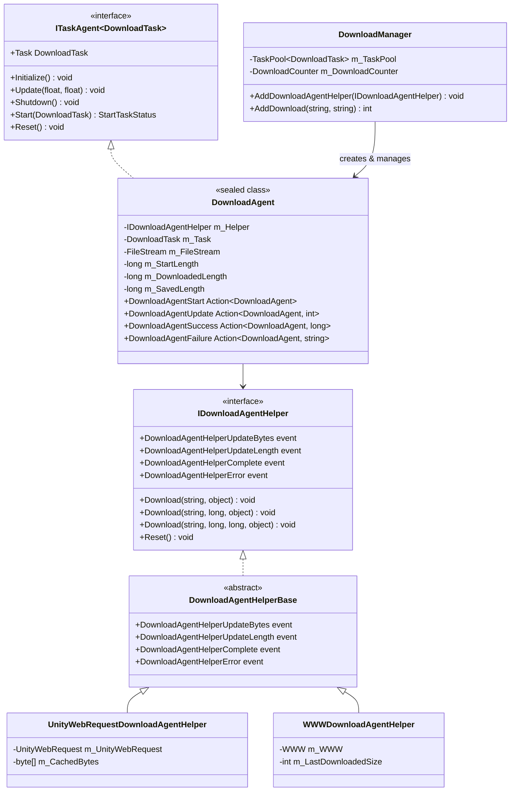
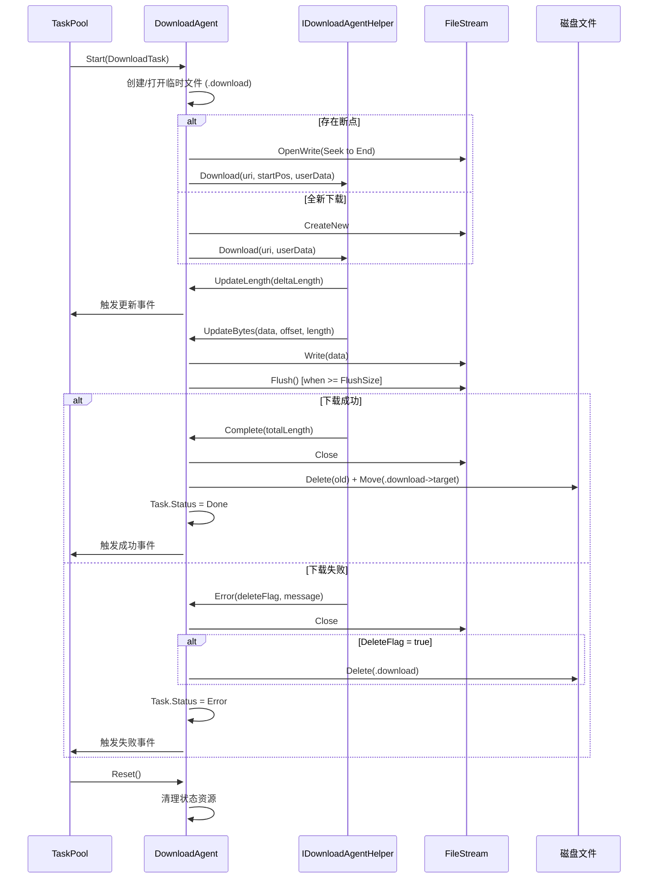

# 下载代理

下载代理（Download Agent）是 GameFrameX 下载系统的コア执行单元，负责实际执行下载任务。每个下载代理インスタンス对应一个具体的下载操作，通过与下载代理辅助器（Download Agent Helper）交互完成网络请求和数据存储。

## 概要

下载代理是 `DownloadManager` 内部的任务执行器，実装了 `ITaskAgent<DownloadTask>` インターフェース。它管理单个下载任务的完全なライフサイクル，含みます：

- **任务启动**：初期化ファイル流、確認断点续传、启动下载
- **進捗监控**：实时追踪下载進捗、処理超时、计算下载速度
- **数据写入**：将下载的数据块写入临时ファイル（.download 后缀）
- **任务完成**：将临时ファイル重命名为目标ファイル
- **エラー処理**：処理网络エラー、超时エラー、IO エラー

下载代理采用ストラテジーパターン設計，通过依存性注入不同的下载代理辅助器（`IDownloadAgentHelper`）来サポート不同的下载実装。フレームワーク提供します两个内置実装：
- `UnityWebRequestDownloadAgentHelper`：基于 Unity 的 `UnityWebRequest` API（推奨，兼容 Unity 2017.2+）
- `WWWDownloadAgentHelper`：基于传统的 `WWW` 类（仅サポート Unity 2018.3 以下バージョン）

## アーキテクチャ

下载代理系统采用分层アーキテクチャ設計，コアコンポーネント含みます：



**アーキテクチャ設計要点：**

1. **任务代理モード**：`DownloadAgent` 実装 `ITaskAgent<DownloadTask>` インターフェース，融入 `TaskPool` 任务池系统，実装任务的統一された调度和管理。

2. **依存性注入**：`DownloadAgent` 通过コンストラクタ受信 `IDownloadAgentHelper` インスタンス，将底层下载実装抽象化，便于拡張和テスト。

3. **イベント驱动**：`DownloadAgent` 通过購読 `IDownloadAgentHelper` 的イベント来感知下载進捗和ステータス变化，保持与具体下载実装解耦。

4. **ライフサイクル管理**：`DownloadAgent` 実装 `IDisposable` インターフェース，確認してくださいリソース（特别是ファイル流和网络请求）正确解放。

## コアフロー

下载代理処理单个下载任务的完全なフロー如下：



**关键設計决策：**

1. **临时ファイル机制**：下载数据先写入 `.download` 后缀的临时ファイル，完成后才重命名为目标ファイル。这確認してください了：
   - 下载中断时不会损坏原有的目标ファイル
   - サポート断点续传（通过確認临时ファイル大小）

2. **缓冲区写入**：`DownloadAgent` 维护一个内部缓冲区，达到 `FlushSize`（デフォルト 1MB）时才执行物理写入，减少 IO 操作次数。

3. **超时检测**：每次收到数据或進捗アップデート时重置等待计时器，もし超过 `Timeout`（デフォルト 30 秒）未收到任何数据，判定为超时エラー。

## コアプロパティ

`DownloadAgent` 提供します以下公开プロパティ供外部查询：

| プロパティ | タイプ | 説明 |
|------|------|------|
| `Task` | `DownloadTask` | 当前〜中処理的下载任务 |
| `WaitTime` | `float` | 距离上次收到数据的时间（秒） |
| `StartLength` | `long` | 开始下载时ファイル已存在的大小（断点续传用） |
| `DownloadedLength` | `long` | 本次下载已取得的数据大小 |
| `CurrentLength` | `long` | 当前总大小（StartLength + DownloadedLength） |
| `SavedLength` | `long` | 已持久化到磁盘的数据大小 |

```csharp
// 使用示例：查询下载进度
DownloadAgent agent = /* 从事件或池中获取 */;
long totalSize = agent.CurrentLength;
long downloaded = agent.DownloadedLength;
float progress = (float)downloaded / totalSize * 100f;
Debug.Log($"下载进度: {progress:F1}% ({downloaded}/{totalSize} bytes)");
```

## イベント系统

下载代理通过以下コールバックイベント与外部通信：

```csharp
// 下载开始事件
public Action<DownloadAgent> DownloadAgentStart;

// 下载进度更新事件（每次收到新数据块）
public Action<DownloadAgent, int> DownloadAgentUpdate;

// 下载成功完成事件
public Action<DownloadAgent, long> DownloadAgentSuccess;

// 下载失败事件
public Action<DownloadAgent, string> DownloadAgentFailure;
```

这些イベント在 `DownloadManager.AddDownloadAgentHelper()` 时被绑定到マネージャー的イベント系统，形成統一された的イベント流。

## 下载代理辅助器

### IDownloadAgentHelper インターフェース

`IDownloadAgentHelper` 定義了下载代理辅助器的コア契约：

> Source: [IDownloadAgentHelper.cs](https://github.com/GameFrameX/com.gameframex.unity.download/blob/main/Runtime/Download/Download/IDownloadAgentHelper.cs#L15-L65)

```csharp
public interface IDownloadAgentHelper
{
    // 事件：下载数据流更新
    event EventHandler<DownloadAgentHelperUpdateBytesEventArgs> DownloadAgentHelperUpdateBytes;
    
    // 事件：下载长度更新（增量）
    event EventHandler<DownloadAgentHelperUpdateLengthEventArgs> DownloadAgentHelperUpdateLength;
    
    // 事件：下载完成
    event EventHandler<DownloadAgentHelperCompleteEventArgs> DownloadAgentHelperComplete;
    
    // 事件：下载错误
    event EventHandler<DownloadAgentHelperErrorEventArgs> DownloadAgentHelperError;

    // 方法：从头开始下载
    void Download(string downloadUri, object userData);
    
    // 方法：从指定位置继续下载（断点续传）
    void Download(string downloadUri, long fromPosition, object userData);
    
    // 方法：下载指定范围的数据
    void Download(string downloadUri, long fromPosition, long toPosition, object userData);
    
    // 方法：重置辅助器状态
    void Reset();
}
```

### UnityWebRequestDownloadAgentHelper

基于 UnityWebRequest 的実装，サポート现代 Unity バージョン（2017.2+）：

> Source: [UnityWebRequestDownloadAgentHelper.cs](https://github.com/GameFrameX/com.gameframex.unity.download/blob/main/Runtime/Download/UnityWebRequestDownloadAgentHelper.cs#L26-L229)

**特性：**
- 使用 `DownloadHandlerScript` サブクラス実装增量数据コールバック
- 内置 SSL 证书検証処理器（デフォルト接受所有证书）
- サポート HTTP Range 头部実装断点续传
- 兼容 Unity 2017.2 至最新バージョン

**使用方法：**

```csharp
// 创建 UnityWebRequest 辅助器实例
var helper = gameObject.AddComponent<UnityWebRequestDownloadAgentHelper>();

// 添加到下载管理器
var downloadManager = GameEntry.GetComponent<DownloadManager>();
downloadManager.AddDownloadAgentHelper(helper);
```

### WWWDownloadAgentHelper

基于传统 WWW 的実装，仅適しています Unity 2018.3 以下バージョン（已标记为过时）：

> Source: [WWWDownloadAgentHelper.cs](https://github.com/GameFrameX/com.gameframex.unity.download/blob/main/Runtime/Download/WWWDownloadAgentHelper.cs#L21-L244)

**注意：** 此実装被 `#if !UNITY_2018_3_OR_NEWER` 条件コンパイル保护，在 Unity 2018.3 及以上バージョン中不可用。

## 自定義下载代理辅助器

開発者〜できます通过継承 `DownloadAgentHelperBase` 来実装自定義下载逻辑：

```csharp
using UnityEngine;
using GameFrameX.Download.Runtime;

public class CustomDownloadAgentHelper : DownloadAgentHelperBase
{
    // 实现继承的事件和抽象方法...
    
    public override void Download(string downloadUri, object userData)
    {
        // 实现自定义下载逻辑
        // 重要：在适当的时候触发事件
    }
    
    public override void Reset()
    {
        // 清理资源
    }
}
```

## イベントパラメータ

### DownloadAgentHelperUpdateBytesEventArgs

下载数据流アップデートイベントパラメータ：

> Source: [DownloadAgentHelperUpdateBytesEventArgs.cs](https://github.com/GameFrameX/com.gameframex.unity.download/blob/main/Runtime/EventArgs/DownloadAgentHelperUpdateBytesEventArgs.cs#L16-L62)

| プロパティ | タイプ | 説明 |
|------|------|------|
| `Bytes` | `byte[]` | 下载的数据块 |
| `Offset` | `int` | 数据起始偏移 |
| `Length` | `int` | 数据长度 |

### DownloadAgentHelperUpdateLengthEventArgs

下载增量大小イベントパラメータ：

> Source: [DownloadAgentHelperUpdateLengthEventArgs.cs](https://github.com/GameFrameX/com.gameframex.unity.download/blob/main/Runtime/EventArgs/DownloadAgentHelperUpdateLengthEventArgs.cs#L16-L47)

| プロパティ | タイプ | 説明 |
|------|------|------|
| `DeltaLength` | `int` | 本次新增的下载数据大小 |

### DownloadAgentHelperCompleteEventArgs

下载完成イベントパラメータ：

> Source: [DownloadAgentHelperCompleteEventArgs.cs](https://github.com/GameFrameX/com.gameframex.unity.download/blob/main/Runtime/EventArgs/DownloadAgentHelperCompleteEventArgs.cs#L16-L62)

| プロパティ | タイプ | 説明 |
|------|------|------|
| `Length` | `long` | 下载的总数据大小 |

### DownloadAgentHelperErrorEventArgs

下载エラーイベントパラメータ：

> Source: [DownloadAgentHelperErrorEventArgs.cs](https://github.com/GameFrameX/com.gameframex.unity.download/blob/main/Runtime/EventArgs/DownloadAgentHelperErrorEventArgs.cs#L16-L66)

| プロパティ | タイプ | 説明 |
|------|------|------|
| `DeleteDownloading` | `bool` | 是否〜する必要があります削除〜中下载的临时ファイル |
| `ErrorMessage` | `string` | エラー説明情報 |

## よくある問題

### 断点续传不工作

**症状**：重新启动游戏后，下载任务从头开始而非从上次中断处继续。

**考えられる原因**：
1. 服务器不サポート HTTP Range 头部
2. 临时ファイル（.download）被意外削除
3. 下载路径不一致

**排查メソッド**：
```csharp
// 检查下载代理的 StartLength 属性
DownloadAgent agent = /* 获取代理 */;
Debug.Log($"StartLength: {agent.StartLength}");
// 如果为 0，说明未检测到断点
```

### 下载超时

**症状**：下载长时间无响应，最终报错 "Timeout"。

**解決策**：
```csharp
// 调整下载超时设置
var downloadManager = GameEntry.GetComponent<DownloadManager>();
downloadManager.Timeout = 120f; // 调整为 120 秒
```

### 内存占用过高

**症状**：大ファイル下载时内存使用量激增。

**原因分析**：
`UnityWebRequestDownloadAgentHelper` 使用 4KB 的固定缓冲区，もし下载速度极快且未及时処理，〜の可能性があります导致数据积压。

**最適化お勧め**：
- 降低 `FlushSize` 以增加磁盘写入频率
- 监控 `WorkingAgentCount`，限制并发下载数量

## 関連リンク

- [下载コンポーネント](./4-core-concepts.download-component) - 下载コンポーネント的使用
- [アーキテクチャ概要](./4-core-concepts.architecture) - 整体系统アーキテクチャ
- [下载イベント](./6-events.download-events) - 下载相关イベント详解
- [代理イベント](./6-events.agent-events) - 代理相关イベント详解
- [API リファレンス](./5-api-reference.properties) - プロパティ和メソッド的完全な定義
