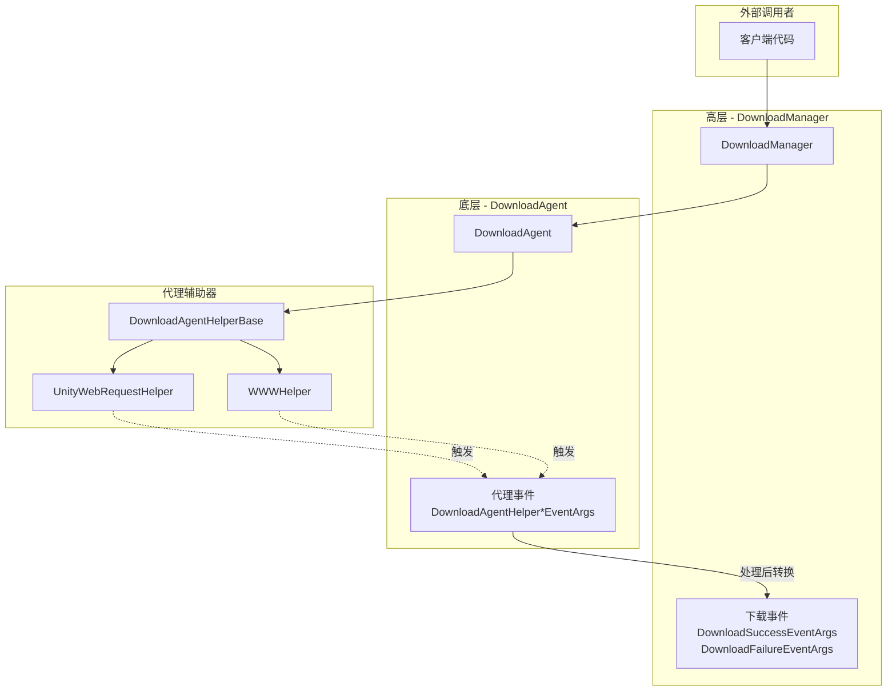
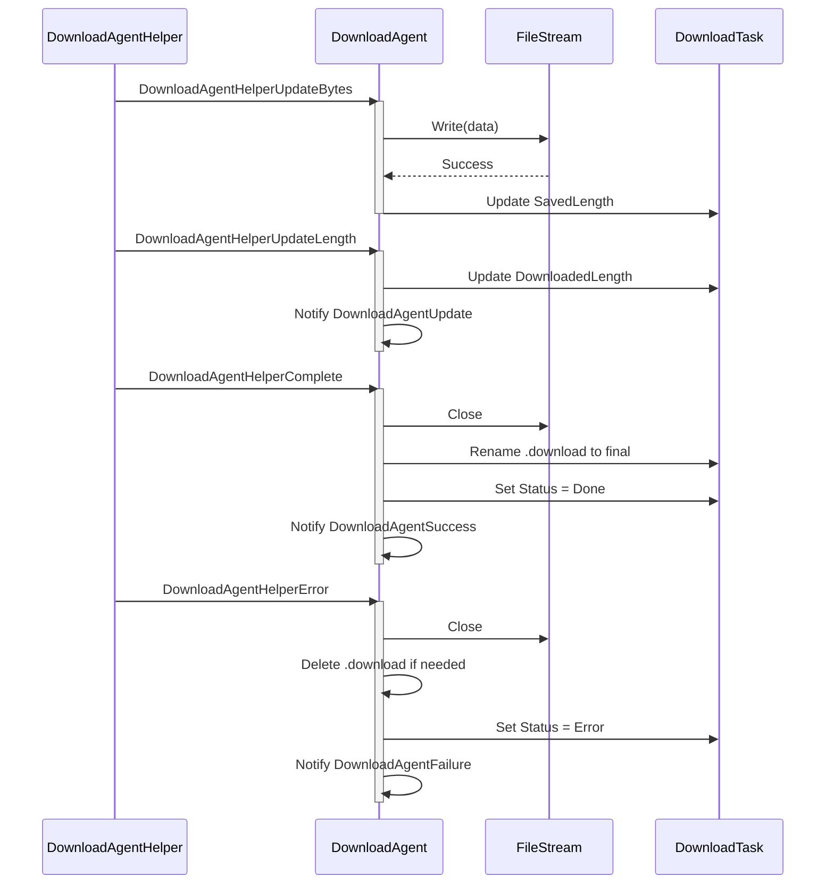
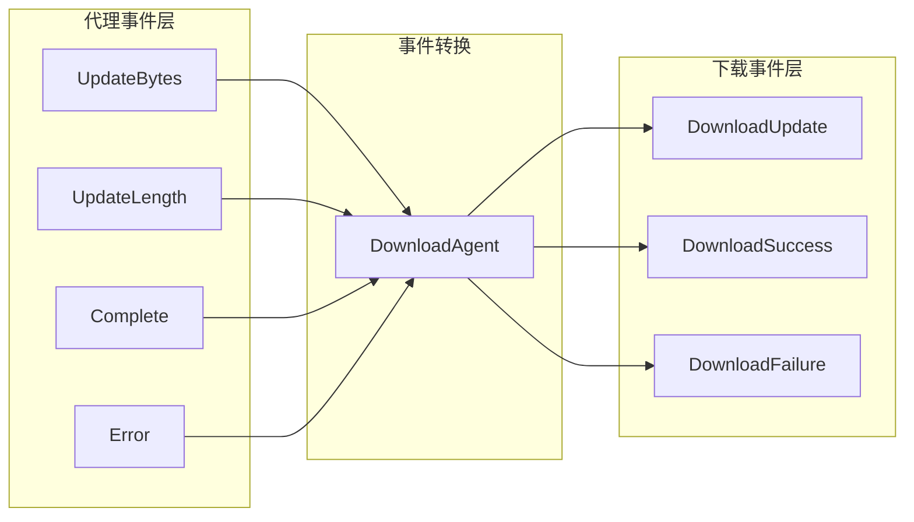

# 代理イベント

代理イベント是下载代理辅助器（Download Agent Helper）在执行下载操作时トリガー的底层イベント。这些イベント提供します对下载过程中各个フェーズ的细粒度控制，使開発者能够监控和処理下载数据的流动ステータス。

## 概要

代理イベント是下载系统中的**底层イベント**，与 DownloadManager 发出的高层下载イベント（下载成功、下载失敗等）不同。代理イベント直接在下载代理辅助器层面工作，提供します对下载数据流的精细控制能力。

**代理イベント与下载イベント的区别：**

| 特性 | 代理イベント | 下载イベント |
|------|----------|----------|
| トリガー层级 | 下载代理辅助器层（底层） | DownloadManager 层（高层） |
| イベント粒度 | 细粒度（字节流、アップデート進捗） | 粗粒度（任务完成/失敗） |
| 使用シーン | 〜する必要があります処理下载数据的シーン | 〜する必要があります感知任务整体ステータス的シーン |

**四种代理イベント：**
1. `DownloadAgentHelperUpdateBytesEventArgs` - 下载数据流アップデートイベント
2. `DownloadAgentHelperUpdateLengthEventArgs` - 下载数据大小アップデートイベント
3. `DownloadAgentHelperCompleteEventArgs` - 下载完成イベント
4. `DownloadAgentHelperErrorEventArgs` - 下载エラーイベント

## イベント体系アーキテクチャ



### イベント流説明

1. **客户端**通过 `DownloadManager` 追加下载任务
2. **DownloadManager** 将任务分配给 **DownloadAgent** 処理
3. **DownloadAgent** 呼び出し **DownloadAgentHelper** 执行实际下载
4. **DownloadAgentHelper**（如 UnityWebRequestHelper）在下载过程中トリガー **代理イベント**
5. **DownloadAgent** 受信并処理这些イベント，アップデート任务ステータス
6. 任务完成后，**DownloadManager** 发出高层 **下载イベント**

## コアイベント详解

### DownloadAgentHelperUpdateBytesEventArgs

下载数据流アップデートイベント，在下载过程中当有新的数据块到达时トリガー。

```csharp
// Source: Runtime/EventArgs/DownloadAgentHelperUpdateBytesEventArgs.cs#L16-L103
public sealed class DownloadAgentHelperUpdateBytesEventArgs : GameEventArgs
{
    public static readonly string EventId = typeof(DownloadAgentHelperUpdateBytesEventArgs).FullName;

    private byte[] m_Bytes;

    /// <summary>
    /// 获取数据流的偏移。
    /// </summary>
    public int Offset { get; private set; }

    /// <summary>
    /// 获取数据流的长度。
    /// </summary>
    public int Length { get; private set; }

    /// <summary>
    /// 获取下载的数据流。
    /// </summary>
    public byte[] GetBytes()
    {
        return m_Bytes;
    }
}
```

**使用シーン：**
- 实时処理下载的数据流
- 对下载数据进行加密/解密処理
- 边下载边写入存储

### DownloadAgentHelperUpdateLengthEventArgs

下载数据大小アップデートイベント，报告下载数据的增量变化。

```csharp
// Source: Runtime/EventArgs/DownloadAgentHelperUpdateLengthEventArgs.cs#L16-L63
public sealed class DownloadAgentHelperUpdateLengthEventArgs : GameEventArgs
{
    public static readonly string EventId = typeof(DownloadAgentHelperUpdateLengthEventArgs).FullName;

    /// <summary>
    /// 获取下载的增量数据大小。
    /// </summary>
    public int DeltaLength { get; private set; }
}
```

**使用シーン：**
- 实时アップデート下载進捗
- 计算下载速度
- 显示下载百分比

### DownloadAgentHelperCompleteEventArgs

下载完成イベント，当下载代理辅助器完成下载时トリガー。

```csharp
// Source: Runtime/EventArgs/DownloadAgentHelperCompleteEventArgs.cs#L16-L63
public sealed class DownloadAgentHelperCompleteEventArgs : GameEventArgs
{
    public static readonly string EventId = typeof(DownloadAgentHelperCompleteEventArgs).FullName;

    /// <summary>
    /// 获取下载的数据大小。
    /// </summary>
    public long Length { get; private set; }
}
```

**使用シーン：**
- 下载完成后的数据検証
- トリガー后续処理フロー

### DownloadAgentHelperErrorEventArgs

下载エラーイベント，当下载过程中发生エラー时トリガー。

```csharp
// Source: Runtime/EventArgs/DownloadAgentHelperErrorEventArgs.cs#L16-L67
public sealed class DownloadAgentHelperErrorEventArgs : GameEventArgs
{
    public static readonly string EventId = typeof(DownloadAgentHelperErrorEventArgs).FullName;

    /// <summary>
    /// 获取是否需要删除正在下载的文件。
    /// </summary>
    public bool DeleteDownloading { get; private set; }

    /// <summary>
    /// 获取错误信息。
    /// </summary>
    public string ErrorMessage { get; private set; }
}
```

**使用シーン：**
- エラーログ记录
- 重试机制トリガー
- 清理不完全な的下载ファイル

## イベント購読与処理

### 在 DownloadAgent 中処理代理イベント

```csharp
// Source: Runtime/Download/Download/DownloadManager.DownloadAgent.cs#L114-L120
/// <summary>
/// 初始化下载代理。
/// </summary>
public void Initialize()
{
    m_Helper.DownloadAgentHelperUpdateBytes += OnDownloadAgentHelperUpdateBytes;
    m_Helper.DownloadAgentHelperUpdateLength += OnDownloadAgentHelperUpdateLength;
    m_Helper.DownloadAgentHelperComplete += OnDownloadAgentHelperComplete;
    m_Helper.DownloadAgentHelperError += OnDownloadAgentHelperError;
}
```

### イベント処理フロー



## 代理イベント与下载イベント的关系



代理イベント经过 DownloadAgent 処理后会转换为高层下载イベント：

| 代理イベント | 转换結果 |
|----------|----------|
| UpdateBytes | 写入ファイル，アップデート SavedLength |
| UpdateLength | トリガー DownloadAgentUpdate コールバック |
| Complete | トリガー DownloadAgentSuccess → DownloadSuccessEventArgs |
| Error | トリガー DownloadAgentFailure → DownloadFailureEventArgs |

## イベントパラメータリファレンス

### DownloadAgentHelperUpdateBytesEventArgs

| プロパティ | タイプ | 説明 |
|------|------|------|
| Offset | int | 数据流的偏移量 |
| Length | int | 数据流的长度 |
| GetBytes() | byte[] | 取得完全な的字节数组 |

### DownloadAgentHelperUpdateLengthEventArgs

| プロパティ | タイプ | 説明 |
|------|------|------|
| DeltaLength | int | 本次下载的增量数据大小 |

### DownloadAgentHelperCompleteEventArgs

| プロパティ | タイプ | 説明 |
|------|------|------|
| Length | long | 下载的总数据大小 |

### DownloadAgentHelperErrorEventArgs

| プロパティ | タイプ | 説明 |
|------|------|------|
| DeleteDownloading | bool | 是否〜する必要があります削除〜中下载的ファイル |
| ErrorMessage | string | エラー情報 |

## 何时使用代理イベント

代理イベント適しています以下シーン：

1. **〜する必要があります処理下载数据流**：如实时解密、边下载边処理
2. **〜する必要があります精细進捗控制**：取得每个数据块的アップデート
3. **自定義存储策略**：完全控制ファイル的写入方法
4. **実装断点续传**：监听数据大小变化

对于大多数シーン，お勧め使用高层**下载イベント**，因为它们提供します更シンプル的 API 和完全な的任务情報。只有在〜する必要があります上述特殊機能时才〜する必要があります使用代理イベント。

## 関連リンク

- [下载イベント](./6-events.download-events) - 高层下载イベント
- [下载代理](./4-core-concepts.download-agent) - 下载代理コンセプト
- [DownloadAgentHelper](./4-core-concepts.download-agent) - 代理辅助器
- [IDownloadAgentHelper](./5-api-reference.methods) - 代理辅助器インターフェース
- [DownloadComponent](./7-configuration.download-component) - 下载コンポーネント設定
