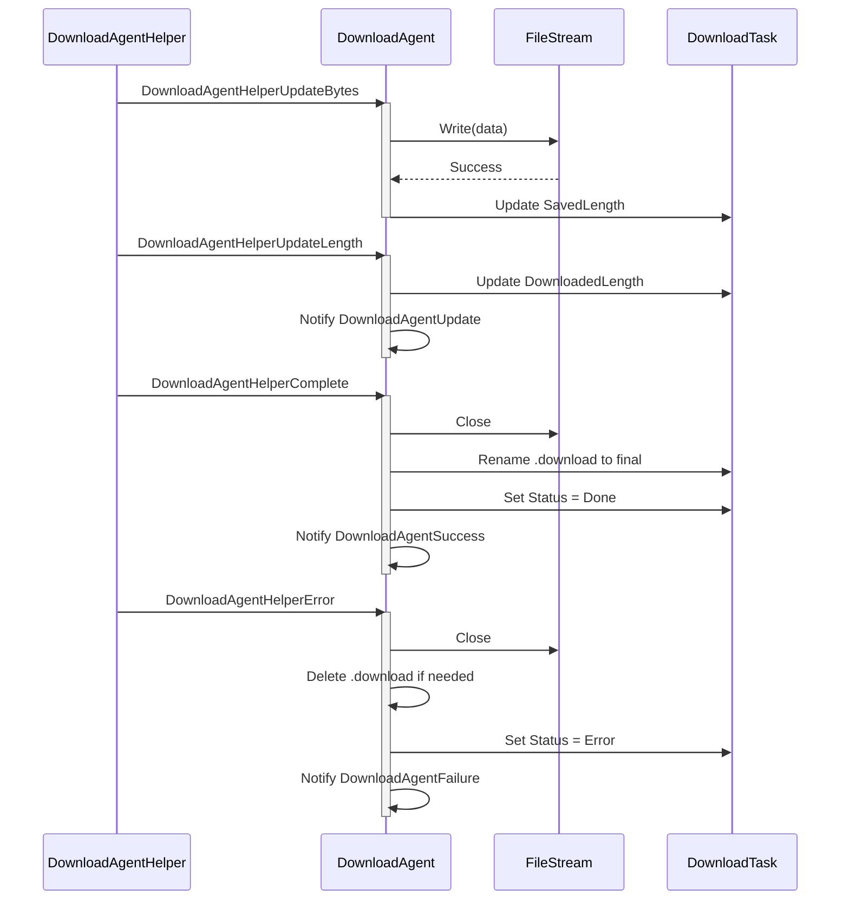
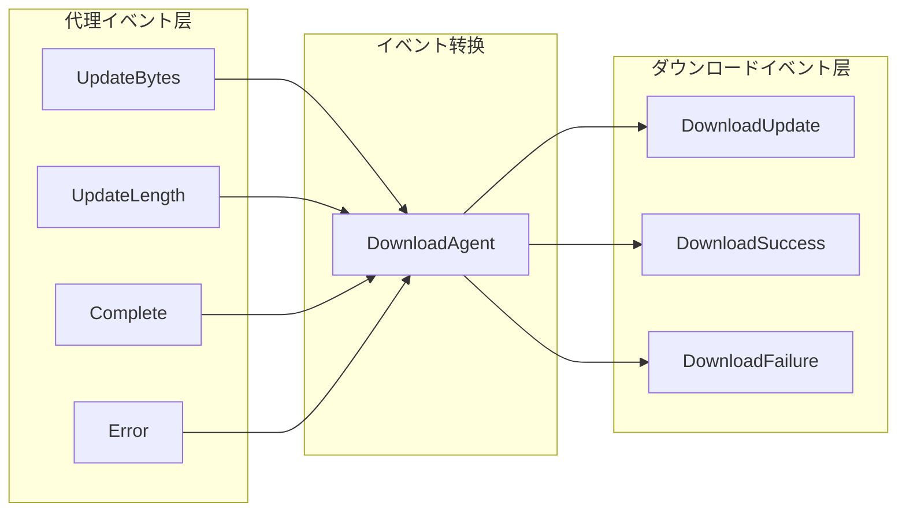

# 代理イベント

代理イベント是ダウンロード代理辅助器（Download Agent Helper）在执行ダウンロード操作时触发的底层イベント。这些イベント提供します对ダウンロード过程中各个阶段的细粒度控制，使開発者能够监控和处理ダウンロード数据的流动ステータス。

## 概要

代理イベント是ダウンロード系统中的**底层イベント**，与 DownloadManager 发出的高层ダウンロードイベント（ダウンロード成功、ダウンロード失败等）不同。代理イベント直接在ダウンロード代理辅助器层面工作，提供します对ダウンロード数据流的精细控制能力。

**代理イベント与ダウンロードイベント的区别：**

| 特性 | 代理イベント | ダウンロードイベント |
|------|----------|----------|
| 触发层级 | ダウンロード代理辅助器层（底层） | DownloadManager 层（高层） |
| イベント粒度 | 细粒度（字节流、更新进度） | 粗粒度（任务完成/失败） |
| 使用シーン | 必要处理ダウンロード数据的シーン | 必要感知任务整体ステータス的シーン |

**四种代理イベント：**
1. `DownloadAgentHelperUpdateBytesEventArgs` - ダウンロード数据流更新イベント
2. `DownloadAgentHelperUpdateLengthEventArgs` - ダウンロード数据大小更新イベント
3. `DownloadAgentHelperCompleteEventArgs` - ダウンロード完成イベント
4. `DownloadAgentHelperErrorEventArgs` - ダウンロード错误イベント

## イベント体系架构


### イベント流説明

1. **客户端**を通じて `DownloadManager` 添加ダウンロード任务
2. **DownloadManager** 将任务分配给 **DownloadAgent** 处理
3. **DownloadAgent** 呼び出し **DownloadAgentHelper** 执行实际ダウンロード
4. **DownloadAgentHelper**（如 UnityWebRequestHelper）在ダウンロード过程中触发 **代理イベント**
5. **DownloadAgent** 接收并处理这些イベント，更新任务ステータス
6. 任务完成后，**DownloadManager** 发出高层 **ダウンロードイベント**

## コアイベント详解

### DownloadAgentHelperUpdateBytesEventArgs

ダウンロード数据流更新イベント，在ダウンロード过程中当有新的数据块到达时触发。

```csharp
// Source: Runtime/EventArgs/DownloadAgentHelperUpdateBytesEventArgs.cs#L16-L103
public sealed class DownloadAgentHelperUpdateBytesEventArgs : GameEventArgs
{
    public static readonly string EventId = typeof(DownloadAgentHelperUpdateBytesEventArgs).FullName;

    private byte[] m_Bytes;

    /// <summary>
    /// 取得数据流的偏移。
    /// </summary>
    public int Offset { get; private set; }

    /// <summary>
    /// 取得数据流的长度。
    /// </summary>
    public int Length { get; private set; }

    /// <summary>
    /// 取得ダウンロード的数据流。
    /// </summary>
    public byte[] GetBytes()
    {
        return m_Bytes;
    }
}
```

**使用シーン：**
- 实时处理ダウンロード的数据流
- 对ダウンロード数据进行加密/解密处理
- 边ダウンロード边写入存储

### DownloadAgentHelperUpdateLengthEventArgs

ダウンロード数据大小更新イベント，报告ダウンロード数据的增量变化。

```csharp
// Source: Runtime/EventArgs/DownloadAgentHelperUpdateLengthEventArgs.cs#L16-L63
public sealed class DownloadAgentHelperUpdateLengthEventArgs : GameEventArgs
{
    public static readonly string EventId = typeof(DownloadAgentHelperUpdateLengthEventArgs).FullName;

    /// <summary>
    /// 取得ダウンロード的增量数据大小。
    /// </summary>
    public int DeltaLength { get; private set; }
}
```

**使用シーン：**
- 实时更新ダウンロード进度
- 计算ダウンロード速度
- 显示ダウンロード百分比

### DownloadAgentHelperCompleteEventArgs

ダウンロード完成イベント，当ダウンロード代理辅助器完成ダウンロード时触发。

```csharp
// Source: Runtime/EventArgs/DownloadAgentHelperCompleteEventArgs.cs#L16-L63
public sealed class DownloadAgentHelperCompleteEventArgs : GameEventArgs
{
    public static readonly string EventId = typeof(DownloadAgentHelperCompleteEventArgs).FullName;

    /// <summary>
    /// 取得ダウンロード的数据大小。
    /// </summary>
    public long Length { get; private set; }
}
```

**使用シーン：**
- ダウンロード完成后的数据验证
- 触发后续处理フロー

### DownloadAgentHelperErrorEventArgs

ダウンロード错误イベント，当ダウンロード过程中发生错误时触发。

```csharp
// Source: Runtime/EventArgs/DownloadAgentHelperErrorEventArgs.cs#L16-L67
public sealed class DownloadAgentHelperErrorEventArgs : GameEventArgs
{
    public static readonly string EventId = typeof(DownloadAgentHelperErrorEventArgs).FullName;

    /// <summary>
    /// 取得是否必要删除正在ダウンロード的ファイル。
    /// </summary>
    public bool DeleteDownloading { get; private set; }

    /// <summary>
    /// 取得错误信息。
    /// </summary>
    public string ErrorMessage { get; private set; }
}
```

**使用シーン：**
- 错误日志记录
- 重试机制触发
- 清理不完整的ダウンロードファイル

## イベント订阅与处理

### 在 DownloadAgent 中处理代理イベント

```csharp
// Source: Runtime/Download/Download/DownloadManager.DownloadAgent.cs#L114-L120
/// <summary>
/// 初期化ダウンロード代理。
/// </summary>
public void Initialize()
{
    m_Helper.DownloadAgentHelperUpdateBytes += OnDownloadAgentHelperUpdateBytes;
    m_Helper.DownloadAgentHelperUpdateLength += OnDownloadAgentHelperUpdateLength;
    m_Helper.DownloadAgentHelperComplete += OnDownloadAgentHelperComplete;
    m_Helper.DownloadAgentHelperError += OnDownloadAgentHelperError;
}
```

### イベント处理フロー



## 代理イベント与ダウンロードイベント的关系



代理イベント经过 DownloadAgent 处理后会转换为高层ダウンロードイベント：

| 代理イベント | 转换结果 |
|----------|----------|
| UpdateBytes | 写入ファイル，更新 SavedLength |
| UpdateLength | 触发 DownloadAgentUpdate 回调 |
| Complete | 触发 DownloadAgentSuccess → DownloadSuccessEventArgs |
| Error | 触发 DownloadAgentFailure → DownloadFailureEventArgs |

## イベント参数参考

### DownloadAgentHelperUpdateBytesEventArgs

| プロパティ | クラス型 | 説明 |
|------|------|------|
| Offset | int | 数据流的偏移量 |
| Length | int | 数据流的长度 |
| GetBytes() | byte[] | 取得完整的字节数组 |

### DownloadAgentHelperUpdateLengthEventArgs

| プロパティ | クラス型 | 説明 |
|------|------|------|
| DeltaLength | int | 本次ダウンロード的增量数据大小 |

### DownloadAgentHelperCompleteEventArgs

| プロパティ | クラス型 | 説明 |
|------|------|------|
| Length | long | ダウンロード的总数据大小 |

### DownloadAgentHelperErrorEventArgs

| プロパティ | クラス型 | 説明 |
|------|------|------|
| DeleteDownloading | bool | 是否必要删除正在ダウンロード的ファイル |
| ErrorMessage | string | 错误信息 |

## 何时使用代理イベント

代理イベント适に使用以下シーン：

1. **必要处理ダウンロード数据流**：如实时解密、边ダウンロード边处理
2. **必要精细进度控制**：取得每个数据块的更新
3. **自定义存储策略**：完全控制ファイル的写入方法
4. **実装断点续传**：监听数据大小变化

对于大多数シーン，建议使用高层**ダウンロードイベント**，因为它们提供します更简洁的 API 和完整的任务信息。只有在必要上述特殊機能时才必要使用代理イベント。

## 関連リンク

- [ダウンロードイベント](./6-events.download-events) - 高层ダウンロードイベント
- [ダウンロード代理](./4-core-concepts.download-agent) - ダウンロード代理概念
- [DownloadAgentHelper](./4-core-concepts.download-agent) - 代理辅助器
- [IDownloadAgentHelper](./5-api-reference.methods) - 代理辅助器インターフェース
- [DownloadComponent](./7-configuration.download-component) - ダウンロードコンポーネント配置
