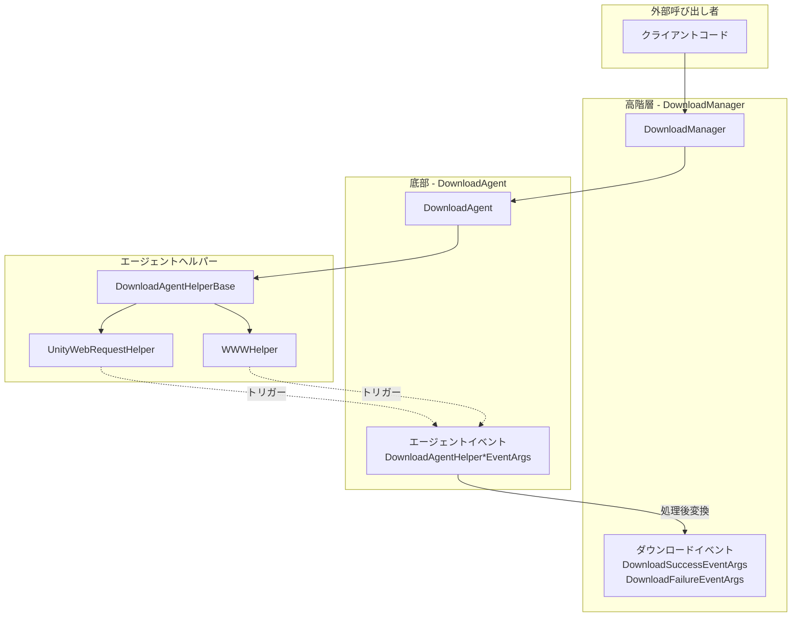
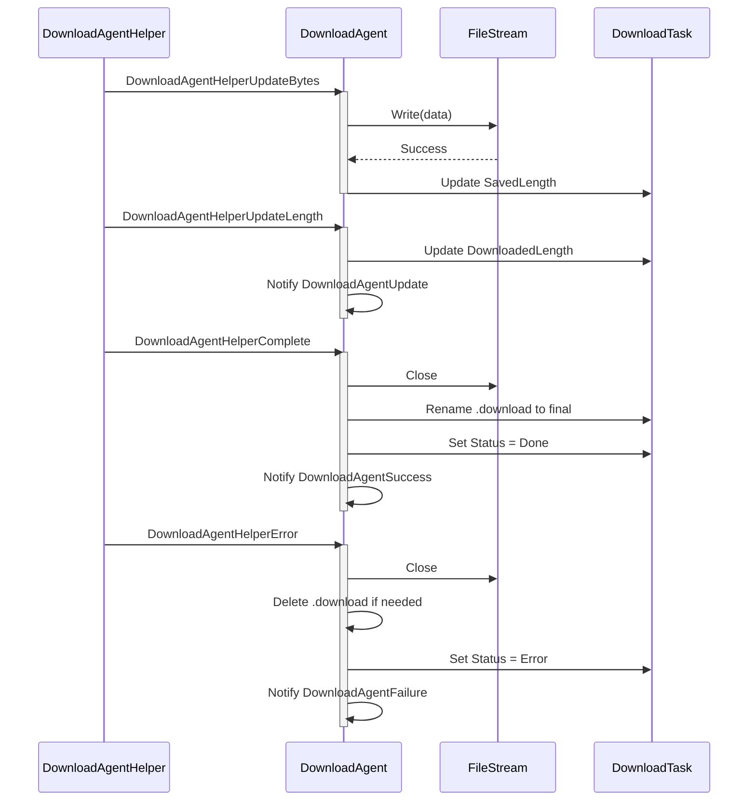
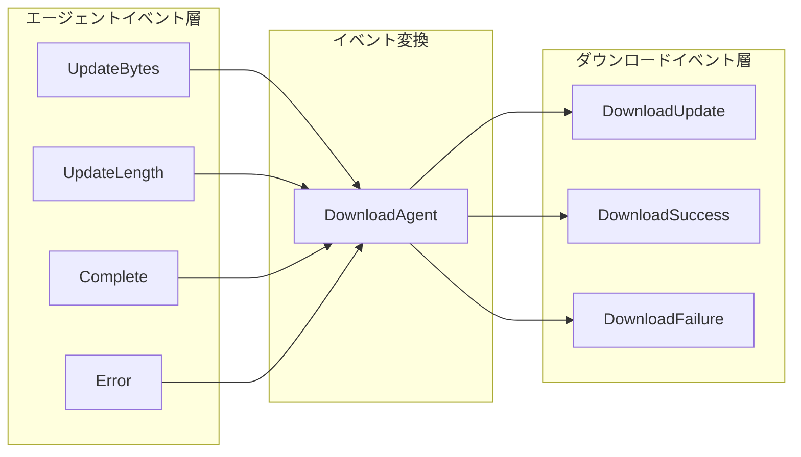

# エージェントイベント

エージェントイベントとは、ダウンロードエージェントヘルパー（Download Agent Helper）がダウンロード操作を実行中にトリガーされる底部イベントです。これらのイベントにより、ダウンロード過程の各段階に対する細粒度の制御が可能となり、開発者はダウンロードデータのフロー状態を監視・処理できます。

## 概要

エージェントイベントとは、ダウンロードシステムにおける**底部イベント**であり、DownloadManagerが発生する高階層ダウンロードイベント（ダウンロード成功、ダウンロード失敗など）とは異なります。エージェントイベント直接在ダウンロードエージェントヘルパーレベルで動作し、ダウンロードデータフローに対する精细な制御能力を提供します。

**エージェントイベントとダウンロードイベントの区别：**

| 特性 | エージェントイベント | ダウンロードイベント |
|------|----------|----------|
| トリガー階層 | ダウンロードエージェントヘルパー層（底部） | DownloadManager層（高階層） |
| イベント粒度 | 細粒度（バイトストリーム、進捗更新） | 粗粒度（タスク完了/失敗） |
| 使用シーン | ダウンロードデータを処理する必要があるシーン | タスク全体の状態を感知する必要があるシーン |

**4つのエージェントイベント：**
1. `DownloadAgentHelperUpdateBytesEventArgs` - ダウンロードデータストリーム更新イベント
2. `DownloadAgentHelperUpdateLengthEventArgs` - ダウンロードデータサイズ更新イベント
3. `DownloadAgentHelperCompleteEventArgs` - ダウンロード完了イベント
4. `DownloadAgentHelperErrorEventArgs` - ダウンロードエラーイベント

## イベント体系アーキテクチャ



### イベントフロー説明

1. **クライアント**が`DownloadManager`を通じてダウンロードタスクを追加
2. **DownloadManager**がタスクを**DownloadAgent**に割り当てて処理
3. **DownloadAgent**が**DownloadAgentHelper**を呼び出して実際のダウンロードを実行
4. **DownloadAgentHelper**（UnityWebRequestHelperなど）がダウンロード過程で**エージェントイベント**をトリガー
5. **DownloadAgent**がこれらのイベントを受け取り処理して、タスク状態を更新
6. タスク完了後、**DownloadManager**が高階層**ダウンロードイベント**を発生

## コアイベント詳細

### DownloadAgentHelperUpdateBytesEventArgs

ダウンロードデータストリーム更新イベント。ダウンロード過程で新しいデータブロックが到着した時にトリガーされます。

```csharp
// 出典: Runtime/EventArgs/DownloadAgentHelperUpdateBytesEventArgs.cs#L16-L103
public sealed class DownloadAgentHelperUpdateBytesEventArgs : GameEventArgs
{
    public static readonly string EventId = typeof(DownloadAgentHelperUpdateBytesEventArgs).FullName;

    private byte[] m_Bytes;

    /// <summary>
    /// バイトストリームのオフセットを取得します。
    /// </summary>
    public int Offset { get; private set; }

    /// <summary>
    /// バイトストリームの長さを取得します。
    /// </summary>
    public int Length { get; private set; }

    /// <summary>
    /// ダウンロードしたバイトストリームを取得します。
    /// </summary>
    public byte[] GetBytes()
    {
        return m_Bytes;
    }
}
```

**使用シーン：**
- ダウンロードデータストリームのリアルタイム処理
- ダウンロードデータの暗号化/復号化処理
- ダウンロードしながらストレージに書き込み

### DownloadAgentHelperUpdateLengthEventArgs

ダウンロードデータサイズ更新イベント。ダウンロードデータの增量変化を報告します。

```csharp
// 出典: Runtime/EventArgs/DownloadAgentHelperUpdateLengthEventArgs.cs#L16-L63
public sealed class DownloadAgentHelperUpdateLengthEventArgs : GameEventArgs
{
    public static readonly string EventId = typeof(DownloadAgentHelperUpdateLengthEventArgs).FullName;

    /// <summary>
    /// ダウンロードの増分データサイズを取得します。
    /// </summary>
    public int DeltaLength { get; private set; }
}
```

**使用シーン：**
- ダウンロード進捗のリアルタイム更新
- ダウンロード速度の計算
- ダウンロードパーセンテージの表示

### DownloadAgentHelperCompleteEventArgs

ダウンロード完了イベント。ダウンロードエージェントヘルパーがダウンロードを完了した時にトリガーされます。

```csharp
// 出典: Runtime/EventArgs/DownloadAgentHelperCompleteEventArgs.cs#L16-L63
public sealed class DownloadAgentHelperCompleteEventArgs : GameEventArgs
{
    public static readonly string EventId = typeof(DownloadAgentHelperCompleteEventArgs).FullName;

    /// <summary>
    /// ダウンロードしたデータサイズを取得します。
    /// </summary>
    public long Length { get; private set; }
}
```

**使用シーン：**
- ダウンロード完了後のデータ検証
- フォローアップ処理フローのトリガー

### DownloadAgentHelperErrorEventArgs

ダウンロードエラーイベント。ダウンロード過程でエラーが発生した時にトリガーされます。

```csharp
// 出典: Runtime/EventArgs/DownloadAgentHelperErrorEventArgs.cs#L16-L67
public sealed class DownloadAgentHelperErrorEventArgs : GameEventArgs
{
    public static readonly string EventId = typeof(DownloadAgentHelperErrorEventArgs).FullName;

    /// <summary>
    /// ダウンロード中のファイルを削除する必要があるかどうかを取得します。
    /// </summary>
    public bool DeleteDownloading { get; private set; }

    /// <summary>
    /// エラーメッセージを取得します。
    /// </summary>
    public string ErrorMessage { get; private set; }
}
```

**使用シーン：**
- エラーログ記録
- 再試行メカニズムのトリガー
- 不完全なダウンロードファイルのクリーンアップ

## イベントの購読と処理

### DownloadAgentでのエージェントイベントの処理

```csharp
// 出典: Runtime/Download/Download/DownloadManager.DownloadAgent.cs#L114-L120
/// <summary>
/// ダウンロードエージェントを初期化します。
/// </summary>
public void Initialize()
{
    m_Helper.DownloadAgentHelperUpdateBytes += OnDownloadAgentHelperUpdateBytes;
    m_Helper.DownloadAgentHelperUpdateLength += OnDownloadAgentHelperUpdateLength;
    m_Helper.DownloadAgentHelperComplete += OnDownloadAgentHelperComplete;
    m_Helper.DownloadAgentHelperError += OnDownloadAgentHelperError;
}
```

### イベント処理フロー



## エージェントイベントとダウンロードイベントの関係



エージェントイベントがDownloadAgentで処理された後、高階層ダウンロードイベントに変換されます：

| エージェントイベント | 変換結果 |
|----------|----------|
| UpdateBytes | ファイルを書き込み、SavedLengthを更新 |
| UpdateLength | DownloadAgentUpdateコールバックをトリガー |
| Complete | DownloadAgentSuccess → DownloadSuccessEventArgsをトリガー |
| Error | DownloadAgentFailure → DownloadFailureEventArgsをトリガー |

## イベントパラメータリファレンス

### DownloadAgentHelperUpdateBytesEventArgs

| プロパティ | 型 | 説明 |
|------|------|------|
| Offset | int | バイトストリームのオフセット量 |
| Length | int | バイトストリームの長さ |
| GetBytes() | byte[] | 完全なバイト配列を取得 |

### DownloadAgentHelperUpdateLengthEventArgs

| プロパティ | 型 | 説明 |
|------|------|------|
| DeltaLength | int | 今回のダウンロード增量データサイズ |

### DownloadAgentHelperCompleteEventArgs

| プロパティ | 型 | 説明 |
|------|------|------|
| Length | long | ダウンロードした総データサイズ |

### DownloadAgentHelperErrorEventArgs

| プロパティ | 型 | 説明 |
|------|------|------|
| DeleteDownloading | bool | ダウンロード中ファイルを削除する必要があるかどうか |
| ErrorMessage | string | エラーメッセージ |

## エージェントイベントを使用するタイミング

エージェントイベントは以下のシーンに適しています：

1. **ダウンロードデータストリームを処理する必要がある**：リアルタイム復号化、ダウンロードしながら処理など
2. **精细な進捗制御が必要**：各データブロックの更新を取得
3. **カスタム保存策略が必要**：ファイルの書き込み方法を完全に制御
4. **レジュームを実装**：データサイズの変化を監視

ほとんどのシーンでは、高階層**ダウンロードイベント**の使用を推奨します。これにより、より简洁なAPIと完全なタスク情報が提供されます。前述の特殊な機能が必要な場合にのみエージェントイベントを使用する必要があります。

## 関連リンク

- [ダウンロードイベント](./6-events.download-events) - 高階層ダウンロードイベント
- [ダウンロードエージェント](./4-core-concepts.download-agent) - ダウンロードエージェント概念
- [DownloadAgentHelper](./4-core-concepts.download-agent) - エージェントヘルパー
- [IDownloadAgentHelper](./5-api-reference.methods) - エージェントヘルパーインターフェース
- [DownloadComponent](./7-configuration.download-component) - ダウンロードコンポーネント設定