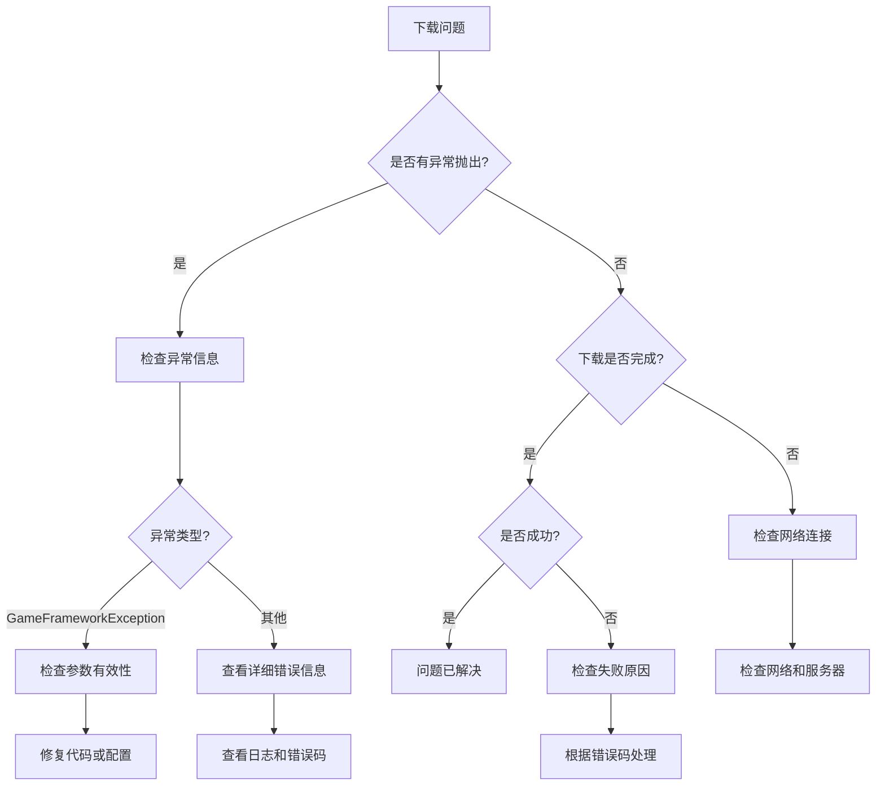

# よくある問題

このドキュメント收集了使用 GameFrameX Download 下载コンポーネント过程中〜の可能性があります遇到的常见問題及其解決策。

## 概要

Download コンポーネント是 GameFrameX フレームワーク中负责処理下载任务的コアコンポーネント。在实际使用过程中，〜の可能性があります因为設定不当、依赖缺失或网络環境等因素遇到各种問題。このドキュメント旨在帮助開発者快速定位和解决这些問題。

## 初期化問題

### 問題：游戏启动时ヒント "Download manager is invalid"

**エラー情報：**
```
Log.Fatal("Download manager is invalid.");
```

**原因分析：**
DownloadComponent 依赖 IDownloadManager モジュール，但该モジュール未能正确登録到 GameFramework 系统中。

**解決策：**
1. 確認してください DownloadManager モジュール已正确登録。確認是否在启动时呼び出し了相关的モジュール登録コード。
2. 確認 GameFrameworkEntry 能够正确解析 IDownloadManager インターフェース。

---

### 問題：游戏启动时ヒント "Event component is invalid"

**エラー情報：**
```
Log.Fatal("Event component is invalid.");
```

**原因分析：**
DownloadComponent 依赖 EventComponent 进行イベント分发，但 EventComponent 未正确初期化。

**解決策：**
1. 確認してくださいシーン中存在 EventComponent。
2. EventComponent 〜しなければなりません在 DownloadComponent 之前初期化。
3. 有关 EventComponent 的詳細情報，请参照 [Event コンポーネントドキュメント](https://github.com/GameFrameX/com.gameframex.unity.event)。

---

### 問題：ヒント "Can not create download agent helper"

**エラー情報：**
```
Log.Error("Can not create download agent helper.");
```

**原因分析：**
无法根据設定的タイプ名称作成下载代理辅助器インスタンス。

**解決策：**
1. 確認 DownloadComponent 的 `DownloadAgentHelperTypeName` フィールド設定是否正确。
2. デフォルト值应为 `UnityGameFramework.Runtime.UnityWebRequestDownloadAgentHelper`。
3. もし使用自定義下载代理辅助器，確認してくださいタイプ名称与アセンブリ中的完全限定名一致。

---

## API 使用問題

### 問題：呼び出し AddDownload 时抛出例外 "Download path is invalid"

**エラー情報：**
```
GameFrameworkException: Download path is invalid.
```

**原因分析：**
传递给 AddDownload メソッド的 downloadPath パラメータ为空或 null。

**解決策：**
確認してください downloadPath パラメータ有效：
```csharp
// 错误示例
int id = downloadComponent.AddDownload("", "http://example.com/file.zip");

// 正确示例
int id = downloadComponent.AddDownload(Application.persistentDataPath + "/file.zip", "http://example.com/file.zip");
```

> Source: [DownloadManager.cs](https://github.com/GameFrameX/com.gameframex.unity.download/blob/main/Runtime/Download/Download/DownloadManager.cs#L338-L341)

---

### 問題：呼び出し AddDownload 时抛出例外 "Download uri is invalid"

**エラー情報：**
```
GameFrameworkException: Download uri is invalid.
```

**原因分析：**
传递给 AddDownload メソッド的 downloadUri パラメータ为空或 null。

**解決策：**
確認してください downloadUri パラメータ有效：
```csharp
// 错误示例
int id = downloadComponent.AddDownload(Application.persistentDataPath + "/file.zip", "");

// 正确示例
int id = downloadComponent.AddDownload(Application.persistentDataPath + "/file.zip", "http://example.com/file.zip");
```

> Source: [DownloadManager.cs](https://github.com/GameFrameX/com.gameframex.unity.download/blob/main/Runtime/Download/Download/DownloadManager.cs#L343-L346)

---

### 問題：呼び出し AddDownload 时抛出例外 "You must add download agent first"

**エラー情報：**
```
GameFrameworkException: You must add download agent first.
```

**原因分析：**
在追加任何下载任务之前，〜しなければなりません先追加至少一个下载代理辅助器。

**解決策：**
1. DownloadComponent 会在 Start メソッド中自动作成指定数量的代理辅助器。
2. 確認してください DownloadComponent 已正确追加到シーン中。
3. 確認 `DownloadAgentHelperCount` プロパティ是否大于 0（デフォルト为 3）。

```csharp
// 在 DownloadComponent Inspector 中设置
[SerializeField] private int m_DownloadAgentHelperCount = 3;
```

> Source: [DownloadManager.cs](https://github.com/GameFrameX/com.gameframex.unity.download/blob/main/Runtime/Download/Download/DownloadManager.cs#L348-L351)

---

## 网络与下载問題

### 問題：下载失敗，ヒント "Timeout"

**エラー情報：**
```
Download failure, download serial id '0', download path '...', download uri '...', error message 'Timeout'.
```

**原因分析：**
下载请求在指定超时时间内未完成。デフォルト超时时间为 30 秒。

**解決策：**
1. 增加超时时间設定：
```csharp
// 设置超时时间为 120 秒
downloadComponent.Timeout = 120f;
```

2. 確認网络连接是否稳定。

3. 確認服务器响应时间是否正常，〜できます尝试使用浏览器或其他工具访问下载链接。

4. もし是大型ファイル下载，考虑调整超时时间或実装断点续传。

---

### 問題：下载时出现网络エラー

**エラー情報：**
```
error: "Network error"
```

**原因分析：**
UnityWebRequest 检测到网络层面的エラー，〜の可能性があります是以下原因：
- 网络连接中断
- DNS 解析失敗
- 无法建立连接

**解決策：**
1. 確認设备网络连接ステータス。
2. 確認下载 URL 是否可访问。
3. もし在移动设备上テスト，確認してください已追加网络权限（Android: INTERNET, ACCESS_NETWORK_STATE; iOS: NSAppTransportSecurity）。
4. 確認设备ログ取得更詳細的エラー情報。

---

### 問題：下载时出现 HTTP エラー

**エラー情報：**
```
error: "HTTP Error 404"
error: "HTTP Error 500"
```

**原因分析：**
服务器返す了エラーステータス码，常见ステータス码含みます：
- 404: ファイル不存在
- 500: 服务器内部エラー
- 502: 网关エラー
- 503: 服务不可用

**解決策：**
1. 確認下载链接是否正确。
2. 確認服务器端的ファイル是否存在。
3. もし是 API 请求，確認 API インターフェース是否正确。
4. 確認服务器ログ以取得更多エラー详情。

---

### 問題：断点续传不生效

**原因分析：**
断点续传機能依赖于服务器サポート HTTP Range 头。

**解決策：**
1. 確認服务器是否サポート断点续传（HTTP 206 ステータス码）。
2. 確認 FlushSize 設定，確認してくださいファイル写入逻辑正常：
```csharp
// 设置写入磁盘的临界大小（默认为 1MB）
downloadComponent.FlushSize = 1024 * 1024;
```

3. 確認してください下载ディレクトリ有足够的磁盘空间。

---

## ファイル系统問題

### 問題：下载ファイル写入失敗

**原因分析：**
- 磁盘空间不足
- 写入路径无权限
- ディレクトリ不存在

**解決策：**
1. 確認してください目标ディレクトリ存在：
```csharp
string directory = Path.GetDirectoryName(downloadPath);
if (!Directory.Exists(directory))
{
    Directory.CreateDirectory(directory);
}
```

2. 確認磁盘剩余空间。

3. 確認应用程序的写入权限。

4. 在 Android 上，注意使用 Application.persistentDataPath 而非 Application.dataPath。

---

## イベント購読問題

### 問題：无法受信下载イベント

**原因分析：**
未正确購読 DownloadComponent 或 DownloadManager 的イベント。

**解決策：**
正确購読イベント的方法：
```csharp
// 通过 EventComponent 订阅
var eventComponent = GameEntry.GetComponent<EventComponent>();
eventComponent.Subscribe(DownloadSuccessEventArgs.EventId, OnDownloadSuccess);
eventComponent.Subscribe(DownloadFailureEventArgs.EventId, OnDownloadFailure);

// 回调处理
private void OnDownloadSuccess(object sender, GameEventArgs e)
{
    var ne = (DownloadSuccessEventArgs)e;
    Debug.Log($"Download success: {ne.DownloadPath}");
}

private void OnDownloadFailure(object sender, GameEventArgs e)
{
    var ne = (DownloadFailureEventArgs)e;
    Debug.Log($"Download failed: {ne.ErrorMessage}");
}
```

> Source: [README.md](https://github.com/GameFrameX/com.gameframex.unity.download/blob/main/README.md#L94-L106)

---

### 問題：Task 返す null

**原因情報：**
Download メソッド返す null 而不是 Task 对象。

**原因分析：**
在 Download メソッド中，もし serialId 不在 m_Downloads 字典中，会返す null。

**解決策：**
確認してください使用正确的序列 ID：
```csharp
// 使用 AddDownload 返回的 serialId
int serialId = downloadComponent.AddDownload(downloadPath, downloadUri);

// 等待下载完成
var task = downloadComponent.Download(downloadPath, downloadUri);
if (task != null)
{
    bool success = await task;
}
```

> Source: [DownloadComponent.cs](https://github.com/GameFrameX/com.gameframex.unity.download/blob/main/Runtime/Download/DownloadComponent.cs#L273-L282)

---

## 設定問題

### 問題：下载速度过慢

**〜の可能性があります原因：**
- 代理数量不足
- 超时时间設定过短
- 网络带宽限制

**解決策：**
1. 增加下载代理数量：
```csharp
// 在 Inspector 中设置更高的 DownloadAgentHelperCount
// 建议值：3-5 个代理
```

2. 调整超时时间：
```csharp
downloadComponent.Timeout = 60f; // 增加到 60 秒
```

3. 调整 FlushSize：
```csharp
// 增加写入缓冲区大小可以提升大文件下载性能
downloadComponent.FlushSize = 2 * 1024 * 1024; // 2MB
```

---

### 問題：无法作成自定義下载代理辅助器

**原因分析：**
自定義下载代理辅助器タイプ未正确登録或アセンブリ未パッケージ含。

**解決策：**
1. 確認してください自定義辅助器継承自 DownloadAgentHelperBase：
```csharp
public class CustomDownloadAgentHelper : DownloadAgentHelperBase
{
    // 实现必要的方法
}
```

2. 在 DownloadComponent Inspector 中設定正确的タイプ名称：
```
DownloadAgentHelperTypeName: "YourNamespace.CustomDownloadAgentHelper"
```

3. 確認してくださいアセンブリ已正确追加到 Unity プロジェクト的 Assembly Definition 中。

---

## デバッグ技巧

### 启用詳細ログ

在开发フェーズ，〜できます启用詳細的デバッグログ来帮助定位問題：

```csharp
// 订阅所有下载事件以监控状态
downloadComponent.DownloadStart += (s, e) => Debug.Log($"Start: {e.DownloadUri}");
downloadComponent.DownloadUpdate += (s, e) => Debug.Log($"Progress: {e.CurrentLength}");
downloadComponent.DownloadSuccess += (s, e) => Debug.Log($"Success: {e.DownloadPath}");
downloadComponent.DownloadFailure += (s, e) => Debug.Log($"Failure: {e.ErrorMessage}");
```

### 確認下载ステータス

使用 DownloadComponent 提供的メソッド確認当前下载ステータス：

```csharp
// 获取等待下载任务数量
int waitingCount = downloadComponent.WaitingTaskCount;

// 获取工作中代理数量
int workingCount = downloadComponent.WorkingAgentCount;

// 获取可用代理数量
int freeCount = downloadComponent.FreeAgentCount;

// 获取当前下载速度
float speed = downloadComponent.CurrentSpeed;
```

### 取得任务情報

```csharp
// 根据序列编号获取下载任务信息
var info = downloadComponent.GetDownloadInfo(serialId);

// 根据标签获取下载任务信息
var infos = downloadComponent.GetDownloadInfos("myTag");

// 获取所有下载任务信息
var allInfos = downloadComponent.GetAllDownloadInfos();
```

---

## 診断フロー图



---

## 関連リンク

- [プラグイン介绍](./1-overview.introduction)
- [機能特性](./1-overview.features)
- [インストール](./2-installation)
- [基本設定](./3-getting-started.basic-setup)
- [首个例](./3-getting-started.first-example)
- [アーキテクチャ概要](./4-core-concepts.architecture)
- [DownloadComponent](./4-core-concepts.download-component)
- [下载代理](./4-core-concepts.download-agent)
- [API リファレンス - プロパティ](./5-api-reference.properties)
- [API リファレンス - メソッド](./5-api-reference.methods)
- [下载イベント](./6-events.download-events)
- [代理イベント](./6-events.agent-events)
- [エディタ設定](./7-configuration.editor-configuration)
- [下载代理設定](./7-configuration.agent-configuration)
