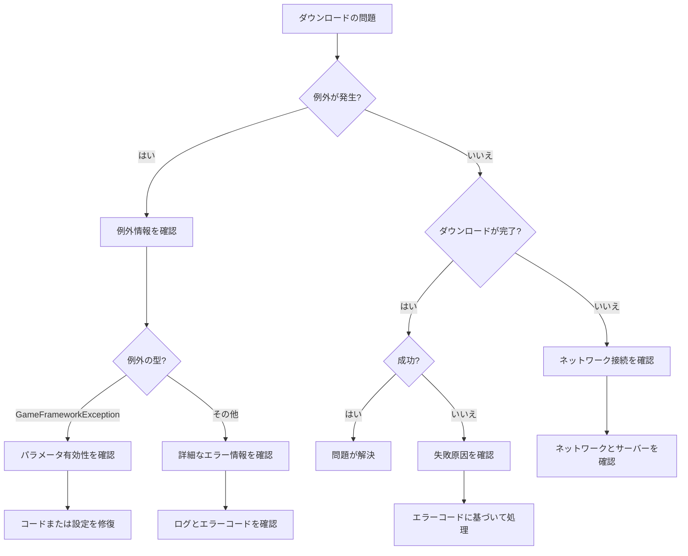

# よくある質問

このドキュメントでは、GameFrameX Downloadダウンロードコンポーネントの使用過程で発生する可能性のある一般的な問題とその解決策を収集しています。

## 概要

DownloadコンポーネントはGameFrameXフレームワークにおいてダウンロードタスクを処理する責任を負うコアコンポーネントです。実際の使用過程で、構成不善、依存関係の欠落、ネットワーク環境などにより 다양한問題が発生する可能性があります。このドキュメントは開発者が这些问题を素早く特定して解決するのを支援することを目的としています。

## 初期化の問題

### 問題：ゲームの起動時に「Download manager is invalid」と表示される

**エラーメッセージ：**
```
Log.Fatal("Download manager is invalid.");
```

**原因分析：**
DownloadComponentはIDownloadManagerモジュールに依存していますが、このモジュールがGameFrameworkシステムに正しく登録されていません。

**解決策：**
1. DownloadManagerモジュールが正しく登録されていることを確認します。起動時に関連するモジュール登録コードを呼び出したかどうかを確認します。
2. GameFrameworkEntryがIDownloadManagerインターフェースを正しく解決できることを確認します。

---

### 問題：ゲームの起動時に「Event component is invalid」と表示される

**エラーメッセージ：**
```
Log.Fatal("Event component is invalid.");
```

**原因分析：**
DownloadComponentはイベント配信にEventComponent依存していますが、EventComponentが正しく初期化されていません。

**解決策：**
1. シーンにEventComponentが存在することを確認します。
2. EventComponentはDownloadComponentよりも前に初期化されている必要があります。
3. EventComponentの詳細については、[Eventコンポーネントドキュメント](https://github.com/GameFrameX/com.gameframex.unity.event)を参照してください。

---

### 問題：「Can not create download agent helper」と表示される

**エラーメッセージ：**
```
Log.Error("Can not create download agent helper.");
```

**原因分析：**
構成されたクラス型名に基づいてダウンロードエージェントヘルパーインスタンスを作成できません。

**解決策：**
1. DownloadComponentの`DownloadAgentHelperTypeName`フィールドの構成が正しいかどうかを確認します。
2. デフォルト値は`UnityGameFramework.Runtime.UnityWebRequestDownloadAgentHelper`です。
3. カスタムダウンロードエージェントヘルパーを使用する場合、クラス型名がアセンブリ内の完全修飾名と一致していることを確認します。

---

## API使用の問題

### 問題：AddDownloadを呼び出すと「Download path is invalid」という例外が発生

**エラーメッセージ：**
```
GameFrameworkException: Download path is invalid.
```

**原因分析：**
AddDownloadメソッドに渡されたdownloadPathパラメータが空またはnullです。

**解決策：**
downloadPathパラメータが有効であることを確認します：
```csharp
// 錯誤の例
int id = downloadComponent.AddDownload("", "http://example.com/file.zip");

// 正しい例
int id = downloadComponent.AddDownload(Application.persistentDataPath + "/file.zip", "http://example.com/file.zip");
```

> 出典: [DownloadManager.cs](https://github.com/GameFrameX/com.gameframex.unity.download/blob/main/Runtime/Download/Download/DownloadManager.cs#L338-L341)

---

### 問題：AddDownloadを呼び出すと「Download uri is invalid」という例外が発生

**エラーメッセージ：**
```
GameFrameworkException: Download uri is invalid.
```

**原因分析：**
AddDownloadメソッドに渡されたdownloadUriパラメータが空またはnullです。

**解決策：**
downloadUriパラメータが有効であることを確認します：
```csharp
// 錯誤の例
int id = downloadComponent.AddDownload(Application.persistentDataPath + "/file.zip", "");

// 正しい例
int id = downloadComponent.AddDownload(Application.persistentDataPath + "/file.zip", "http://example.com/file.zip");
```

> 出典: [DownloadManager.cs](https://github.com/GameFrameX/com.gameframex.unity.download/blob/main/Runtime/Download/Download/DownloadManager.cs#L343-L346)

---

### 問題：AddDownloadを呼び出すと「You must add download agent first」という例外が発生

**エラーメッセージ：**
```
GameFrameworkException: You must add download agent first.
```

**原因分析：**
ダウンロードタスクを追加する前に少なくとも1つのダウンロードエージェントヘルパーを追加する必要があります。

**解決策：**
1. DownloadComponentはStartメソッドで指定された数のエージェントヘルパーを自動的に作成します。
2. DownloadComponentがシーンに正しく追加されていることを確認します。
3. `DownloadAgentHelperCount`プロパティが0より大きいことを確認します（デフォルトは3）。

```csharp
// DownloadComponent Inspectorで設定
[SerializeField] private int m_DownloadAgentHelperCount = 3;
```

> 出典: [DownloadManager.cs](https://github.com/GameFrameX/com.gameframex.unity.download/blob/main/Runtime/Download/Download/DownloadManager.cs#L348-L351)

---

## ネットワークとダウンロードの問題

### 問題：ダウンロードが失敗し「Timeout」と表示される

**エラーメッセージ：**
```
Download failure, download serial id '0', download path '...', download uri '...', error message 'Timeout'.
```

**原因分析：**
指定されたタイムアウト時間内にダウンロードリクエストが完了しません。デフォルトのタイムアウト時間は30秒です。

**解決策：**
1. タイムアウト時間を 增加設定します：
```csharp
// タイムアウト時間を120秒に設定
downloadComponent.Timeout = 120f;
```

2. ネットワーク接続が安定かどうかを確認します。

3. サーバーの応答時間が正常かどうかを確認します。ブラウザやその他のツールでダウンロードリンクにアクセスしてみてください。

4. 大容量ファイルのダウンロードの場合、タイムアウト時間を調整するかレジュームを実装することを検討します。

---

### 問題：ダウンロード時にネットワークエラーが発生

**エラーメッセージ：**
```
error: "Network error"
```

**原因分析：**
UnityWebRequestがネットワークレベルのエラーを検出しました。以下の原因が考えられます：
- ネットワーク接続が中断
- DNS解決の失敗
- 接続を確立できない

**解決策：**
1. デバイスのネットワーク接続状態を確認します。
2. ダウンロードURLにアクセス可能かどうかを確認します。
3. モバイルデバイスでテストする場合は、ネットワーク権限が追加されていることを確認します（Android: INTERNET, ACCESS_NETWORK_STATE; iOS: NSAppTransportSecurity）。
4. デバイスログを確認してより詳細なエラー情報を取得します。

---

### 問題：ダウンロード時にHTTPエラーが発生

**エラーメッセージ：**
```
error: "HTTP Error 404"
error: "HTTP Error 500"
```

**原因分析：**
サーバーがエラーステータスコードを返しました。一般的なステータスコードには以下が含まれます：
- 404: ファイルが存在しない
- 500: サーバー内部エラー
- 502: ゲートウェイエラー
- 503: サービス使用不可

**解決策：**
1. ダウンロードリンクが正しいかどうかを確認します。
2. サーバー側にファイルが存在するかどうかを確認します。
3. APIリクエストの場合、APIインターフェースが正しいかどうかを確認します。
4. サーバーilonを確認して詳細なエラーを取得します。

---

### 問題：レジュームが動作しない

**原因分析：**
レジューム機能はサーバーがHTTP Rangeヘッダーをサポートしているかに依存します。

**解決策：**
1. サーバーがレジュームをサポートしているかどうかを確認します（HTTP 206ステータスコード）。
2. FlushSize構成を確認し、ファイルの書き込みロジックが正常かどうかを確認します：
```csharp
// ディスクへの書き込み閾値を設定（デフォルトは1MB）
downloadComponent.FlushSize = 1024 * 1024;
```

3. ダウンロードディレクトリに十分なディスク容量があることを確認します。

---

## ファイルシステムの問題

### 問題：ダウンロードファイルの書き込みが失敗

**原因分析：**
- ディスク容量が不足
- 書き込みパスにアクセス権限がない
- ディレクトリが存在しない

**解決策：**
1. ターゲットディレクトリが存在することを確認します：
```csharp
string directory = Path.GetDirectoryName(downloadPath);
if (!Directory.Exists(directory))
{
    Directory.CreateDirectory(directory);
}
```

2. ディスクの空き容量を確認します。

3. アプリケーションの書き込み権限を確認します。

4. Androidでは、Application.dataPathではなくApplication.persistentDataPathを使用に注意してください。

---

## イベント購読の問題

### 問題：ダウンロードイベントを受信できない

**原因分析：**
DownloadComponentまたはDownloadManagerのイベントが正しく購読されていません。

**解決策：**
イベントを正しく購読する方法：
```csharp
// EventComponentを通じて購読
var eventComponent = GameEntry.GetComponent<EventComponent>();
eventComponent.Subscribe(DownloadSuccessEventArgs.EventId, OnDownloadSuccess);
eventComponent.Subscribe(DownloadFailureEventArgs.EventId, OnDownloadFailure);

// コールバック処理
private void OnDownloadSuccess(object sender, GameEventArgs e)
{
    var ne = (DownloadSuccessEventArgs)e;
    Debug.Log($"Download success: {ne.DownloadPath}");
}

private void OnDownloadFailure(object sender, GameEventArgs e)
{
    var ne = (DownloadFailureEventArgs)e;
    Debug.Log($"Download failed: {ne.ErrorMessage}");
}
```

> 出典: [README.md](https://github.com/GameFrameX/com.gameframex.unity.download/blob/main/README.md#L94-L106)

---

### 問題：Taskがnullを返す

**原因情報：**
Downloadメソッドがnull而不是Taskオブジェクトを返します。

**原因分析：**
Downloadメソッドで、serialIdがm_Downloads辞書に存在しない場合、nullを返します。

**解決策：**
正しいシリアルIDを使用してください：
```csharp
// AddDownloadが返したserialIdを使用
int serialId = downloadComponent.AddDownload(downloadPath, downloadUri);

// ダウンロード完了を待機
var task = downloadComponent.Download(downloadPath, downloadUri);
if (task != null)
{
    bool success = await task;
}
```

> 出典: [DownloadComponent.cs](https://github.com/GameFrameX/com.gameframex.unity.download/blob/main/Runtime/Download/DownloadComponent.cs#L273-L282)

---

## 設定の問題

### 問題：ダウンロード速度が低速

**考えられる原因：**
- エージェント数が不足
- タイムアウト時間が短すぎ
- ネットワーク帯域幅の制限

**解決策：**
1. ダウンロードエージェント数を 增加します：
```csharp
// Inspectorでより高いDownloadAgentHelperCountを設定
// 推奨値：3-5個のエージェント
```

2. タイムアウト時間を調整します：
```csharp
downloadComponent.Timeout = 60f; // 60秒に増加
```

3. FlushSizeを調整します：
```csharp
// 書き込みバッファサイズを 增加すると大容量ファイルのダウンロード性能が向上
downloadComponent.FlushSize = 2 * 1024 * 1024; // 2MB
```

---

### 問題：カスタムダウンロードエージェントヘルパーを作成できない

**原因分析：**
カスタムダウンロードエージェントヘルパーのクラス型が正しく登録されていないか、アセンブリに含まれていません。

**解決策：**
1. カスタムヘルパーがDownloadAgentHelperBaseを継承していることを確認します：
```csharp
public class CustomDownloadAgentHelper : DownloadAgentHelperBase
{
    // 必要なメソッドを実装
}
```

2. DownloadComponent Inspectorで正しいクラス型名を設定します：
```
DownloadAgentHelperTypeName: "YourNamespace.CustomDownloadAgentHelper"
```

3. アセンブリがUnityプロジェクトのAssembly Definitionに正しく追加されていることを確認します。

---

## デバッグ技巧

### 詳細ログを有効にする

開発段階で、詳細デバッグログを有効にして問題の特定を支援できます：

```csharp
// すべてのダウンロードイベントを購読して状態を監視
downloadComponent.DownloadStart += (s, e) => Debug.Log($"Start: {e.DownloadUri}");
downloadComponent.DownloadUpdate += (s, e) => Debug.Log($"Progress: {e.CurrentLength}");
downloadComponent.DownloadSuccess += (s, e) => Debug.Log($"Success: {e.DownloadPath}");
downloadComponent.DownloadFailure += (s, e) => Debug.Log($"Failure: {e.ErrorMessage}");
```

### ダウンロード状態を確認する

DownloadComponentが提供するメソッドを使用して現在のダウンロード状態を確認します：

```csharp
// 待機中のダウンロードタスク数を取得
int waitingCount = downloadComponent.WaitingTaskCount;

// 作業中のエージェント数を取得
int workingCount = downloadComponent.WorkingAgentCount;

// 使用可能なエージェント数を取得
int freeCount = downloadComponent.FreeAgentCount;

// 現在のダウンロード速度を取得
float speed = downloadComponent.CurrentSpeed;
```

### タスク情報を取得

```csharp
// シリアル番号に基づいてダウンロードタスク情報を取得
var info = downloadComponent.GetDownloadInfo(serialId);

// タグに基づいてダウンロードタスク情報を取得
var infos = downloadComponent.GetDownloadInfos("myTag");

// すべてのダウンロードタスク情報を取得
var allInfos = downloadComponent.GetAllDownloadInfos();
```

---

## 診断フローチャート



---

## 関連リンク

- [プラグイン紹介](./1-overview.introduction)
- [機能特性](./1-overview.features)
- [インストール](./2-installation)
- [基本設定](./3-getting-started.basic-setup)
- [最初の例](./3-getting-started.first-example)
- [アーキテクチャ概要](./4-core-concepts.architecture)
- [DownloadComponent](./4-core-concepts.download-component)
- [ダウンロードエージェント](./4-core-concepts.download-agent)
- [APIリファレンス - プロパティ](./5-api-reference.properties)
- [APIリファレンス - メソッド](./5-api-reference.methods)
- [ダウンロードイベント](./6-events.download-events)
- [エージェントイベント](./6-events.agent-events)
- [エディタ設定](./7-configuration.editor-configuration)
- [ダウンロードエージェント設定](./7-configuration.agent-configuration)