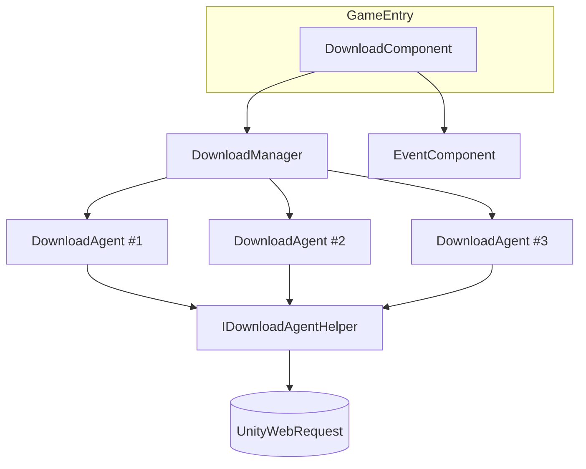

# ダウンロードコンポーネントの概要

GameFrameX ダウンロードコンポーネントは、Unity 向けのマルチエージェントダウンロードマネージャーであり、ファイルの並行ダウンロード、優先度キューによるスケジューリング、一時停止/再開、リアルタイムの速度レポート、イベントコールバックを担当します。`DownloadComponent`（`GameEntry` にアタッチ）を外部向けのエントリポイントとし、内部には `DownloadManager` とプラグイン可能なダウンロードエージェントヘルパー（`IDownloadAgentHelper`）をカプセル化しています。リソースパッケージ、ホットアップデートファイル、パッチなどをローカルに保存するダウンロードのシナリオに適しています。

## クイックスタート

1. **コンポーネントのインストール**：`Packages/manifest.json` に Scoped Registry と依存関係を追加します：

   ```json
   {
     "scopedRegistries": [
       {
         "name": "GameFrameX",
         "url": "https://gameframex.upm.alianblank.uk",
         "scopes": ["com.gameframex"]
       }
     ],
     "dependencies": {
       "com.gameframex.unity.download": "1.1.2"
     }
   }
   ```

   出典： [README.zh-CN.md](https://github.com/GameFrameX/com.gameframex.unity.download/blob/main/README.zh-CN.md#L68-L84)

2. **コンポーネントインスタンスの取得**：フレームワークのエントリポイントから `DownloadComponent` を取得します：

   ```csharp
   var downloadComponent = GameEntry.GetComponent<DownloadComponent>();
   ```

   出典： [DownloadComponent.cs](https://github.com/GameFrameX/com.gameframex.unity.download/blob/main/Runtime/Download/DownloadComponent.cs#L46-L60)

3. **ダウンロードタスクの追加**（非同期方式）：

   ```csharp
   bool success = await downloadComponent.Download(
       "/本地保存路径/file.zip",
       "https://example.com/file.zip"
   );
   ```

   出典： [README.zh-CN.md](https://github.com/GameFrameX/com.gameframex.unity.download/blob/main/README.zh-CN.md#L131-L143)

4. **またはイベント駆動方式を使用**：

   ```csharp
   var eventComponent = GameEntry.GetComponent<EventComponent>();
   eventComponent.Subscribe(DownloadSuccessEventArgs.EventId, OnDownloadSuccess);
   eventComponent.Subscribe(DownloadFailureEventArgs.EventId, OnDownloadFailure);

   int serialId = downloadComponent.AddDownload(
       "/本地保存路径/file.zip",
       "https://example.com/file.zip"
   );
   ```

   出典： [README.zh-CN.md](https://github.com/GameFrameX/com.gameframex.unity.download/blob/main/README.zh-CN.md#L96-L127)

5. **タグによるグループ化と一時停止/再開**：

   ```csharp
   int id = downloadComponent.AddDownload(path, uri, tag: "assets", priority: 10);
   downloadComponent.GetDownloadInfos("assets");
   downloadComponent.RemoveDownloads("assets");

   downloadComponent.Paused = true;   // すべて一時停止
   downloadComponent.Paused = false;  // 再開
   ```

   出典： [README.zh-CN.md](https://github.com/GameFrameX/com.gameframex.unity.download/blob/main/README.zh-CN.md#L145-L167)

## 仕組みの概要

コンポーネントは外部に `DownloadComponent` のみを公開し、内部では 3 種類のオブジェクトが連携して動作します：



- `DownloadComponent` はパラメータ（エージェント数、タイムアウト、`FlushSize`、ヘルパー型）を管理し、呼び出しを転送します。
- `DownloadManager` はタスクキューとエージェントプールを管理し、優先度に従ってタスクをディスパッチします。
- `IDownloadAgentHelper` は実際にネットワークリクエストを送信する抽象層であり、デフォルトの実装は `UnityWebRequestDownloadAgentHelper` で、Inspector で置き換えやカスタマイズが可能です。
- 完了/失敗はイベントバスを通じてサブスクライバーにブロードキャストされます。

出典： [DownloadComponent.cs](https://github.com/GameFrameX/com.gameframex.unity.download/blob/main/Runtime/Download/DownloadComponent.cs#L46-L80)

## 主要機能の概要

| 機能 | 説明 |
|------|------|
| マルチエージェント並行 | デフォルトで 3 つのダウンロードエージェントが並列実行され、Inspector で変更可能 |
| 優先度スケジューリング | 数値が大きいほど優先的にディスパッチされる |
| タグによるグループ化 | tag によるタスクの追加、照会、削除をサポート |
| 一時停止と再開 | `Paused = true/false` がグローバルに適用される |
| タイムアウトとフラッシュ | `Timeout`（デフォルト 30 秒）と `FlushSize`（デフォルト 1 MB）により中断からの再開（レジューム）に対応 |
| リアルタイムメトリクス | `CurrentSpeed`、`TotalAgentCount`、`WaitingTaskCount` |
| イベント駆動 | `EventComponent` を通じて `DownloadStart` / `DownloadUpdate` / `DownloadSuccess` / `DownloadFailure` を配信 |
| 非同期サポート | `Download()` は `Task<bool>` を返し、直接 await 可能 |
| プラグイン可能なバックエンド | `UnityWebRequestDownloadAgentHelper` を内蔵し、`IDownloadAgentHelper` を実装することも可能 |

出典： [README.zh-CN.md](https://github.com/GameFrameX/com.gameframex.unity.download/blob/main/README.zh-CN.md#L28-L38)

## 次のステップ

- ダウンロードタスクの追加方法と結果の処理については、「ダウンロードを開始する方法」を参照してください。
- タグによるタスク管理については、「タググループでダウンロードを管理する方法」を参照してください。
- 一時停止/再開、タイムアウトとフラッシュしきい値の変更については、「ダウンロードコンポーネントを設定する方法」を参照してください。
- イベントのサブスクライブと非同期インターフェースの選択については、「ダウンロードイベントをサブスクライブする方法」を参照してください。
- ダウンロードバックエンドの置き換えやカスタマイズについては、「ダウンロードエージェントヘルパーを置き換える方法」を参照してください。
- ダウンロード失敗のトラブルシューティングについては、「ダウンロードに失敗した場合の対処方法」を参照してください。