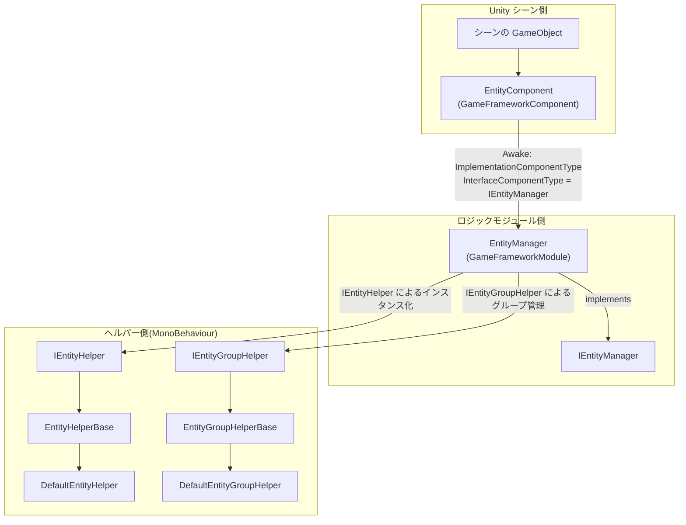

# 仕組み:Manager-Component-Helper アーキテクチャとエンティティライフサイクル

Entity(エンティティ)モジュールは、GameFrameX フレームワーク共通の **Manager + Component + Helper** 3層アーキテクチャを採用しています。Unity 側の `EntityComponent` はシーン向けのエントリポイントであり、ロジック側の `EntityManager` を保持してすべてのエンティティのライフサイクル(`Init → Show → Hide → Recycle`)を統一的にスケジュールします。また、`IEntityHelper` / `IEntityGroupHelper` という2つの Helper インターフェースを通じて、「どのように生成するか / どのようにグループ化するか」という具体的な動作を、ユーザーが置き換え可能な実装へと委譲しています。

## 3層の役割一覧

| 層 | 型 | 名前空間 | 役割 |
|----|------|--------------|------|
| Component(コンポーネント) | `EntityComponent : GameFrameworkComponent` | `GameFrameX.Entity.Runtime` | シーンの GameObject にアタッチされ、フレームワークモジュールのエントリポイントとして機能。`Awake` 時に `IEntityManager` の実装クラスをフレームワークにバインドし、エンティティグループの登録と取得を提供します |
| Manager(マネージャー) | `EntityManager : GameFrameworkModule, IEntityManager` | `GameFrameX.Entity.Runtime` | partial class による純粋なロジックモジュール。エンティティ / エンティティグループの辞書管理、ステートマシンの推進、`ShowEntity` / `HideEntity` / `RecycleEntity` のメインフローを担当します |
| Helper(ヘルパー) | `IEntityHelper` / `IEntityGroupHelper` および対応する `*Base`、`Default*` 実装 | `GameFrameX.Entity.Runtime` | ユーザーまたはフレームワークのデフォルトによって提供される `MonoBehaviour`:Helper が「エンティティをどのようにインスタンス化するか / エンティティをどのグループにアタッチするか」を決定します |

## クイックスタート(モジュールを動作させる)

1. シーンに空の GameObject を配置し、`EntityComponent` を追加します(Inspector の Add Component → GameFrameX/Entity から見つけられます)。
2. `MonoBehaviour` に `EntityHelperBase` を継承させてエンティティヘルパーとするか、組み込みの `DefaultEntityHelper` をそのまま使用します。
3. `MonoBehaviour` に `EntityGroupHelperBase` を継承させてエンティティグループヘルパーとするか、組み込みの `DefaultEntityGroupHelper` をそのまま使用します。
4. ゲーム起動時に `GameEntry.GetComponent<EntityComponent>()` でコンポーネントを取得し、`AddEntityGroup(...)` を呼び出して複数のグループを登録します。その後は `ShowEntity` を呼び出してインスタンスを生成できます。

ソースコードの入口:[EntityComponent.cs](https://github.com/GameFrameX/com.gameframex.unity.entity/blob/main/Runtime/Entity/EntityComponent.cs#L100-L120)

## Manager-Component-Helper の関係



- 起動:`EntityComponent.Awake()` はソースファイル内で `InterfaceComponentType = typeof(IEntityManager)` と `ImplementationComponentType = Utility.Assembly.GetType(componentType)` を実行し、フレームワークがこれを `IEntityManager` として組み立て、グローバルからアクセスできるようにします。

ソースコード:[EntityComponent.cs](https://github.com/GameFrameX/com.gameframex.unity.entity/blob/main/Runtime/Entity/EntityComponent.cs)

## エンティティライフサイクル

エンティティの生成から破棄までの全過程は `EntityStatus` ステートマシンによって推進されます。列挙型は `Entity/EntityManager.EntityStatus.cs` で定義されています:

| 状態 | 意味 | トリガーとなる動作 |
|------|------|----------|
| `Unknown` | デフォルトのプレースホルダー | — |
| `WillInit` | 初期化直前 | Manager がリソースを準備し Helper を呼び出す |
| `Inited` | 初期化済み | リソース準備完了、`OnInit` をコールバック |
| `WillShow` | 表示直前 | Helper の `CreateEntity` を呼び出す |
| `Showed` | 表示済み、シーン内でアクティブ | `OnShow` をコールバック |
| `WillHide` | 非表示直前 | 表示の回収を準備 |
| `Hidden` | 非表示済み、インスタンスは保持 | `OnHide` をコールバック |
| `WillRecycle` | リサイクル直前 | 参照カウントがゼロになる |
| `Recycled` | リサイクル済み、再利用または破棄可能 | `OnRecycle` をコールバック |

ソースコード:[EntityManager.EntityStatus.cs](https://github.com/GameFrameX/com.gameframex.unity.entity/blob/main/Runtime/Entity/Entity/EntityManager.EntityStatus.cs#L38-L52)

### 状態遷移の4ステップ

Manager は `ShowEntity` / `HideEntity` のメインエントリを通じて上記の状態を順番に推進し、各ステップは Helper に委譲されます:

1. **Init**:`InstantiateEntity(entityAsset)` により、`IEntityHelper` が対応するグループコンテナー内でエンティティをインスタンス化します。
2. **Show**:`CreateEntity(entityInstance, entityGroup, userData)` により、Helper が `IEntity` を構築し、Transform と親ノードを設定します。
3. **Hide**:`EntityManager.Hide*` のフローにより `Showed → WillHide → Hidden` と遷移し、インスタンスはグループ内に保持されて再利用を待機します。
4. **Recycle**:`ReleaseEntity(entityAsset, entityInstance)` により、Helper が破棄またはオブジェクトプールへの返却を行います。

`IEntityHelper` のインターフェース定義:

```csharp
public interface IEntityHelper
{
    object InstantiateEntity(object entityAsset);
    IEntity CreateEntity(object entityInstance, IEntityGroup entityGroup, object userData);
    void ReleaseEntity(object entityAsset, object entityInstance);
}
```

ソースコード:[IEntityHelper.cs](https://github.com/GameFrameX/com.gameframex.unity.entity/blob/main/Runtime/Entity/Entity/IEntityHelper.cs#L37-L61)

## Helper の置き換えポイント

| インターフェース | デフォルト実装 | カスタム Helper に置き換えるケース |
|------|----------|--------------------------|
| `IEntityHelper` | `DefaultEntityHelper : EntityHelperBase` | Addressables、オブジェクトプール、カスタムのプリロード戦略を使いたい場合は `EntityHelperBase` を継承 |
| `IEntityGroupHelper` | `DefaultEntityGroupHelper : EntityGroupHelperBase` | エンティティを異なる親ノードにアタッチしたい、階層別の LOD / 分割画面で表示したい場合は `EntityGroupHelperBase` を継承 |

2つの Helper 抽象クラスはどちらも `MonoBehaviour` を継承しているため、Inspector で任意の GameObject にバインドでき、Manager は呼び出し時にインターフェースを通じてインスタンスを取得します。

ソースコード:[EntityHelperBase.cs](https://github.com/GameFrameX/com.gameframex.unity.entity/blob/main/Runtime/Entity/EntityHelperBase.cs#L38-L40)、[EntityGroupHelperBase.cs](https://github.com/GameFrameX/com.gameframex.unity.entity/blob/main/Runtime/Entity/EntityGroupHelperBase.cs#L38-L40)

## 次のステップ

- エンティティグループを追加してエンティティを表示したい場合は、『ハウツー:エンティティグループを登録して ShowEntity する』を参照してください。
- `ShowEntity` で `Entity ... is not inited` や類似のエラーが出る場合は、『エンティティライフサイクルの例外時の対処方法』を参照してください。
- 公開 API のメソッドシグネチャとデフォルト値については、『エンティティモジュール API クイックリファレンス』を参照してください。