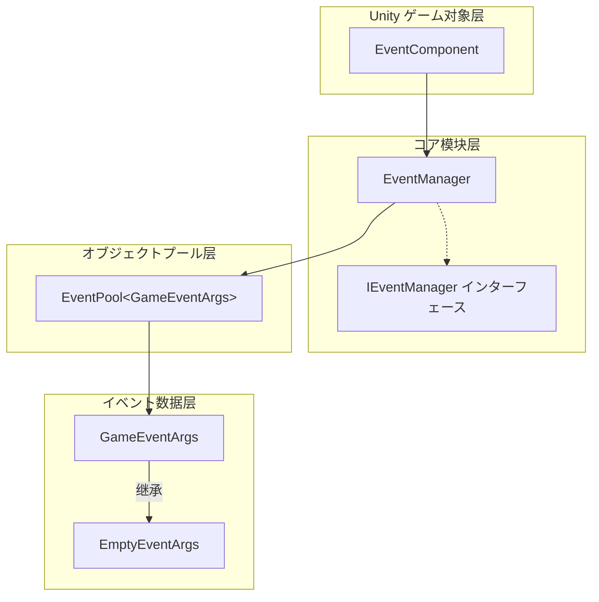
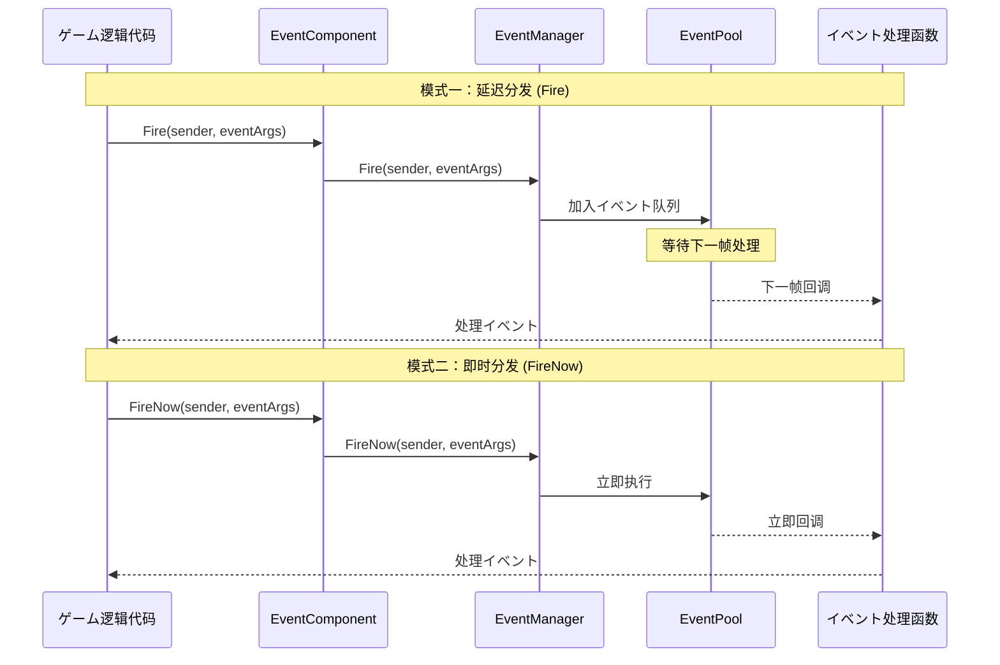
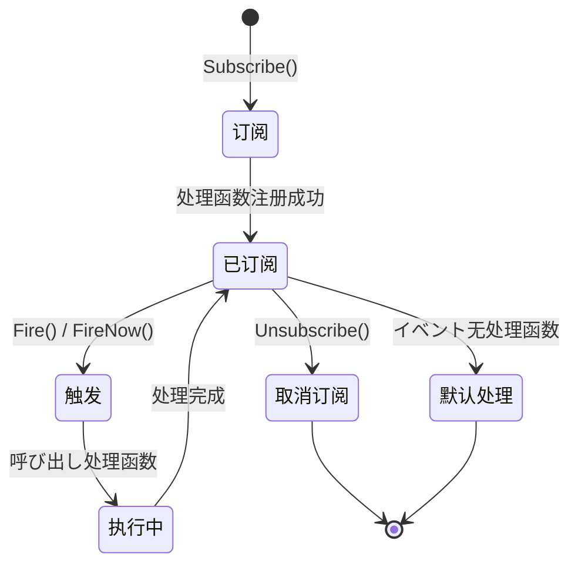

# 插件介绍

GameFrameX Event 插件是 GameFrameX ゲームフレームワーク的コアコンポーネント之一，提供します一套完整的ゲームイベント系统解決策。该插件実装了观察者模式（Observer Pattern），允许ゲーム对象之间进行松耦合的通信，是构建イベント驱动型ゲーム架构的理想选择。

## 概要

GameFrameX Event イベント系统コンポーネントは轻量级、高性能的 Unity イベント管理フレームワーク，专为ゲーム开发设计。它解决了传统 Unity イベント系统（如 UnityEvent、SendMessage）的诸多局限性，提供します更加强大和灵活的イベント处理能力。

该イベント系统的コア设计理念是将イベント的**发送者**与**接收者**解耦，使得ゲーム各个模块之间不必要直接引用彼此，を通じてイベント进行通信。这种设计模式极大地提高了代码的可维护性和可扩展性，特别适合大型ゲームプロジェクト的开发。

### コア機能

| 特性 | 説明 |
|------|------|
| **线程安全** | サポート在后台线程触发イベント，自动在主线程回调处理函数 |
| **延迟分发** | Fire() メソッド将イベント分发延迟到下一帧，避免性能抖动 |
| **即时分发** | FireNow() メソッドサポート立即イベント分发，适に使用实时响应シーン |
| **オブジェクトプール** | 内部使用オブジェクトプール技术，减少内存分配和 GC 压力 |
| **默认处理器** | サポート設定默认イベント处理函数，捕获未明确订阅的イベント |
| **多重订阅** | 允许同一イベント ID 绑定多个处理函数 |

### イベント系统架构

GameFrameX Event イベント系统由多个コアコンポーネント构成，每个コンポーネント都有明确的职责分工：



**架构説明：**

- **EventComponent**：作为 Unity コンポーネント存在，提供给ゲーム脚本直接呼び出し的公共 API，是イベント系统与ゲーム代码的桥梁。它を継承 `GameFrameworkComponent`，遵循 GameFrameX フレームワーク的コンポーネント规范。

- **EventManager**：イベント系统的コア模块，を継承 `GameFrameworkModule`，実装了 `IEventManager` インターフェース。负责管理所有イベント的订阅、取消订阅和分发逻辑。

- **EventPool**：内部使用的イベント池実装，负责イベント对象的取得和回收，有效减少ゲーム运行时的内存分配。

- **GameEventArgs**：所有ゲームイベント的基クラス，開発者必要继承此クラス来作成自定义イベントクラス型。

- **EmptyEventArgs**：预置的简单イベントクラス，仅包含イベント ID，适に使用不必要携带额外数据的シーン。

## イベント流转机制

### イベント分发模式

GameFrameX Event 提供します两种イベント分发模式，以满足不同シーン的需求：



**延迟分发（Fire）特点：**
- イベント被加入队列，在下一帧统一处理
- 完全线程安全，可在任意线程呼び出し
- 适に使用大多数ゲーム逻辑イベント
- 可避免在某一帧产生性能高峰

**即时分发（FireNow）特点：**
- イベント立即分发，同步执行所有处理函数
- 非线程安全，必須在主线程呼び出し
- 适に使用必要立即响应的イベント
- 适合处理ゲーム中的即时反馈

### イベント生命周期



## 快速使用示例

### 基本订阅与触发

```csharp
// 1. 定义自定义イベントクラス
public class PlayerDeadEventArgs : GameEventArgs
{
    public int PlayerId { get; set; }
    public string Reason { get; set; }
}

// 2. 取得 EventComponent コンポーネント引用
var eventComponent = UnityEngine.GameObject.Find("GameRoot").GetComponent<EventComponent>();

// 3. 订阅イベント
eventComponent.CheckSubscribe("player_dead", OnPlayerDead);

// 4. 定义イベント处理函数
private void OnPlayerDead(object sender, GameEventArgs e)
{
    var args = (PlayerDeadEventArgs)e;
    UnityEngine.Debug.Log($"玩家 {args.PlayerId} 死亡，原因：{args.Reason}");
}

// 5. 触发イベント
eventComponent.Fire(this, new PlayerDeadEventArgs 
{ 
    PlayerId = 1001, 
    Reason = "被怪物击杀" 
});
```

> Source: [Runtime/EventComponent.cs](https://github.com/GameFrameX/com.gameframex.unity.event/blob/main/Runtime/EventComponent.cs#L90-L99)

### 使用空イベント

```csharp
// 触发一个不带数据的简单イベント
eventComponent.Fire(this, "game_start");
```

> Source: [Runtime/EventComponent.cs](https://github.com/GameFrameX/com.gameframex.unity.event/blob/main/Runtime/EventComponent.cs#L140-L144)

### 检查与取消订阅

```csharp
// 检查イベント处理函数是否存在
bool exists = eventComponent.Check("player_dead", OnPlayerDead);

// 取消订阅
eventComponent.Unsubscribe("player_dead", OnPlayerDead);
```

> Source: [Runtime/EventComponent.cs](https://github.com/GameFrameX/com.gameframex.unity.event/blob/main/Runtime/EventComponent.cs#L72-L75)

## イベント系统设计优势

### 相比 Unity 原生イベント系统的优势

| 特性 | UnityEvent / SendMessage | GameFrameX Event |
|------|-------------------------|------------------|
| 性能 | 较差，有反射开销 | 高性能，无反射 |
| クラス型安全 | 弱クラス型 | 强クラス型 |
| 线程安全 | 不サポート | サポート |
| オブジェクトプール | 不サポート | サポート |
| 泛型サポート | 不サポート | サポート |

### 典型应用シーン

1. **UI 与ゲーム逻辑解耦**：ゲーム数据变化时，を通じてイベント通知 UI 层更新，无需 UI 直接引用ゲーム逻辑代码

2. **模块间通信**：不同ゲーム模块（如背包系统、任务系统、成就系统）之间を通じてイベント进行通信，降低模块间耦合度

3. **插件系统**：ゲーム插件或扩展模块可能を通じて订阅イベント来响应ゲームイベント，无需修改コア代码

4. **调试与日志**：を通じて订阅全局イベント，可能実装ゲーム行为的监控和日志记录

## 技术実装细节

### コアクラス説明

**EventComponent クラス**

EventComponent 是イベント系统在 Unity 中的エントリーポイント点，它を継承 `GameFrameworkComponent`，在 `Awake()` メソッド中初期化 EventManager 模块：

```csharp
protected override void Awake()
{
    ImplementationComponentType = Utility.Assembly.GetType(componentType);
    InterfaceComponentType = typeof(IEventManager);
    base.Awake();
    m_EventManager = GameFrameworkEntry.GetModule<IEventManager>();
}
```

> Source: [Runtime/EventComponent.cs](https://github.com/GameFrameX/com.gameframex.unity.event/blob/main/Runtime/EventComponent.cs#L43-L54)

**EventManager クラス**

EventManager 実装了 `IEventManager` インターフェース，内部使用 `EventPool<GameEventArgs>` 进行イベント管理：

```csharp
public EventManager()
{
    m_EventPool = new EventPool<GameEventArgs>(EventPoolMode.AllowNoHandler | EventPoolMode.AllowMultiHandler);
}
```

> Source: [Runtime/Event/EventManager.cs](https://github.com/GameFrameX/com.gameframex.unity.event/blob/main/Runtime/Event/EventManager.cs#L24-L27)

**CheckSubscribe メソッド**

该メソッド実装了「检查订阅」模式，如果イベント处理函数不存在则自动订阅：

```csharp
public void CheckSubscribe(string id, EventHandler<GameEventArgs> handler)
{
    if (!Check(id, handler))
    {
        m_EventManager.Subscribe(id, handler);
    }
}
```

> Source: [Runtime/EventComponent.cs](https://github.com/GameFrameX/com.gameframex.unity.event/blob/main/Runtime/EventComponent.cs#L82-L88)

这种设计避免了重复订阅导致的重复呼び出し问题，简化了開発者的使用逻辑。

## 関連リンク

- [安装方法](./02.installation.md) - 了解如何安装和配置插件
- [快速入门](./03.getting-started.md) - 快速开始使用イベント系统
- [イベント系统架构](./04.features.md) - 深入了解イベント系统アーキテクチャ設計
- [EventComponent API 参考](./05.event-component.md) - 完整的 API 文档
- [EventManager API 参考](./06.event-manager.md) - イベント管理器 API 文档
- [GameEventArgs API 参考](./07.game-event-args.md) - イベント参数クラス API 文档
