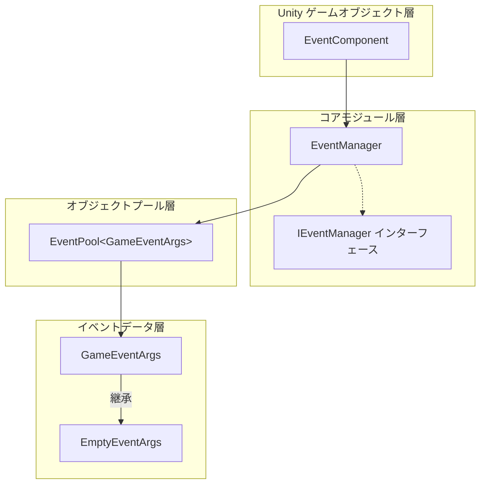
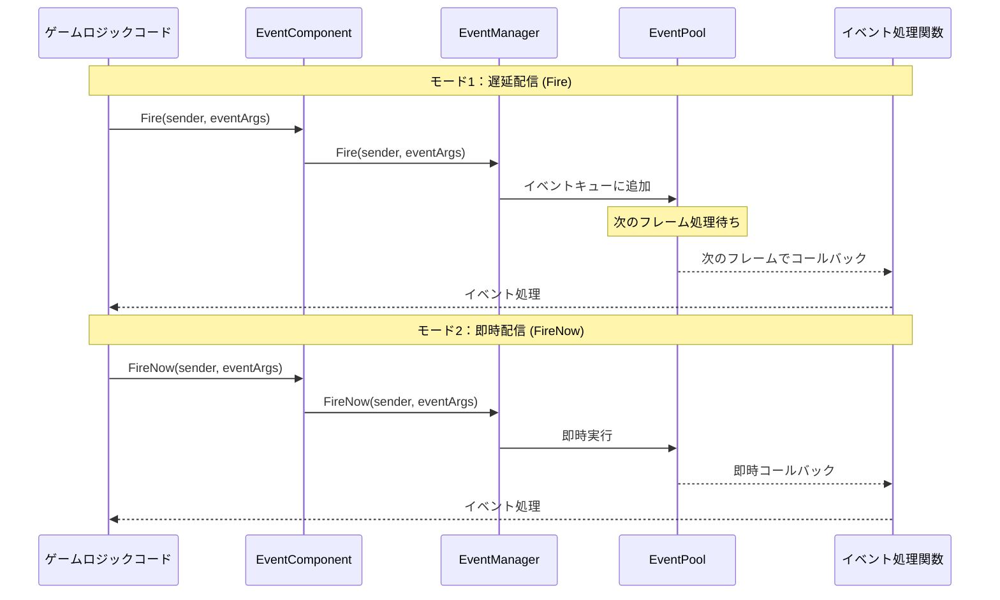
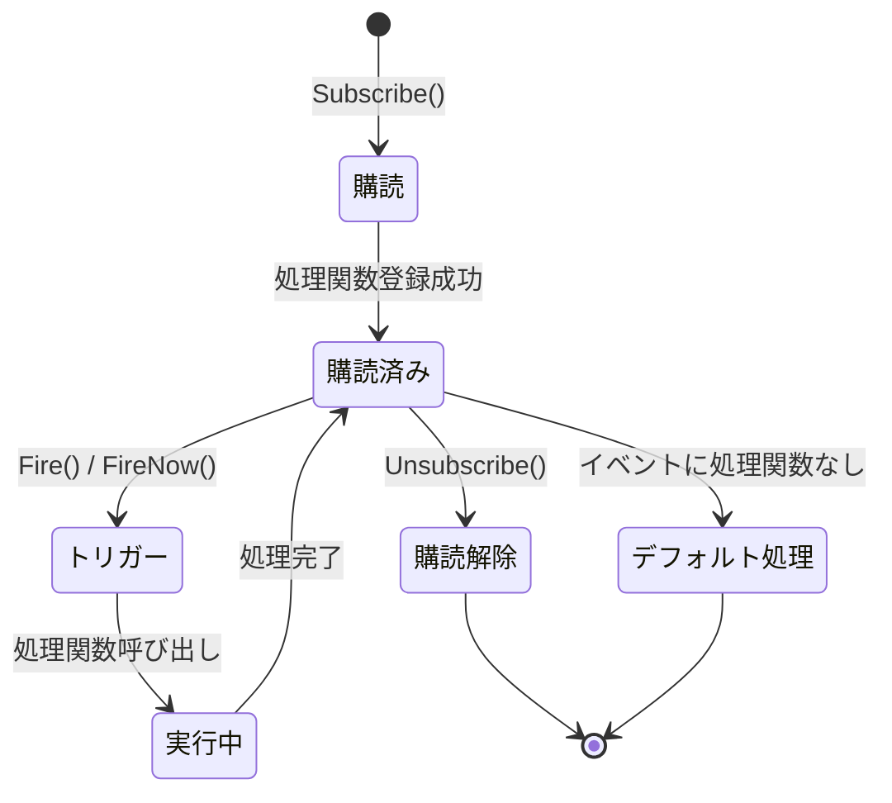

# プラグイン紹介

GameFrameX Event プラグインは GameFrameX ゲームフレームワークの中核コンポーネント之一であり、完全なゲームイベントシステム解决方案を提供します。本プラグインはオブザーバーパターン（Observer Pattern）を実装し、ゲームオブジェクト間の疎結合通信を実現します。

## 概要

GameFrameX Event イベントシステムコンポーネントは、軽量で高性能な Unity イベント管理フレームワークであり、ゲーム開発向けに設計されています。従来の Unity イベントシステム（UnityEvent、SendMessage 等）の多くの限界を解決し、より強力で柔軟なイベント処理能力を提供します。

本イベントシステムのコア設計理念は、イベントの**送信者**と**受信者**を分離し、ゲームの各モジュールが互いに直接参照する必要がないようにすることです。イベントを通じて通信这种方法は、コードの保守性と拡張性を 크게向上させ、大型ゲームプロジェクトの開発に特に適しています。

### コア機能

| 機能 | 説明 |
|------|------|
| **スレッドセーフ** | バックグラウンドスレッドでのイベントトリガーをサポートし、自動的にメインスレッドでコールバック処理関数を実行 |
| **遅延配信** | Fire() メソッドはイベント配信を次のフレームに遅延させ、パフォーマンスの変動を回避 |
| **即時配信** | FireNow() メソッドは即時イベント配信をサポートし、リアルタイム応答シナリオに適合 |
| **オブジェクトプール** | 内部でオブジェクトプール技術を使用し、メモリ割り当てと GC 压力を削減 |
| **デフォルトハンドラー** | デフォルトイベント処理関数の設定をサポートし、明示的に購読されていないイベントをキャプチャ |
| **マルチキャスト** | 同一イベント ID への複数の処理関数バインディングを許可 |

### イベントシステムアーキテクチャ

GameFrameX Event イベントシステムは、複数のコアコンポーネントで構成され、各コンポーネントには明確な責任分担があります：



**アーキテクチャ説明：**

- **EventComponent**：Unity コンポーネントとして存在し、ゲームスクリプトに呼び出される公共 API を提供し、イベントシステムとゲームコードの橋渡しとなります。`GameFrameworkComponent` を継承し、GameFrameX フレームワークのコンポーネント規範に従います。

- **EventManager**：イベントシステムの中核モジュールであり、`GameFrameworkModule` を継承し、`IEventManager` インターフェースを実装します。全イベントの購読、購読解除、配信ロジックを管理します。

- **EventPool**：内部使用のイベントプール実装であり、イベントオブジェクトの取得と回収を担当し、ゲーム実行時のメモリ割り当てを効果的に削減します。

- **GameEventArgs**：全ゲームイベントの基底クラスであり、開発者はこのクラスを継承してカスタムイベントタイプを作成する必要があります。

- **EmptyEventArgs**：組み込みのシンプルイベントクラスであり、イベント ID のみを含み、追加データの携带が不要なシナリオに適合します。

## イベントフロー機構

### イベント配信モード

GameFrameX Event は、異なるシナリオの需求を満たすために2つのイベント配信モードを提供します：



**遅延配信（Fire）の特徴：**
- イベントがキューに追加され、次のフレームで統一処理
- 完全スレッドセーフであり、任意のスレッドから呼び出し可能
- 大半のゲームロジックイベントに適合
- 某一フレームでのパフォーマンスピークを回避可能

**即時配信（FireNow）の特徴：**
- イベントが即時配信され、全処理関数を同期実行
- スレッドセーフではなく、メインスレッドでのみ呼び出し可能
- 即時応答が必要なイベントに適合
- ゲーム内の即時フィードバック処理に適合

### イベントライフサイクル



## クイック使用例

### 基本購読とトリガー

```csharp
// 1. カスタムイベントクラスを定義
public class PlayerDeadEventArgs : GameEventArgs
{
    public int PlayerId { get; set; }
    public string Reason { get; set; }
}

// 2. EventComponent コンポーネント参照を取得
var eventComponent = UnityEngine.GameObject.Find("GameRoot").GetComponent<EventComponent>();

// 3. イベントを購読
eventComponent.CheckSubscribe("player_dead", OnPlayerDead);

// 4. イベント処理関数を定義
private void OnPlayerDead(object sender, GameEventArgs e)
{
    var args = (PlayerDeadEventArgs)e;
    UnityEngine.Debug.Log($"プレイヤー {args.PlayerId} 死亡、原因：{args.Reason}");
}

// 5. イベントをトリガー
eventComponent.Fire(this, new PlayerDeadEventArgs
{
    PlayerId = 1001,
    Reason = "モンスターに殺害された"
});
```

> Source: [Runtime/EventComponent.cs](https://github.com/GameFrameX/com.gameframex.unity.event/blob/main/Runtime/EventComponent.cs#L90-L99)

### 空イベントの使用

```csharp
// データなしのシンプルイベントをトリガー
eventComponent.Fire(this, "game_start");
```

> Source: [Runtime/EventComponent.cs](https://github.com/GameFrameX/com.gameframex.unity.event/blob/main/Runtime/EventComponent.cs#L140-L144)

### 購読の確認と解除

```csharp
// イベント処理関数が存在するかをチェック
bool exists = eventComponent.Check("player_dead", OnPlayerDead);

// 購読を解除
eventComponent.Unsubscribe("player_dead", OnPlayerDead);
```

> Source: [Runtime/EventComponent.cs](https://github.com/GameFrameX/com.gameframex.unity.event/blob/main/Runtime/EventComponent.cs#L72-L75)

## イベントシステム設計の優位性

### Unity ネイティブイベントシステムとの比較

| 機能 | UnityEvent / SendMessage | GameFrameX Event |
|------|-------------------------|------------------|
| パフォーマンス | 低く、リフレクションオーバーヘッドあり | 高パフォーマンス、リフレクションなし |
| タイプセーフティ | 弱い型付け | 強い型付け |
| スレッドセーフ | 非サポート | サポート |
| オブジェクトプール | 非サポート | サポート |
| ジェネリックサポート | 非サポート | サポート |

### 典型的な应用シナリオ

1. **UI とゲームロジックの分離**：ゲームデータが変化した時、イベントを通じて UI レイヤーに更新通知を送信し、UI がゲームロジックコードを直接参照する必要がない

2. **モジュール間通信**：異なるゲームモジュール（バックpacks システム、クエストシステム、アチーブメントシステム等）の間でイベントを通じて通信し、モジュール間の結合度を低減

3. **プラグインシステム**：ゲームプラグインまたは拡張モジュールはイベントの購読を通じてゲームイベントに応答でき、コアコードを変更する必要がない

4. **デバッグとログ**：グローバルイベントの購読を通じて、ゲーム動作のモニタリングとログ記録を実装可能

## 技術実装詳細

### コアクラス説明

**EventComponent クラス**

EventComponent は Unity におけるイベントシステムのエントリーポイントであり、`GameFrameworkComponent` を継承し、`Awake()` メソッドで EventManager モジュールを初期化します：

```csharp
protected override void Awake()
{
    ImplementationComponentType = Utility.Assembly.GetType(componentType);
    InterfaceComponentType = typeof(IEventManager);
    base.Awake();
    m_EventManager = GameFrameworkEntry.GetModule<IEventManager>();
}
```

> Source: [Runtime/EventComponent.cs](https://github.com/GameFrameX/com.gameframex.unity.event/blob/main/Runtime/EventComponent.cs#L43-L54)

**EventManager クラス**

EventManager は `IEventManager` インターフェースを実装し、内部で `EventPool<GameEventArgs>` を使用してイベント管理を行います：

```csharp
public EventManager()
{
    m_EventPool = new EventPool<GameEventArgs>(EventPoolMode.AllowNoHandler | EventPoolMode.AllowMultiHandler);
}
```

> Source: [Runtime/Event/EventManager.cs](https://github.com/GameFrameX/com.gameframex.unity.event/blob/main/Runtime/Event/EventManager.cs#L24-L27)

**CheckSubscribe メソッド**

このメソッドは「購読チェック」パターンを実装し、イベント処理関数が存在しない場合は自動的に購読します：

```csharp
public void CheckSubscribe(string id, EventHandler<GameEventArgs> handler)
{
    if (!Check(id, handler))
    {
        m_EventManager.Subscribe(id, handler);
    }
}
```

> Source: [Runtime/EventComponent.cs](https://github.com/GameFrameX/com.gameframex.unity.event/blob/main/Runtime/EventComponent.cs#L82-L88)

この設計は、重複購読による重複呼び出しの問題を回避し、開発者の使用ロジックを簡素化します。

## 関連リンク

- [ 설치 방법](./02.installation.md) - プラグインのインストールと設定方法
- [クイックスタート](./03.getting-started.md) - イベントシステムの使用開始
- [イベントシステムアーキテクチャ](./04.features.md) - イベントシステムアーキテクチャ設計の詳細
- [EventComponent API リファレンス](./05.event-component.md) - 完全な API ドキュメント
- [EventManager API リファレンス](./06.event-manager.md) - イベントマネージャー API ドキュメント
- [GameEventArgs API リファレンス](./07.game-event-args.md) - イベントパラメータクラス API ドキュメント
