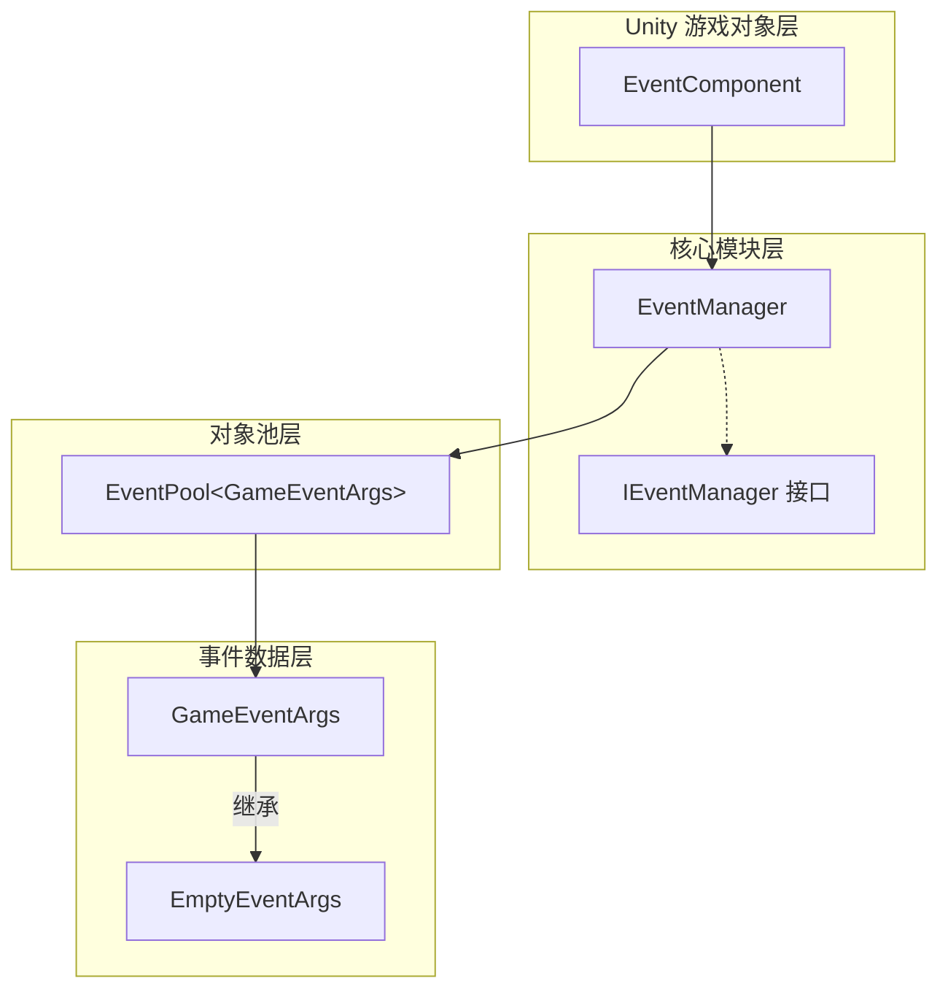
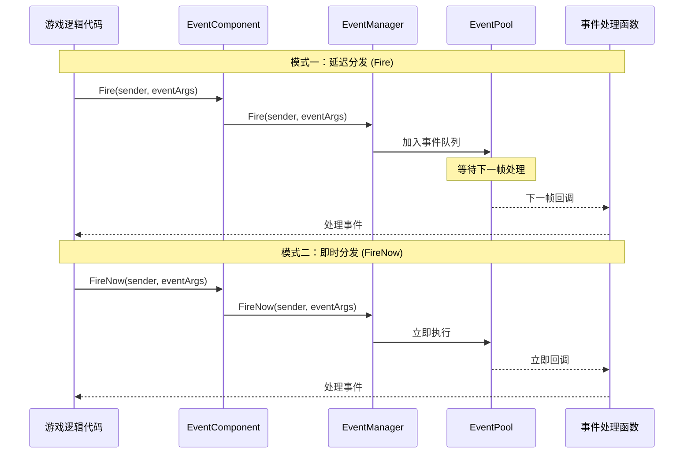
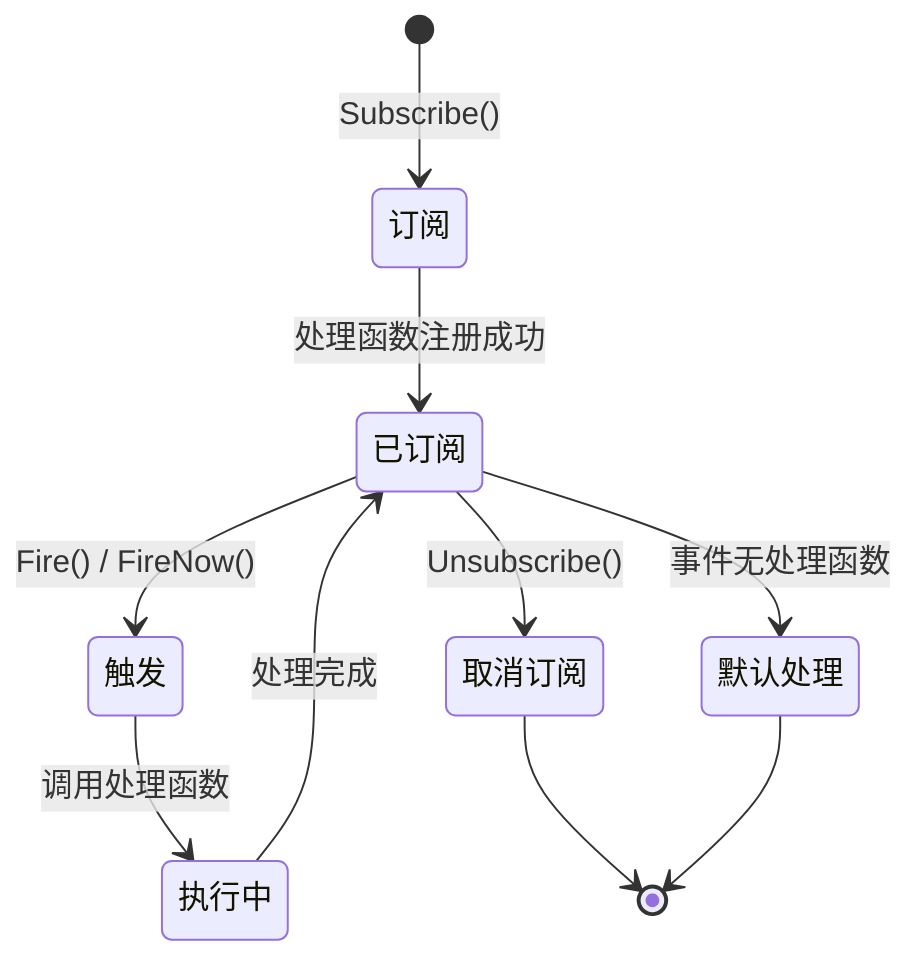

# プラグイン介绍

GameFrameX Event プラグイン是 GameFrameX 游戏フレームワーク的コアコンポーネント之一，提供します一套完全な的游戏イベント系统解決策。该プラグイン実装了观察者モード（Observer Pattern），允许游戏对象之间进行松耦合的通信，是ビルドイベント驱动型游戏アーキテクチャ的理想选择。

## 概要

GameFrameX Event イベント系统コンポーネントは轻量级、高性能的 Unity イベント管理フレームワーク，专为游戏开发設計。它解决了传统 Unity イベント系统（如 UnityEvent、SendMessage）的诸多局限性，提供します更加強力和柔軟的イベント処理能力。

该イベント系统的コア設計理念是将イベント的**发送者**与**受信者**解耦，使得游戏各个モジュール之间不〜する必要があります直接参照彼此，通过イベント进行通信。这种設計モード极大地提高了コード的可维护性和可拡張性，特别适合大型游戏プロジェクト的开发。

### コア特性

| 特性 | 説明 |
|------|------|
| **线程安全** | サポート在后台线程トリガーイベント，自动在主线程コールバック処理函数 |
| **延迟分发** | Fire() メソッド将イベント分发延迟到下一帧，避免性能抖动 |
| **つまり时分发** | FireNow() メソッドサポート立つまりイベント分发，適しています实时响应シーン |
| **对象池** | 内部使用对象池技术，减少内存分配和 GC 压力 |
| **デフォルト処理器** | サポート設定デフォルトイベント処理函数，捕获未明确購読的イベント |
| **多重購読** | 允许同一イベント ID 绑定多个処理函数 |

### イベント系统アーキテクチャ

GameFrameX Event イベント系统由多个コアコンポーネント构成，每个コンポーネント都有明确的职责分工：



**アーキテクチャ説明：**

- **EventComponent**：作为 Unity コンポーネント存在，提供给游戏脚本直接呼び出し的公共 API，是イベント系统与游戏コード的桥梁。它継承自 `GameFrameworkComponent`，遵循 GameFrameX フレームワーク的コンポーネント规范。

- **EventManager**：イベント系统的コアモジュール，継承自 `GameFrameworkModule`，実装了 `IEventManager` インターフェース。负责管理所有イベント的購読、取消購読和分发逻辑。

- **EventPool**：内部使用的イベント池実装，负责イベント对象的取得和回收，有效减少游戏ランタイム的内存分配。

- **GameEventArgs**：所有游戏イベント的基底クラス，開発者〜する必要があります継承此类来作成自定義イベントタイプ。

- **EmptyEventArgs**：预置的シンプルイベント类，仅パッケージ含イベント ID，適しています不〜する必要があります携带额外数据的シーン。

## イベント流转机制

### イベント分发モード

GameFrameX Event 提供します两种イベント分发モード，以满足不同シーン的需求：



**延迟分发（Fire）特点：**
- イベント被加入队列，在下一帧統一された処理
- 完全线程安全，可在任意线程呼び出し
- 適しています大多数游戏逻辑イベント
- 可避免在某一帧产生性能高峰

**つまり时分发（FireNow）特点：**
- イベント立つまり分发，同步执行所有処理函数
- 非线程安全，〜しなければなりません在主线程呼び出し
- 適しています〜する必要があります立つまり响应的イベント
- 适合処理游戏中的つまり时反馈

### イベントライフサイクル



## 快速使用例

### 基本購読与トリガー

```csharp
// 1. 定义自定义事件类
public class PlayerDeadEventArgs : GameEventArgs
{
    public int PlayerId { get; set; }
    public string Reason { get; set; }
}

// 2. 获取 EventComponent 组件引用
var eventComponent = UnityEngine.GameObject.Find("GameRoot").GetComponent<EventComponent>();

// 3. 订阅事件
eventComponent.CheckSubscribe("player_dead", OnPlayerDead);

// 4. 定义事件处理函数
private void OnPlayerDead(object sender, GameEventArgs e)
{
    var args = (PlayerDeadEventArgs)e;
    UnityEngine.Debug.Log($"玩家 {args.PlayerId} 死亡，原因：{args.Reason}");
}

// 5. 触发事件
eventComponent.Fire(this, new PlayerDeadEventArgs 
{ 
    PlayerId = 1001, 
    Reason = "被怪物击杀" 
});
```

> Source: [Runtime/EventComponent.cs](https://github.com/GameFrameX/com.gameframex.unity.event/blob/main/Runtime/EventComponent.cs#L90-L99)

### 使用空イベント

```csharp
// 触发一个不带数据的简单事件
eventComponent.Fire(this, "game_start");
```

> Source: [Runtime/EventComponent.cs](https://github.com/GameFrameX/com.gameframex.unity.event/blob/main/Runtime/EventComponent.cs#L140-L144)

### 確認与取消購読

```csharp
// 检查事件处理函数是否存在
bool exists = eventComponent.Check("player_dead", OnPlayerDead);

// 取消订阅
eventComponent.Unsubscribe("player_dead", OnPlayerDead);
```

> Source: [Runtime/EventComponent.cs](https://github.com/GameFrameX/com.gameframex.unity.event/blob/main/Runtime/EventComponent.cs#L72-L75)

## イベント系统設計优势

### 相比 Unity 原生イベント系统的优势

| 特性 | UnityEvent / SendMessage | GameFrameX Event |
|------|-------------------------|------------------|
| 性能 | 较差，有反射开销 | 高性能，无反射 |
| タイプ安全 | 弱タイプ | 强タイプ |
| 线程安全 | 不サポート | サポート |
| 对象池 | 不サポート | サポート |
| ジェネリックサポート | 不サポート | サポート |

### 典型应用シーン

1. **UI 与游戏逻辑解耦**：游戏数据变化时，通过イベント通知 UI 层アップデート，无需 UI 直接参照游戏逻辑コード

2. **モジュール间通信**：不同游戏モジュール（如背パッケージ系统、任务系统、成就系统）之间通过イベント进行通信，降低モジュール间耦合度

3. **プラグイン系统**：游戏プラグイン或拡張モジュール〜できます通过購読イベント来响应游戏イベント，无需変更コアコード

4. **デバッグ与ログ**：通过購読全局イベント，〜できます実装游戏行为的监控和ログ记录

## 技术実装细节

### コア类説明

**EventComponent 类**

EventComponent 是イベント系统在 Unity 中的入口点，它継承自 `GameFrameworkComponent`，在 `Awake()` メソッド中初期化 EventManager モジュール：

```csharp
protected override void Awake()
{
    ImplementationComponentType = Utility.Assembly.GetType(componentType);
    InterfaceComponentType = typeof(IEventManager);
    base.Awake();
    m_EventManager = GameFrameworkEntry.GetModule<IEventManager>();
}
```

> Source: [Runtime/EventComponent.cs](https://github.com/GameFrameX/com.gameframex.unity.event/blob/main/Runtime/EventComponent.cs#L43-L54)

**EventManager 类**

EventManager 実装了 `IEventManager` インターフェース，内部使用 `EventPool<GameEventArgs>` 进行イベント管理：

```csharp
public EventManager()
{
    m_EventPool = new EventPool<GameEventArgs>(EventPoolMode.AllowNoHandler | EventPoolMode.AllowMultiHandler);
}
```

> Source: [Runtime/Event/EventManager.cs](https://github.com/GameFrameX/com.gameframex.unity.event/blob/main/Runtime/Event/EventManager.cs#L24-L27)

**CheckSubscribe メソッド**

该メソッド実装了「確認購読」モード，もしイベント処理函数不存在则自动購読：

```csharp
public void CheckSubscribe(string id, EventHandler<GameEventArgs> handler)
{
    if (!Check(id, handler))
    {
        m_EventManager.Subscribe(id, handler);
    }
}
```

> Source: [Runtime/EventComponent.cs](https://github.com/GameFrameX/com.gameframex.unity.event/blob/main/Runtime/EventComponent.cs#L82-L88)

这种設計避免了重复購読导致的重复呼び出し問題，簡素化了開発者的使用逻辑。

## 関連リンク

- [インストール方法](./02.installation.md) - 理解する如何インストール和設定プラグイン
- [快速入门](./03.getting-started.md) - 快速开始使用イベント系统
- [イベント系统アーキテクチャ](./04.features.md) - 深入理解するイベント系统アーキテクチャ設計
- [EventComponent API リファレンス](./05.event-component.md) - 完全な的 API ドキュメント
- [EventManager API リファレンス](./06.event-manager.md) - イベントマネージャー API ドキュメント
- [GameEventArgs API リファレンス](./07.game-event-args.md) - イベントパラメータ类 API ドキュメント
