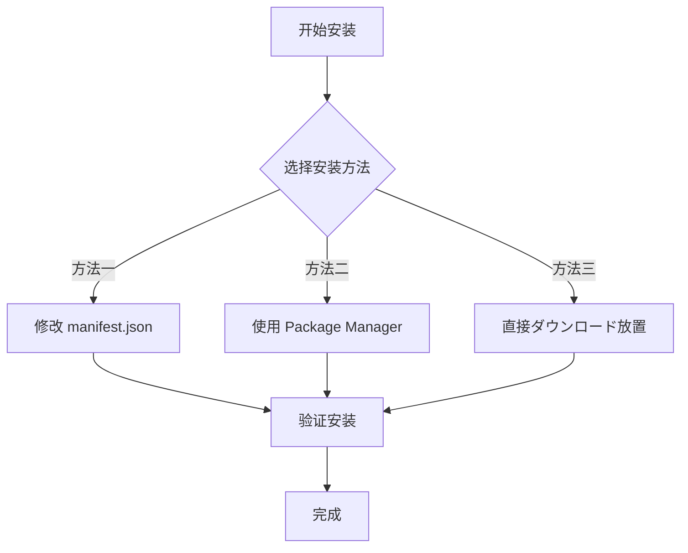
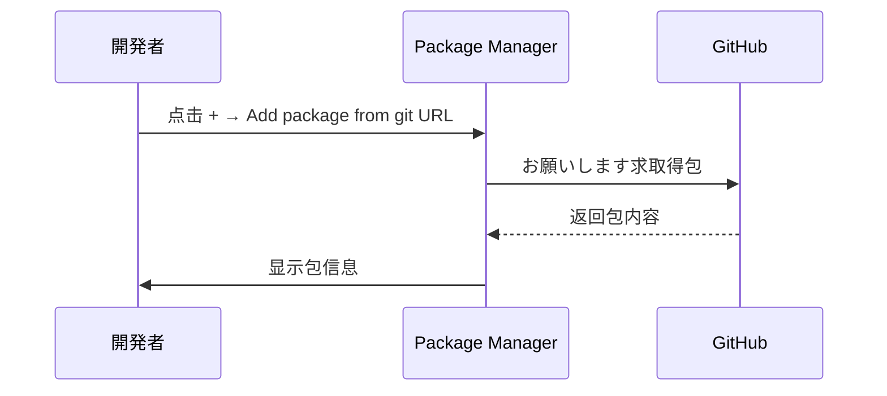

# 安装方法

本文档介绍如何将 Game Frame X Event イベント系统コンポーネント安装到您的 Unity プロジェクト中。

## 概要

Game Frame X Event 是 Game Frame X ゲームフレームワーク的イベント系统コンポーネント，提供ゲーム内イベント的订阅、派发和管理機能。该コンポーネントサポート线程安全的异步イベント派发，适に使用各种ゲーム开发シーン。

**包信息：**
| プロパティ | 值 |
|------|-----|
| 包名 | com.gameframex.unity.event |
| 版本 | 1.1.0 |
| Unity 版本 | 2017.1+ |

## 安装前准备

在开始安装之前，開発環境が以下の要件を満たしていることを確認してください：

- Unity 2017.1 或更高版本
- 已安装 Git 工具（に使用を通じて Git URL 安装）

## インストールメソッド

Game Frame X Event 提供三种安装方法，您可能に基づいてプロジェクト需求选择其中一种。



### メソッド一：を通じて manifest.json 安装

这种方法适合必要将包作为プロジェクト依赖进行版本管理的シーン。

1. 打开 Unity プロジェクト中的 `Packages` ファイル夹
2. 找到并编辑 `manifest.json` ファイル
3. 在 `dependencies` ノードに追加以下の内容：

```json
{
  "dependencies": {
    "com.gameframex.unity.event": "https://github.com/GameFrameX/com.gameframex.unity.event.git"
  }
}
```

4. 保存ファイル并等待 Unity 自动ダウンロード和导入包

> **注意：** 这种方法会自动从 Git 仓库取得最新版本。如果必要指定版本，可能使用 Git 的版本标签。

### メソッド二：を通じて Unity Package Manager 安装

这是最常用的安装方法，适合大多数プロジェクト。

1. 打开 Unity 编辑器
2. 选择菜单 **Window → Package Manager**
3. 在 Package Manager 窗口中，点击左上角的 **+** 按钮
4. 选择 **Add package from git URL...**
5. 在输入框中粘贴以下地址：

```
https://github.com/GameFrameX/com.gameframex.unity.event.git
```

6. 点击 **Add** 按钮开始安装
7. 等待ダウンロード和导入完成



### メソッド三：直接ダウンロード放置

这种方法适合离线环境或必要自定义修改的シーン。

1. 访问 GitHub 仓库：
   > https://github.com/GameFrameX/com.gameframex.unity.event.git

2. 点击 **Code** 按钮，选择 **Download ZIP** ダウンロード源码
3. 解压ダウンロード的 ZIP ファイル
4. 将解压后的ファイル夹重名前を付ける `com.gameframex.unity.event`
5. 将ファイル夹复制到 Unity プロジェクト的 `Packages` ディレクトリ中
6. Unity 会自动识别并加载该包

> **ヒント：** 放置后包ファイル夹中必要包含 `package.json` ファイル，Unity 才能正确识别。

## 安装验证

インストール完了後，以下のメソッドで確認可能是否インストール成功：

### メソッド一：检查 Package Manager

打开 **Window → Package Manager**，在列表中查找 **Game Frame X Event**，确认其ステータス为已安装。

### メソッド二：检查脚本引用

在プロジェクト中作成一个测试脚本，尝试引用 EventComponent：

```csharp
using GameFrameX.Event.Runtime;

// 确保 EventComponent 可能正常使用
public class TestScript : MonoBehaviour
{
    private EventComponent _eventComponent;
    
    void Start()
    {
        _eventComponent = GetComponent<EventComponent>();
        Debug.Log("Event コンポーネント已成功安装！");
    }
}
```

### メソッド三：检查程序集

确认プロジェクト中已加载以下程序集：
- `GameFrameX.Event.Runtime`
- `GameFrameX.Event.Editor`（如果在编辑器中使用）

## 依赖项説明

Game Frame X Event コンポーネント依赖以下コア模块：

| 依赖模块 | 説明 |
|---------|------|
| GameFrameX.Runtime | ゲームフレームワーク运行时コア |

> **注意：** 如果您的プロジェクト中没有安装 GameFrameX.Runtime，必要先安装该依赖项。EventComponent を継承 `GameFrameworkComponent`，必要フレームワークコアサポート。

## よくある質問

### Q1: 安装后出现找不到 GameFrameworkComponent 的错误

这是因为缺少 GameFrameX.Runtime コア模块。お願いします先安装ゲームフレームワーク的コア运行时コンポーネント，然后再安装 Event 模块。

### Q2: 最新バージョンに更新するメソッド

- **方法一/二**：删除 manifest.json 中的对应条目后重新添加，或在 Package Manager 中点击更新按钮
- **方法三**：重新ダウンロード最新版本并替换

### Q3: サポート哪些 Unity 版本

该コンポーネントサポート Unity 2017.1 及以上版本。建议使用较新的 LTS 版本以获得最佳兼容性。

## 関連リンク

- [插件介绍](./01.overview.md)
- [快速入门](./03.getting-started.md)
- [コア概念](./04.features.md)
- [GitHub 仓库](https://github.com/GameFrameX/com.gameframex.unity.event.git)
- [官方网站](https://gameframex.doc.alianblank.com)
