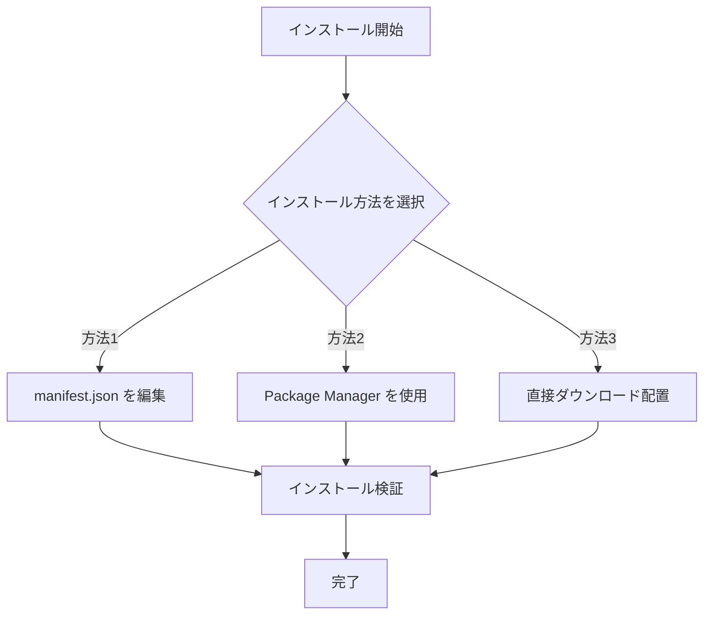
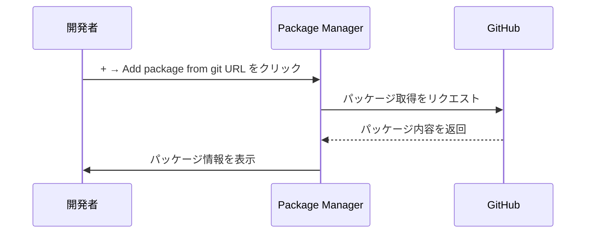

# インストール方法

このドキュメントでは、Game Frame X Event イベントシステムコンポーネントを Unity プロジェクトにインストールする方法を説明します。

## 概要

Game Frame X Event は、Game Frame X ゲームフレームワークのイベントシステムコンポーネントであり、ゲーム内イベントの購読、発行、管理機能を提供します。本コンポーネントはスレッドセーフな非同期イベント発行をサポートし、様々なゲーム開発シナリオに適合します。

**パッケージ情報：**
| 属性 | 値 |
|------|-----|
| パッケージ名 | com.gameframex.unity.event |
| バージョン | 1.1.0 |
| Unity バージョン | 2017.1+ |

## インストール前の準備

インストールを開始する前に、開発環境が以下の要件を満たしていることを確認してください：

- Unity 2017.1 以上
- Git ツールがインストール済み（Git URL からのインストールに使用）

## インストール方法

Game Frame X Event は3つのインストール方法を提供しており、プロジェクトの需求に応じていずれかを選択できます。



### 方法1：manifest.json からのインストール

この方法は、パッケージをプロジェクト依存としてバージョン管理する必要があるシナリオに適合します。

1. Unity プロジェクト内の `Packages` フォルダを開く
2. `manifest.json` ファイルを見つけて編集
3. `dependencies` ノード以下に以下の内容を追加：

```json
{
  "dependencies": {
    "com.gameframex.unity.event": "https://github.com/GameFrameX/com.gameframex.unity.event.git"
  }
}
```

4. ファイルを保存し、Unity が自動的にパッケージをダウンロードしてインポートするのを待つ

> **注意：** この方法は Git リポジトリから最新バージョンを自動的に取得します。バージョンを指定する必要がある場合は、Git のバージョントagland を使用できます。

### 方法2：Unity Package Manager からのインストール

これが最も一般的に使用されるインストール方法であり、大半のプロジェクトに適合します。

1. Unity エディターを開く
2. メニューから **Window → Package Manager** を選択
3. Package Manager ウィンドウで、左上の **+** ボタンをクリック
4. **Add package from git URL...** を選択
5. 入力フィールドに以下のアドレスを貼り付け：

```
https://github.com/GameFrameX/com.gameframex.unity.event.git
```

6. **Add** ボタンをクリックしてインストールを開始
7. ダウンロードとインポートが完了するまで待つ



### 方法3：直接ダウンロード配置

この方法は、オフライン環境またはカスタム変更が必要なシナリオに適合します。

1. GitHub リポジトリにアクセス：
   > https://github.com/GameFrameX/com.gameframex.unity.event.git

2. **Code** ボタンをクリックし、**Download ZIP** を選択してソースコードをダウンロード
3. ダウンロードした ZIP ファイル解凍
4. 解凍後のフォルダの名前を `com.gameframex.unity.event` に変更
5. フォルダを Unity プロジェクトの `Packages` ディレクトリにコピー
6. Unity が自動的にパッケージを識別してロード

> **ヒント：** 配置後、パッケージフォルダ内に `package.json` ファイルが含まれている必要があり、Unity のみんなさんが正しく識別できます。

## インストール検証

インストール完了後、以下の方法でインストールが成功したか確認できます：

### 方法1：Package Manager の確認

**Window → Package Manager** を開き、リスト内で **Game Frame X Event** を探し、ステータスがインストール済みであることを確認します。

### 方法2：スクリプト参照の確認

プロジェクト内にテストスクリプトを作成し、EventComponent の参照を試みます：

```csharp
using GameFrameX.Event.Runtime;

// EventComponent が正常使用可能であることを確認
public class TestScript : MonoBehaviour
{
    private EventComponent _eventComponent;

    void Start()
    {
        _eventComponent = GetComponent<EventComponent>();
        Debug.Log("Event コンポーネントが正常にインストールされました！");
    }
}
```

### 方法3：アセンブリの確認

プロジェクト内に以下のアセンブリがロードされていることを確認：
- `GameFrameX.Event.Runtime`
- `GameFrameX.Event.Editor`（エディターで使用する場合）

## 依存関係の説明

Game Frame X Event コンポーネントは以下の中核モジュールに依存します：

| 依存モジュール | 説明 |
|---------|------|
| GameFrameX.Runtime | ゲームフレームワークランタイムの中核 |

> **注意：** プロジェクトに GameFrameX.Runtime がインストールされていない場合、先にこの依存関係をインストールする必要があります。EventComponent は `GameFrameworkComponent` を継承しており、フレームワークコアサポートが必要です。

## よくある質問

### Q1: インストール後に GameFrameworkComponent が見つからないエラーが表示される

これは GameFrameX.Runtime コアモジュールが欠落しているためです。先にゲームフレームワークの中核ランタイムコンポーネントをインストールし、その後 Event モジュールをインストールしてください。

### Q2: 最新バージョンに更新する方法

- **方法1/2**：manifest.json の該当エントリを削除して再追加するか、Package Manager で更新ボタンをクリック
- **方法3**：最新バージョンを再ダウンロードして置換

### Q3: どの Unity バージョンをサポートしていますか

本コンポーネントは Unity 201.1 以上をサポートしています。最佳な互換性のため、最新の LTS バージョンの使用をお勧めします。

## 関連リンク

- [プラグイン紹介](./01.overview.md)
- [クイックスタート](./03.getting-started.md)
- [コア概念](./04.features.md)
- [GitHub リポジトリ](https://github.com/GameFrameX/com.gameframex.unity.event.git)
- [公式サイト](https://gameframex.doc.alianblank.com)
