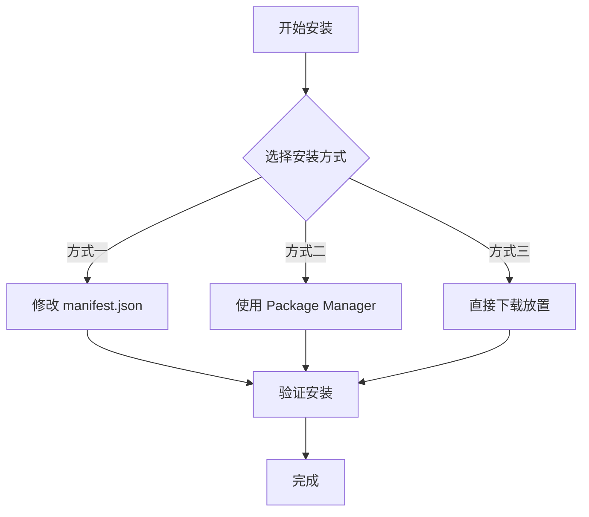
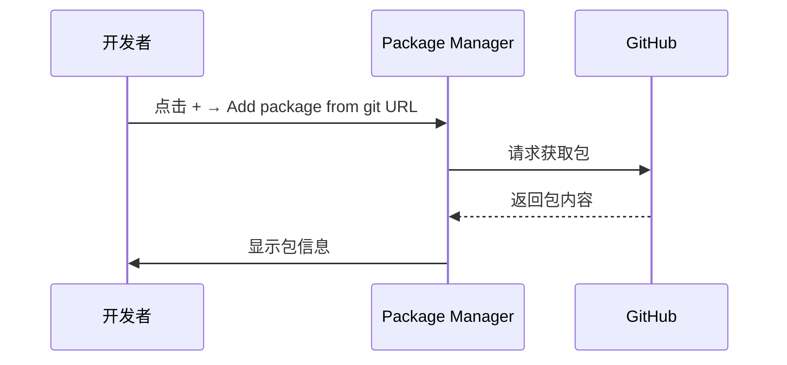

# インストールメソッド

このドキュメント介绍如何将 Game Frame X Event イベント系统コンポーネントインストール到您的 Unity プロジェクト中。

## 概要

Game Frame X Event 是 Game Frame X 游戏フレームワーク的イベント系统コンポーネント，提供游戏内イベント的購読、派发和管理機能。该コンポーネントサポート线程安全的异步イベント派发，適しています各种游戏开发シーン。

**パッケージ情報：**
| プロパティ | 值 |
|------|-----|
| パッケージ名 | com.gameframex.unity.event |
| バージョン | 1.1.0 |
| Unity バージョン | 2017.1+ |

## インストール前准备

在开始インストール之前，请確認してください您的开发環境满足以下要求：

- Unity 2017.1 或更高バージョン
- 已インストール Git 工具（用于通过 Git URL インストール）

## インストールメソッド

Game Frame X Event 提供三种インストール方法，您〜できます根据プロジェクト需求选择其中一种。



### 方法一：通过 manifest.json インストール

这种方法适合〜する必要があります将パッケージ作为プロジェクト依赖进行バージョン管理的シーン。

1. 打开 Unity プロジェクト中的 `Packages` ファイル夹
2. 找到并编辑 `manifest.json` ファイル
3. 在 `dependencies` 节点下追加以下内容：

```json
{
  "dependencies": {
    "com.gameframex.unity.event": "https://github.com/GameFrameX/com.gameframex.unity.event.git"
  }
}
```

4. 保存ファイル并等待 Unity 自动下载和导入パッケージ

> **注意：** 这种方法会自动从 Git リポジトリ取得最新バージョン。もし〜する必要があります指定バージョン，〜できます使用 Git 的バージョン标签。

### 方法二：通过 Unity Package Manager インストール

这是最常用的インストール方法，适合大多数プロジェクト。

1. 打开 Unity エディタ
2. 选择メニュー **Window → Package Manager**
3. 在 Package Manager ウィンドウ中，点击左上角的 **+** ボタン
4. 选择 **Add package from git URL...**
5. 在输入框中粘贴以下地址：

```
https://github.com/GameFrameX/com.gameframex.unity.event.git
```

6. 点击 **Add** ボタン开始インストール
7. 等待下载和导入完成



### 方法三：直接下载放置

这种方法适合离线環境或〜する必要があります自定義変更的シーン。

1. 访问 GitHub リポジトリ：
   > https://github.com/GameFrameX/com.gameframex.unity.event.git

2. 点击 **Code** ボタン，选择 **Download ZIP** 下载ソースコード
3. 解压下载的 ZIP ファイル
4. 将解压后的ファイル夹重命名为 `com.gameframex.unity.event`
5. 将ファイル夹复制到 Unity プロジェクト的 `Packages` ディレクトリ中
6. Unity 会自动识别并ロード该パッケージ

> **ヒント：** 放置后パッケージファイル夹中〜する必要がありますパッケージ含 `package.json` ファイル，Unity 才能正确识别。

## インストールの確認

インストール完成后，〜できます通过以下方法検証是否インストール成功：

### メソッド一：確認 Package Manager

打开 **Window → Package Manager**，在列表中查找 **Game Frame X Event**，確認其ステータス为已インストール。

### メソッド二：確認脚本参照

在プロジェクト中作成一个テスト脚本，尝试参照 EventComponent：

```csharp
using GameFrameX.Event.Runtime;

// 确保 EventComponent 可以正常使用
public class TestScript : MonoBehaviour
{
    private EventComponent _eventComponent;
    
    void Start()
    {
        _eventComponent = GetComponent<EventComponent>();
        Debug.Log("Event 组件已成功安装！");
    }
}
```

### メソッド三：確認アセンブリ

確認プロジェクト中已ロード以下アセンブリ：
- `GameFrameX.Event.Runtime`
- `GameFrameX.Event.Editor`（もし在エディタ中使用）

## 依赖项説明

Game Frame X Event コンポーネント依赖以下コアモジュール：

| 依赖モジュール | 説明 |
|---------|------|
| GameFrameX.Runtime | 游戏フレームワークランタイムコア |

> **注意：** もし您的プロジェクト中没有インストール GameFrameX.Runtime，〜する必要があります先インストール该依赖项。EventComponent 継承自 `GameFrameworkComponent`，〜する必要がありますフレームワークコアサポート。

## よくある問題

### Q1: インストール后出现找不到 GameFrameworkComponent 的エラー

这是因为缺少 GameFrameX.Runtime コアモジュール。请先インストール游戏フレームワーク的コアランタイムコンポーネント，次に再インストール Event モジュール。

### Q2: 如何アップデート到最新バージョン

- **方法一/二**：削除 manifest.json 中的对应条目后重新追加，或在 Package Manager 中点击アップデートボタン
- **方法三**：重新下载最新バージョン并置換

### Q3: サポート哪些 Unity バージョン

该コンポーネントサポート Unity 2017.1 及以上バージョン。お勧め使用较新的 LTS バージョン以获得最佳兼容性。

## 関連リンク

- [プラグイン介绍](./01.overview.md)
- [快速入门](./03.getting-started.md)
- [コアコンセプト](./04.features.md)
- [GitHub リポジトリ](https://github.com/GameFrameX/com.gameframex.unity.event.git)
- [官方网站](https://gameframex.doc.alianblank.com)
