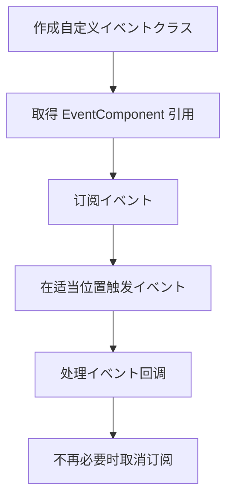

# 快速入门

本文档将帮助你快速上手 GameFrameX イベント系统。を通じて阅读本指南，你将了解如何在 Unity プロジェクト中配置和使用イベントコンポーネント来実装ゲーム中的イベント驱动编程。

## 概要

GameFrameX イベント系统は轻量级的イベント管理フレームワーク，采用观察者模式実装，允许ゲーム中的不同模块を通じてイベント进行松耦合通信。你可能使用字符串作为イベント标识符来订阅和处理イベント。

## 前置条件

在使用イベント系统之前，必ず：

1. Unity 2017.1 或更高版本
2. 已正确安装 GameFrameX コアフレームワーク
3. 已在プロジェクト中添加 Event コンポーネント包

> **ヒント:** 有关安装説明，お願いします参阅 [安装方法](./02.installation.md)。

## 基本使用フロー

イベント系统的典型使用フロー如下：



## 第一步：作成自定义イベントクラス

首先，必要定义一个を継承 `GameEventArgs` 的イベント参数クラス：

```csharp
using GameFrameX.Event.Runtime;

/// <summary>
/// ゲーム开始イベント参数
/// </summary>
public class GameStartEventArgs : GameEventArgs
{
    /// <summary>
    /// イベント ID 标识
    /// </summary>
    public override string Id => "game_start";

    /// <summary>
    /// 当前ゲーム关卡
    /// </summary>
    public int CurrentLevel { get; set; }

    /// <summary>
    /// 玩家名称
    /// </summary>
    public string PlayerName { get; set; }

    /// <summary>
    /// 清理イベント数据
    /// </summary>
    public override void Clear()
    {
        CurrentLevel = 0;
        PlayerName = null;
    }
}
```

> Source: [GameEventArgs.cs](https://github.com/GameFrameX/com.gameframex.unity.event/blob/main/Runtime/EventArgs/GameEventArgs.cs#L12-L18)

## 第二步：在シーン中添加 EventComponent

在 Unity 编辑器中，按照以下手順添加イベントコンポーネント：

1. 在シーン中作成一个空ゲーム对象（或选择已有ゲーム对象）
2. 点击 **Add Component** 按钮
3. 搜索 **Event** コンポーネント
4. 选择 **Game Framework → Event**

コンポーネント添加后，EventComponent 会自动初期化イベント管理器。

## 第三步：订阅イベント

在必要监听イベント的脚本中，订阅相应的イベント：

```csharp
using UnityEngine;
using GameFrameX.Event.Runtime;

/// <summary>
/// ゲーム管理器 - 负责ゲーム生命周期管理
/// </summary>
public class GameManager : MonoBehaviour
{
    private EventComponent _eventComponent;

    private void Awake()
    {
        // 取得イベントコンポーネント引用
        _eventComponent = UnityEngine.GameObject.FindObjectOfType<EventComponent>();
    }

    private void OnEnable()
    {
        // 订阅ゲーム开始イベント
        // CheckSubscribe 会在不存在时自动订阅，避免重复订阅
        _eventComponent.CheckSubscribe("game_start", OnGameStart);
    }

    private void OnDisable()
    {
        // 取消订阅ゲーム开始イベント
        _eventComponent.Unsubscribe("game_start", OnGameStart);
    }

    /// <summary>
    /// ゲーム开始イベント处理函数
    /// </summary>
    private void OnGameStart(object sender, GameEventArgs e)
    {
        if (e is GameStartEventArgs args)
        {
            Debug.Log($"ゲーム开始！关卡：{args.CurrentLevel}, 玩家：{args.PlayerName}");
        }
    }
}
```

> Source: [EventComponent.cs](https://github.com/GameFrameX/com.gameframex.unity.event/blob/main/Runtime/EventComponent.cs#L82-L88)

## 第四步：触发イベント

当ゲームステータス发生变化时，触发相应的イベント：

```csharp
// 在ゲーム的启动フロー中触发イベント
public class GameStarter : MonoBehaviour
{
    public EventComponent eventComponent;

    private void Start()
    {
        // 作成イベント参数
        var eventArgs = new GameStartEventArgs
        {
            CurrentLevel = 1,
            PlayerName = "Player1"
        };

        // 触发イベント - Fire 是线程安全的，会在下一帧分发
        eventComponent.Fire(this, eventArgs);

        // 或者使用 FireNow 立即分发（非线程安全）
        // eventComponent.FireNow(this, eventArgs);
    }
}
```

> Source: [EventComponent.cs](https://github.com/GameFrameX/com.gameframex.unity.event/blob/main/Runtime/EventComponent.cs#L130-L144)

## イベント分发模式

イベントコンポーネント提供两种イベント分发方法：

| 模式 | メソッド | 线程安全 | 适用シーン |
|------|------|----------|----------|
| 延迟分发 | `Fire()` | ✅ 安全 | 大多数情况，推荐使用 |
| 立即分发 | `FireNow()` | ❌ 不安全 | 紧急イベント或确定性要求高的情况 |

```csharp
// 延迟分发 - イベント会在下一帧处理
eventComponent.Fire(sender, new GameEventArgs());

// 立即分发 - イベント会立即处理
eventComponent.FireNow(sender, new GameEventArgs());
```

## 简化イベント用法

如果不必要传递复杂的イベント数据，可能使用简化的字符串イベント：

```csharp
// 触发简单イベント
eventComponent.Fire(this, "player_dead");

// 在イベント处理函数中接收
private void OnPlayerDead(object sender, GameEventArgs e)
{
    // e.Id 将包含 "player_dead"
    Debug.Log("玩家死亡！");
}
```

> Source: [EmptyEventArgs.cs](https://github.com/GameFrameX/com.gameframex.unity.event/blob/main/Runtime/EventArgs/EmptyEventArgs.cs#L32-L37)

## 完整示例：玩家死亡イベント

以下は完整的示例，展示如何実装玩家死亡イベント系统：

```csharp
using UnityEngine;
using GameFrameX.Event.Runtime;

/// <summary>
/// 玩家死亡イベント参数
/// </summary>
public class PlayerDeadEventArgs : GameEventArgs
{
    public override string Id => "player_dead";
    public int PlayerId { get; set; }
    public string Reason { get; set; }
    public override void Clear()
    {
        PlayerId = 0;
        Reason = null;
    }
}

/// <summary>
/// 玩家控制器
/// </summary>
public class PlayerController : MonoBehaviour
{
    private EventComponent _eventComponent;
    private int _health = 100;

    private void Awake()
    {
        _eventComponent = FindObjectOfType<EventComponent>();
    }

    private void OnEnable()
    {
        _eventComponent.CheckSubscribe("player_dead", OnPlayerDead);
    }

    private void OnDisable()
    {
        _eventComponent.Unsubscribe("player_dead", OnPlayerDead);
    }

    /// <summary>
    /// 玩家受到伤害
    /// </summary>
    public void TakeDamage(int damage)
    {
        _health -= damage;
        
        if (_health <= 0)
        {
            // 触发玩家死亡イベント
            var args = new PlayerDeadEventArgs
            {
                PlayerId = GetInstanceID(),
                Reason = "生命值耗尽"
            };
            _eventComponent.Fire(this, args);
        }
    }

    private void OnPlayerDead(object sender, GameEventArgs e)
    {
        if (e is PlayerDeadEventArgs args)
        {
            Debug.Log($"玩家 {args.PlayerId} 已死亡，原因：{args.Reason}");
            // 这里可能添加ゲーム结束逻辑
        }
    }
}
```

## 默认イベント处理函数

可能为イベントコンポーネント設定默认处理器，に使用捕获未明确订阅的イベント：

```csharp
private void Start()
{
    var eventComponent = GetComponent<EventComponent>();
    eventComponent.SetDefaultHandler(OnUnhandledEvent);
}

private void OnUnhandledEvent(object sender, GameEventArgs e)
{
    Debug.Log($"未处理的イベント：{e.Id}");
}
```

> Source: [EventComponent.cs](https://github.com/GameFrameX/com.gameframex.unity.event/blob/main/Runtime/EventComponent.cs#L120-L123)

## イベント统计

可能随时取得当前イベント系统的ステータス：

```csharp
// 取得イベント处理函数总数
int handlerCount = eventComponent.EventHandlerCount;

// 取得イベントクラス型总数
int eventCount = eventComponent.EventCount;

// 取得特定イベント的处理函数数量
int specificCount = eventComponent.Count("game_start");
```

> Source: [EventComponent.cs](https://github.com/GameFrameX/com.gameframex.unity.event/blob/main/Runtime/EventComponent.cs#L27-L38)

## 最佳实践

1. **及时取消订阅**: 在 `OnDisable` 或 `OnDestroy` 中取消订阅イベント，避免内存泄漏
2. **使用 CheckSubscribe**: 使用 `CheckSubscribe` メソッド避免重复订阅
3. **使用 Fire 而非 FireNow**: 除非有特殊需求，否则使用 `Fire` メソッド确保线程安全
4. **清理イベント数据**: 在自定义イベントクラス中正确実装 `Clear()` メソッド，便于オブジェクトプール复用

## 関連リンク

- [插件介绍](./01.overview.md) - 了解更多关于イベント系统的概述
- [安装方法](./02.installation.md) - 查看详细的安装説明
- [イベント系统架构](./04.features.md) - 深入了解内部架构
- [EventComponent API 参考](./05.event-component.md) - 完整的 API 文档
- [EventManager API 参考](./06.event-manager.md) - イベント管理器 API
- [GameEventArgs API 参考](./07.game-event-args.md) - イベント参数基クラス
- [常见问题解答](./08.troubleshooting.md) - 常见问题与解決策
