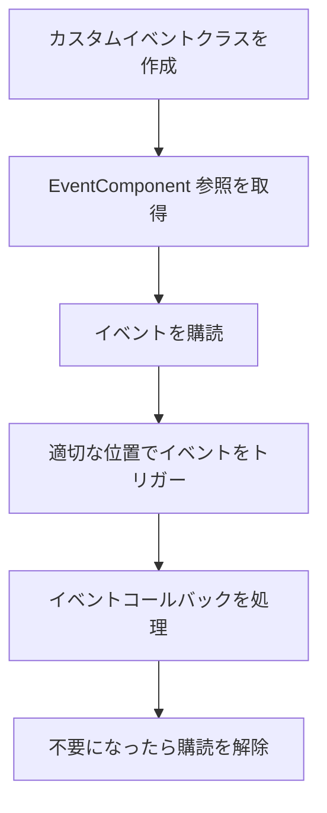

# クイックスタート

このドキュメントでは、GameFrameX イベントシステムを快速に使い始める方法を説明します。このガイドを通じて、Unity プロジェクトでイベントコンポーネントを設定して使用する方法を理解し、ゲーム内のイベント驱动プログラミングを実現する方法を学びます。

## 概要

GameFrameX イベントシステムは、軽量なイベント管理フレームワークであり、オブザーバーパターンを実装して、ゲーム内の異なるモジュール間の疎結合通信を實現します。文字列をイベント識別子として使用してイベントの購読と処理を行えます。

## 前提条件

イベントシステムを使用する前に、以下を確認してください：

1. Unity 2017.1 以上
2. GameFrameX 中核フレームワークが正しくインストール済み
3. プロジェクトに Event コンポーネントパッケージが追加済み

> **ヒント:** インストール说明については、[インストール方法](./02.installation.md) を参照してください。

## 基本使用フロー

イベントシステムの典型的な使用フローは以下の通りです：



## ステップ1：カスタムイベントクラスの作成

まず、`GameEventArgs` を継承するイベントパラメータクラスを定義する必要があります：

```csharp
using GameFrameX.Event.Runtime;

/// <summary>
/// ゲーム開始イベントパラメータ
/// </summary>
public class GameStartEventArgs : GameEventArgs
{
    /// <summary>
    /// イベント ID 識別子
    /// </summary>
    public override string Id => "game_start";

    /// <summary>
    /// 現在のゲームレベル
    /// </summary>
    public int CurrentLevel { get; set; }

    /// <summary>
    /// プレイヤー名
    /// </summary>
    public string PlayerName { get; set; }

    /// <summary>
    /// イベントデータをクリア
    /// </summary>
    public override void Clear()
    {
        CurrentLevel = 0;
        PlayerName = null;
    }
}
```

> Source: [GameEventArgs.cs](https://github.com/GameFrameX/com.gameframex.unity.event/blob/main/Runtime/EventArgs/GameEventArgs.cs#L12-L18)

## ステップ2：シーンに EventComponent を追加

Unity エディターで、以下の手順でイベントコンポーネントを追加します：

1. シーン内に空のゲームオブジェクトを作成（または既存のゲームオブジェクトを選択）
2. **Add Component** ボタンをクリック
3. **Event** コンポーネントを検索
4. **Game Framework → Event** を選択

コンポーネント追加後、EventComponent は自動的にイベントマネージャーを初期化します。

## ステップ3：イベントの購読

イベントを监听する必要があるスクリプトで、相应のイベントを購読します：

```csharp
using UnityEngine;
using GameFrameX.Event.Runtime;

/// <summary>
/// ゲームマネージャー - ゲームライフサイクル管理を担当
/// </summary>
public class GameManager : MonoBehaviour
{
    private EventComponent _eventComponent;

    private void Awake()
    {
        // イベントコンポーネント参照を取得
        _eventComponent = UnityEngine.GameObject.FindObjectOfType<EventComponent>();
    }

    private void OnEnable()
    {
        // ゲーム開始イベントを購読
        // CheckSubscribe は存在しない場合は自動的に購読し、重複購読を回避
        _eventComponent.CheckSubscribe("game_start", OnGameStart);
    }

    private void OnDisable()
    {
        // ゲーム開始イベントの購読を解除
        _eventComponent.Unsubscribe("game_start", OnGameStart);
    }

    /// <summary>
    /// ゲーム開始イベント処理関数
    /// </summary>
    private void OnGameStart(object sender, GameEventArgs e)
    {
        if (e is GameStartEventArgs args)
        {
            Debug.Log($"ゲーム開始！レベル：{args.CurrentLevel}, プレイヤー：{args.PlayerName}");
        }
    }
}
```

> Source: [EventComponent.cs](https://github.com/GameFrameX/com.gameframex.unity.event/blob/main/Runtime/EventComponent.cs#L82-L88)

## ステップ4：イベントのトリガー

ゲームステータスが変化した時、相应的なイベントをトリガーします：

```csharp
// ゲームの起動フローでイベントをトリガー
public class GameStarter : MonoBehaviour
{
    public EventComponent eventComponent;

    private void Start()
    {
        // イベントパラメータを作成
        var eventArgs = new GameStartEventArgs
        {
            CurrentLevel = 1,
            PlayerName = "Player1"
        };

        // イベントをトリガー - Fire はスレッドセーフであり、次のフレームで配信
        eventComponent.Fire(this, eventArgs);

        // または FireNow を使用して即時配信（非スレッドセーフ）
        // eventComponent.FireNow(this, eventArgs);
    }
}
```

> Source: [EventComponent.cs](https://github.com/GameFrameX/com.gameframex.unity.event/blob/main/Runtime/EventComponent.cs#L130-L144)

## イベント配信モード

イベントコンポーネントは2つのイベント配信方法を提供します：

| モード | メソッド | スレッドセーフ | 適用のシナリオ |
|------|------|----------|----------|
| 遅延配信 | `Fire()` | ✅ 安全 | 大半の場合推奨使用 |
| 即時配信 | `FireNow()` | ❌ 不安全 | 緊急イベントまたは高い確定的要件の場合 |

```csharp
// 遅延配信 - イベントは次のフレームで処理
eventComponent.Fire(sender, new GameEventArgs());

// 即時配信 - イベントは即座に処理
eventComponent.FireNow(sender, new GameEventArgs());
```

## シンプルイベントの使用

複雑なイベントデータを传递する必要がない場合、シンプルな文字列イベントを使用できます：

```csharp
// シンプルイベントをトリガー
eventComponent.Fire(this, "player_dead");

// イベント処理関数で受信
private void OnPlayerDead(object sender, GameEventArgs e)
{
    // e.Id には "player_dead" が含まれる
    Debug.Log("プレイヤー死亡！");
}
```

> Source: [EmptyEventArgs.cs](https://github.com/GameFrameX/com.gameframex.unity.event/blob/main/Runtime/EventArgs/EmptyEventArgs.cs#L32-L37)

## 完全示例：プレイヤー死亡イベント

以下是完全な示例であり、プレイヤー死亡イベントシステムを実装する方法を示します：

```csharp
using UnityEngine;
using GameFrameX.Event.Runtime;

/// <summary>
/// プレイヤー死亡イベントパラメータ
/// </summary>
public class PlayerDeadEventArgs : GameEventArgs
{
    public override string Id => "player_dead";
    public int PlayerId { get; set; }
    public string Reason { get; set; }
    public override void Clear()
    {
        PlayerId = 0;
        Reason = null;
    }
}

/// <summary>
/// プレイヤーコントローラー
/// </summary>
public class PlayerController : MonoBehaviour
{
    private EventComponent _eventComponent;
    private int _health = 100;

    private void Awake()
    {
        _eventComponent = FindObjectOfType<EventComponent>();
    }

    private void OnEnable()
    {
        _eventComponent.CheckSubscribe("player_dead", OnPlayerDead);
    }

    private void OnDisable()
    {
        _eventComponent.Unsubscribe("player_dead", OnPlayerDead);
    }

    /// <summary>
    /// プレイヤーがダメージを受けた
    /// </summary>
    public void TakeDamage(int damage)
    {
        _health -= damage;

        if (_health <= 0)
        {
            // プレイヤー死亡イベントをトリガー
            var args = new PlayerDeadEventArgs
            {
                PlayerId = GetInstanceID(),
                Reason = "ライフポイント枯竭"
            };
            _eventComponent.Fire(this, args);
        }
    }

    private void OnPlayerDead(object sender, GameEventArgs e)
    {
        if (e is PlayerDeadEventArgs args)
        {
            Debug.Log($"プレイヤー {args.PlayerId} が死亡、原因：{args.Reason}");
            // ここにゲームオーバーロジックを追加可能
        }
    }
}
```

## デフォルトイベント処理関数

イベントコンポーネントにデフォルトハンドラーを設定し、明示的に購読されていないイベントをキャプチャできます：

```csharp
private void Start()
{
    var eventComponent = GetComponent<EventComponent>();
    eventComponent.SetDefaultHandler(OnUnhandledEvent);
}

private void OnUnhandledEvent(object sender, GameEventArgs e)
{
    Debug.Log($"未処理のイベント：{e.Id}");
}
```

> Source: [EventComponent.cs](https://github.com/GameFrameX/com.gameframex.unity.event/blob/main/Runtime/EventComponent.cs#L120-L123)

## イベント統計

イベントシステムの現在のステータスをいつでも取得できます：

```csharp
// イベント処理関数の総数を取得
int handlerCount = eventComponent.EventHandlerCount;

// イベントタイプの総数を取得
int eventCount = eventComponent.EventCount;

// 特定イベントの処理関数数を取得
int specificCount = eventComponent.Count("game_start");
```

> Source: [EventComponent.cs](https://github.com/GameFrameX/com.gameframex.unity.event/blob/main/Runtime/EventComponent.cs#L27-L38)

## ベストプラクティス

1. **購読解除の適時実行**: `OnDisable` または `OnDestroy` でイベントの購読を解除し、メモリーリークを回避
2. **CheckSubscribe の使用**: `CheckSubscribe` メソッドを使用して重複購読を回避
3. **Fire の使用（非 FireNow）**: 特別な需求がない限り、`Fire` メソッドを使用してスレッドセーフを確保
4. **イベントデータのクリア**: カスタムイベントクラスで `Clear()` メソッドを正しく実装し、オブジェクトプールの再利用を容易に

## 関連リンク

- [プラグイン紹介](./01.overview.md) - イベントシステムの詳細について
- [インストール方法](./02.installation.md) - 詳細なインストール说明
- [イベントシステムアーキテクチャ](./04.features.md) - 内部アーキテクチャの詳細
- [EventComponent API リファレンス](./05.event-component.md) - 完全な API ドキュメント
- [EventManager API リファレンス](./06.event-manager.md) - イベントマネージャー API
- [GameEventArgs API リファレンス](./07.game-event-args.md) - イベントパラメータ基底クラス
- [よくある質問](./08.troubleshooting.md) - よくある質問と解決策
