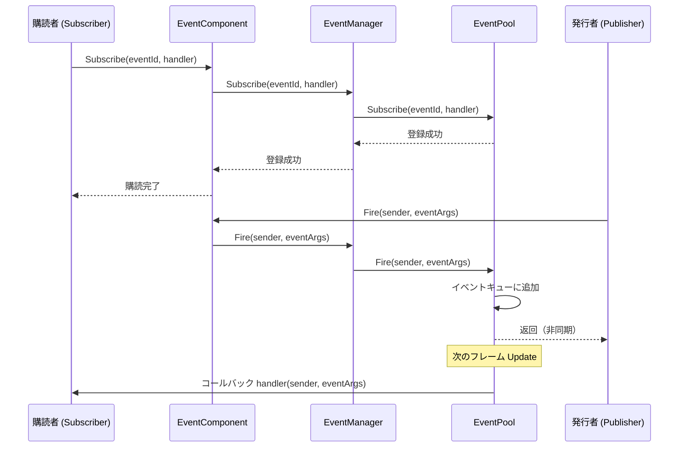
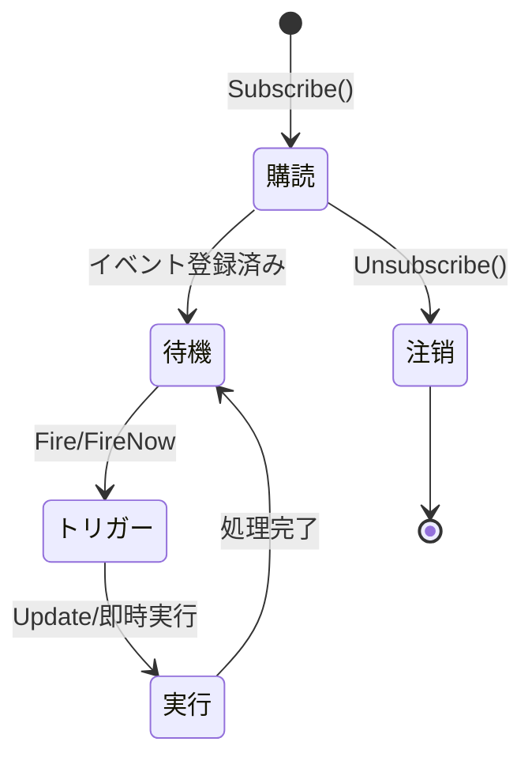
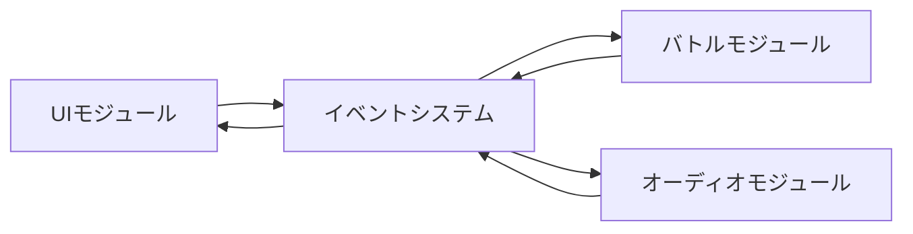
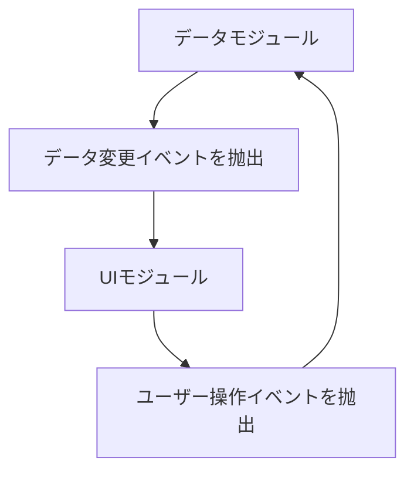

# イベントシステムアーキテクチャ

GameFrameX イベントシステムは、 publish-subscribe（Pub-Sub）パターンに基づくイベント驱动フレームワークであり、スレッドセーフな非同期イベント発行机制を提供します。本システムは GameFrameX アーキテクチャの中核コンポーネントの一つであり、ゲーム開発における疎結合とイベント通信をサポートします。

## 概要

イベントシステムは、ゲーム開発におけるコンポーネント間通信の問題を解決することを目的としています。ゲーム開発では、異なるモジュール（UI、バトル、システム等）間での相互通信が必要ですが、直接呼び出し会造成紧耦合になります。イベントシステムはイベントチャネルを導入し、モジュール間で疎結合通信を実現します：

- **発行者（Publisher）**：イベントを抛出を担当し、誰が受信するかは関心しない
- **購読者（Subscriber）**：イベントの监听と処理を担当し、誰が送信するかは関心しない
- **イベントチャネル**：イベントを発行者から購読者への传递を担当

### コア機能

| 機能 | 説明 |
|------|------|
| スレッドセーフ | `Fire` メソッドはクロースレッド呼び出しをサポートし、自動的にメインスレッドでコールバック |
| 遅延配信 | 非同期 이벤트는 다음 프레임에 배포되어ロジック同期問題を回避 |
| 即時配信 | `FireNow` メソッドは即時コールバックを実行（スレッドセーフティに注意が必要） |
| マルチキャストサポート | 同一イベントへの複数の処理関数バインディングを許可 |
| デフォルト処理 | 未購読イベントのキャプチャ用デフォルトハンドラー設定をサポート |
| オブジェクトプール | EventPool を使用してメモリ割り当てを削減 |

## アーキテクチャ設計

### コンポーネント階層構造

```mermaid
flowchart TB
    subgraph Unity["Unity エンジン層"]
        Mono[MonoBehaviour スクリプト]
    end

    subgraph Component["Component カプセル化層"]
        EC[EventComponent]
    end

    subgraph Interface["インターフェース抽象層"]
        IEM[IEventManager]
    end

    subgraph Implementation["実装層"]
        EM[EventManager]
        EP[EventPool]
    end

    subgraph Runtime["ランタイム依存"]
        Pool[EventPool コア]
    end

    Mono --> EC
    EC --> IEM
    IEM <|.. EM
    EM --> EP
    EP --> Pool
```

### コアコンポーネントの説明

#### 1. EventComponent

Unity コンポーネントであり、`GameFrameworkComponent` を継承し、Unity 向けのイベントインターフェースを提供します。

```csharp
public sealed class EventComponent : GameFrameworkComponent
{
    private IEventManager m_EventManager = null;

    protected override void Awake()
    {
        ImplementationComponentType = Utility.Assembly.GetType(componentType);
        InterfaceComponentType = typeof(IEventManager);
        base.Awake();
        m_EventManager = GameFrameworkEntry.GetModule<IEventManager>();
    }

    public void Fire(object sender, GameEventArgs e);
    public void FireNow(object sender, GameEventArgs e);
    public void Subscribe(string id, EventHandler<GameEventArgs> handler);
    public void Unsubscribe(string id, EventHandler<GameEventArgs> handler);
}
```
> Source: [EventComponent.cs](https://github.com/GameFrameX/com.gameframex.unity.event/blob/main/Runtime/EventComponent.cs#L1-L155)

#### 2. IEventManager

イベントマネージャーインターフェースであり、イベントシステムのコア操作コントラクトを定義します：

```csharp
public interface IEventManager
{
    int EventHandlerCount { get; }
    int EventCount { get; }

    void Subscribe(string id, EventHandler<GameEventArgs> handler);
    void Unsubscribe(string id, EventHandler<GameEventArgs> handler);
    void Fire(object sender, GameEventArgs e);
    void FireNow(object sender, GameEventArgs e);
    void SetDefaultHandler(EventHandler<GameEventArgs> handler);
}
```
> Source: [IEventManager.cs](https://github.com/GameFrameX/com.gameframex.unity.event/blob/main/Runtime/Event/IEventManager.cs#L1-L77)

#### 3. EventManager

`IEventManager` の実装クラスであり、内部で `EventPool` を使用してイベントを管理します：

```csharp
public sealed class EventManager : GameFrameworkModule, IEventManager
{
    private readonly EventPool<GameEventArgs> m_EventPool;

    public EventManager()
    {
        m_EventPool = new EventPool<GameEventArgs>(
            EventPoolMode.AllowNoHandler | EventPoolMode.AllowMultiHandler);
    }

    public void Fire(object sender, GameEventArgs e)
    {
        m_EventPool.Fire(sender, e);
    }

    public void FireNow(object sender, GameEventArgs e)
    {
        m_EventPool.FireNow(sender, e);
    }
}
```
> Source: [EventManager.cs](https://github.com/GameFrameX/com.gameframex.unity.event/blob/main/Runtime/Event/EventManager.cs#L1-L142)

#### 4. EventPool（GameFrameX.Runtime に依存）

イベントプールは底层実装であり、负责：
- イベント購読関係の存储
- イベントオブジェクトの管理（オブジェクトプールを使用して GC を削減）
- イベントの処理関数への配信

### クラス継承関係

```mermaid
classDiagram
    class BaseEventArgs {
        <<abstract>>
        +Id: string { get; }
        +Clear() void
    }

    class GameEventArgs {
        <<abstract>>
    }

    class EmptyEventArgs {
        -_eventId: string
        +Create(eventId): EmptyEventArgs
    }

    BaseEventArgs <|-- GameEventArgs
    GameEventArgs <|-- EmptyEventArgs
```

### イベントパラメータ体系

**GameEventArgs** は全ゲームイベントの基底クラスです：

```csharp
public abstract class GameEventArgs : BaseEventArgs
{
}
```
> Source: [GameEventArgs.cs](https://github.com/GameFrameX/com.gameframex.unity.event/blob/main/Runtime/EventArgs/GameEventArgs.cs#L1-L19)

**EmptyEventArgs** は、データの携带が不要なシンプルイベントに使用されます：

```csharp
public sealed class EmptyEventArgs : GameEventArgs
{
    public static EmptyEventArgs Create(string eventId)
    {
        var eventArgs = ReferencePool.Acquire<EmptyEventArgs>();
        eventArgs.SetEventId(eventId);
        return eventArgs;
    }
}
```
> Source: [EmptyEventArgs.cs](https://github.com/GameFrameX/com.gameframex.unity.event/blob/main/Runtime/EventArgs/EmptyEventArgs.cs#L1-L47)

## イベントフロー

### 購読と配信フロー



### 2つの配信モードの比較

| モード | メソッド | スレッドセーフ | 実行タイミング | 適用のシナリオ |
|------|------|----------|----------|----------|
| 遅延配信 | `Fire()` | ✅ 安全 | 次のフレーム | 非同期ロジック、クロースレッド呼び出し |
| 即時配信 | `FireNow()` | ⚠️ 注意 | 即時 | 同期ロジック、メインスレッドの確定的 |

**設計意図：**

- **Fire メソッド**：遅延配信を採用して，即使在后台スレッドでイベントを抛出しても、コールバックはメインスレッドで実行されることを確保します。これは Unity 開発にとって非常重要であり、因為 Unity の API はメインスレッドからのみ呼び出し可能です。同時に、現在のフレームに延迟することで、予期しない計算のトリガーを回避できます。

- **FireNow メソッド**：即時コールバックを実行し、パフォーマンスは高いですが、呼び出し元がメインスレッドで実行されること、およびコールバック実行に問題がないことを確保する必要があります。

### イベントライフサイクル



## 使用例

### 基本購読と配信

```csharp
public class Player : MonoBehaviour
{
    private EventComponent _eventComponent;

    private void Start()
    {
        // イベントコンポーネントを取得
        _eventComponent = UnityEngine.Component.FindObjectOfType<EventComponent>();

        // イベントを購読
        _eventComponent.CheckSubscribe("OnPlayerDead", OnPlayerDead);
    }

    private void OnPlayerDead(object sender, GameEventArgs e)
    {
        UnityEngine.Debug.Log("プレイヤー死亡！");
    }

    private void OnCollisionEnter(UnityEngine.Collision collision)
    {
        // イベントを抛出
        _eventComponent.Fire(this, EmptyEventArgs.Create("OnPlayerDead"));
    }
}
```
> Source: [EventComponent.cs](https://github.com/GameFrameX/com.gameframex.unity.event/blob/main/Runtime/EventComponent.cs#L80-L114)

### カスタムイベントパラメータ

```csharp
// カスタムイベントパラメータを定義
public class DamageEventArgs : GameEventArgs
{
    public int Damage { get; set; }
    public UnityEngine.Vector3 Position { get; set; }
}

// データ付きイベントを配信
var args = ReferencePool.Acquire<DamageEventArgs>();
args.Damage = 100;
args.Position = transform.position;
eventComponent.Fire(this, args);
```

### デフォルトハンドラー

```csharp
// デフォルトハンドラーを設定して未購読のイベントをキャプチャ
eventComponent.SetDefaultHandler((sender, e) =>
{
    UnityEngine.Debug.Log($"未処理のイベント: {e.Id}");
});
```
> Source: [EventManager.cs](https://github.com/GameFrameX/com.gameframex.unity.event/blob/main/Runtime/Event/EventManager.cs#L113-L120)

## 設定と確認

### イベント統計

```csharp
// イベント処理関数数を取得
int handlerCount = eventComponent.EventHandlerCount;

// イベントタイプ数を取得
int eventCount = eventComponent.EventCount;
```
> Source: [EventComponentInspector.cs](https://github.com/GameFrameX/com.gameframex.unity.event/blob/main/Editor/Inspector/EventComponentInspector.cs#L27-L33)

### 購読ステータスの確認

```csharp
// 特定イベント処理関数が存在するかをチェック
bool exists = eventComponent.Check("OnPlayerDead", OnPlayerDeadHandler);
```
> Source: [EventComponent.cs](https://github.com/GameFrameX/com.gameframex.unity.event/blob/main/Runtime/EventComponent.cs#L72-L75)

## 一般的な使用パターン

### パターン1：モジュール間分離



UI モジュールはバトルモジュールの存在を知らない，只订阅「バトル開始」イベント；バトルモジュールはイベントを抛出するだけで、誰が受信するかは関心しない。

### パターン2：データ驱动 UI



データが変化した時イベントを抛出すれば、UI は自動的に応答して更新；ユーザー操作はイベントを通じてデータモジュールに通知して処理。

### パターン3：システム間通信

ゲーム内の各システム（アチーブメントシステム、クエストシステム、ログシステム）は同一のイベントを購読して、異なる応答を実現できます：

```csharp
// アチーブメントシステム
achievementComponent.Subscribe("LevelComplete", OnLevelComplete);

// クエストシステム
questComponent.Subscribe("LevelComplete", OnLevelComplete);

// ログシステム
logComponent.Subscribe("LevelComplete", OnLevelComplete);

// レベル完了時、全システムが通知を受信
levelComponent.Fire(this, new LevelCompleteEventArgs { Level = 5 });
```

## 設計の優位性

1. **疎結合**：発行者と購読者間の直接依存がない
2. **拡張可能**：新規購読者追加時に発行者コードを変更する必要がない
3. **スレッドセーフ**：クロースレッドイベント配信をサポート
4. **パフォーマンス最適化**：オブジェクトプールを使用して GC を削減
5. **灵活制御**：遅延配信と即時配信の2つのモードをサポート

## 注意事項

1. **メモリーリークの回避**：コンポーネント破棄時は必ず購読を解除
2. **Fire vs FireNow**：メインスレッドで明確に実行する場合を除いて、`Fire` を使用
3. **イベントID管理**：定数または列挙型を使用してイベントIDを管理することを推奨、文字列のハードコーディングを回避
4. **コールバックパフォーマンス**：コールバック内での時間のかかる操作の実行を回避

## 関連リンク

- [EventComponent API リファレンス](./05.event-component.md)
- [EventManager API リファレンス](./06.event-manager.md)
- [GameEventArgs API リファレンス](./07.game-event-args.md)
- [クイックスタート](./03.getting-started.md)
- [よくある質問](./08.troubleshooting.md)
