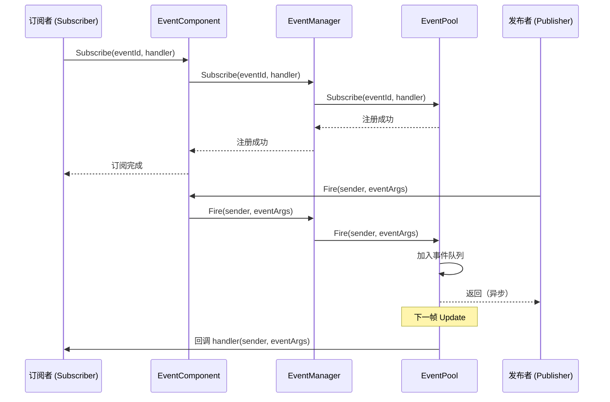
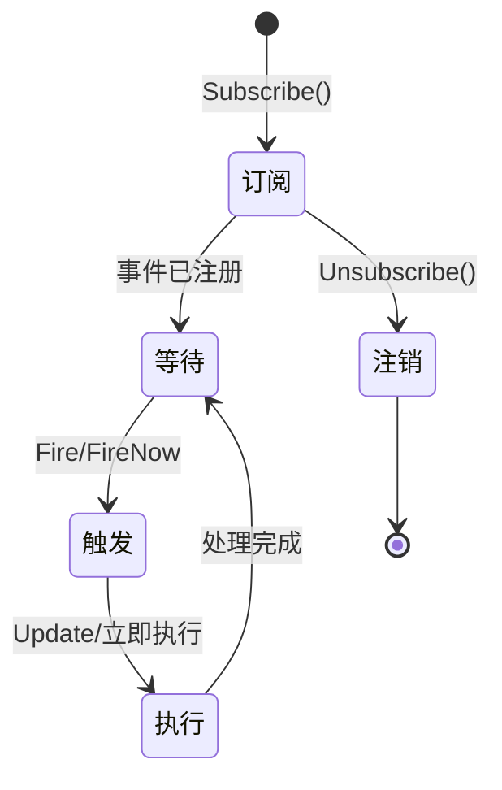
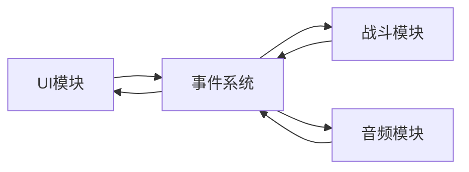
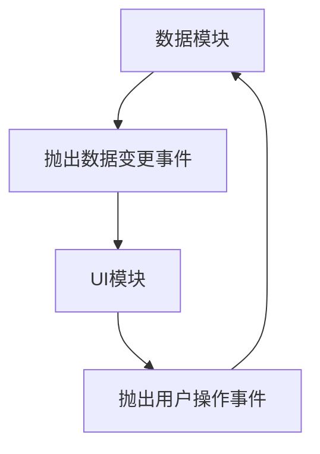

# イベント系统アーキテクチャ

GameFrameX イベント系统は基于リリース-購読（Pub-Sub）モード的イベント驱动フレームワーク，提供线程安全的异步イベント派发机制。该系统是 GameFrameX アーキテクチャ的コアコンポーネント之一，サポート游戏开发中的解耦和イベント通信。

## 概要

イベント系统旨在解决游戏开发中的コンポーネント通信問題。在游戏开发中，不同モジュール（如 UI、战斗、系统）之间〜する必要があります相互通信，但直接呼び出し会造成紧耦合。イベント系统通过引入イベント通道，使モジュール之间〜できます松耦合通信：

- **リリース者（Publisher）**：负责抛出イベント，不关心谁受信
- **購読者（Subscriber）**：负责监听イベント并処理，不关心谁发出
- **イベント通道**：负责将イベント从リリース者传递给購読者

### コア特性

| 特性 | 説明 |
|------|------|
| 线程安全 | `Fire` メソッドサポート跨线程呼び出し，自动在主线程コールバック |
| 延迟派发 | 异步イベント在下一帧分发，避免逻辑同步問題 |
| 立つまり派发 | `FireNow` メソッド立つまり执行コールバック（需注意线程安全） |
| 多播サポート | 同一イベント可绑定多个処理函数 |
| デフォルト処理 | サポート設定デフォルト処理器捕获未購読イベント |
| 对象池 | 使用 EventPool 减少内存分配 |

## アーキテクチャ設計

### コンポーネント層次结构

```mermaid
flowchart TB
    subgraph Unity["Unity 引擎层"]
        Mono[MonoBehaviour 脚本]
    end

    subgraph Component["Component 封装层"]
        EC[EventComponent]
    end

    subgraph Interface["接口抽象层"]
        IEM[IEventManager]
    end

    subgraph Implementation["实现层"]
        EM[EventManager]
        EP[EventPool]
    end

    subgraph Runtime["运行时依赖"]
        Pool[EventPool 核心]
    end

    Mono --> EC
    EC --> IEM
    IEM <|.. EM
    EM --> EP
    EP --> Pool
```

### コアコンポーネント説明

#### 1. EventComponent

Unity コンポーネント，継承自 `GameFrameworkComponent`，提供面向 Unity 的イベントインターフェース。

```csharp
public sealed class EventComponent : GameFrameworkComponent
{
    private IEventManager m_EventManager = null;

    protected override void Awake()
    {
        ImplementationComponentType = Utility.Assembly.GetType(componentType);
        InterfaceComponentType = typeof(IEventManager);
        base.Awake();
        m_EventManager = GameFrameworkEntry.GetModule<IEventManager>();
    }

    public void Fire(object sender, GameEventArgs e);
    public void FireNow(object sender, GameEventArgs e);
    public void Subscribe(string id, EventHandler<GameEventArgs> handler);
    public void Unsubscribe(string id, EventHandler<GameEventArgs> handler);
}
```
> Source: [EventComponent.cs](https://github.com/GameFrameX/com.gameframex.unity.event/blob/main/Runtime/EventComponent.cs#L1-L155)

#### 2. IEventManager

イベントマネージャーインターフェース，定義了イベント系统的コア操作契约：

```csharp
public interface IEventManager
{
    int EventHandlerCount { get; }
    int EventCount { get; }

    void Subscribe(string id, EventHandler<GameEventArgs> handler);
    void Unsubscribe(string id, EventHandler<GameEventArgs> handler);
    void Fire(object sender, GameEventArgs e);
    void FireNow(object sender, GameEventArgs e);
    void SetDefaultHandler(EventHandler<GameEventArgs> handler);
}
```
> Source: [IEventManager.cs](https://github.com/GameFrameX/com.gameframex.unity.event/blob/main/Runtime/Event/IEventManager.cs#L1-L77)

#### 3. EventManager

`IEventManager` 的実装类，内部使用 `EventPool` 管理イベント：

```csharp
public sealed class EventManager : GameFrameworkModule, IEventManager
{
    private readonly EventPool<GameEventArgs> m_EventPool;

    public EventManager()
    {
        m_EventPool = new EventPool<GameEventArgs>(
            EventPoolMode.AllowNoHandler | EventPoolMode.AllowMultiHandler);
    }

    public void Fire(object sender, GameEventArgs e)
    {
        m_EventPool.Fire(sender, e);
    }

    public void FireNow(object sender, GameEventArgs e)
    {
        m_EventPool.FireNow(sender, e);
    }
}
```
> Source: [EventManager.cs](https://github.com/GameFrameX/com.gameframex.unity.event/blob/main/Runtime/Event/EventManager.cs#L1-L142)

#### 4. EventPool（依赖 GameFrameX.Runtime）

イベント池是底层実装，负责：
- 存储イベント購読关系
- 管理イベント对象（使用对象池减少 GC）
- 分发イベント到処理函数

### 类継承关系

```mermaid
classDiagram
    class BaseEventArgs {
        <<abstract>>
        +Id: string { get; }
        +Clear() void
    }

    class GameEventArgs {
        <<abstract>>
    }

    class EmptyEventArgs {
        -_eventId: string
        +Create(eventId): EmptyEventArgs
    }

    BaseEventArgs <|-- GameEventArgs
    GameEventArgs <|-- EmptyEventArgs
```

### イベントパラメータ体系

**GameEventArgs** 是所有游戏イベント的基底クラス：

```csharp
public abstract class GameEventArgs : BaseEventArgs
{
}
```
> Source: [GameEventArgs.cs](https://github.com/GameFrameX/com.gameframex.unity.event/blob/main/Runtime/EventArgs/GameEventArgs.cs#L1-L19)

**EmptyEventArgs** 用于不〜する必要があります携带数据的シンプルイベント：

```csharp
public sealed class EmptyEventArgs : GameEventArgs
{
    public static EmptyEventArgs Create(string eventId)
    {
        var eventArgs = ReferencePool.Acquire<EmptyEventArgs>();
        eventArgs.SetEventId(eventId);
        return eventArgs;
    }
}
```
> Source: [EmptyEventArgs.cs](https://github.com/GameFrameX/com.gameframex.unity.event/blob/main/Runtime/EventArgs/EmptyEventArgs.cs#L1-L47)

## イベントフロー

### 購読与派发フロー



### 两种派发モード对比

| モード | メソッド | 线程安全 | 执行时机 | 适用シーン |
|------|------|----------|----------|----------|
| 延迟派发 | `Fire()` | ✅ 安全 | 下一帧 | 异步逻辑、跨线程呼び出し |
| 立つまり派发 | `FireNow()` | ⚠️ 注意 | 立つまり | 同步逻辑、主线程确定 |

**設計意图：**

- **Fire メソッド**：采用延迟派发，確認してくださいつまり使在后台线程抛出イベント，コールバック也在主线程执行。这对于 Unity 开发非常重要な，因为 Unity 的 API 只能在主线程呼び出し。同時に，延迟到下一帧〜できます避免在当前帧トリガー意外的计算。

- **FireNow メソッド**：立つまり执行コールバック，性能更高，但呼び出し者需確認してください在主线程执行，且コールバック执行不会导致問題。

### イベントライフサイクル



## 使用例

### 基本購読与派发

```csharp
public class Player : MonoBehaviour
{
    private EventComponent _eventComponent;

    private void Start()
    {
        // 获取事件组件
        _eventComponent = UnityEngine.Component.FindObjectOfType<EventComponent>();

        // 订阅事件
        _eventComponent.CheckSubscribe("OnPlayerDead", OnPlayerDead);
    }

    private void OnPlayerDead(object sender, GameEventArgs e)
    {
        UnityEngine.Debug.Log("玩家死亡！");
    }

    private void OnCollisionEnter(UnityEngine.Collision collision)
    {
        // 抛出事件
        _eventComponent.Fire(this, EmptyEventArgs.Create("OnPlayerDead"));
    }
}
```
> Source: [EventComponent.cs](https://github.com/GameFrameX/com.gameframex.unity.event/blob/main/Runtime/EventComponent.cs#L80-L114)

### 自定義イベントパラメータ

```csharp
// 定义自定义事件参数
public class DamageEventArgs : GameEventArgs
{
    public int Damage { get; set; }
    public UnityEngine.Vector3 Position { get; set; }
}

// 抛出带数据的事件
var args = ReferencePool.Acquire<DamageEventArgs>();
args.Damage = 100;
args.Position = transform.position;
eventComponent.Fire(this, args);
```

### デフォルト処理器

```csharp
// 设置默认处理器捕获未订阅的事件
eventComponent.SetDefaultHandler((sender, e) =>
{
    UnityEngine.Debug.Log($"未处理的事件: {e.Id}");
});
```
> Source: [EventManager.cs](https://github.com/GameFrameX/com.gameframex.unity.event/blob/main/Runtime/Event/EventManager.cs#L113-L120)

## 設定与確認

### イベント统计

```csharp
// 获取事件处理函数数量
int handlerCount = eventComponent.EventHandlerCount;

// 获取事件类型数量
int eventCount = eventComponent.EventCount;
```
> Source: [EventComponentInspector.cs](https://github.com/GameFrameX/com.gameframex.unity.event/blob/main/Editor/Inspector/EventComponentInspector.cs#L27-L33)

### 確認購読ステータス

```csharp
// 检查特定事件处理函数是否存在
bool exists = eventComponent.Check("OnPlayerDead", OnPlayerDeadHandler);
```
> Source: [EventComponent.cs](https://github.com/GameFrameX/com.gameframex.unity.event/blob/main/Runtime/EventComponent.cs#L72-L75)

## 常见使用モード

### モード一：モジュール间解耦



UI モジュール不知道战斗モジュール的存在，只購読 "战斗开始" イベント；战斗モジュール只负责抛出イベント，不关心谁受信。

### モード二：数据驱动 UI



数据变化时抛出イベント，UI 自动响应アップデート；ユーザー操作通过イベント通知数据モジュール処理。

### モード三：系统间通信

游戏中的各个系统（成就系统、任务系统、ログ系统）〜できます購読同一个イベント，実装不同的响应：

```csharp
// 成就系统
achievementComponent.Subscribe("LevelComplete", OnLevelComplete);

// 任务系统
questComponent.Subscribe("LevelComplete", OnLevelComplete);

// 日志系统
logComponent.Subscribe("LevelComplete", OnLevelComplete);

// 等级完成时，所有系统都会收到通知
levelComponent.Fire(this, new LevelCompleteEventArgs { Level = 5 });
```

## 設計优势

1. **松耦合**：リリース者和購読者不直接依赖
2. **可拡張**：新增購読者无需変更リリース者コード
3. **线程安全**：サポート跨线程イベント派发
4. **性能最適化**：使用对象池减少 GC
5. **柔軟控制**：サポート延迟派发和立つまり派发两种モード

## 注意事项

1. **避免内存泄漏**：コンポーネント破棄时务必取消購読
2. **Fire vs FireNow**：除非明确在主线程，否则使用 `Fire`
3. **イベントID管理**：お勧め使用常量或列挙型管理イベントID，避免字符串硬编码
4. **コールバック性能**：避免在コールバック中执行耗时操作

## 関連リンク

- [EventComponent API リファレンス](./05.event-component.md)
- [EventManager API リファレンス](./06.event-manager.md)
- [GameEventArgs API リファレンス](./07.game-event-args.md)
- [快速入门](./03.getting-started.md)
- [常见問題解答](./08.troubleshooting.md)
