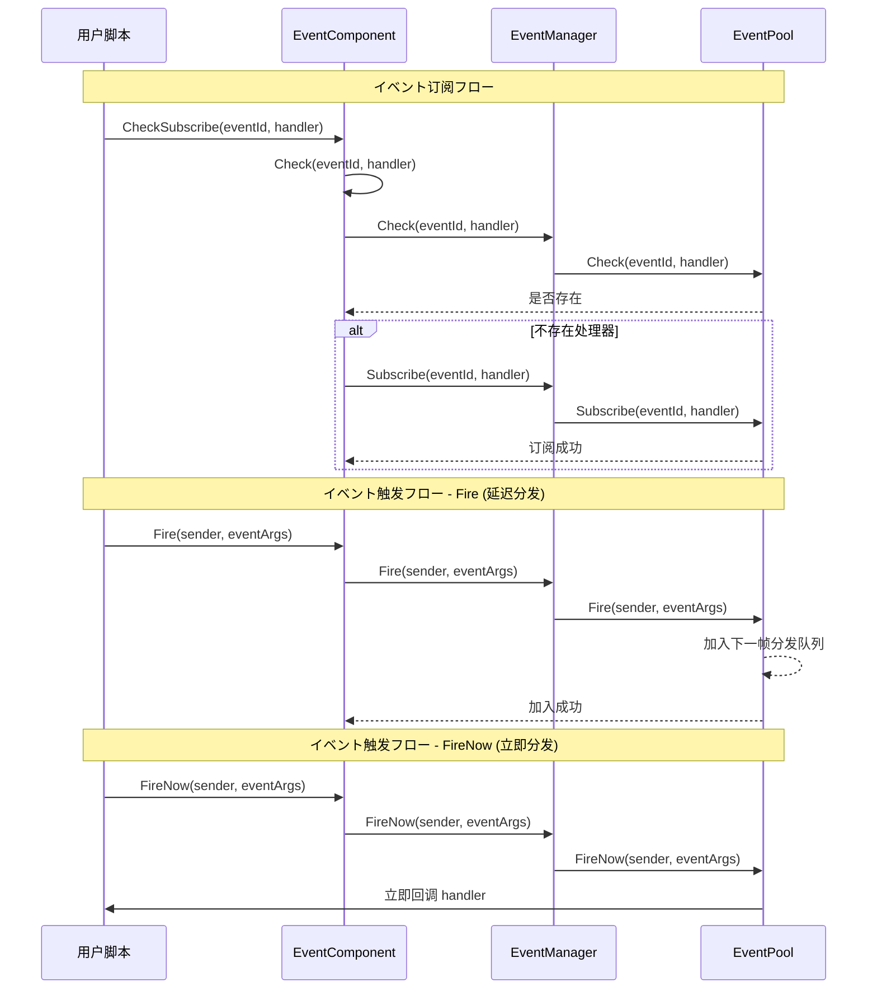

# EventComponent

EventComponent 是 Game Frame X イベント系统的 Unity コンポーネント层，提供基づく观察者模式的イベント订阅与发布機能。

## Overview

EventComponent 是ゲームフレームワーク中的コアイベントコンポーネント，を継承 `GameFrameworkComponent`。它作为 Unity ゲーム对象コンポーネント，提供します一个可配置的、易于使用的イベント系统インターフェース。

### コア职责

- **イベント订阅**：允许脚本订阅特定イベント ID 的处理函数
- **イベント取消订阅**：允许脚本取消对特定イベント的订阅
- **イベント触发**：サポート两种模式触发イベント（延迟分发和立即分发）
- **线程安全**：跨线程触发イベント时可保证在主线程回调

### コンポーネント特性

- を継承 `GameFrameworkComponent`，遵循フレームワークコンポーネント规范
- 使用 `[DisallowMultipleComponent]` 特性防止重复添加
- 使用 `[AddComponentMenu]` 在 Unity 编辑器中添加菜单项
- サポート多处理器（MultiHandler）和无处理器（NoHandler）模式

## Architecture

EventComponent 在イベント系统中的位置和交互关系：

```mermaid
flowchart TD
    subgraph UnityLayer["Unity ゲーム层"]
        EventComp[EventComponent]
    end

    subgraph FrameworkLayer["Game Framework コア层"]
        GFComponent[GameFrameworkComponent]
        GFEntry[GameFrameworkEntry]
    end

    subgraph EventLayer["イベント系统层"]
        IEventMgr[IEventManager]
        EventMgr[EventManager]
        EventPool[EventPool<GameEventArgs>]
    end

    subgraph UserLayer["用户脚本层"]
        ScriptA[用户脚本 A]
        ScriptB[用户脚本 B]
    end

    EventComp -->|继承| GFComponent
    EventComp -->|取得模块| GFEntry
    GFEntry -->|返回| IEventMgr
    IEventMgr <|.実装.| EventMgr
    EventMgr -->|使用| EventPool
    
    ScriptA -->|订阅イベント| EventComp
    ScriptB -->|订阅イベント| EventComp
    EventComp -->|触发イベント| EventPool
    EventPool -.->|回调| ScriptA
    EventPool -.->|回调| ScriptB
```

### イベント系统架构説明

| 层级 | コンポーネント | 职责 |
|------|------|------|
| Unity层 | EventComponent | 提供 Unity コンポーネントインターフェース，封装底层模块 |
| フレームワークコア层 | GameFrameworkEntry | 模块初期化和依赖注入 |
| イベント系统层 | IEventManager | イベント管理器インターフェース定义 |
| イベント系统层 | EventManager | イベント管理器実装 |
| イベント系统层 | EventPool | イベント池，负责イベント存储和分发 |

## Core Flow

イベント订阅与触发的完整フロー：



### イベント分发模式对比

| 模式 | メソッド | 线程安全 | 分发时机 | 适用シーン |
|------|------|----------|----------|----------|
| 延迟分发 | `Fire()` | ✅ 是 | 下一帧 | 大多数情况，特别是跨线程触发 |
| 立即分发 | `FireNow()` | ❌ 否 | 立即 | 确定性要求高的同步シーン |

## Usage Examples

### 基本用法 - 订阅和触发イベント

```csharp
using GameFrameX.Event.Runtime;

// 定义イベント参数クラス
public class PlayerDeadEventArgs : GameEventArgs
{
    public int PlayerId { get; set; }
    public string Reason { get; set; }
    
    public override void Clear()
    {
        PlayerId = 0;
        Reason = string.Empty;
    }

    public override string Id => "player.dead";
}

// 在必要监听イベント的脚本中
public class PlayerController : MonoBehaviour
{
    private EventComponent _eventComponent;

    private void Start()
    {
        // 取得 EventComponent コンポーネント
        _eventComponent = UnityEngine.GameObject.FindObjectOfType<EventComponent>();
        
        // 订阅イベント - 使用 CheckSubscribe 自动检查是否已订阅
        _eventComponent.CheckSubscribe(PlayerDeadEventArgs args => OnPlayerDead(args));
    }

    private void OnPlayerDead(PlayerDeadEventArgs args)
    {
        UnityEngine.Debug.Log($"玩家 {args.PlayerId} 死亡: {args.Reason}");
    }

    private void OnDestroy()
    {
        // 取消订阅イベント
        if (_eventComponent != null)
        {
            _eventComponent.Unsubscribe("player.dead", OnPlayerDead);
        }
    }
}

// 在触发イベント的脚本中
public class GameManager : MonoBehaviour
{
    private EventComponent _eventComponent;

    private void Start()
    {
        _eventComponent = UnityEngine.GameObject.FindObjectOfType<EventComponent>();
    }

    public void KillPlayer(int playerId)
    {
        // 作成イベント参数
        var eventArgs = ReferencePool.Acquire<PlayerDeadEventArgs>();
        eventArgs.PlayerId = playerId;
        eventArgs.Reason = "被怪物击杀";

        // 触发イベント
        _eventComponent.Fire(this, eventArgs);
        
        // イベント参数会被自动回收
    }
}
```
> Source: [EventComponent.cs](https://github.com/GameFrameX/com.gameframex.unity.event/blob/main/Runtime/EventComponent.cs#L1-L155)
> Source: [GameEventArgs.cs](https://github.com/GameFrameX/com.gameframex.unity.event/blob/main/Runtime/EventArgs/GameEventArgs.cs#L1-L19)

### 简化イベント - 使用空イベント参数

如果只必要传递イベント ID，不必要额外数据：

```csharp
// 触发一个简单イベント
_eventComponent.Fire(this, "player.respawn");

// 订阅简单イベント
_eventComponent.CheckSubscribe("player.respawn", args => 
{
    UnityEngine.Debug.Log("玩家重生");
});
```
> Source: [EventComponent.cs](https://github.com/GameFrameX/com.gameframex.unity.event/blob/main/Runtime/EventComponent.cs#L140-L144)

### 使用默认イベント处理器

可能为所有未处理的イベント設定默认处理器：

```csharp
// 設定默认处理器
_eventComponent.SetDefaultHandler((sender, args) =>
{
    UnityEngine.Debug.Log($"未处理的イベント: {args.Id}");
});
```
> Source: [EventComponent.cs](https://github.com/GameFrameX/com.gameframex.unity.event/blob/main/Runtime/EventComponent.cs#L120-L123)

## API Reference

### プロパティ

#### `EventHandlerCount`

```csharp
public int EventHandlerCount { get; }
```

取得已订阅的イベント处理函数总数。

**返回：** イベント处理函数的总数

---

#### `EventCount`

```csharp
public int EventCount { get; }
```

取得已订阅的イベントクラス型总数。

**返回：** イベントクラス型的总数

---

### メソッド

#### `Count(id: string): int`

```csharp
public int Count(string id)
```

取得指定イベント ID 的イベント处理函数数量。

**参数：**
- `id` (string): イベントクラス型编号

**返回：** 该イベント ID 关联的イベント处理函数数量

---

#### `Check(id: string, handler: EventHandler<GameEventArgs>): bool`

```csharp
public bool Check(string id, EventHandler<GameEventArgs> handler)
```

检查指定イベント ID 是否已存在特定的イベント处理函数。

**参数：**
- `id` (string): イベントクラス型编号
- `handler` (EventHandler<GameEventArgs>): 要检查的イベント处理函数

**返回：** 是否存在该イベント处理函数

---

#### `CheckSubscribe(id: string, handler: EventHandler<GameEventArgs>): void`

```csharp
public void CheckSubscribe(string id, EventHandler<GameEventArgs> handler)
```

检查并订阅イベント处理函数。如果处理函数不存在，则自动订阅。

**设计意图：** 此メソッド解决了重复订阅的问题。在 Unity 开发中，经常会在 `Start()` 或 `OnEnable()` 中订阅イベント，但如果这些メソッド被多次呼び出し，会导致同一处理函数被重复订阅。此メソッド会在订阅前检查，避免重复订阅。

**参数：**
- `id` (string): イベントクラス型编号
- `handler` (EventHandler<GameEventArgs>): 要订阅的イベント处理回调函数

---

#### `Subscribe(id: string, handler: EventHandler<GameEventArgs>): void`

```csharp
[Obsolete("Use CheckSubscribe instead.")]
public void Subscribe(string id, EventHandler<GameEventArgs> handler)
```

> ⚠️ 已废弃，お願いします使用 `CheckSubscribe` 代替。

订阅イベント处理回调函数。

**参数：**
- `id` (string): イベントクラス型编号
- `handler` (EventHandler<GameEventArgs>): 要订阅的イベント处理回调函数

---

#### `Unsubscribe(id: string, handler: EventHandler<GameEventArgs>): void`

```csharp
public void Unsubscribe(string id, EventHandler<GameEventArgs> handler)
```

取消订阅イベント处理回调函数。

**设计意图：** 在 Unity 中，当脚本被销毁时（如切换シーン、对象销毁），必須取消イベント订阅以避免空引用異常。通常在 `OnDestroy()` 或 `OnDisable()` 中呼び出し。

**参数：**
- `id` (string): イベントクラス型编号
- `handler` (EventHandler<GameEventArgs>): 要取消订阅的イベント处理回调函数

---

#### `SetDefaultHandler(handler: EventHandler<GameEventArgs>): void`

```csharp
public void SetDefaultHandler(EventHandler<GameEventArgs> handler)
```

設定默认イベント处理函数。当触发一个没有订阅者的イベント时，会呼び出し默认处理器。

**参数：**
- `handler` (EventHandler<GameEventArgs>): 要設定的默认イベント处理函数

---

#### `Fire(sender: object, e: GameEventArgs): void`

```csharp
public void Fire(object sender, GameEventArgs e)
```

抛出イベント（延迟分发模式）。

**设计意图：** 此メソッド是线程安全的。即使在后台线程中呼び出し `Fire()`，イベント回调也只会在主线程的下一帧执行。这是推荐使用的イベント触发方法，特别适に使用网络消息回调、异步操作完成通知等シーン。

**参数：**
- `sender` (object): イベント发送者，通常传递 `this`
- `e` (GameEventArgs): イベント参数对象

---

#### `Fire(sender: object, eventId: string): void`

```csharp
public void Fire(object sender, string eventId)
```

抛出イベント（使用空イベント参数）。

**设计意图：** 提供一种简化的无数据イベント触发方法。当只必要传递イベント ID 而不必要携带额外数据时使用。

**参数：**
- `sender` (object): イベント发送者
- `eventId` (string): イベント编号

---

#### `FireNow(sender: object, e: GameEventArgs): void`

```csharp
public void FireNow(object sender, GameEventArgs e)
```

抛出イベント（立即分发模式）。

**设计意图：** 此メソッド不是线程安全的，イベント会立刻同步分发。适に使用必要确定性执行顺序的シーン，例如某些帧同步逻辑或调试时必要立即看到效果的情况。**注意：** 不要在后台线程中呼び出し此メソッド。

**参数：**
- `sender` (object): イベント发送者
- `e` (GameEventArgs): イベント参数对象

---

## Configuration Options

EventComponent 作为 Unity コンポーネント，无需额外配置。它を通じてフレームワーク的 `GameFrameworkEntry` 自动取得 `IEventManager` 模块。

| 配置项 | クラス型 | 默认值 | 説明 |
|--------|------|--------|------|
| Component Menu | string | "Game Framework/Event" | Unity 编辑器中的コンポーネント菜单位置 |

---

## Related Links

- [EventManager](./06.event-manager.md) - イベント管理器底层実装
- [GameEventArgs](./07.game-event-args.md) - イベント参数基クラス
- [コア概念：イベント系统架构](../04.features.md) - 了解イベント系统设计原理
- [快速入门](../03.getting-started.md) - 开始使用イベント系统
