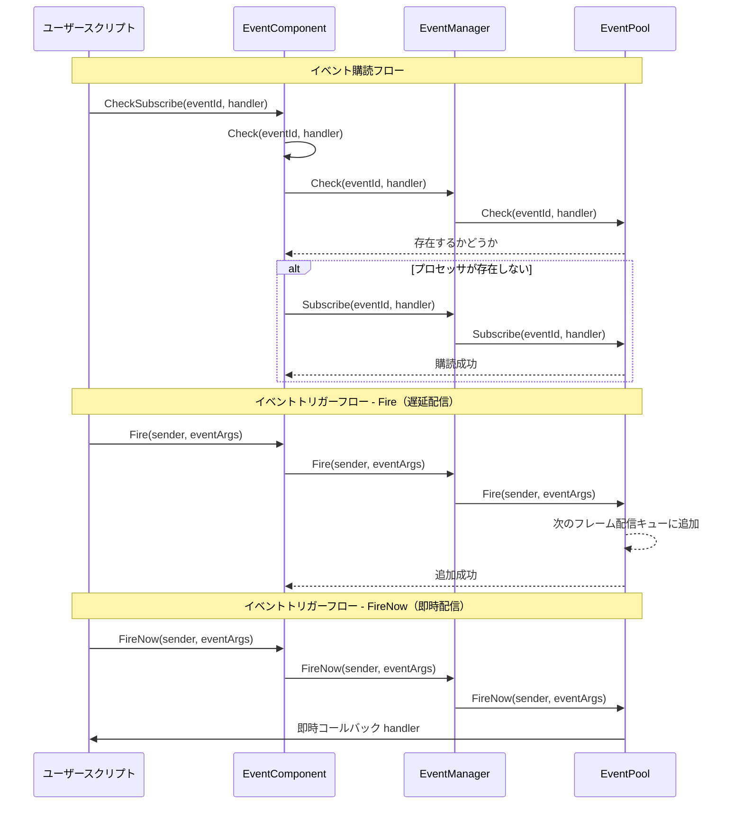

# EventComponent

EventComponent は、Game Frame X イベントシステムの Unity コンポーネント層であり、オブザーバーパターンに基づいたイベント購読者と発行機能を提供します。

## 概要

EventComponent は、ゲームフレームワークにおける中核イベントコンポーネントであり、`GameFrameworkComponent` を継承しています。Unity ゲームオブジェクトコンポーネントとして、構成可能で使いやすいイベントシステムインターフェースを提供します。

### 中核責任

- **イベント購読**：スクリプトが特定のイベント ID の処理関数を購読することを許可
- **イベント購読解除**：スクリプトが特定のイベントの購読を取り消すことを許可
- **イベントトリガー**：2つのモードでイベントのトリガーをサポート（遅延配信と即時配信）
- **スレッドセーフ**：クロースレッドでイベントをトリガーする場合、メインスレッドでコールバックすることを保証

### コンポーネント特性

- `GameFrameworkComponent` を継承し、フレームワークコンポーネント規範に従う
- `[DisallowMultipleComponent]` 属性を使用して重複追加を防止
- `[AddComponentMenu]` を使用して Unity エディターのコンポーネントメニュー項目を追加
- マルチハンドラー（MultiHandler）とノーハンドラー（NoHandler）モードをサポート

## アーキテクチャ

EventComponent のイベントシステムにおける位置と相互作用の関係：

```mermaid
flowchart TD
    subgraph UnityLayer["Unity ゲーム層"]
        EventComp[EventComponent]
    end

    subgraph FrameworkLayer["Game Framework 中核層"]
        GFComponent[GameFrameworkComponent]
        GFEntry[GameFrameworkEntry]
    end

    subgraph EventLayer["イベントシステム層"]
        IEventMgr[IEventManager]
        EventMgr[EventManager]
        EventPool[EventPool<GameEventArgs>]
    end

    subgraph UserLayer["ユーザースクリプト層"]
        ScriptA[ユーザースクリプト A]
        ScriptB[ユーザースクリプト B]
    end

    EventComp -->|継承| GFComponent
    EventComp -->|モジュール取得| GFEntry
    GFEntry -->|返回| IEventMgr
    IEventMgr <|.実装.| EventMgr
    EventMgr -->|使用| EventPool

    ScriptA -->|イベント購読| EventComp
    ScriptB -->|イベント購読| EventComp
    EventComp -->|イベントトリガー| EventPool
    EventPool -.->|コールバック| ScriptA
    EventPool -.->|コールバック| ScriptB
```

### イベントシステムアーキテクチャ説明

| 階層 | コンポーネント | 責任 |
|------|------|------|
| Unity層 | EventComponent | Unity コンポーネントインターフェースを提供し、底层モジュールをカプセル化 |
| フレームワーク中核層 | GameFrameworkEntry | モジュールの初期化と依存性注入 |
| イベントシステム層 | IEventManager | イベントマネージャーインターフェースを定義 |
| イベントシステム層 | EventManager | イベントマネージャーの実装 |
| イベントシステム層 | EventPool | イベントプール担当、イベントの存储と配信 |

## コアフロー

イベント購読者とトリガーの完全なフロー：



### イベント配信モード比較

| モード | メソッド | スレッドセーフ | 配信タイミング | 適用のシナリオ |
|------|------|----------|----------|----------|
| 遅延配信 | `Fire()` | ✅ はい | 次のフレーム | 大半の場合、特にクロースレッドトリガー |
| 即時配信 | `FireNow()` | ❌ いいえ | 即時 | 高い確定的要件のある同期シナリオ |

## 使用例

### 基本使用 - イベントの購読とトリガー

```csharp
using GameFrameX.Event.Runtime;

// イベントパラメータクラスを定義
public class PlayerDeadEventArgs : GameEventArgs
{
    public int PlayerId { get; set; }
    public string Reason { get; set; }

    public override void Clear()
    {
        PlayerId = 0;
        Reason = string.Empty;
    }

    public override string Id => "player.dead";
}

// イベントを监听する必要があるスクリプトで
public class PlayerController : MonoBehaviour
{
    private EventComponent _eventComponent;

    private void Start()
    {
        // EventComponent コンポーネントを取得
        _eventComponent = UnityEngine.GameObject.FindObjectOfType<EventComponent>();

        // イベントを購読 - CheckSubscribe を使用して既に購読しているか自動チェック
        _eventComponent.CheckSubscribe(PlayerDeadEventArgs args => OnPlayerDead(args));
    }

    private void OnPlayerDead(PlayerDeadEventArgs args)
    {
        UnityEngine.Debug.Log($"プレイヤー {args.PlayerId} 死亡: {args.Reason}");
    }

    private void OnDestroy()
    {
        // イベントの購読を解除
        if (_eventComponent != null)
        {
            _eventComponent.Unsubscribe("player.dead", OnPlayerDead);
        }
    }
}

// イベントをトリガーするスクリプトで
public class GameManager : MonoBehaviour
{
    private EventComponent _eventComponent;

    private void Start()
    {
        _eventComponent = UnityEngine.GameObject.FindObjectOfType<EventComponent>();
    }

    public void KillPlayer(int playerId)
    {
        // イベントパラメータを作成
        var eventArgs = ReferencePool.Acquire<PlayerDeadEventArgs>();
        eventArgs.PlayerId = playerId;
        eventArgs.Reason = "モンスターに殺害された";

        // イベントをトリガー
        _eventComponent.Fire(this, eventArgs);

        // イベントパラメータは自動的に回収される
    }
}
```
> Source: [EventComponent.cs](https://github.com/GameFrameX/com.gameframex.unity.event/blob/main/Runtime/EventComponent.cs#L1-L155)
> Source: [GameEventArgs.cs](https://github.com/GameFrameX/com.gameframex.unity.event/blob/main/Runtime/EventArgs/GameEventArgs.cs#L1-L19)

### シンプルイベント - 空イベントパラメータの使用

イベント ID の传递のみが必要で、追加データが必要ない場合：

```csharp
// シンプルイベントをトリガー
_eventComponent.Fire(this, "player.respawn");

// シンプルイベントを購読
_eventComponent.CheckSubscribe("player.respawn", args =>
{
    UnityEngine.Debug.Log("プレイヤー蘇生");
});
```
> Source: [EventComponent.cs](https://github.com/GameFrameX/com.gameframex.unity.event/blob/main/Runtime/EventComponent.cs#L140-L144)

### デフォルトイベントプロセッサの使用

未処理のイベントすべてにデフォルトプロセッサを設定できます：

```csharp
// デフォルトプロセッサを設定
_eventComponent.SetDefaultHandler((sender, args) =>
{
    UnityEngine.Debug.Log($"未処理のイベント: {args.Id}");
});
```
> Source: [EventComponent.cs](https://github.com/GameFrameX/com.gameframex.unity.event/blob/main/Runtime/EventComponent.cs#L120-L123)

## API リファレンス

### プロパティ

#### `EventHandlerCount`

```csharp
public int EventHandlerCount { get; }
```

購読済みのイベント処理関数の総数を取得します。

**返回值：** イベント処理関数の総数

---

#### `EventCount`

```csharp
public int EventCount { get; }
```

購読済みのイベントタイプの総数を取得します。

**返回值：** イベントタイプの総数

---

### メソッド

#### `Count(id: string): int`

```csharp
public int Count(string id)
```

指定されたイベント ID のイベント処理関数数を取得します。

**パラメータ：**
- `id` (string): イベントタイプ番号

**返回值：** 当該イベント ID に関連するイベント処理関数数

---

#### `Check(id: string, handler: EventHandler<GameEventArgs>): bool`

```csharp
public bool Check(string id, EventHandler<GameEventArgs> handler)
```

指定されたイベント ID に特定のイベント処理関数が既に存在するかをチェックします。

**パラメータ：**
- `id` (string): イベントタイプ番号
- `handler` (EventHandler<GameEventArgs>): チェックするイベント処理関数

**返回值：** 当該イベント処理関数が存在するかどうか

---

#### `CheckSubscribe(id: string, handler: EventHandler<GameEventArgs>): void`

```csharp
public void CheckSubscribe(string id, EventHandler<GameEventArgs> handler)
```

イベント処理関数をチェックして購読します。処理関数が存在しない場合は自動的に購読します。

**設計意図：** このメソッドは重複購読の問題を解決します。Unity 開発では、`Start()` や `OnEnable()` でイベントを購読することがよくありますが、これらのメソッドが複数回呼び出されると、同一の処理関数が重複購読される原因となります。このメソッドは購読前にチェックを行い、重複購読を回避します。

**パラメータ：**
- `id` (string): イベントタイプ番号
- `handler` (EventHandler<GameEventArgs>): 購読するイベント処理コールバック関数

---

#### `Subscribe(id: string, handler: EventHandler<GameEventArgs>): void`

```csharp
[Obsolete("Use CheckSubscribe instead.")]
public void Subscribe(string id, EventHandler<GameEventArgs> handler)
```

> ⚠️ 非推奨です。代わりに `CheckSubscribe` を使用してください。

イベント処理コールバック関数を購読します。

**パラメータ：**
- `id` (string): イベントタイプ番号
- `handler` (EventHandler<GameEventArgs>): 購読するイベント処理コールバック関数

---

#### `Unsubscribe(id: string, handler: EventHandler<GameEventArgs>): void`

```csharp
public void Unsubscribe(string id, EventHandler<GameEventArgs> handler)
```

イベント処理コールバック関数の購読を解除します。

**設計意図：** Unity では、スクリプトが破棄された場合（シーン切り替え、オブジェクト破棄等）には、イベント購読を取り消して Null 参照例外を避ける必要があります。通常は `OnDestroy()` または `OnDisable()` で呼び出します。

**パラメータ：**
- `id` (string): イベントタイプ番号
- `handler` (EventHandler<GameEventArgs>): 購読解除するイベント処理コールバック関数

---

#### `SetDefaultHandler(handler: EventHandler<GameEventArgs>): void`

```csharp
public void SetDefaultHandler(EventHandler<GameEventArgs> handler)
```

デフォルトイベント処理関数を設定します。購読者なしのイベントがトリガーされた場合、デフォルトプロセッサが呼び出されます。

**パラメータ：**
- `handler` (EventHandler<GameEventArgs>): 設定するデフォルトイベント処理関数

---

#### `Fire(sender: object, e: GameEventArgs): void`

```csharp
public void Fire(object sender, GameEventArgs e)
```

イベントを抛出します（遅延配信モード）。

**設計意図：** このメソッドはスレッドセーフです。バックグラウンドスレッドで `Fire()` を呼び出しても、イベントコールバックはメインスレッドの次のフレームでのみ実行されます。これは推奨されるイベントトリガーメソッドであり、ネットワークメッセージコールバック、非同期操作完了通知等のシナリオに特に適しています。

**パラメータ：**
- `sender` (object): イベント送信者、通例として `this` を 전달
- `e` (GameEventArgs): イベントパラメータオブジェクト

---

#### `Fire(sender: object, eventId: string): void`

```csharp
public void Fire(object sender, string eventId)
```

イベントを抛出します（空イベントパラメータを使用）。

**設計意図：** データのないイベントトリガーの簡略化された方法を提供します。イベント ID の传递のみが必要で追加データを携带する必要がない場合に使用します。

**パラメータ：**
- `sender` (object): イベント送信者
- `eventId` (string): イベント番号

---

#### `FireNow(sender: object, e: GameEventArgs): void`

```csharp
public void FireNow(object sender, GameEventArgs e)
```

イベントを抛出します（即時配信モード）。

**設計意図：** このメソッドはスレッドセーフではなく、イベントは即座に同期配信されます。確定的実行順序が必要なシナリオに適しています，例如特定のフレーム同期ロジックやデバッグ時に即座に効果を確認する必要がある場合。**注意：** バックグラウンドスレッドでこのメソッドを呼び出さないでください。

**パラメータ：**
- `sender` (object): イベント送信者
- `e` (GameEventArgs): イベントパラメータオブジェクト

---

## 設定オプション

EventComponent は Unity コンポーネントとして、追加設定は不要です。フレームワークの `GameFrameworkEntry` を通じて `IEventManager` モジュールを自動的に取得します。

| 設定項目 | タイプ | 默认値 | 説明 |
|--------|------|--------|------|
| Component Menu | string | "Game Framework/Event" | Unity エディターでのコンポーネント菜單位置 |

---

## 関連リンク

- [EventManager](./06.event-manager.md) - イベントマネージャー底层実装
- [GameEventArgs](./07.game-event-args.md) - イベントパラメータ基底クラス
- [コア概念：イベントシステムアーキテクチャ](../04.features.md) - イベントシステム設計原理了解更多
- [クイックスタート](../03.getting-started.md) - イベントシステムの使用開始
