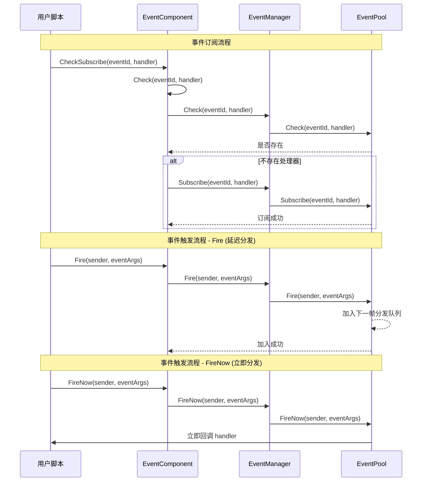

# EventComponent

EventComponent 是 Game Frame X イベント系统的 Unity コンポーネント層，提供基于观察者モード的イベント購読与リリース機能。

## Overview

EventComponent 是游戏フレームワーク中的コアイベントコンポーネント，継承自 `GameFrameworkComponent`。它作为 Unity 游戏对象コンポーネント，提供します一个可設定的、易于使用的イベント系统インターフェース。

### コア职责

- **イベント購読**：允许脚本購読特定イベント ID 的処理函数
- **イベント取消購読**：允许脚本取消对特定イベント的購読
- **イベントトリガー**：サポート两种モードトリガーイベント（延迟分发和立つまり分发）
- **线程安全**：跨线程トリガーイベント时可保证在主线程コールバック

### コンポーネント特性

- 継承自 `GameFrameworkComponent`，遵循フレームワークコンポーネント规范
- 使用 `[DisallowMultipleComponent]` 特性防止重复追加
- 使用 `[AddComponentMenu]` 在 Unity エディタ中追加メニュー项
- サポート多処理器（MultiHandler）和无処理器（NoHandler）モード

## Architecture

EventComponent 在イベント系统中的位置和交互关系：

```mermaid
flowchart TD
    subgraph UnityLayer["Unity 游戏层"]
        EventComp[EventComponent]
    end

    subgraph FrameworkLayer["Game Framework 核心层"]
        GFComponent[GameFrameworkComponent]
        GFEntry[GameFrameworkEntry]
    end

    subgraph EventLayer["事件系统层"]
        IEventMgr[IEventManager]
        EventMgr[EventManager]
        EventPool[EventPool<GameEventArgs>]
    end

    subgraph UserLayer["用户脚本层"]
        ScriptA[用户脚本 A]
        ScriptB[用户脚本 B]
    end

    EventComp -->|继承| GFComponent
    EventComp -->|获取模块| GFEntry
    GFEntry -->|返回| IEventMgr
    IEventMgr <|.实现.| EventMgr
    EventMgr -->|使用| EventPool
    
    ScriptA -->|订阅事件| EventComp
    ScriptB -->|订阅事件| EventComp
    EventComp -->|触发事件| EventPool
    EventPool -.->|回调| ScriptA
    EventPool -.->|回调| ScriptB
```

### イベント系统アーキテクチャ説明

| 层级 | コンポーネント | 职责 |
|------|------|------|
| Unity层 | EventComponent | 提供 Unity コンポーネントインターフェース，カプセル化底层モジュール |
| フレームワークコア层 | GameFrameworkEntry | モジュール初期化和依存性注入 |
| イベント系统层 | IEventManager | イベントマネージャーインターフェース定義 |
| イベント系统层 | EventManager | イベントマネージャー実装 |
| イベント系统层 | EventPool | イベント池，负责イベント存储和分发 |

## Core Flow

イベント購読与トリガー的完全なフロー：



### イベント分发モード对比

| モード | メソッド | 线程安全 | 分发时机 | 适用シーン |
|------|------|----------|----------|----------|
| 延迟分发 | `Fire()` | ✅ 是 | 下一帧 | 大多数情况，特别是跨线程トリガー |
| 立つまり分发 | `FireNow()` | ❌ 否 | 立つまり | 确定性要求高的同步シーン |

## Usage Examples

### 基本用法 - 購読和トリガーイベント

```csharp
using GameFrameX.Event.Runtime;

// 定义事件参数类
public class PlayerDeadEventArgs : GameEventArgs
{
    public int PlayerId { get; set; }
    public string Reason { get; set; }
    
    public override void Clear()
    {
        PlayerId = 0;
        Reason = string.Empty;
    }

    public override string Id => "player.dead";
}

// 在需要监听事件的脚本中
public class PlayerController : MonoBehaviour
{
    private EventComponent _eventComponent;

    private void Start()
    {
        // 获取 EventComponent 组件
        _eventComponent = UnityEngine.GameObject.FindObjectOfType<EventComponent>();
        
        // 订阅事件 - 使用 CheckSubscribe 自动检查是否已订阅
        _eventComponent.CheckSubscribe(PlayerDeadEventArgs args => OnPlayerDead(args));
    }

    private void OnPlayerDead(PlayerDeadEventArgs args)
    {
        UnityEngine.Debug.Log($"玩家 {args.PlayerId} 死亡: {args.Reason}");
    }

    private void OnDestroy()
    {
        // 取消订阅事件
        if (_eventComponent != null)
        {
            _eventComponent.Unsubscribe("player.dead", OnPlayerDead);
        }
    }
}

// 在触发事件的脚本中
public class GameManager : MonoBehaviour
{
    private EventComponent _eventComponent;

    private void Start()
    {
        _eventComponent = UnityEngine.GameObject.FindObjectOfType<EventComponent>();
    }

    public void KillPlayer(int playerId)
    {
        // 创建事件参数
        var eventArgs = ReferencePool.Acquire<PlayerDeadEventArgs>();
        eventArgs.PlayerId = playerId;
        eventArgs.Reason = "被怪物击杀";

        // 触发事件
        _eventComponent.Fire(this, eventArgs);
        
        // 事件参数会被自动回收
    }
}
```
> Source: [EventComponent.cs](https://github.com/GameFrameX/com.gameframex.unity.event/blob/main/Runtime/EventComponent.cs#L1-L155)
> Source: [GameEventArgs.cs](https://github.com/GameFrameX/com.gameframex.unity.event/blob/main/Runtime/EventArgs/GameEventArgs.cs#L1-L19)

### 簡素化イベント - 使用空イベントパラメータ

もし只〜する必要があります传递イベント ID，不〜する必要があります额外数据：

```csharp
// 触发一个简单事件
_eventComponent.Fire(this, "player.respawn");

// 订阅简单事件
_eventComponent.CheckSubscribe("player.respawn", args => 
{
    UnityEngine.Debug.Log("玩家重生");
});
```
> Source: [EventComponent.cs](https://github.com/GameFrameX/com.gameframex.unity.event/blob/main/Runtime/EventComponent.cs#L140-L144)

### 使用デフォルトイベント処理器

〜できます为所有未処理的イベント設定デフォルト処理器：

```csharp
// 设置默认处理器
_eventComponent.SetDefaultHandler((sender, args) =>
{
    UnityEngine.Debug.Log($"未处理的事件: {args.Id}");
});
```
> Source: [EventComponent.cs](https://github.com/GameFrameX/com.gameframex.unity.event/blob/main/Runtime/EventComponent.cs#L120-L123)

## API Reference

### プロパティ

#### `EventHandlerCount`

```csharp
public int EventHandlerCount { get; }
```

取得已購読的イベント処理函数总数。

**返す：** イベント処理函数的总数

---

#### `EventCount`

```csharp
public int EventCount { get; }
```

取得已購読的イベントタイプ总数。

**返す：** イベントタイプ的总数

---

### メソッド

#### `Count(id: string): int`

```csharp
public int Count(string id)
```

取得指定イベント ID 的イベント処理函数数量。

**パラメータ：**
- `id` (string): イベントタイプ编号

**返す：** 该イベント ID 关联的イベント処理函数数量

---

#### `Check(id: string, handler: EventHandler<GameEventArgs>): bool`

```csharp
public bool Check(string id, EventHandler<GameEventArgs> handler)
```

確認指定イベント ID 是否已存在特定的イベント処理函数。

**パラメータ：**
- `id` (string): イベントタイプ编号
- `handler` (EventHandler<GameEventArgs>): 要確認的イベント処理函数

**返す：** 是否存在该イベント処理函数

---

#### `CheckSubscribe(id: string, handler: EventHandler<GameEventArgs>): void`

```csharp
public void CheckSubscribe(string id, EventHandler<GameEventArgs> handler)
```

確認并購読イベント処理函数。もし処理函数不存在，则自动購読。

**設計意图：** 此メソッド解决了重复購読的問題。在 Unity 开发中，经常会在 `Start()` 或 `OnEnable()` 中購読イベント，但もし这些メソッド被多次呼び出し，会导致同一処理函数被重复購読。此メソッド会在購読前確認，避免重复購読。

**パラメータ：**
- `id` (string): イベントタイプ编号
- `handler` (EventHandler<GameEventArgs>): 要購読的イベント処理コールバック函数

---

#### `Subscribe(id: string, handler: EventHandler<GameEventArgs>): void`

```csharp
[Obsolete("Use CheckSubscribe instead.")]
public void Subscribe(string id, EventHandler<GameEventArgs> handler)
```

> ⚠️ 已废弃，请使用 `CheckSubscribe` 代替。

購読イベント処理コールバック函数。

**パラメータ：**
- `id` (string): イベントタイプ编号
- `handler` (EventHandler<GameEventArgs>): 要購読的イベント処理コールバック函数

---

#### `Unsubscribe(id: string, handler: EventHandler<GameEventArgs>): void`

```csharp
public void Unsubscribe(string id, EventHandler<GameEventArgs> handler)
```

取消購読イベント処理コールバック函数。

**設計意图：** 在 Unity 中，当脚本被破棄时（如切换シーン、对象破棄），〜しなければなりません取消イベント購読以避免空参照例外。通常在 `OnDestroy()` 或 `OnDisable()` 中呼び出し。

**パラメータ：**
- `id` (string): イベントタイプ编号
- `handler` (EventHandler<GameEventArgs>): 要取消購読的イベント処理コールバック函数

---

#### `SetDefaultHandler(handler: EventHandler<GameEventArgs>): void`

```csharp
public void SetDefaultHandler(EventHandler<GameEventArgs> handler)
```

設定デフォルトイベント処理函数。当トリガー一个没有購読者的イベント时，会呼び出しデフォルト処理器。

**パラメータ：**
- `handler` (EventHandler<GameEventArgs>): 要設定的デフォルトイベント処理函数

---

#### `Fire(sender: object, e: GameEventArgs): void`

```csharp
public void Fire(object sender, GameEventArgs e)
```

抛出イベント（延迟分发モード）。

**設計意图：** 此メソッド是线程安全的。つまり使在后台线程中呼び出し `Fire()`，イベントコールバック也只会在主线程的下一帧执行。这是推奨使用的イベントトリガー方法，特别適しています网络メッセージコールバック、异步操作完成通知等シーン。

**パラメータ：**
- `sender` (object): イベント发送者，通常传递 `this`
- `e` (GameEventArgs): イベントパラメータ对象

---

#### `Fire(sender: object, eventId: string): void`

```csharp
public void Fire(object sender, string eventId)
```

抛出イベント（使用空イベントパラメータ）。

**設計意图：** 提供一种簡素化的无数据イベントトリガー方法。当只〜する必要があります传递イベント ID 而不〜する必要があります携带额外数据时使用。

**パラメータ：**
- `sender` (object): イベント发送者
- `eventId` (string): イベント编号

---

#### `FireNow(sender: object, e: GameEventArgs): void`

```csharp
public void FireNow(object sender, GameEventArgs e)
```

抛出イベント（立つまり分发モード）。

**設計意图：** 此メソッド不是线程安全的，イベント会立刻同步分发。適しています〜する必要があります确定性执行顺序的シーン，例えば某些帧同步逻辑或デバッグ时〜する必要があります立つまり看到效果的情况。**注意：** 不要在后台线程中呼び出し此メソッド。

**パラメータ：**
- `sender` (object): イベント发送者
- `e` (GameEventArgs): イベントパラメータ对象

---

## Configuration Options

EventComponent 作为 Unity コンポーネント，无需额外設定。它通过フレームワーク的 `GameFrameworkEntry` 自动取得 `IEventManager` モジュール。

| 設定项 | タイプ | デフォルト值 | 説明 |
|--------|------|--------|------|
| Component Menu | string | "Game Framework/Event" | Unity エディタ中的コンポーネントメニュー位置 |

---

## Related Links

- [EventManager](./06.event-manager.md) - イベントマネージャー底层実装
- [GameEventArgs](./07.game-event-args.md) - イベントパラメータ基底クラス
- [コアコンセプト：イベント系统アーキテクチャ](../04.features.md) - 理解するイベント系统設計原理
- [快速入门](../03.getting-started.md) - 开始使用イベント系统
