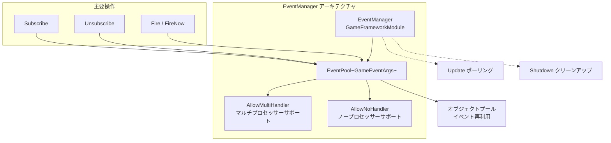
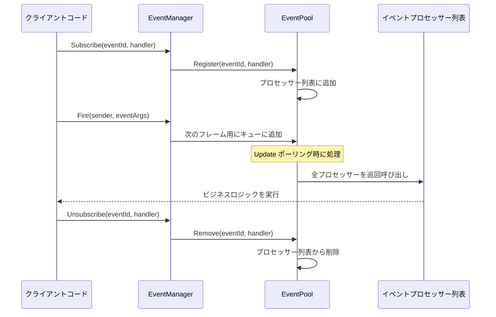
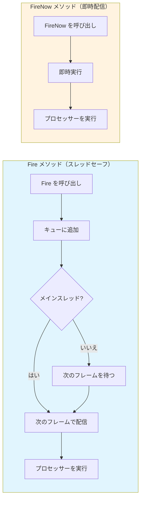

# EventManager

EventManager は、GameFrameX イベントシステムの中核マネージャーであり、ゲームイベントの購読、購読解除、配信管理を担当します。EventPool に基づいて実装され、スレッドセーフなイベント配信とマルチプロセッサーモードをサポートします。

## 概要

EventManager は、GameFrameX イベントシステムの中核コンポーネントであり、`GameFrameworkModule` を継承し、`IEventManager` インターフェースを実装しています。强大的なイベントシステムを提供し、ゲーム内の異なるモジュール間の疎結合通信を實現します。

EventManager のコア機能は以下を含みます：
- **イベントの購読と購読解除**：イベント ID を通じてイベント処理関数を登録または削除
- **イベントの配信**：スレッドセーフな遅延配信（`Fire`）と即時配信（`FireNow`）の2つのモードをサポート
- **イベント統計**：購読済みのイベント処理関数数とイベント数を照会
- **デフォルトプロセッサ**：明示的に購読されていないイベントをキャプチャするデフォルトイベント処理関数の設定をサポート

> **注意**：EventManager は通常、EventComponent を通じて Unity シーンで使用されます。EventComponent は EventManager の Unity コンポーネントカプセル化であり、より親しみやすい Unity 統合インターフェースを提供します。
>
> EventComponent の詳細については、[EventComponent](./05.event-component.md) ドキュメントを参照してください。
>
> GameEventArgs の詳細については、[GameEventArgs](./07.game-event-args.md) ドキュメントを参照してください。

## アーキテクチャ

EventManager は、イベントプール（EventPool）に基づいて実装されており、これは高效なイベント管理モードです。EventPool は以下の特性をサポートします：



### デザインパターン

EventManager は以下のデザインパターンを採用しています：

| モード | 応用 | 優位性 |
|------|------|------|
| **オブジェクトプールモード** | EventPool が GameEventArgs を再利用 | GC を削減、パフォーマンスを最適化 |
| **オブザーバーモード** | Subscribe/Publish メカニズム | イベント発行者と購読者の疎結合 |
| **遅延実行モード** | Fire を次のフレームに遅延配信 | スレッドセーフを保証 |

## コアフロー

### イベントの購読と配信フロー



### イベント配信モードの比較



## 使用例

### 基本使用

```csharp
// カスタムイベントパラメータを定義
public class PlayerDeathEventArgs : GameEventArgs
{
    public int PlayerId { get; set; }
    public string Reason { get; set; }
    public override void Clear()
    {
        PlayerId = 0;
        Reason = string.Empty;
    }
}

// イベントを購読
EventComponent eventComponent = UnityEngine.Object.FindObjectOfType<EventComponent>();
eventComponent.CheckSubscribe("player_death", OnPlayerDeath);

// イベント処理関数
private void OnPlayerDeath(object sender, GameEventArgs e)
{
    var args = (PlayerDeathEventArgs)e;
    UnityEngine.Debug.Log($"プレイヤー {args.PlayerId} 死亡: {args.Reason}");
}

// イベントを抛出
eventComponent.Fire(this, new PlayerDeathEventArgs
{
    PlayerId = 1001,
    Reason = "モンスターに殺害された"
});

// 購読を解除
eventComponent.Unsubscribe("player_death", OnPlayerDeath);
```
> Source: [EventManager.cs](https://github.com/GameFrameX/com.gameframex.unity.event/blob/main/Runtime/Event/EventManager.cs#L98-L101)

### 空イベントの使用（データなし）

```csharp
// シンプルイベントを購読（データの携带が不要）
eventComponent.CheckSubscribe("game_start", OnGameStart);

// シンプルイベントを抛出
eventComponent.Fire(this, "game_start");

// イベント処理関数
private void OnGameStart(object sender, GameEventArgs e)
{
    UnityEngine.Debug.Log("ゲーム開始！");
}
```
> Source: [EventComponent.cs](https://github.com/GameFrameX/com.gameframex.unity.event/blob/main/Runtime/EventComponent.cs#L140-L144)

### デフォルトプロセッサーの設定

```csharp
// デフォルトプロセッサーを設定して全、明示的に購読されていないイベントをキャプチャ
eventComponent.SetDefaultHandler(OnDefaultEvent);

// デフォルトイベント処理関数
private void OnDefaultEvent(object sender, GameEventArgs e)
{
    UnityEngine.Debug.Log($"未処理のイベントを受信: {e.Id}");
}
```
> Source: [EventManager.cs](https://github.com/GameFrameX/com.gameframex.unity.event/blob/main/Runtime/Event/EventManager.cs#L117-L120)

## API リファレンス

### プロパティ

#### `EventHandlerCount`

```csharp
public int EventHandlerCount { get; }
```

購読済みのイベント処理関数の総数を取得します。

**返回值：** イベント処理関数の数。

---

#### `EventCount`

```csharp
public int EventCount { get; }
```

購読済みのイベントタイプ数（異なるイベント ID の数）。

**返回值：** イベントタイプの数。

---

### メソッド

#### `Count`

```csharp
public int Count(string id)
```

指定されたイベント ID のイベント処理関数数を取得します。

**パラメータ：**
- `id` (string): イベントタイプ番号

**返回值：** 指定されたイベント ID のイベント処理関数数。

> Source: [EventManager.cs#L77-L80](https://github.com/GameFrameX/com.gameframex.unity.event/blob/main/Runtime/Event/EventManager.cs#L77-L80)

---

#### `Check`

```csharp
public bool Check(string id, EventHandler<GameEventArgs> handler)
```

指定されたイベント処理関数が存在するかをチェックします。

**パラメータ：**
- `id` (string): イベントタイプ番号
- `handler` (EventHandler<GameEventArgs>): チェックするイベント処理関数

**返回值：** 指定されたイベント処理関数が存在するかどうか。

> Source: [EventManager.cs#L88-L91](https://github.com/GameFrameX/com.gameframex.unity.event/blob/main/Runtime/Event/EventManager.cs#L88-L91)

---

#### `Subscribe`

```csharp
public void Subscribe(string id, EventHandler<GameEventArgs> handler)
```

指定されたイベント ID のイベント処理関数を購読します。

**パラメータ：**
- `id` (string): イベントタイプ番号
- `handler` (EventHandler<GameEventArgs>): 購読するイベント処理関数

**説明：**
- 同一のイベント ID に複数の処理関数を購読可能
- イベントがトリガーされた時、全購読された処理関数が呼び出される

> Source: [EventManager.cs#L98-L101](https://github.com/GameFrameX/com.gameframex.unity.event/blob/main/Runtime/Event/EventManager.cs#L98-L101)

---

#### `Unsubscribe`

```csharp
public void Unsubscribe(string id, EventHandler<GameEventArgs> handler)
```

指定されたイベント ID のイベント処理関数の購読を解除します。

**パラメータ：**
- `id` (string): イベントタイプ番号
- `handler` (EventHandler<GameEventArgs>): 購読解除するイベント処理関数

**説明：** イベント処理関数が存在しない場合任何操作を実行しません。

> Source: [EventManager.cs#L108-L111](https://github.com/GameFrameX/com.gameframex.unity.event/blob/main/Runtime/Event/EventManager.cs#L108-L111)

---

#### `SetDefaultHandler`

```csharp
public void SetDefaultHandler(EventHandler<GameEventArgs> handler)
```

デフォルトイベント処理関数を設定します。

**パラメータ：**
- `handler` (EventHandler<GameEventArgs>): 設定するデフォルトイベント処理関数

**説明：** イベントに対応する購読者プロセッサーが見つからない場合、デフォルトイベント処理関数が呼び出されます。

> Source: [EventManager.cs#L117-L120](https://github.com/GameFrameX/com.gameframex.unity.event/blob/main/Runtime/Event/EventManager.cs#L117-L120)

---

#### `Fire`

```csharp
public void Fire(object sender, GameEventArgs e)
```

イベントを抛出します（スレッドセーフモード）。

**パラメータ：**
- `sender` (object): イベント送信者
- `e` (GameEventArgs): イベントパラメータ

**説明：**
- このメソッドはスレッドセーフです
- メインスレッド以外で呼び出しても、メインスレッドでイベント処理関数をコールバックすることを保証
- イベント抛出後の次のフレームで配信

> Source: [EventManager.cs#L127-L130](https://github.com/GameFrameX/com.gameframex.unity.event/blob/main/Runtime/Event/EventManager.cs#L127-L130)

---

#### `FireNow`

```csharp
public void FireNow(object sender, GameEventArgs e)
```

イベントを抛出します（即時モード）。

**パラメータ：**
- `sender` (object): イベント送信者
- `e` (GameEventArgs): イベントパラメータ

**説明：**
- このメソッドはスレッドセーフではありません
- イベントが即座に配信され、直ちに全購読された処理関数を呼び出す
- 调用スレッドの安全を確認した場合のみ使用

> Source: [EventManager.cs#L137-L140](https://github.com/GameFrameX/com.gameframex.unity.event/blob/main/Runtime/Event/EventManager.cs#L137-L140)

---

## スレッドセーフティ

EventManager は、異なる需求を満たすために2つのイベント配信モードを提供します：

| メソッド | スレッドセーフ | 配信タイミング | 適用のシナリオ |
|------|----------|----------|----------|
| `Fire` | ✅ セーフ | 次のフレーム | クロースレッドイベント、サーバー通知クライアント |
| `FireNow` | ❌ 非セーフ | 即時 | 同一スレッド内の同期ロジック |

**ベストプラクティス：**
- 子スレッドでイベントをトリガーする場合は `Fire` を使用し、コールバックがメインスレッドで実行されることを確保
- メインスレッドで即時応答が必要な場合は `FireNow` を使用
- `FireNow` のイベント処理関数内での時間のかかる操作を回避

## パフォーマンス最適化提案

1. **オブジェクトプールの使用**：カスタムイベントクラスは `GameEventArgs` を継承しオブジェクトプールインターフェースを実装し、オブジェクトの頻繁な作成を回避
2. **購読解除の適時実行**：不要になったイベント应及时購読解除し、巡回开销を削減
3. **`CheckSubscribe` の使用**：`CheckSubscribe` メソッドを使用して重複購読問題を自動的に処理することを推奨
4. **頻繁な配信の回避**：高频イベント（例えは每フレーム更新）の場合、合併またはスロットルを検討

## 関連リンク

- [EventComponent](./05.event-component.md) - Unity コンポーネントカプセル化
- [GameEventArgs](./07.game-event-args.md) - イベントパラメータ基底クラス
- [コア概念：イベントシステムアーキテクチャ](../04.features.md) - 更多設計原理を学ぶ
- [クイックスタート](../03.getting-started.md) - イベントシステムの使用開始
