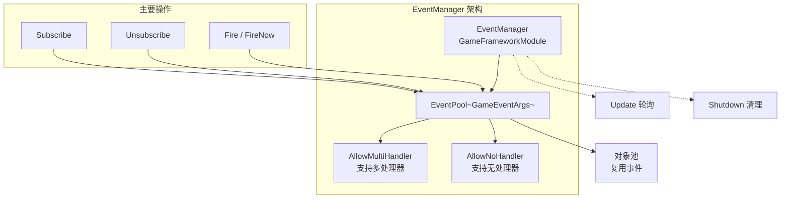
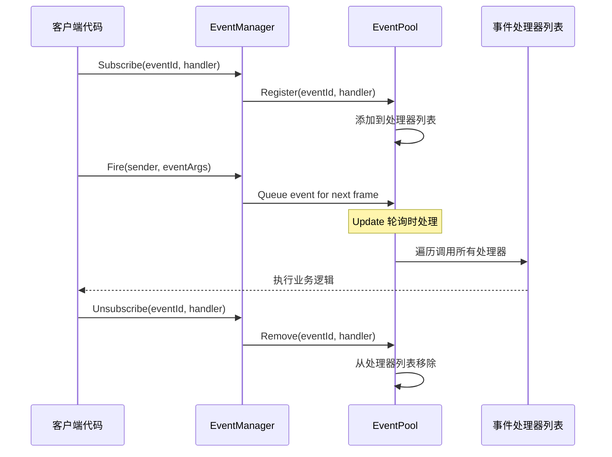
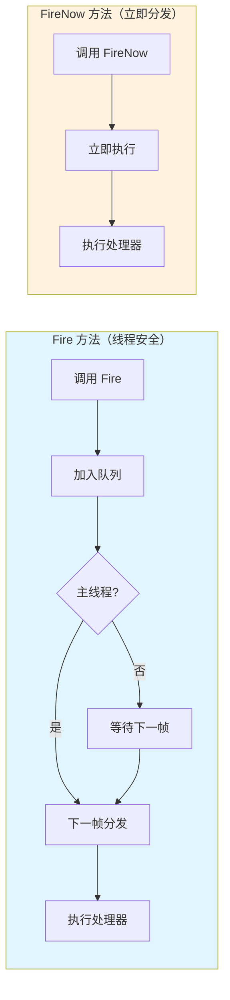

# EventManager

EventManager 是 GameFrameX イベント系统的コアマネージャー，负责游戏イベント的購読、取消購読和派发管理。它基于 EventPool 実装，サポート线程安全的イベント分发和多処理器モード。

## 概要

EventManager 是 GameFrameX イベント系统的コアコンポーネント，継承自 `GameFrameworkModule` 并実装了 `IEventManager` インターフェース。它提供します一个強力的イベント系统，允许游戏中的不同モジュール通过イベント进行松耦合的通信。

EventManager 的コア機能含みます：
- **イベント購読与取消購読**：通过イベント ID 登録或移除イベント処理函数
- **イベント派发**：サポート线程安全的延迟分发（`Fire`）和立つまり分发（`FireNow`）两种モード
- **イベント统计**：提供当前已購読的イベント処理函数数量和イベント数量查询
- **デフォルト処理器**：サポート設定デフォルトイベント処理函数来捕获未明确購読的イベント

> **注意**：EventManager 通常通过 EventComponent 在 Unity シーン中使用。EventComponent 是 EventManager 的 Unity コンポーネントカプセル化，提供します更使いやすい的 Unity 集成インターフェース。
> 
> 有关 EventComponent 的詳細情報，请参照 [EventComponent](./05.event-component.md) ドキュメント。
> 
> 有关 GameEventArgs 的詳細情報，请参照 [GameEventArgs](./07.game-event-args.md) ドキュメント。

## アーキテクチャ

EventManager 基于イベント池（EventPool）実装，这は一種の効率的的イベント管理モード。EventPool サポート以下特性：



### デザインパターン

EventManager 采用以下設計モード：

| モード | 应用 | 优势 |
|------|------|------|
| **对象池モード** | EventPool 复用 GameEventArgs | 减少 GC，最適化性能 |
| **观察者モード** | Subscribe/Publish 机制 | 解耦イベントリリース者和購読者 |
| **延迟执行モード** | Fire 延迟到下一帧分发 | 保证线程安全 |

## コアフロー

### イベント購読与派发フロー



### イベント分发モード对比



## 使用例

### 基本使用

```csharp
// 定义自定义事件参数
public class PlayerDeathEventArgs : GameEventArgs
{
    public int PlayerId { get; set; }
    public string Reason { get; set; }
    public override void Clear()
    {
        PlayerId = 0;
        Reason = string.Empty;
    }
}

// 订阅事件
EventComponent eventComponent = UnityEngine.Object.FindObjectOfType<EventComponent>();
eventComponent.CheckSubscribe("player_death", OnPlayerDeath);

// 事件处理函数
private void OnPlayerDeath(object sender, GameEventArgs e)
{
    var args = (PlayerDeathEventArgs)e;
    UnityEngine.Debug.Log($"玩家 {args.PlayerId} 死亡: {args.Reason}");
}

// 抛出事件
eventComponent.Fire(this, new PlayerDeathEventArgs 
{ 
    PlayerId = 1001, 
    Reason = "被怪物击杀" 
});

// 取消订阅
eventComponent.Unsubscribe("player_death", OnPlayerDeath);
```
> Source: [EventManager.cs](https://github.com/GameFrameX/com.gameframex.unity.event/blob/main/Runtime/Event/EventManager.cs#L98-L101)

### 使用空イベント（无需数据）

```csharp
// 订阅简单事件（无需携带数据）
eventComponent.CheckSubscribe("game_start", OnGameStart);

// 抛出简单事件
eventComponent.Fire(this, "game_start");

// 事件处理函数
private void OnGameStart(object sender, GameEventArgs e)
{
    UnityEngine.Debug.Log("游戏开始！");
}
```
> Source: [EventComponent.cs](https://github.com/GameFrameX/com.gameframex.unity.event/blob/main/Runtime/EventComponent.cs#L140-L144)

### 設定デフォルト処理器

```csharp
// 设置默认处理器捕获所有未明确订阅的事件
eventComponent.SetDefaultHandler(OnDefaultEvent);

// 默认事件处理函数
private void OnDefaultEvent(object sender, GameEventArgs e)
{
    UnityEngine.Debug.Log($"收到未处理事件: {e.Id}");
}
```
> Source: [EventManager.cs](https://github.com/GameFrameX/com.gameframex.unity.event/blob/main/Runtime/Event/EventManager.cs#L117-L120)

## API リファレンス

### プロパティ

#### `EventHandlerCount`

```csharp
public int EventHandlerCount { get; }
```

取得已購読的イベント処理函数的总数量。

**戻り値：** イベント処理函数的数量。

---

#### `EventCount`

```csharp
public int EventCount { get; }
```

取得已購読的イベントタイプ数量（不同イベント ID 的数量）。

**戻り値：** イベントタイプ的数量。

---

### メソッド

#### `Count`

```csharp
public int Count(string id)
```

取得指定イベント ID 的イベント処理函数数量。

**パラメータ：**
- `id` (string): イベントタイプ编号

**戻り値：** 指定イベント ID 的イベント処理函数数量。

> Source: [EventManager.cs#L77-L80](https://github.com/GameFrameX/com.gameframex.unity.event/blob/main/Runtime/Event/EventManager.cs#L77-L80)

---

#### `Check`

```csharp
public bool Check(string id, EventHandler<GameEventArgs> handler)
```

確認是否存在指定的イベント処理函数。

**パラメータ：**
- `id` (string): イベントタイプ编号
- `handler` (EventHandler<GameEventArgs>): 要確認的イベント処理函数

**戻り値：** 是否存在指定的イベント処理函数。

> Source: [EventManager.cs#L88-L91](https://github.com/GameFrameX/com.gameframex.unity.event/blob/main/Runtime/Event/EventManager.cs#L88-L91)

---

#### `Subscribe`

```csharp
public void Subscribe(string id, EventHandler<GameEventArgs> handler)
```

購読指定イベント ID 的イベント処理函数。

**パラメータ：**
- `id` (string): イベントタイプ编号
- `handler` (EventHandler<GameEventArgs>): 要購読的イベント処理函数

**説明：** 
- 同一个イベント ID 〜できます購読多个処理函数
- イベントトリガー时，所有購読的処理函数都会被呼び出し

> Source: [EventManager.cs#L98-L101](https://github.com/GameFrameX/com.gameframex.unity.event/blob/main/Runtime/Event/EventManager.cs#L98-L101)

---

#### `Unsubscribe`

```csharp
public void Unsubscribe(string id, EventHandler<GameEventArgs> handler)
```

取消購読指定イベント ID 的イベント処理函数。

**パラメータ：**
- `id` (string): イベントタイプ编号
- `handler` (EventHandler<GameEventArgs>): 要取消購読的イベント処理函数

**説明：** もしイベント処理函数不存在，则不会执行任何操作。

> Source: [EventManager.cs#L108-L111](https://github.com/GameFrameX/com.gameframex.unity.event/blob/main/Runtime/Event/EventManager.cs#L108-L111)

---

#### `SetDefaultHandler`

```csharp
public void SetDefaultHandler(EventHandler<GameEventArgs> handler)
```

設定デフォルトイベント処理函数。

**パラメータ：**
- `handler` (EventHandler<GameEventArgs>): 要設定的デフォルトイベント処理函数

**説明：** デフォルトイベント処理函数会在イベント没有找到对应的購読処理器时被呼び出し。

> Source: [EventManager.cs#L117-L120](https://github.com/GameFrameX/com.gameframex.unity.event/blob/main/Runtime/Event/EventManager.cs#L117-L120)

---

#### `Fire`

```csharp
public void Fire(object sender, GameEventArgs e)
```

抛出イベント（线程安全モード）。

**パラメータ：**
- `sender` (object): イベント发送者
- `e` (GameEventArgs): イベントパラメータ

**説明：** 
- 此メソッド是线程安全的
- つまり使在非主线程中呼び出し，也会保证在主线程中コールバックイベント処理函数
- イベント会在抛出后的下一帧分发

> Source: [EventManager.cs#L127-L130](https://github.com/GameFrameX/com.gameframex.unity.event/blob/main/Runtime/Event/EventManager.cs#L127-L130)

---

#### `FireNow`

```csharp
public void FireNow(object sender, GameEventArgs e)
```

抛出イベント（立つまりモード）。

**パラメータ：**
- `sender` (object): イベント发送者
- `e` (GameEventArgs): イベントパラメータ

**説明：** 
- 此メソッド不是线程安全的
- イベント会立刻分发，立つまり呼び出し所有購読的処理函数
- 仅在确定呼び出し线程安全的情况下使用

> Source: [EventManager.cs#L137-L140](https://github.com/GameFrameX/com.gameframex.unity.event/blob/main/Runtime/Event/EventManager.cs#L137-L140)

---

## 线程安全性

EventManager 提供します两种イベント分发モード以满足不同的需求：

| メソッド | 线程安全 | 分发时机 | 适用シーン |
|------|----------|----------|----------|
| `Fire` | ✅ 安全 | 下一帧 | 跨线程イベント、后端通知前端 |
| `FireNow` | ❌ 不安全 | 立つまり | 同一线程内同步逻辑 |

**最佳实践：**
- 在子线程中トリガーイベント时使用 `Fire`，確認してくださいコールバック在主线程执行
- 在主线程中〜する必要があります立つまり响应时使用 `FireNow`
- 避免在 `FireNow` 的イベント処理函数中进行耗时操作

## 性能最適化お勧め

1. **使用对象池**：自定義イベント类应継承 `GameEventArgs` 并実装对象池インターフェース，避免频繁作成对象
2. **及时取消購読**：不再〜する必要があります的イベント应及时取消購読，减少遍历开销
3. **使用 `CheckSubscribe`**：推奨使用 `CheckSubscribe` メソッド自动処理重复購読問題
4. **避免频繁派发**：对于高频イベント（如每帧アップデート），考虑合并或节流

## 関連リンク

- [EventComponent](./05.event-component.md) - Unity コンポーネントカプセル化
- [GameEventArgs](./07.game-event-args.md) - イベントパラメータ基底クラス
- [コアコンセプト：イベント系统アーキテクチャ](../04.features.md) - 理解する更多設計原理
- [快速入门](../03.getting-started.md) - 开始使用イベント系统
