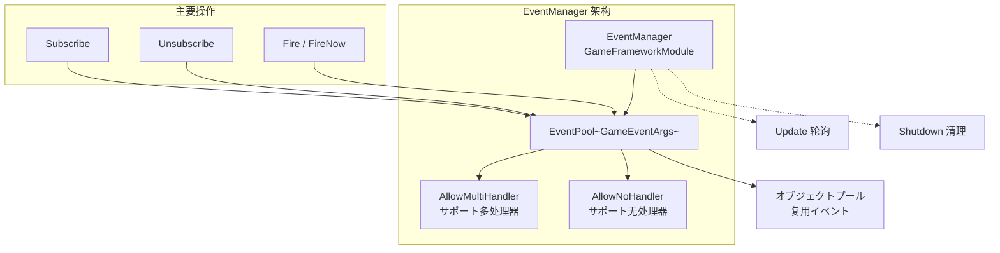
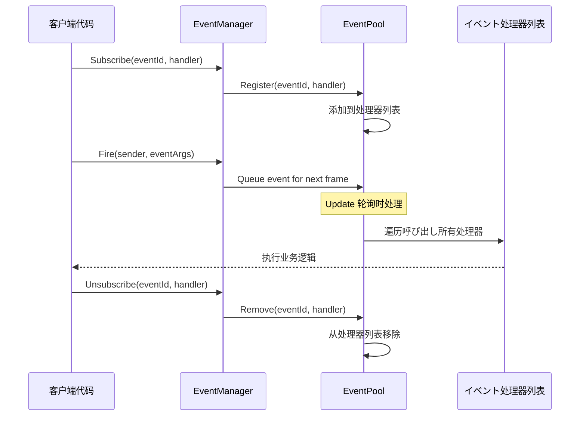
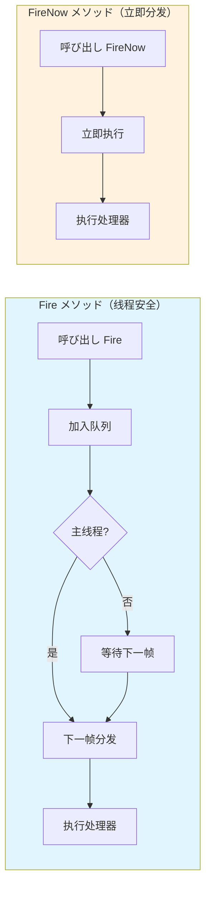

# EventManager

EventManager 是 GameFrameX イベント系统的コア管理器，负责ゲームイベント的订阅、取消订阅和派发管理。它基づく EventPool 実装，サポート线程安全的イベント分发和多处理器模式。

## 概要

EventManager 是 GameFrameX イベント系统的コアコンポーネント，を継承 `GameFrameworkModule` 并実装了 `IEventManager` インターフェース。它提供します一个强大的イベント系统，允许ゲーム中的不同模块を通じてイベント进行松耦合的通信。

EventManager 的コア機能包括：
- **イベント订阅与取消订阅**：を通じてイベント ID 注册或移除イベント处理函数
- **イベント派发**：サポート线程安全的延迟分发（`Fire`）和立即分发（`FireNow`）两种模式
- **イベント统计**：提供当前已订阅的イベント处理函数数量和イベント数量查询
- **默认处理器**：サポート設定默认イベント处理函数来捕获未明确订阅的イベント

> **注意**：EventManager 通常を通じて EventComponent 在 Unity シーン中使用。EventComponent 是 EventManager 的 Unity コンポーネント封装，提供します更友好的 Unity 集成インターフェース。
> 
> 有关 EventComponent 的详细信息，お願いします参阅 [EventComponent](./05.event-component.md) 文档。
> 
> 有关 GameEventArgs 的详细信息，お願いします参阅 [GameEventArgs](./07.game-event-args.md) 文档。

## 架构

EventManager 基づくイベント池（EventPool）実装，这是一种高效的イベント管理模式。EventPool サポート以下特性：



### 设计模式

EventManager 采用以下设计模式：

| 模式 | 应用 | 优势 |
|------|------|------|
| **オブジェクトプール模式** | EventPool 复用 GameEventArgs | 减少 GC，优化性能 |
| **观察者模式** | Subscribe/Publish 机制 | 解耦イベント发布者和订阅者 |
| **延迟执行模式** | Fire 延迟到下一帧分发 | 保证线程安全 |

## コアフロー

### イベント订阅与派发フロー



### イベント分发模式对比



## 使用例

### 基本使用

```csharp
// 定义自定义イベント参数
public class PlayerDeathEventArgs : GameEventArgs
{
    public int PlayerId { get; set; }
    public string Reason { get; set; }
    public override void Clear()
    {
        PlayerId = 0;
        Reason = string.Empty;
    }
}

// 订阅イベント
EventComponent eventComponent = UnityEngine.Object.FindObjectOfType<EventComponent>();
eventComponent.CheckSubscribe("player_death", OnPlayerDeath);

// イベント处理函数
private void OnPlayerDeath(object sender, GameEventArgs e)
{
    var args = (PlayerDeathEventArgs)e;
    UnityEngine.Debug.Log($"玩家 {args.PlayerId} 死亡: {args.Reason}");
}

// 抛出イベント
eventComponent.Fire(this, new PlayerDeathEventArgs 
{ 
    PlayerId = 1001, 
    Reason = "被怪物击杀" 
});

// 取消订阅
eventComponent.Unsubscribe("player_death", OnPlayerDeath);
```
> Source: [EventManager.cs](https://github.com/GameFrameX/com.gameframex.unity.event/blob/main/Runtime/Event/EventManager.cs#L98-L101)

### 使用空イベント（无需数据）

```csharp
// 订阅简单イベント（无需携带数据）
eventComponent.CheckSubscribe("game_start", OnGameStart);

// 抛出简单イベント
eventComponent.Fire(this, "game_start");

// イベント处理函数
private void OnGameStart(object sender, GameEventArgs e)
{
    UnityEngine.Debug.Log("ゲーム开始！");
}
```
> Source: [EventComponent.cs](https://github.com/GameFrameX/com.gameframex.unity.event/blob/main/Runtime/EventComponent.cs#L140-L144)

### 設定默认处理器

```csharp
// 設定默认处理器捕获所有未明确订阅的イベント
eventComponent.SetDefaultHandler(OnDefaultEvent);

// 默认イベント处理函数
private void OnDefaultEvent(object sender, GameEventArgs e)
{
    UnityEngine.Debug.Log($"收到未处理イベント: {e.Id}");
}
```
> Source: [EventManager.cs](https://github.com/GameFrameX/com.gameframex.unity.event/blob/main/Runtime/Event/EventManager.cs#L117-L120)

## API 参考

### プロパティ

#### `EventHandlerCount`

```csharp
public int EventHandlerCount { get; }
```

取得已订阅的イベント处理函数的总数量。

**返回值：** イベント处理函数的数量。

---

#### `EventCount`

```csharp
public int EventCount { get; }
```

取得已订阅的イベントクラス型数量（不同イベント ID 的数量）。

**返回值：** イベントクラス型的数量。

---

### メソッド

#### `Count`

```csharp
public int Count(string id)
```

取得指定イベント ID 的イベント处理函数数量。

**参数：**
- `id` (string): イベントクラス型编号

**返回值：** 指定イベント ID 的イベント处理函数数量。

> Source: [EventManager.cs#L77-L80](https://github.com/GameFrameX/com.gameframex.unity.event/blob/main/Runtime/Event/EventManager.cs#L77-L80)

---

#### `Check`

```csharp
public bool Check(string id, EventHandler<GameEventArgs> handler)
```

检查是否存在指定的イベント处理函数。

**参数：**
- `id` (string): イベントクラス型编号
- `handler` (EventHandler<GameEventArgs>): 要检查的イベント处理函数

**返回值：** 是否存在指定的イベント处理函数。

> Source: [EventManager.cs#L88-L91](https://github.com/GameFrameX/com.gameframex.unity.event/blob/main/Runtime/Event/EventManager.cs#L88-L91)

---

#### `Subscribe`

```csharp
public void Subscribe(string id, EventHandler<GameEventArgs> handler)
```

订阅指定イベント ID 的イベント处理函数。

**参数：**
- `id` (string): イベントクラス型编号
- `handler` (EventHandler<GameEventArgs>): 要订阅的イベント处理函数

**説明：** 
- 同一个イベント ID 可能订阅多个处理函数
- イベント触发时，所有订阅的处理函数都会被呼び出し

> Source: [EventManager.cs#L98-L101](https://github.com/GameFrameX/com.gameframex.unity.event/blob/main/Runtime/Event/EventManager.cs#L98-L101)

---

#### `Unsubscribe`

```csharp
public void Unsubscribe(string id, EventHandler<GameEventArgs> handler)
```

取消订阅指定イベント ID 的イベント处理函数。

**参数：**
- `id` (string): イベントクラス型编号
- `handler` (EventHandler<GameEventArgs>): 要取消订阅的イベント处理函数

**説明：** 如果イベント处理函数不存在，则不会执行任何操作。

> Source: [EventManager.cs#L108-L111](https://github.com/GameFrameX/com.gameframex.unity.event/blob/main/Runtime/Event/EventManager.cs#L108-L111)

---

#### `SetDefaultHandler`

```csharp
public void SetDefaultHandler(EventHandler<GameEventArgs> handler)
```

設定默认イベント处理函数。

**参数：**
- `handler` (EventHandler<GameEventArgs>): 要設定的默认イベント处理函数

**説明：** 默认イベント处理函数会在イベント没有找到对应的订阅处理器时被呼び出し。

> Source: [EventManager.cs#L117-L120](https://github.com/GameFrameX/com.gameframex.unity.event/blob/main/Runtime/Event/EventManager.cs#L117-L120)

---

#### `Fire`

```csharp
public void Fire(object sender, GameEventArgs e)
```

抛出イベント（线程安全模式）。

**参数：**
- `sender` (object): イベント发送者
- `e` (GameEventArgs): イベント参数

**説明：** 
- 此メソッド是线程安全的
- 即使在非主线程中呼び出し，也会保证在主线程中回调イベント处理函数
- イベント会在抛出后的下一帧分发

> Source: [EventManager.cs#L127-L130](https://github.com/GameFrameX/com.gameframex.unity.event/blob/main/Runtime/Event/EventManager.cs#L127-L130)

---

#### `FireNow`

```csharp
public void FireNow(object sender, GameEventArgs e)
```

抛出イベント（立即模式）。

**参数：**
- `sender` (object): イベント发送者
- `e` (GameEventArgs): イベント参数

**説明：** 
- 此メソッド不是线程安全的
- イベント会立刻分发，立即呼び出し所有订阅的处理函数
- 仅在确定呼び出し线程安全的情况下使用

> Source: [EventManager.cs#L137-L140](https://github.com/GameFrameX/com.gameframex.unity.event/blob/main/Runtime/Event/EventManager.cs#L137-L140)

---

## 线程安全性

EventManager 提供します两种イベント分发模式以满足不同的需求：

| メソッド | 线程安全 | 分发时机 | 适用シーン |
|------|----------|----------|----------|
| `Fire` | ✅ 安全 | 下一帧 | 跨线程イベント、后端通知前端 |
| `FireNow` | ❌ 不安全 | 立即 | 同一线程内同步逻辑 |

**最佳实践：**
- 在子线程中触发イベント时使用 `Fire`，确保回调在主线程执行
- 在主线程中必要立即响应时使用 `FireNow`
- 避免在 `FireNow` 的イベント处理函数中进行耗时操作

## 性能优化建议

1. **使用オブジェクトプール**：自定义イベントクラス应继承 `GameEventArgs` 并実装オブジェクトプールインターフェース，避免频繁作成对象
2. **及时取消订阅**：不再必要的イベント应及时取消订阅，减少遍历开销
3. **使用 `CheckSubscribe`**：推荐使用 `CheckSubscribe` メソッド自动处理重复订阅问题
4. **避免频繁派发**：对于高频イベント（如每帧更新），考虑合并或节流

## 関連リンク

- [EventComponent](./05.event-component.md) - Unity コンポーネント封装
- [GameEventArgs](./07.game-event-args.md) - イベント参数基クラス
- [コア概念：イベント系统架构](../04.features.md) - 了解更多设计原理
- [快速入门](../03.getting-started.md) - 开始使用イベント系统
