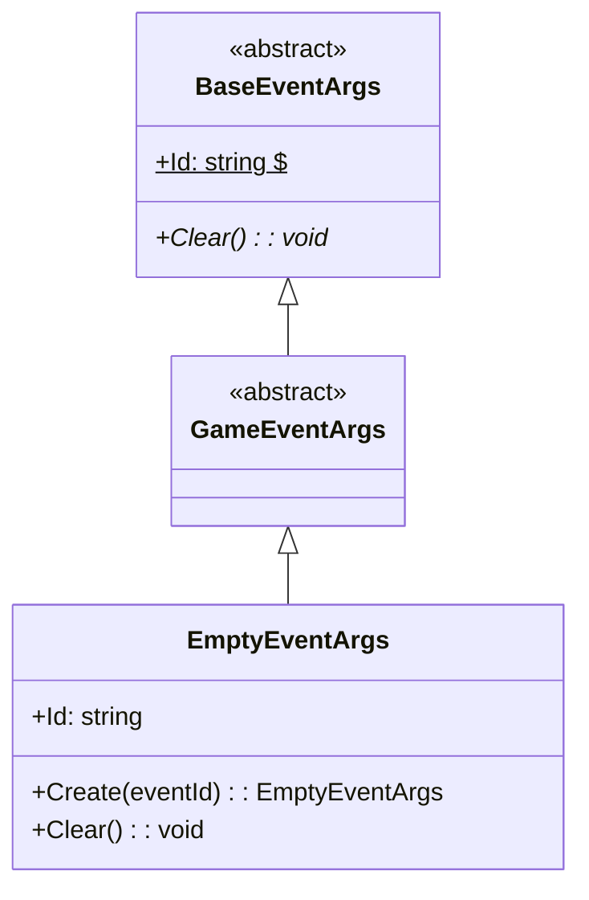
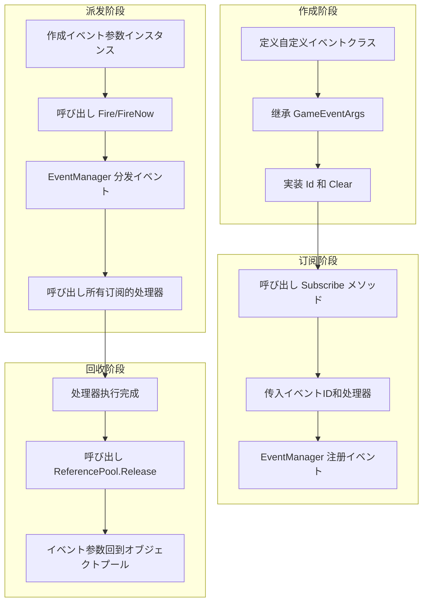

# GameEventArgs

ゲームイベント参数基クラス，に使用定义ゲームフレームワーク中所有イベント的基クラス。

## 概要

GameEventArgs 是 GameFrameX イベント系统的コア基クラス，所有自定义ゲームイベント都应继承此クラス。它を継承 BaseEventArgs，提供しますイベント系统的基本结构和インターフェース规范。

**设计意图**：を通じて建立统一的イベント参数基クラス，イベント系统能够以クラス型安全的方法处理各种ゲームイベント，同时保持イベント订阅和派发的灵活性。

## クラス层次结构



## コアコンセプト

### イベント ID

每个イベント参数都べき具有唯一的イベント标识符（Event ID），に使用イベント的订阅和识别。イベント ID 通常使用字符串クラス型，可能是：

- 预定义的常量字符串
- クラス型的完整名称（`typeof(T).FullName`）
- 自定义的业务逻辑标识

### オブジェクトプール

GameEventArgs 设计上サポートオブジェクトプール模式以优化性能。实际使用中，イベント参数通常を通じて `ReferencePool` 进行取得和回收：

```csharp
var eventArgs = ReferencePool.Acquire<EmptyEventArgs>();
// ... 使用イベント参数
ReferencePool.Release(eventArgs);
```

> Source: [EmptyEventArgs.cs](https://github.com/GameFrameX/com.gameframex.unity.event/blob/main/Runtime/EventArgs/EmptyEventArgs.cs#L32-L37)

## 作成自定义イベント参数

要作成自定义イベント参数クラス，必要继承 GameEventArgs 并実装必要成员。以下是 EmptyEventArgs 的完整実装示例：

```csharp
using GameFrameX.Runtime;

namespace GameFrameX.Event.Runtime
{
    /// <summary>
    /// 空イベント
    /// </summary>
    public sealed class EmptyEventArgs : GameEventArgs
    {
        private string _eventId = typeof(EmptyEventArgs).FullName;

        public override void Clear()
        {
        }

        public override string Id
        {
            get { return _eventId; }
        }

        /// <summary>
        /// 作成空イベント
        /// </summary>
        /// <param name="eventId">イベント编号</param>
        /// <returns>空イベント对象</returns>
        public static EmptyEventArgs Create(string eventId)
        {
            var eventArgs = ReferencePool.Acquire<EmptyEventArgs>();
            eventArgs.SetEventId(eventId);
            return eventArgs;
        }

        /// <summary>
        /// 設定イベント编号
        /// </summary>
        /// <param name="eventId"></param>
        private void SetEventId(string eventId)
        {
            _eventId = eventId;
        }
    }
}
```

> Source: [EmptyEventArgs.cs](https://github.com/GameFrameX/com.gameframex.unity.event/blob/main/Runtime/EventArgs/EmptyEventArgs.cs#L1-L48)

### 実装要点

1. **Id プロパティ**（必須）：返回イベント的唯一标识符
2. **Clear メソッド**（必須）：重置イベント参数ステータス，に使用对象回收时清理数据
3. **Create 静态メソッド**（推荐）：提供工厂メソッド作成イベントインスタンス，サポートオブジェクトプール

## イベント参数与イベント系统

GameEventArgs 在イベント系统中的使用フロー如下：



## 完整イベント示例

以下は带有数据载荷的自定义イベント参数示例：

```csharp
// 假设的自定义イベント参数示例（展示模式）
public class PlayerDieEventArgs : GameEventArgs
{
    private int _playerId;
    private string _deathReason;
    private Vector3 _deathPosition;

    public override void Clear()
    {
        _playerId = 0;
        _deathReason = string.Empty;
        _deathPosition = Vector3.zero;
    }

    public override string Id => "PlayerDie";

    public int PlayerId => _playerId;
    public string DeathReason => _deathReason;
    public Vector3 DeathPosition => _deathPosition;

    public static PlayerDieEventArgs Create(int playerId, string reason, Vector3 position)
    {
        var args = ReferencePool.Acquire<PlayerDieEventArgs>();
        args._playerId = playerId;
        args._deathReason = reason;
        args._deathPosition = position;
        return args;
    }
}
```

> 注：以上示例展示作成自定义イベント参数的模式，实际代码需に基づいて具体需求実装

## イベント派发方法

イベント系统提供两种派发方法：

| 方法 | メソッド | 线程安全 | 特点 |
|------|------|----------|------|
| 延迟派发 | `Fire(sender, args)` | ✅ 安全 | 在下一帧分发，适合跨线程呼び出し |
| 立即派发 | `FireNow(sender, args)` | ❌ 不安全 | 立即分发，性能更高但非线程安全 |

```csharp
// 延迟派发（线程安全）
eventComponent.Fire(this, EmptyEventArgs.Create("game_start"));

// 立即派发
eventComponent.FireNow(this, EmptyEventArgs.Create("game_start"));
```

> Source: [EventComponent.cs](https://github.com/GameFrameX/com.gameframex.unity.event/blob/main/Runtime/EventComponent.cs#L130-L154)

## API 参考

### `GameEventArgs`

ゲーム逻辑イベント基クラス。

**名前空間**: `GameFrameX.Event.Runtime`

**继承**: `BaseEventArgs`

**サブクラス**:

- `EmptyEventArgs`：空イベント実装

#### 成员

| 成员 | クラス型 | 説明 |
|------|------|------|
| `Id` | `string` | 取得イベント唯一标识符（抽象プロパティ） |
| `Clear()` | `void` | 重置イベントステータス（抽象メソッド） |

### `EmptyEventArgs`

空イベント実装，に使用不必要携带数据的イベント。

**名前空間**: `GameFrameX.Event.Runtime`

**继承**: `GameEventArgs`

#### メソッド

| メソッド | 返回クラス型 | 説明 |
|------|----------|------|
| `Create(eventId)` | `EmptyEventArgs` | 作成空イベントインスタンス |

## 関連リンク

- [EventComponent](./05.event-component.md)
- [EventManager](./06.event-manager.md)
- [イベント系统架构](./04.features.md)
- [快速入门](./03.getting-started.md)
