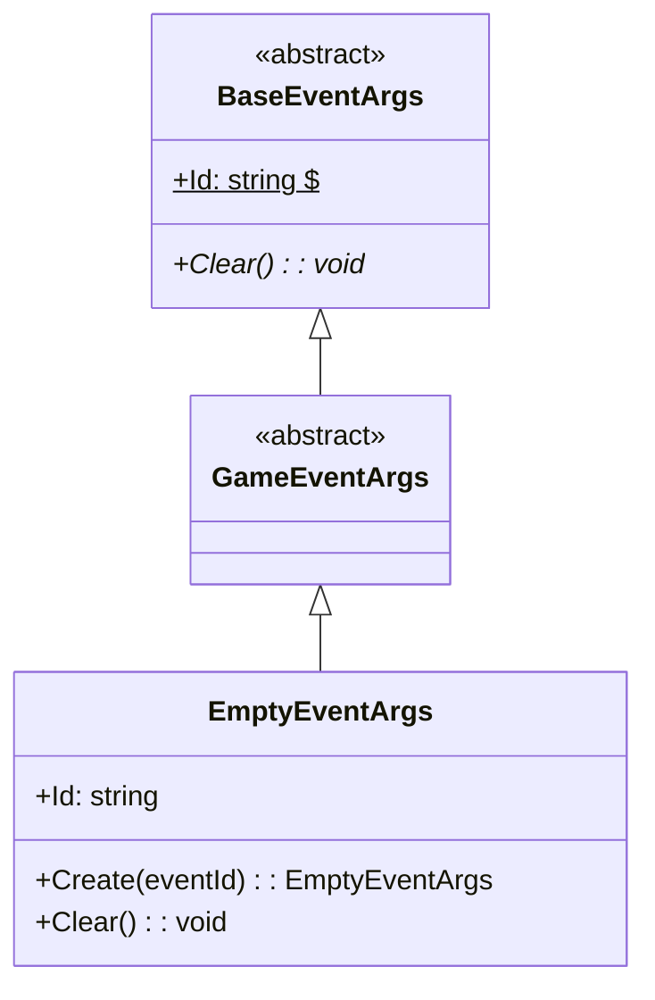
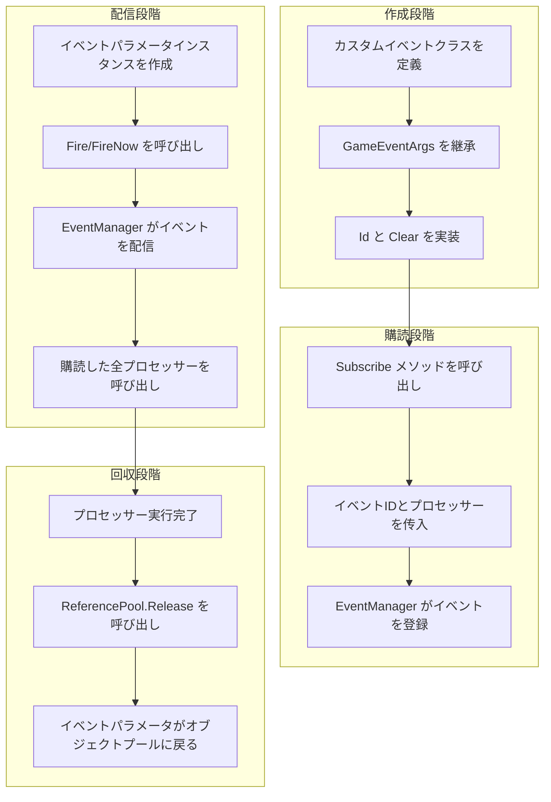

# GameEventArgs

ゲームイベントパラメータの基底クラスであり、ゲームフレームワーク内すべてのイベントの基底クラスを定義するために使用します。

## 概要

GameEventArgs は、GameFrameX イベントシステムの中核基底クラスであり、すべてのカスタムゲームイベントは、このクラスを継承する必要があります。BaseEventArgs を継承し、イベントシステムの基本構造とインターフェース規範を提供します。

**設計意図**：統一されたイベントパラメータ基底クラスを確立することで、イベントシステムは型安全な方法で各种ゲームイベントを処理でき、同時にイベント購読者と配信の柔軟性を維持できます。

## クラス階層構造



## コアコンセプト

### イベント ID

各イベントパラメータには唯一のイベント識別子（Event ID）が必要であり、イベントの購読者と識別に使用されます。イベント ID は通常文字列型を使用し、以下を含めます：

- 事前定義された定数文字列
- 型の完全名（`typeof(T).FullName`）
- カスタムビジネスロジック識別子

### オブジェクトプール

GameEventArgs は設計上、パフォーマンスを最適化するためにオブジェクトプールモードをサポートします。実際の使用では、イベントパラメータは通常 `ReferencePool` を通じて取得と回収を行います：

```csharp
var eventArgs = ReferencePool.Acquire<EmptyEventArgs>();
// ... イベントパラメータを使用
ReferencePool.Release(eventArgs);
```

> Source: [EmptyEventArgs.cs](https://github.com/GameFrameX/com.gameframex.unity.event/blob/main/Runtime/EventArgs/EmptyEventArgs.cs#L32-L37)

## カスタムイベントパラメータの作成

カスタムイベントパラメータクラスを作成するには、GameEventArgs を継承し必要なメンバーを実装する必要があります。以下は EmptyEventArgs の完全な実装例です：

```csharp
using GameFrameX.Runtime;

namespace GameFrameX.Event.Runtime
{
    /// <summary>
    /// 空イベント
    /// </summary>
    public sealed class EmptyEventArgs : GameEventArgs
    {
        private string _eventId = typeof(EmptyEventArgs).FullName;

        public override void Clear()
        {
        }

        public override string Id
        {
            get { return _eventId; }
        }

        /// <summary>
        /// 空イベントを作成
        /// </summary>
        /// <param name="eventId">イベント番号</param>
        /// <returns>空イベントオブジェクト</returns>
        public static EmptyEventArgs Create(string eventId)
        {
            var eventArgs = ReferencePool.Acquire<EmptyEventArgs>();
            eventArgs.SetEventId(eventId);
            return eventArgs;
        }

        /// <summary>
        /// イベント番号を設定
        /// </summary>
        /// <param name="eventId"></param>
        private void SetEventId(string eventId)
        {
            _eventId = eventId;
        }
    }
}
```

> Source: [EmptyEventArgs.cs](https://github.com/GameFrameX/com.gameframex.unity.event/blob/main/Runtime/EventArgs/EmptyEventArgs.cs#L1-L48)

### 実装ポイント

1. **Id プロパティ**（必須）：イベントの唯一の識別子を返す
2. **Clear メソッド**（必須）：イベントパラメータステータスをリセットし、オブジェクト回収時にデータをクリーンアップ
3. **Create 静的メソッド**（推奨）：ファクトリメソッドでイベントインスタンスを作成、オブジェクトプールをサポート

## イベントパラメータとイベントシステム

GameEventArgs のイベントシステムにおける使用フローは以下の通りです：



## 完全イベント例

以下はデータペイロード付きのカスタムイベントパラメータ例です：

```csharp
// カスタムイベントパラメータの例（パターンを示す）
public class PlayerDieEventArgs : GameEventArgs
{
    private int _playerId;
    private string _deathReason;
    private Vector3 _deathPosition;

    public override void Clear()
    {
        _playerId = 0;
        _deathReason = string.Empty;
        _deathPosition = Vector3.zero;
    }

    public override string Id => "PlayerDie";

    public int PlayerId => _playerId;
    public string DeathReason => _deathReason;
    public Vector3 DeathPosition => _deathPosition;

    public static PlayerDieEventArgs Create(int playerId, string reason, Vector3 position)
    {
        var args = ReferencePool.Acquire<PlayerDieEventArgs>();
        args._playerId = playerId;
        args._deathReason = reason;
        args._deathPosition = position;
        return args;
    }
}
```

> 注：以上の例はカスタムイベントパラメータの作成パターンを示すものであり、実際のコードは具体的な需求に基づいて実装する必要があります

## イベント配信方法

イベントシステムは2つの配信方法を提供します：

| 方法 | メソッド | スレッドセーフ | 特徴 |
|------|------|----------|------|
| 遅延配信 | `Fire(sender, args)` | ✅ 安全 | 次のフレームで配信、クロースレッド呼び出しに適合 |
| 即時配信 | `FireNow(sender, args)` | ❌ 非安全 | 即時配信、パフォーマンスは高いがスレッドセーフではない |

```csharp
// 遅延配信（スレッドセーフ）
eventComponent.Fire(this, EmptyEventArgs.Create("game_start"));

// 即時配信
eventComponent.FireNow(this, EmptyEventArgs.Create("game_start"));
```

> Source: [EventComponent.cs](https://github.com/GameFrameX/com.gameframex.unity.event/blob/main/Runtime/EventComponent.cs#L130-L154)

## API リファレンス

### `GameEventArgs`

ゲームロジックイベントの基底クラス。

**名前空間**: `GameFrameX.Event.Runtime`

**継承**: `BaseEventArgs`

**サブクラス**:

- `EmptyEventArgs`：空イベント実装

#### メンバー

| メンバー | タイプ | 説明 |
|------|------|------|
| `Id` | `string` | イベントの唯一の識別子を取得（抽象プロパティ） |
| `Clear()` | `void` | イベントステータスをリセット（抽象メソッド） |

### `EmptyEventArgs`

空イベント実装であり、データの携带が不要なイベントに使用。

**名前空間**: `GameFrameX.Event.Runtime`

**継承**: `GameEventArgs`

#### メソッド

| メソッド | 返回タイプ | 説明 |
|------|----------|------|
| `Create(eventId)` | `EmptyEventArgs` | 空イベントインスタンスを作成 |

## 関連リンク

- [EventComponent](./05.event-component.md)
- [EventManager](./06.event-manager.md)
- [イベントシステムアーキテクチャ](./04.features.md)
- [クイックスタート](./03.getting-started.md)
