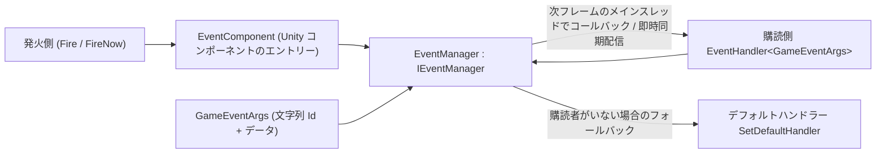

# パッケージ概要:GameFrameX Event とは

GameFrameX Event(パッケージ名 `com.gameframex.unity.event`)は、GameFrameX フレームワークのイベントシステムコンポーネントです:**文字列 ID** ベースのイベントバスであり、モジュール間の疎結合通信に使用されます。スレッドセーフな遅延配信(`Fire`、次フレームのメインスレッドでコールバック)、即時配信(`FireNow`)をサポートし、デフォルトハンドラーで未購読のイベントをフォールバック処理できます。本パッケージには依存パッケージが一切ありません。

提供される機能：

- 文字列 ID ベースのイベント購読 / 購読解除
- `Fire` — スレッドセーフな遅延配信(次フレームのメインスレッドでコールバック)
- `FireNow` — 即時の同期配信
- `Fire(sender, eventId)` — カスタムイベント引数が不要なショートカット
- `Check` / `CheckSubscribe` / `CheckUnsubscribe` — 存在確認、存在しない場合の自動購読、存在する場合の安全な購読解除
- `Count` / `EventHandlerCount` / `EventCount` — ハンドラー関数の統計
- デフォルトハンドラーによる未購読イベントのフォールバック処理

## クイックスタート

1. パッケージのインストール(いずれか一つを選択)：Unity プロジェクトの `Packages/manifest.json` を編集して scoped registry を追加し依存関係を宣言する、または `dependencies` ノードの下に直接 Git URL を追加する、あるいは Unity の `Package Manager` で Git URL から追加する、もしくはリポジトリをダウンロードして `Packages` ディレクトリに配置します。

   ```json
   {
     "scopedRegistries": [
       {
         "name": "GameFrameX",
         "url": "https://gameframex.upm.alianblank.uk",
         "scopes": [
           "com.gameframex"
         ]
       }
     ],
     "dependencies": {
       "com.gameframex.unity.event": "1.1.1"
     }
   }
   ```

   出典: [README.zh-CN.md](https://github.com/GameFrameX/com.gameframex.unity.event/blob/main/README.zh-CN.md#L42-L67)

2. カスタムイベント引数クラスを定義します。`GameEventArgs` を継承し、`Id` で文字列のイベント ID を返し、参照プールと組み合わせて再利用します:

   ```csharp
   public class LevelUpEventArgs : GameEventArgs
   {
       public override string Id => "level_up";
       public int Level { get; private set; }

       public static LevelUpEventArgs Create(int level)
       {
           var args = ReferencePool.Acquire<LevelUpEventArgs>();
           args.Level = level;
           return args;
       }

       public override void Clear()
       {
           base.Clear();
           Level = 0;
       }
   }
   ```

   出典: [README.zh-CN.md](https://github.com/GameFrameX/com.gameframex.unity.event/blob/main/README.zh-CN.md#L75-L94)

3. `EventComponent` を通じて購読 / 購読解除を行います(以下の例の `eventComponent` はこのコンポーネントへの参照です):

   ```csharp
   eventComponent.Subscribe("level_up", OnLevelUp);
   eventComponent.Unsubscribe("level_up", OnLevelUp);

   void OnLevelUp(object sender, GameEventArgs e)
   {
       var args = (LevelUpEventArgs)e;
       Debug.Log($"レベル {args.Level} にアップしました");
   }
   ```

   出典: [README.zh-CN.md](https://github.com/GameFrameX/com.gameframex.unity.event/blob/main/README.zh-CN.md#L99-L107)

4. イベントを発火します——遅延モード(スレッドセーフ、次フレームのメインスレッドでコールバック)、即時モード(メインスレッドのみ)、ショートカット(カスタム引数不要)の 3 種類から選択：

   ```csharp
   eventComponent.Fire(this, LevelUpEventArgs.Create(5));      // 遅延モード
   eventComponent.FireNow(this, LevelUpEventArgs.Create(5));   // 即時モード
   eventComponent.Fire(this, "level_up");                      // ショートカット
   ```

   出典： [README.zh-CN.md](https://github.com/GameFrameX/com.gameframex.unity.event/blob/main/README.zh-CN.md#L122-L140)

5. (任意)デフォルトハンドラーを設定し、どのハンドラーにも購読されていないイベントをフォールバック処理します:

   ```csharp
   eventComponent.SetDefaultHandler(OnDefaultEvent);

   void OnDefaultEvent(object sender, GameEventArgs e)
   {
       Debug.Log($"未処理のイベント: {e.Id}");
   }
   ```

   出典： [README.zh-CN.md](https://github.com/GameFrameX/com.gameframex.unity.event/blob/main/README.zh-CN.md#L142-L151)

よく使う API(`IEventManager` インターフェースで定義され、`EventComponent` が同名の呼び出しエントリーを外部に公開しています):

| メンバー | シグネチャ | 説明 |
|------|------|------|
| `EventHandlerCount` | `int { get; }` | イベントハンドラー関数の総数を取得 |
| `EventCount` | `int { get; }` | イベント数を取得 |
| `Count` | `int Count(string id)` | 指定したイベントのハンドラー関数の数を取得 |
| `Check` | `bool Check(string id, EventHandler<GameEventArgs> handler)` | イベントハンドラー関数が存在するか確認 |
| `Subscribe` | `void Subscribe(string id, EventHandler<GameEventArgs> handler)` | イベントハンドラー関数を購読 |
| `Unsubscribe` | `void Unsubscribe(string id, EventHandler<GameEventArgs> handler)` | イベントハンドラー関数の購読を解除 |
| `CheckUnsubscribe` | `void CheckUnsubscribe(string id, EventHandler<GameEventArgs> handler)` | 確認して購読解除。handler が存在しない場合は何もしない |
| `SetDefaultHandler` | `void SetDefaultHandler(EventHandler<GameEventArgs> handler)` | デフォルトのイベントハンドラー関数を設定 |
| `Fire` | `void Fire(object sender, GameEventArgs e)` | スレッドセーフな遅延発火。メインスレッド以外から発火しても、メインスレッドでのコールバックを保証し、イベントは次フレームで配信される |
| `FireNow` | `void FireNow(object sender, GameEventArgs e)` | 即時に発火して同期配信。スレッドセーフではない |

出典： [IEventManager.cs](https://github.com/GameFrameX/com.gameframex.unity.event/blob/main/Runtime/Event/IEventManager.cs#L38-L105)

## 動作原理の概要

イベントは `EventComponent`(Unity コンポーネントのエントリー)からイベントマネージャー `EventManager`(`IEventManager` の実装)に渡され、一元処理されます:購読側は文字列 ID ごとに `EventHandler<GameEventArgs>` を登録し、発火側はデータを保持する `GameEventArgs` をイベントバスに渡します。`Fire` はスレッドセーフな遅延キューを通って次フレームのメインスレッドで配信され、`FireNow` は即時に同期配信され、購読者のいないイベントはデフォルトハンドラーによるフォールバック処理に委ねられます。



リポジトリのソース構成一覧：

| パス | 役割 |
|------|------|
| `Runtime/EventComponent.cs` | Unity コンポーネントのエントリー。購読 / 発火などの呼び出しを外部に公開 |
| `Runtime/Event/EventManager.cs` | イベントマネージャーの実装 |
| `Runtime/Event/IEventManager.cs` | イベントマネージャーのインターフェース(API 契約) |
| `Runtime/EventArgs/GameEventArgs.cs` | イベント引数の基底クラス(文字列 `Id`) |
| `Runtime/EventArgs/EmptyEventArgs.cs` | 空のイベント引数 |
| `Runtime/GameFrameXEventCroppingHelper.cs` | ストリッピング(コードストリッピング)補助 |
| `Editor/Inspector/EventComponentInspector.cs` | エディターにおける `EventComponent` の Inspector |

出典： [IEventManager.cs](https://github.com/GameFrameX/com.gameframex.unity.event/blob/main/Runtime/Event/IEventManager.cs#L38-L105)

## よくある間違い

- **メインスレッド以外で `FireNow` を呼び出す**:`FireNow` はスレッドセーフではなく、即座に同期配信されます。スレッドをまたいでイベントを発火する場合は `Fire` を使ってください。こちらはメインスレッドでのコールバック(次フレームでの配信)を保証します。
- **サブスレッドで `Fire` を発火した後、同じフレームで副作用を読み取る**:`Fire` は遅延配信であり、イベントは発火後の**次フレーム**にコールバックされます。発火直後にハンドラーが実行済みであると想定しないでください。
- **重複購読 / 存在しないハンドラーの購読解除**:`Check` で存在を確認するか、`CheckSubscribe`(存在しない場合にのみ購読)、`CheckUnsubscribe`(存在する場合にのみ解除、存在しない場合は何もしない)をそのまま使って例外を回避してください。
- **イベント引数の再利用を実装し忘れる**:`GameEventArgs` は参照プールと組み合わせて使用します。サンプルでは `Create` 内で `ReferencePool.Acquire` を呼び、`Clear` 内でフィールドをリセットし、発火後はフレームワークが回収して再利用します。

出典： [README.zh-CN.md](https://github.com/GameFrameX/com.gameframex.unity.event/blob/main/README.zh-CN.md#L109-L159)

## 次のステップ

- 各 API の詳細なシグネチャと説明は、[IEventManager.cs](https://github.com/GameFrameX/com.gameframex.unity.event/blob/main/Runtime/Event/IEventManager.cs#L38-L105) のインターフェースソースを参照してください。
- 完全な使用例(確認 / 統計 / デフォルトハンドラー)は、[README.zh-CN.md](https://github.com/GameFrameX/com.gameframex.unity.event/blob/main/README.zh-CN.md#L71-L159) を参照してください。
- 公式ドキュメント:<https://gameframex.doc.alianblank.com>;更新履歴は [Releases](https://github.com/gameframex/com.gameframex.unity.event/releases) を参照してください。