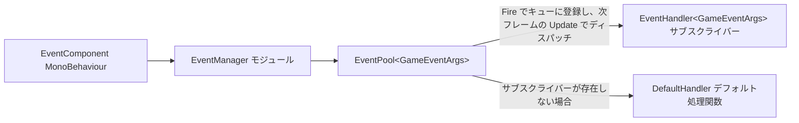

# 仕組み：イベントディスパッチとモジュールライフサイクル

本ページでは、Event モジュール内部で 1 回のイベントディスパッチがどのように完了するか、また `EventManager` がフレームワークモジュールとして初期化・ポーリング・シャットダウンされる流れについて説明します。要点：`Fire` はキューに登録し、次のフレームで `Update` 内でディスパッチされます（スレッドセーフ）。`FireNow` は即座に同期的にディスパッチします（非スレッドセーフ）。すべての転送は `EventComponent` → `EventManager` → `EventPool<GameEventArgs>` の 3 層を経由して完了します。

## イベントディスパッチの流れ

1 回の `Fire` の完全な経路はわずか 4 ステップです：

1. ゲームロジックコードが `EventComponent.Fire(sender, e)` を呼び出すと、コンポーネントはそのリクエストをそのまま内部の `IEventManager` に転送します（`GameFrameworkEntry.GetModule<IEventManager>()` によって取得。`EventComponent.Awake` を参照）。
2. `EventManager.Fire` はイベントを内部の `EventPool<GameEventArgs>` キューに追加し、**いかなる処理関数のコールバックも即座には行いません**。
3. フレームワークが毎フレームモジュールをポーリングする際、`EventManager.Update` は `m_EventPool.Update(elapseSeconds, realElapseSeconds)` を呼び出し、キュー内のイベントをキュー登録順に**メインスレッド**で対応する `id` のサブスクライバーへディスパッチします。
4. ディスパッチ完了後、イベント引数は参照プールに返却されます（`GameEventArgs` は `BaseEventArgs` から派生しており、空イベントは `ReferencePool.Acquire<EmptyEventArgs>()` によって生成されます）。



2 層転送の実際のコードは以下の通りです——コンポーネント層は委譲のみを行い、マネージャー層が本物の `EventPool` を保持しています：

```csharp
public void Fire(object sender, GameEventArgs e)
{
    m_EventManager.Fire(sender, e);
}
```

出典：[EventComponent.cs](https://github.com/GameFrameX/com.gameframex.unity.event/blob/main/Runtime/EventComponent.cs#L147-L150)

```csharp
public sealed class EventManager : GameFrameworkModule, IEventManager
{
    private readonly EventPool<GameEventArgs> m_EventPool;

    public EventManager()
    {
        m_EventPool = new EventPool<GameEventArgs>(EventPoolMode.AllowNoHandler | EventPoolMode.AllowMultiHandler);
    }
```

出典：[EventManager.cs](https://github.com/GameFrameX/com.gameframex.unity.event/blob/main/Runtime/Event/EventManager.cs#L39-L49)

コンストラクターで渡される `EventPoolMode` フラグの組み合わせが、このモジュールのディスパッチ動作を決定します：`AllowNoHandler` はイベントにサブスクライバーが 1 つも存在しなくてもエラーにならないことを許可し、`AllowMultiHandler` は同じ `id` に複数の処理関数を紐付けることを許可します。

## 2 種類の発行方法の違い

| 方法 | ディスパッチのタイミング | スレッドセーフ | 適用シーン |
|------|----------|----------|----------|
| `Fire(sender, e)` | 発行後の次フレーム | ○（サブスレッドから発行してもメインスレッドでのコールバックを保証） | 通常のゲームロジックイベント |
| `FireNow(sender, e)` | 即座に同期的にディスパッチ | ×（メインスレッドからのみ呼び出し可能） | その場でコールバック結果を取得する必要があるシーン |
| `Fire(sender, eventId)` | `Fire` と同じ | ○ | 引数なしイベント。内部で自動的に `EmptyEventArgs` を構築 |

`Fire(object sender, string eventId)` オーバーロードはイベント ID が空でないことを検証し、参照プールから空イベントオブジェクトを 1 つ取得します：

```csharp
public void Fire(object sender, string eventId)
{
    GameFrameworkGuard.NotNullOrEmpty(eventId, nameof(eventId));
    m_EventManager.Fire(sender, EmptyEventArgs.Create(eventId));
}
```

出典：[EventComponent.cs](https://github.com/GameFrameX/com.gameframex.unity.event/blob/main/Runtime/EventComponent.cs#L157-L161)

`EmptyEventArgs.Create` の実装は、参照プールの経路を裏付けています：

```csharp
public static EmptyEventArgs Create(string eventId)
{
    var eventArgs = ReferencePool.Acquire<EmptyEventArgs>();
    eventArgs.SetEventId(eventId);
    return eventArgs;
}
```

出典：[EmptyEventArgs.cs](https://github.com/GameFrameX/com.gameframex.unity.event/blob/main/Runtime/EventArgs/EmptyEventArgs.cs#L33-L38)

## モジュールライフサイクル

`EventManager` は `GameFrameworkModule` を継承しており、`GameFrameworkEntry` によって統一的に駆動されます。3 つの主要なライフサイクルのタイミングは、いずれも `EventPool` への単純なパススルーです：

| ライフサイクル段階 | トリガー | EventManager での実装 |
|--------------|--------|----------------------|
| 初期化 | コンストラクター | `EventPool<GameEventArgs>` を生成し、`EventPoolMode` を設定 |
| 毎フレームのポーリング | フレームワークのメインループ | `Update` が `m_EventPool.Update(...)` を呼び出し、滞留イベントをディスパッチ |
| シャットダウン | フレームワークの終了処理 | `Shutdown` が `m_EventPool.Shutdown()` を呼び出し、サブスクライブとキューをクリア |

```csharp
/// <summary>ゲームフレームワークモジュールの優先度を取得します。</summary>
/// <remarks>優先度の高いモジュールほど先にポーリングされ、シャットダウン処理は後に行われます。</remarks>
protected override int Priority
{
    get { return 7; }
}

protected override void Update(float elapseSeconds, float realElapseSeconds)
{
    m_EventPool.Update(elapseSeconds, realElapseSeconds);
}

protected override void Shutdown()
{
    m_EventPool.Shutdown();
}
```

出典：[EventManager.cs](https://github.com/GameFrameX/com.gameframex.unity.event/blob/main/Runtime/Event/EventManager.cs#L67-L92)

優先度は **7** です。数値が大きいほど早くポーリングされ、遅くシャットダウンされます。また、シーン内の `EventComponent` には `[GameFrameXAutoComponent(-7000)]` 属性が付いており、Unity 側の MonoBehaviour とこのモジュールとの橋渡しを担当します。`Awake` 内で `GameFrameworkEntry.GetModule<IEventManager>()` を通じてマネージャーインスタンスを取得し、取得できなかった場合は `Log.Fatal("Event manager is invalid.")` を出力します。

```csharp
protected override void Awake()
{
    ImplementationComponentType = Utility.Assembly.GetType(componentType);
    InterfaceComponentType = typeof(IEventManager);
    base.Awake();
    m_EventManager = GameFrameworkEntry.GetModule<IEventManager>();
    if (m_EventManager == null)
    {
        Log.Fatal("Event manager is invalid.");
        return;
    }
}
```

出典：[EventComponent.cs](https://github.com/GameFrameX/com.gameframex.unity.event/blob/main/Runtime/EventComponent.cs#L66-L77)

したがって、利用者から見た完全なシーケンスは次の通りです：シーンのロード → `EventComponent.Awake` でモジュールを取得 → ゲームロジックは任意のタイミングで `Subscribe` / `Fire` → 毎フレーム `Update` でディスパッチ → 終了時に `Shutdown` でクリーンアップ。

## サブスクライブとサブスクライブ解除の内部動作

サブスクライブ、サブスクライブ解除、チェックはいずれも `EventPool` の処理関数テーブルを直接操作しており、`EventManager` 自身はゲームロジックの状態を一切保持しません：

```csharp
public void Subscribe(string id, EventHandler<GameEventArgs> handler)
{
    m_EventPool.Subscribe(id, handler);
}

public void CheckUnsubscribe(string id, EventHandler<GameEventArgs> handler)
{
    if (m_EventPool.Check(id, handler))
    {
        m_EventPool.Unsubscribe(id, handler);
    }
}
```

出典：[EventManager.cs](https://github.com/GameFrameX/com.gameframex.unity.event/blob/main/Runtime/Event/EventManager.cs#L120-L146)

コンポーネント層には、重複サブスクライブを防ぐ `CheckSubscribe` も用意されています——先に `Check` してから `Subscribe` することで、同じデリゲートが 2 回登録され、1 回の `Fire` で複数回コールバックが発生するのを防ぎます：

```csharp
public void CheckSubscribe(string id, EventHandler<GameEventArgs> handler)
{
    if (!Check(id, handler))
    {
        m_EventManager.Subscribe(id, handler);
    }
}
```

出典：[EventComponent.cs](https://github.com/GameFrameX/com.gameframex.unity.event/blob/main/Runtime/EventComponent.cs#L105-L111)

さらに、`SetDefaultHandler(handler)` を呼び出すことでデフォルト処理関数を設定できます：あるイベント `id` にサブスクライバーが 1 つも存在しない場合、イベントはデフォルト処理関数に渡されます。デバッグ時に「発行したのに受け取る側がいない」イベントを追跡するのによく使われます。`EventManager` が公開している `EventHandlerCount` / `EventCount` / `Count(id)` で、実行時にキューとサブスクライブの規模を観察できます。

## イベント引数の継承チェーン

```csharp
public abstract class GameEventArgs : BaseEventArgs
{
}
```

出典：[GameEventArgs.cs](https://github.com/GameFrameX/com.gameframex.unity.event/blob/main/Runtime/EventArgs/GameEventArgs.cs#L38-L40)

ディスパッチ可能なすべてのイベント引数は `GameEventArgs` を継承しなければなりません（その基底クラス `BaseEventArgs` は GameFrameX ランタイムライブラリに由来し、本リポジトリには含まれていません。`BaseEventArgs` と `EventPool` の完全な実装の詳細を含むソースコードは本リポジトリでは提供されていません）。リポジトリに同梱されている `EmptyEventArgs` は引数なしイベント用で、ゲーム側でカスタムイベントを定義する場合も同様です：`GameEventArgs` を継承し、`Id` と `Clear` を実装します。発行後は参照プールによって再利用され、GC を回避できます。

## 関連リンク

- ゲームロジックコードでイベントをサブスクライブ・発行する方法については、『イベントのサブスクライブと発行方法』タスクページ（同一ディレクトリ）を参照してください。
- コンポーネントのアタッチと Inspector の情報については、[EventComponent.cs](https://github.com/GameFrameX/com.gameframex.unity.event/blob/main/Runtime/EventComponent.cs) と [EventComponentInspector.cs](https://github.com/GameFrameX/com.gameframex.unity.event/blob/main/Editor/Inspector/EventComponentInspector.cs) を参照してください。
- マネージャーの完全な API については、[IEventManager.cs](https://github.com/GameFrameX/com.gameframex.unity.event/blob/main/Runtime/Event/IEventManager.cs) と [EventManager.cs](https://github.com/GameFrameX/com.gameframex.unity.event/blob/main/Runtime/Event/EventManager.cs) を参照してください。