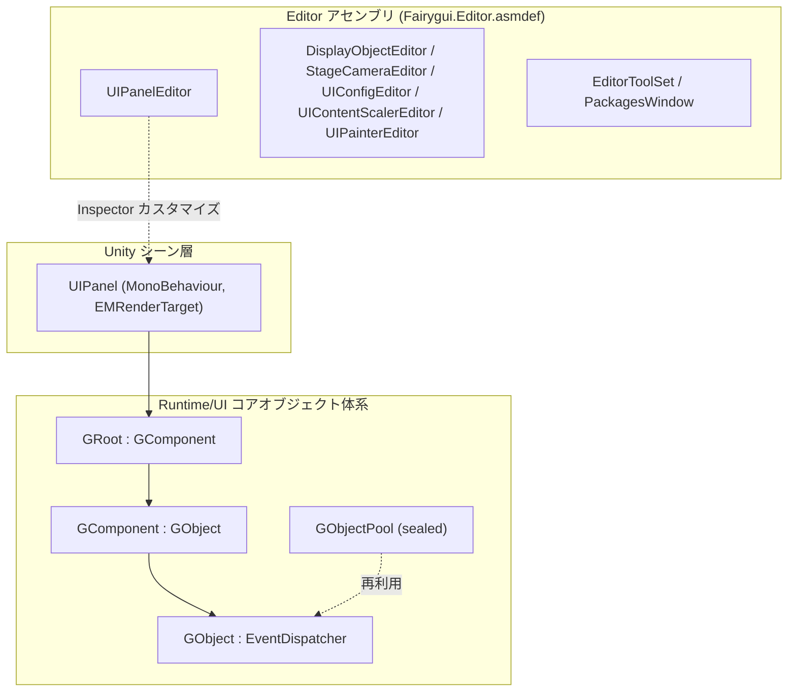

# 動作原理:ランタイム構造とモジュール構成

FairyGUI Unity ランタイム(パッケージ名 `com.gameframex.unity.fairygui.unity`、バージョン 5.3.5、FairyGUI 公式ソースコードベース)は 2 つの主要部分で構成されます:**Runtime** ディレクトリは純粋な C# による UI コアオブジェクト体系を担い、**Editor** ディレクトリは Unity エディター拡張を担います。UI オブジェクトは `GObject` をルートとし、`GComponent → GRoot` へと階層的に組み合わされ、最終的に Unity シーン内の `UIPanel`(MonoBehaviour)によってマウントされ表示されます。

## パッケージ基本情報

| 項目 | 値 |
|------|------|
| パッケージ名 | `com.gameframex.unity.fairygui.unity` |
| 表示名 | FairyGUI |
| バージョン | 5.3.5 |
| 最低 Unity バージョン | 2019.4 |
| Samples | パッケージ内蔵の Samples サンプル(displayName: `Samples`) |

上記の情報は [package.json](https://github.com/GameFrameX/com.gameframex.unity.fairygui.unity/blob/main/package.json#L2-L10) によるものです。

## ディレクトリとモジュール構成

| ディレクトリ/モジュール | 内容 | 主要ファイルの例 |
|------|------|------|
| `Runtime/UI` | UI オブジェクト体系のコア:基本オブジェクト、コンポーネント、ルートノード、オブジェクトプール、パネルのマウント | [GObject.cs](https://github.com/GameFrameX/com.gameframex.unity.fairygui.unity/blob/main/Runtime/UI/GObject.cs) |
| `Editor` | エディター拡張:各コンポーネントの Inspector カスタマイズとツールウィンドウ | [UIPanelEditor.cs](https://github.com/GameFrameX/com.gameframex.unity.fairygui.unity/blob/main/Editor/UIPanelEditor.cs) |

`Editor` ディレクトリ配下で確認されているエディター拡張(いずれも名前空間 `FairyGUI.Editor` に位置し、独立した [Fairygui.Editor.asmdef](https://github.com/GameFrameX/com.gameframex.unity.fairygui.unity/blob/main/Editor/Fairygui.Editor.asmdef) によってアセンブリ境界が定義されます):

- `DisplayObjectEditor` — 表示オブジェクトの Inspector カスタマイズ
- `StageCameraEditor` — ステージカメラの Inspector カスタマイズ
- `UIConfigEditor` — UI 設定の Inspector カスタマイズ
- `UIContentScalerEditor` — コンテンツスケーリング設定の Inspector カスタマイズ
- `UIPainterEditor` — UI Painter の Inspector カスタマイズ
- `UIPanelEditor` — `UIPanel` コンポーネントの Inspector カスタマイズ
- `EditorToolSet` / `PackagesWindow` — エディター用ツールセットとパッケージ管理ウィンドウ

## UI オブジェクトのクラス階層

ランタイムの UI オブジェクトはすべて `Runtime/UI` に配置されており、継承関係は以下の通りです(コードはソースコード原文です):

```csharp
public class GObject : EventDispatcher
```

Source: [GObject.cs](https://github.com/GameFrameX/com.gameframex.unity.fairygui.unity/blob/main/Runtime/UI/GObject.cs#L7)

```csharp
public class GComponent : GObject
```

Source: [GComponent.cs](https://github.com/GameFrameX/com.gameframex.unity.fairygui.unity/blob/main/Runtime/UI/GComponent.cs#L14)

```csharp
public class GRoot : GComponent
```

Source: [GRoot.cs](https://github.com/GameFrameX/com.gameframex.unity.fairygui.unity/blob/main/Runtime/UI/GRoot.cs#L10)

```csharp
public sealed class GObjectPool
```

Source: [GObjectPool.cs](https://github.com/GameFrameX/com.gameframex.unity.fairygui.unity/blob/main/Runtime/UI/GObjectPool.cs#L10)

階層の意味：

- **`GObject`**:すべての UI オブジェクトの基底クラス。イベントディスパッチャー `EventDispatcher` を継承し、イベント処理を統一しています。
- **`GComponent`**:コンテナコンポーネント。子 `GObject` を保持・管理でき、コンポジットツリーの中間層を構成します。
- **`GRoot`**:ルートコンテナ。`GComponent` を継承し、UI ツリーの最上位エントリです。
- **`GObjectPool`**(sealed):オブジェクトプール。UI オブジェクトの再利用に使用されます。

## Unity シーンへのマウント：UIPanel

`Runtime` 内の UI オブジェクトツリーを Unity シーンに表示するには、MonoBehaviour コンポーネント `UIPanel` を GameObject にマウントする必要があります:

```csharp
[AddComponentMenu("FairyGUI/UI Panel")]
public class UIPanel : MonoBehaviour, EMRenderTarget
```

Source: [UIPanel.cs](https://github.com/GameFrameX/com.gameframex.unity.fairygui.unity/blob/main/Runtime/UI/UIPanel.cs#L25-L27)

要点：

- `UIPanel` は `EMRenderTarget` インターフェースも実装しており、レンダリングターゲットとしてフレームワークのレンダリングパイプラインに参加できます。
- メニューパスは `FairyGUI/UI Panel` で、Unity のコンポーネントメニュー `Add Component → FairyGUI/UI Panel` から追加します。
- 対応するエディターのカスタマイズは `FairyGUI.UIPanelEditor` です(`[CustomEditor(typeof(FairyGUI.UIPanel))]`、[UIPanelEditor.cs](https://github.com/GameFrameX/com.gameframex.unity.fairygui.unity/blob/main/Editor/UIPanelEditor.cs#L12-L14) を参照)。

## モジュール構造の概要



## 関連リンク

- UI 基底クラスの実装:[GObject.cs](https://github.com/GameFrameX/com.gameframex.unity.fairygui.unity/blob/main/Runtime/UI/GObject.cs)
- コンテナコンポーネント:[GComponent.cs](https://github.com/GameFrameX/com.gameframex.unity.fairygui.unity/blob/main/Runtime/UI/GComponent.cs)
- ルートコンテナ:[GRoot.cs](https://github.com/GameFrameX/com.gameframex.unity.fairygui.unity/blob/main/Runtime/UI/GRoot.cs)
- Unity マウントコンポーネント:[UIPanel.cs](https://github.com/GameFrameX/com.gameframex.unity.fairygui.unity/blob/main/Runtime/UI/UIPanel.cs)
- エディター拡張:[Editor ディレクトリ](https://github.com/GameFrameX/com.gameframex.unity.fairygui.unity/blob/main/Editor)
- パッケージ記述ファイル:[package.json](https://github.com/GameFrameX/com.gameframex.unity.fairygui.unity/blob/main/package.json)