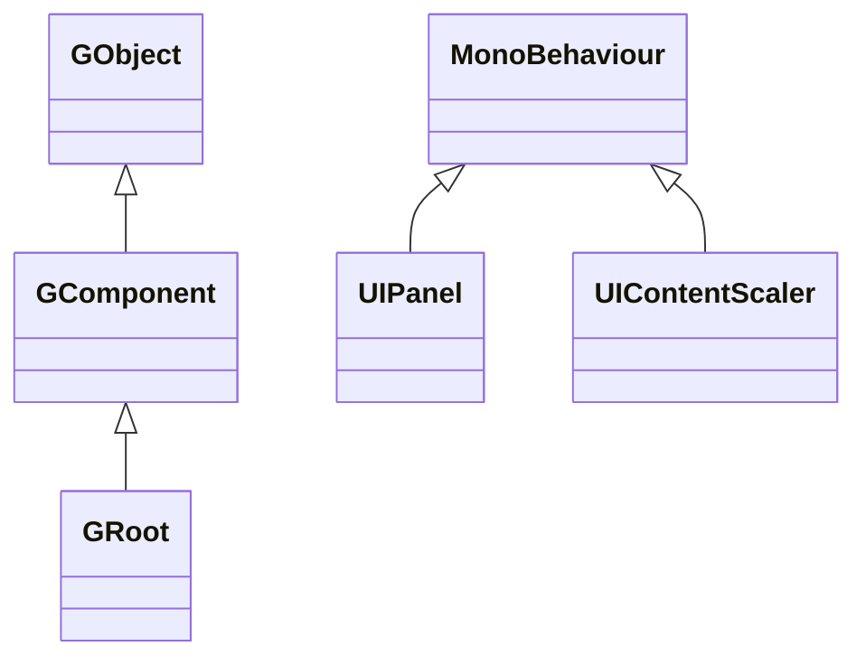

# FairyGUI for Unity パッケージの紹介

本パッケージは、GameFrameX 向けに [FairyGUI](https://www.fairygui.com/product.html) を Unity 用にラップしたバージョンです。FairyGUI はクロスプラットフォームの UI エディターおよび UI フレームワークであり、本パッケージはそれを Unity Package(UPM)としてパッケージ化し、ストリッピング防止、ミニゲームのキーボード対応、エディターのショートカットメニューなど、ゲームフレームワークとの統合に必要な変更を追加しています。本パッケージをインストールすれば、FairyGUI エディターからエクスポートした UI リソースを使って Unity でインターフェースを構築できます。

## クイックスタート

### 1. パッケージのインストール

Unity プロジェクトの `Packages/manifest.json` に `scopedRegistries` と依存関係を追加します(4 つのインストール方法のいずれかを選択してください):

```json
{
  "scopedRegistries": [
    {
      "name": "GameFrameX",
      "url": "https://gameframex.upm.alianblank.uk",
      "scopes": [
        "com.gameframex"
      ]
    }
  ],
  "dependencies": {
    "com.gameframex.unity.fairygui.unity": "5.3.3"
  }
}
```

Source: [README.md](https://github.com/GameFrameX/com.gameframex.unity.fairygui.unity/blob/main/README.md#L88-L104)

`scopes` は、どのパッケージをこの registry から解決するかを決定します:`com.gameframex` で始まるパッケージのみがここから取得されます。

その他の 3 つの方法：

- `manifest.json` の `dependencies` に直接 Git アドレスを記述する:`"com.gameframex.unity.fairygui.unity": "https://github.com/gameframex/com.gameframex.unity.fairygui.unity.git"`
- Unity の **Package Manager** で **Git URL** を使って追加する:`https://github.com/gameframex/com.gameframex.unity.fairygui.unity.git`
- リポジトリを Unity プロジェクトの `Packages` ディレクトリにクローンすると、自動的にロードされます

Source: [README.md](https://github.com/GameFrameX/com.gameframex.unity.fairygui.unity/blob/main/README.md#L108-L115)

### 2. インストールの確認

Unity に戻り、メニューバーに `Tools > FairyGUI` が表示されればインストール成功です——これは本パッケージで新たに追加されたエディター用ショートカットスイッチの入口です(各コンパイルマクロの切り替えに使用します)。

### 3. UI の使用

- [FairyGUI 公式サイト](https://www.fairygui.com/product.html)からエディターをダウンロードして UI を作成し、リソースを Unity プロジェクトへエクスポートします;
- シーン内で `UIPanel`(FairyGUI/UI Panel コンポーネント)を使って UI を取り付けるか、`GRoot` を UI ルートコンポーネントとしてコードで動的に作成します;
- `UIContentScaler`(FairyGUI/UI Content Scaler コンポーネント)を使って解像度の適応を設定します。

本パッケージは Unity 2019.4 以降のバージョンで利用可能で、他に依存パッケージはありません。

## 仕組みの概要

パッケージ内のコードは 3 つの層に分かれています(Unity Package 標準ディレクトリ):

| ディレクトリ | 内容 | 主要な型 |
|------|------|----------|
| `Runtime/UI` | コンポーネント層：GObject コンポーネント体系、UIPackage リソースパッケージ、UIPanel/UIContentScaler の MonoBehaviour ブリッジ | `GObject`、`GComponent`、`GRoot`、`GList`、`GButton`、`GLoader`、`UIPanel`、`UIPackage` |
| `Runtime/Core` | 表示層：表示オブジェクト、レンダリングメッシュ、クリック検出、ブレンドモード | `DisplayObject`、`Container`、`Image`、`MeshFactory`、`PixelHitTest` |
| `Editor` | エディター拡張：Inspector 拡張、マクロスイッチメニュー | `UIPanelEditor`、`UIConfigEditor`、`EditorToolSet` |

コンポーネント層の継承関係(ソースコードで確認済み):



- `GObject` はすべての UI コンポーネントの基底クラスです。`GComponent` は子オブジェクトを格納できるコンテナーです。`GRoot` は UI ツリーのルートノードです([GObject.cs](https://github.com/GameFrameX/com.gameframex.unity.fairygui.unity/blob/main/Runtime/UI/GObject.cs)、[GComponent.cs](https://github.com/GameFrameX/com.gameframex.unity.fairygui.unity/blob/main/Runtime/UI/GComponent.cs#L14)、[GRoot.cs](https://github.com/GameFrameX/com.gameframex.unity.fairygui.unity/blob/main/Runtime/UI/GRoot.cs#L10))
- `UIPanel` と `UIContentScaler` は Unity の GameObject にアタッチする `MonoBehaviour` であり、FairyGUI のコンポーネントツリーを Unity のシーンとレンダリングに接続する役割を担います([UIPanel.cs](https://github.com/GameFrameX/com.gameframex.unity.fairygui.unity/blob/main/Runtime/UI/UIPanel.cs#L26)、[UIContentScaler.cs](https://github.com/GameFrameX/com.gameframex.unity.fairygui.unity/blob/main/Runtime/UI/UIContentScaler.cs#L10))

FairyGUI は `FairyBatching` という DrawCall 最適化技術を搭載しており、テキストと画像の混在レイアウト、emoji 入力、仮想リスト/循環リスト、ピクセル単位のクリック検出、弧状 UI、ジェスチャー、タイプライター効果などの一般的な UI 機能を内蔵しています。マウス、シングルタップ、マルチタップ、VR コントローラーなどの入力は、同一のインタラクションコードとして統一的にカプセル化されています。

## 公式版からの変更点

本パッケージは、FairyGUI 公式 Unity 版をベースに以下の調整を行っています([README.md](https://github.com/GameFrameX/com.gameframex.unity.fairygui.unity/blob/main/README.md#L28-L38)):

1. Unity Package Manager サポートを追加
2. `FairyGUICroppingHelper` ストリッピング防止スクリプトを追加
3. `link.xml` ストリッピングフィルターを追加
4. 非同期 AssetBundle ロード時にコールバックが呼ばれないバグを修正
5. WeChat ミニゲーム、Douyin ミニゲームのキーボード入力対応を追加
6. `ENABLE_WECHAT_MINI_GAME` マクロを追加(WeChat ミニゲームのキーボード対応、Douyin と同時に有効化しないでください)
7. `ENABLE_DOUYIN_MINI_GAME` マクロを追加(Douyin ミニゲームのキーボード対応、WeChat と同時に有効化しないでください)
8. Unity エディターのショートカットスイッチを追加:`Tools > FairyGUI` の対応メニュー
9. 画像のピクセル化機能を追加

## 関連リンク

- [FairyGUI 公式チュートリアル](https://www.fairygui.com/docs/guide/index.html)
- [GameFrameX ドキュメント](https://gameframex.doc.alianblank.com)
- [リリースノート / Changelog](https://github.com/GameFrameX/com.gameframex.unity.fairygui.unity/releases)
- ピクセル化機能の有効化とパラメーター調整については、[README.md](https://github.com/GameFrameX/com.gameframex.unity.fairygui.unity/blob/main/README.md#L40-L70) を参照してください
- QQ 交流グループ：467608841 / 233840761