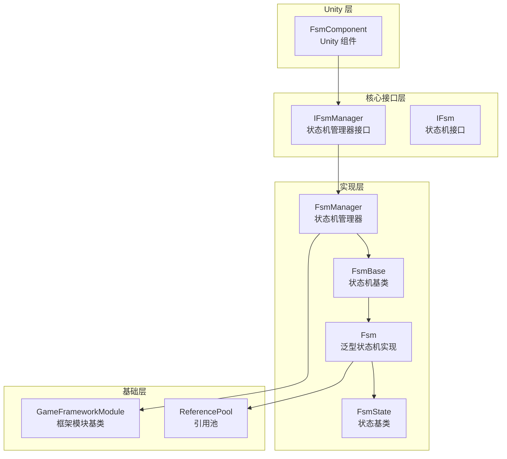
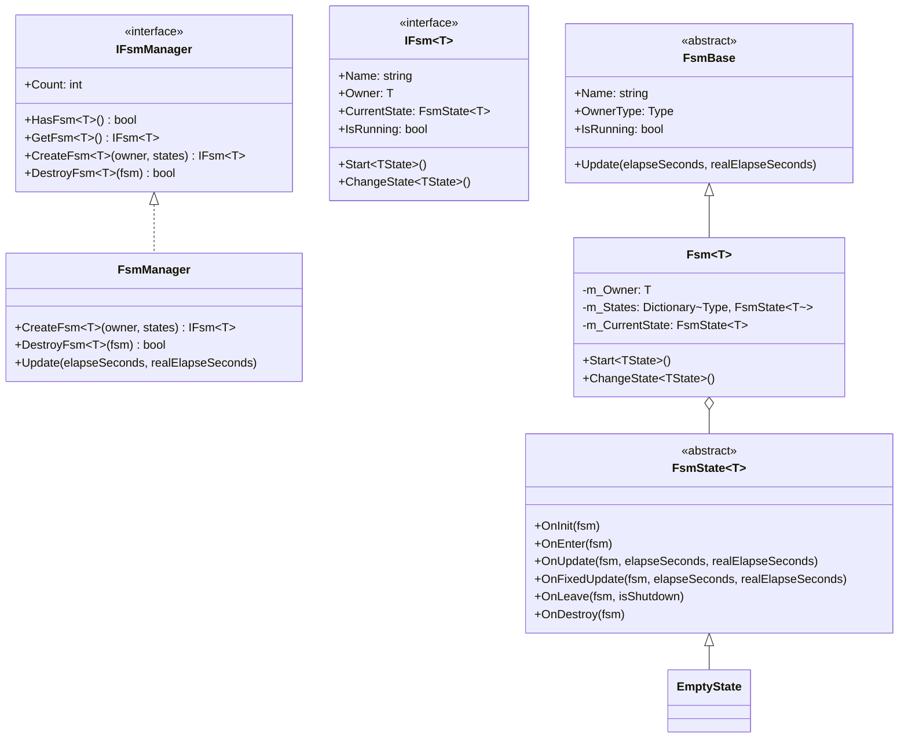
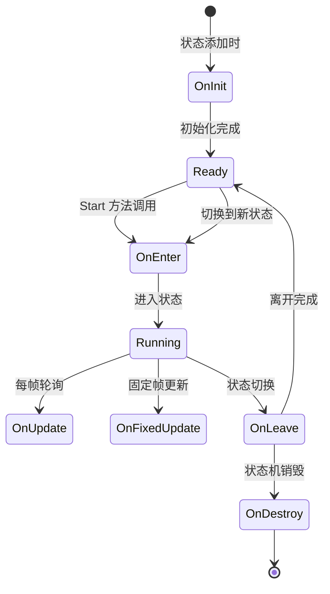
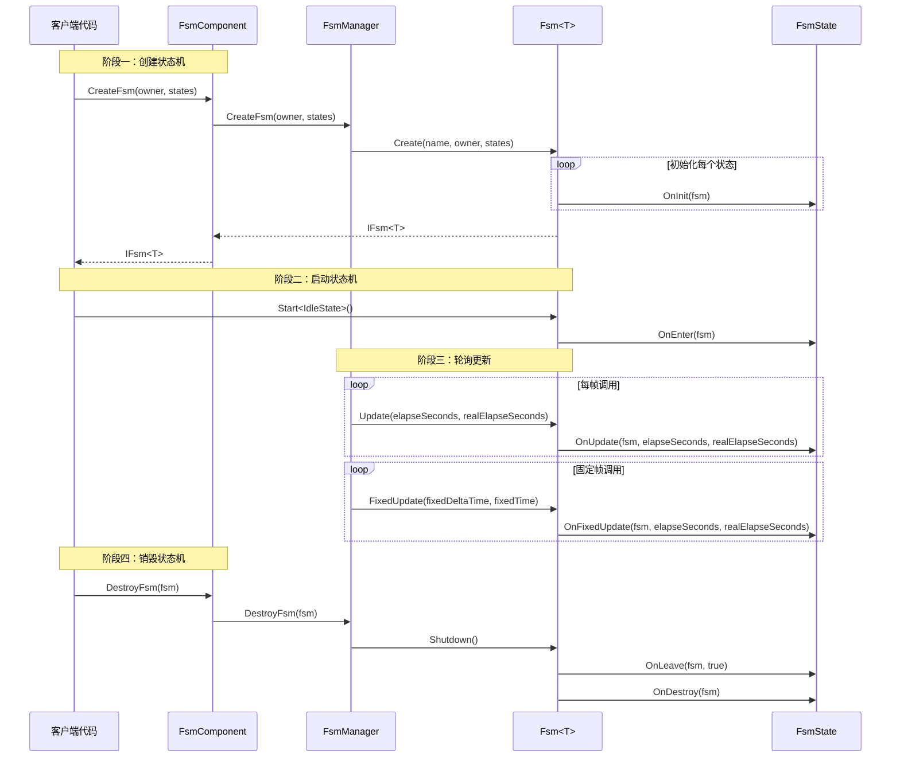

# 概要

GameFrameX 有限ステータス机（FSM）コンポーネント是 GameFrameX 游戏フレームワーク的コアモジュール之一，提供します完全な的有限ステータス机実装，用于管理游戏对象的行为ステータス转换。该コンポーネント基于 Game Framework 开发，サポートジェネリックタイプ约束，提供しますステータスライフサイクル管理、ステータス数据存储、ステータス切换等コア機能。

## プロジェクト紹介

有限ステータス机は一種の行为設計モード，允许对象在其内部ステータス改变时改变其行为。FSM コンポーネント将对象的ステータスカプセル化为独立的ステータス类，使得ステータス转换逻辑清晰可控，非常适合処理游戏中的角色行为、AI ステータス机 UI フロー控制等シーン。

**コア特性：**

- **ジェネリックステータス机**：サポート任意参照タイプ作为ステータス机持有者
- **完全なライフサイクル**：提供ステータス初期化、进入、アップデート、固定アップデート、离开、破棄等コールバック
- **数据存储**：サポート在ステータス机中存储和检索ステータス相关数据
- **ステータス切换**：提供タイプ安全和柔軟的ステータス切换机制
- **固定帧アップデート**：サポート FixedUpdate 物理アップデート
- **对象池集成**：使用参照池技术最適化内存分配

## システムアーキテクチャ

FSM コンポーネント采用分层アーキテクチャ設計，通过インターフェース抽象実装解耦。



**アーキテクチャ説明：**

| 层级 | コンポーネント | 职责 |
|------|------|------|
| Unity 层 | FsmComponent | 提供 Unity MonoBehaviour カプセル化，集成到 Unity ライフサイクル |
| コアインターフェース層 | IFsmManager, IFsm | 定義ステータス机管理和ステータス机的抽象インターフェース |
| 実装層 | FsmManager, Fsm, FsmState | ステータス机マネージャー、ジェネリックステータス机、ステータス基底クラス的具体実装 |
| 基本层 | GameFrameworkModule, ReferencePool | フレームワーク基本モジュール和对象池サポート |

## コアコンポーネント

FSM コンポーネント由以下コアタイプ组成：



**コンポーネント职责：**

| タイプ | 説明 |
|------|------|
| **FsmComponent** | Unity コンポーネント，カプセル化 FsmManager，提供 Editor 和ランタイム访问 |
| **FsmManager** | ステータス机マネージャー，负责作成、取得、破棄ステータス机，管理所有ステータス机インスタンス |
| **Fsm** | ジェネリックステータス机実装类，管理ステータス集合、ステータス数据、ステータス转换 |
| **FsmState** | ステータス基底クラス，定義ステータス的ライフサイクルコールバックメソッド |
| **FsmBase** | ステータス机抽象基底クラス，定義汎用プロパティ和メソッド |

## ステータスライフサイクル

ステータス机中的每个ステータス都有完全な的ライフサイクルコールバック：



**ライフサイクルコールバック：**

| コールバックメソッド | 呼び出し时机 | 用途 |
|----------|----------|------|
| `OnInit` | ステータス被追加到ステータス机时 | 初期化ステータス数据，設定ステータスパラメータ |
| `OnEnter` | 进入ステータス时 | ステータス进入逻辑，如再生动画、再生音效 |
| `OnUpdate` | 每帧轮询时 | ステータス行为逻辑，条件判断，ステータス转换確認 |
| `OnFixedUpdate` | 固定帧アップデート时 | 物理相关逻辑 |
| `OnLeave` | 离开ステータス时 | ステータス退出清理，リソース解放 |
| `OnDestroy` | ステータス机破棄时 | 最终清理工作 |

## クイックスタート

以下是使用 FSM コンポーネント的基本例：

### 定義ステータス

まず，定義具体的ステータス类継承自 `FsmState<T>`：

```csharp
using GameFrameX.Fsm.Runtime;

// 定义角色类作为状态机持有者
public class Character
{
    public string Name;
}

// 空闲状态
public class IdleState : FsmState<Character>
{
    protected internal override void OnEnter(IFsm<Character> fsm)
    {
        base.OnEnter(fsm);
        UnityEngine.Debug.Log("进入空闲状态");
    }

    protected internal override void OnUpdate(IFsm<Character> fsm, float elapseSeconds, float realElapseSeconds)
    {
        base.OnUpdate(fsm, elapseSeconds, realElapseSeconds);
        // 检测是否应该进入移动状态
    }
}

// 移动状态
public class MoveState : FsmState<Character>
{
    protected internal override void OnEnter(IFsm<Character> fsm)
    {
        base.OnEnter(fsm);
        UnityEngine.Debug.Log("进入移动状态");
    }

    protected internal override void OnLeave(IFsm<Character> fsm, bool isShutdown)
    {
        base.OnLeave(fsm, isShutdown);
        UnityEngine.Debug.Log("离开移动状态");
    }
}
```

> Source: [README.md](https://github.com/GameFrameX/com.gameframex.unity.fsm/blob/main/README.md#L43-L78)

### 作成和使用ステータス机

```csharp
// 创建角色
var character = new Character { Name = "Hero" };

// 通过 FsmComponent 创建状态机
var fsm = fsmComponent.CreateFsm(character,
    new IdleState(),
    new MoveState());

// 启动状态机，从空闲状态开始
fsm.Start<IdleState>();

// 在状态内部切换到另一个状态
// MoveState newState = fsm.GetState<MoveState>();
// newState.ChangeState<MoveState>(fsm);

// 销毁状态机
fsmComponent.DestroyFsm(fsm);
```

> Source: [README.md](https://github.com/GameFrameX/com.gameframex.unity.fsm/blob/main/README.md#L40-L65)

## コアフロー

FSM コンポーネント的工作フロー涉及作成、轮询和破棄三个主なフェーズ：



## ステータス数据管理

FSM コンポーネント提供しますステータス数据存储機能，〜できます在ステータス机中保存和检索数据：

```csharp
// 设置数据
fsm.SetData("Health", new VarInt(100));
fsm.SetData("Speed", new VarFloat(5.0f));

// 获取数据
VarInt health = fsm.GetData<VarInt>("Health");
int healthValue = health.Value;

// 检查数据是否存在
if (fsm.HasData("Speed"))
{
    // 数据存在
}

// 移除数据
fsm.RemoveData("Health");
```

> Source: [Fsm.cs](https://github.com/GameFrameX/com.gameframex.unity.fsm/blob/main/Runtime/Fsm/Fsm.cs#L445-L507)

## Unity 集成

FsmComponent 作为 Unity コンポーネント集成到游戏シーン中，自动管理ステータス机的ライフサイクル：

```csharp
[DisallowMultipleComponent]
[AddComponentMenu("Game Framework/FSM")]
public sealed class FsmComponent : GameFrameworkComponent
{
    private IFsmManager m_FsmManager = null;

    protected override void Awake()
    {
        base.Awake();
        m_FsmManager = GameFrameworkEntry.GetModule<IFsmManager>();
    }

    private void FixedUpdate()
    {
        m_FsmManager.FixedUpdate(Time.fixedDeltaTime, Time.fixedTime);
    }
}
```

> Source: [FsmComponent.cs](https://github.com/GameFrameX/com.gameframex.unity.fsm/blob/main/Runtime/Fsm/FsmComponent.cs#L22-L53)

## 関連リンク

- [インストールガイド](./2-installation)
- [快速开始](./3-getting-started)
- [コアコンセプト](./04.features.md)
- [API リファレンス](./5-api-reference)
- [常见問題](./6-troubleshooting)
- [GitHub リポジトリ](https://github.com/GameFrameX/com.gameframex.unity.fsm.git)
- [GameFrameX 官方网站](https://gameframex.doc.alianblank.com)
