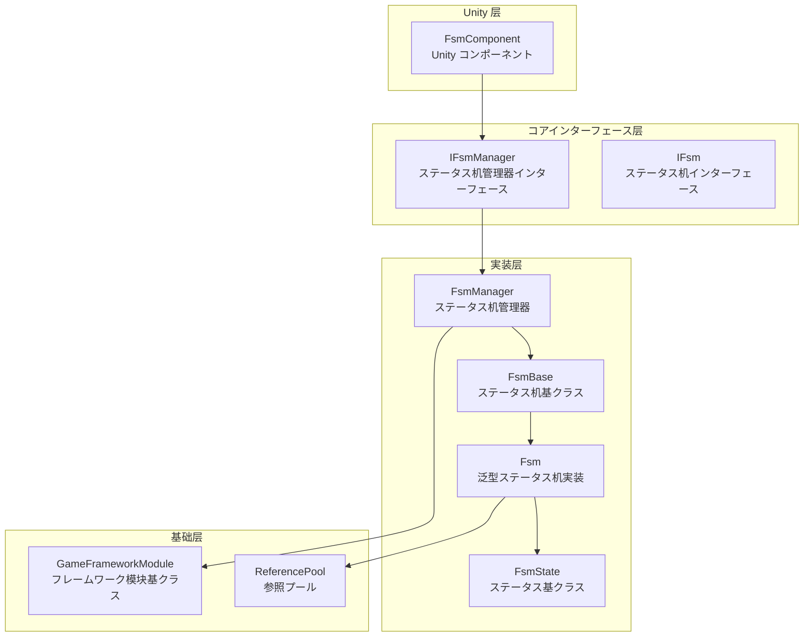
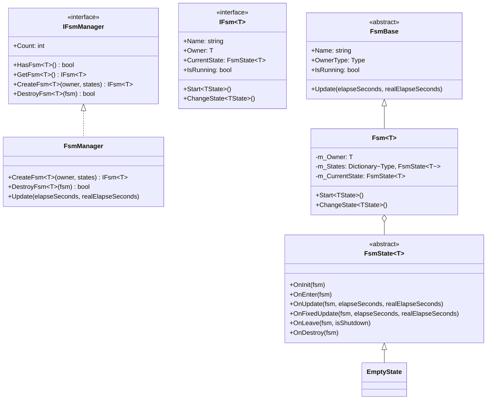
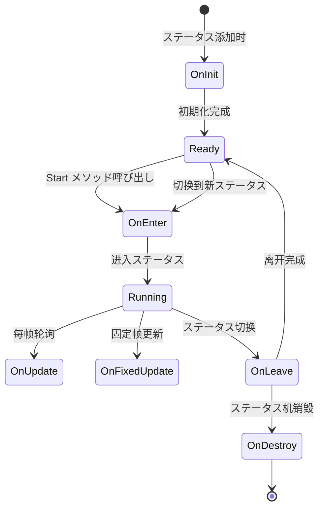
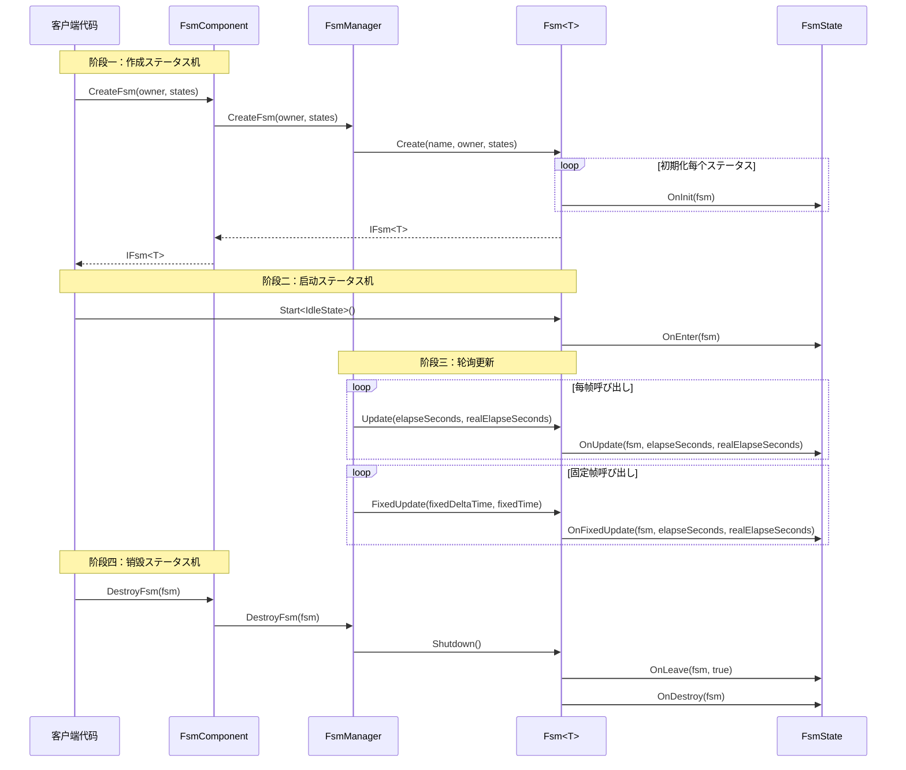

# 概要

GameFrameX 有限状態機械（FSM）コンポーネント是 GameFrameX ゲームフレームワーク的コア模块之一，提供します完整的有限状態機械実装，に使用管理ゲーム对象的行为ステータス转换。该コンポーネント基づく Game Framework 开发，サポート泛型クラス型约束，提供しますステータス生命周期管理、ステータス数据存储、ステータス切换等コア機能。

## プロジェクト简介

有限状態機械是一种行为设计模式，允许对象在其内部ステータス改变时改变其行为。FSM コンポーネント将对象的ステータス封装为独立的ステータスクラス，使得ステータス转换逻辑清晰可控，非常适合处理ゲーム中的角色行为、AI ステータス机 UI フロー控制等シーン。

**コア特性：**

- **泛型ステータス机**：サポート任意引用クラス型作为ステータス机持有者
- **完整生命周期**：提供ステータス初期化、进入、更新、固定更新、离开、销毁等回调
- **数据存储**：サポート在ステータス机中存储和检索ステータス関連数据
- **ステータス切换**：提供クラス型安全和灵活的ステータス切换机制
- **固定帧更新**：サポート FixedUpdate 物理更新
- **オブジェクトプール集成**：使用参照プール技术优化内存分配

## 系统架构

FSM コンポーネント采用分层アーキテクチャ設計，を通じてインターフェース抽象実装解耦。



**架构説明：**

| 层级 | コンポーネント | 职责 |
|------|------|------|
| Unity 层 | FsmComponent | 提供 Unity MonoBehaviour 封装，集成到 Unity 生命周期 |
| コアインターフェース层 | IFsmManager, IFsm | 定义ステータス机管理和ステータス机的抽象インターフェース |
| 実装层 | FsmManager, Fsm, FsmState | ステータス机管理器、泛型ステータス机、ステータス基クラス的具体実装 |
| 基础层 | GameFrameworkModule, ReferencePool | フレームワーク基础模块和オブジェクトプールサポート |

## コアコンポーネント

FSM コンポーネント由以下コアクラス型组成：



**コンポーネント职责：**

| クラス型 | 説明 |
|------|------|
| **FsmComponent** | Unity コンポーネント，封装 FsmManager，提供 Editor 和运行时访问 |
| **FsmManager** | ステータス机管理器，负责作成、取得、销毁ステータス机，管理所有ステータス机インスタンス |
| **Fsm** | 泛型ステータス机実装クラス，管理ステータス集合、ステータス数据、ステータス转换 |
| **FsmState** | ステータス基クラス，定义ステータス的生命周期回调メソッド |
| **FsmBase** | ステータス机抽象基底クラス，定义通用プロパティ和メソッド |

## ステータス生命周期

ステータス机中的每个ステータス都有完整的生命周期回调：



**生命周期回调：**

| 回调メソッド | 呼び出し时机 | 用途 |
|----------|----------|------|
| `OnInit` | ステータス被添加到ステータス机时 | 初期化ステータス数据，配置ステータス参数 |
| `OnEnter` | 进入ステータス时 | ステータス进入逻辑，如播放动画、播放音效 |
| `OnUpdate` | 每帧轮询时 | ステータス行为逻辑，条件判断，ステータス转换检查 |
| `OnFixedUpdate` | 固定帧更新时 | 物理関連逻辑 |
| `OnLeave` | 离开ステータス时 | ステータス退出清理，リソース释放 |
| `OnDestroy` | ステータス机销毁时 | 最终清理工作 |

## 快速开始

以下是使用 FSM コンポーネント的基本示例：

### 定义ステータス

首先，定义具体的ステータスクラスを継承 `FsmState<T>`：

```csharp
using GameFrameX.Fsm.Runtime;

// 定义角色クラス作为ステータス机持有者
public class Character
{
    public string Name;
}

// 空闲ステータス
public class IdleState : FsmState<Character>
{
    protected internal override void OnEnter(IFsm<Character> fsm)
    {
        base.OnEnter(fsm);
        UnityEngine.Debug.Log("进入空闲ステータス");
    }

    protected internal override void OnUpdate(IFsm<Character> fsm, float elapseSeconds, float realElapseSeconds)
    {
        base.OnUpdate(fsm, elapseSeconds, realElapseSeconds);
        // 检测是否べき进入移动ステータス
    }
}

// 移动ステータス
public class MoveState : FsmState<Character>
{
    protected internal override void OnEnter(IFsm<Character> fsm)
    {
        base.OnEnter(fsm);
        UnityEngine.Debug.Log("进入移动ステータス");
    }

    protected internal override void OnLeave(IFsm<Character> fsm, bool isShutdown)
    {
        base.OnLeave(fsm, isShutdown);
        UnityEngine.Debug.Log("离开移动ステータス");
    }
}
```

> Source: [README.md](https://github.com/GameFrameX/com.gameframex.unity.fsm/blob/main/README.md#L43-L78)

### 作成和使用ステータス机

```csharp
// 作成角色
var character = new Character { Name = "Hero" };

// を通じて FsmComponent 作成ステータス机
var fsm = fsmComponent.CreateFsm(character,
    new IdleState(),
    new MoveState());

// 启动ステータス机，从空闲ステータス开始
fsm.Start<IdleState>();

// 在ステータス内部切换到另一个ステータス
// MoveState newState = fsm.GetState<MoveState>();
// newState.ChangeState<MoveState>(fsm);

// 销毁ステータス机
fsmComponent.DestroyFsm(fsm);
```

> Source: [README.md](https://github.com/GameFrameX/com.gameframex.unity.fsm/blob/main/README.md#L40-L65)

## コアフロー

FSM コンポーネント的工作フロー涉及作成、轮询和销毁三个主要阶段：



## ステータス数据管理

FSM コンポーネント提供しますステータス数据存储機能，可能在ステータス机中保存和检索数据：

```csharp
// 設定数据
fsm.SetData("Health", new VarInt(100));
fsm.SetData("Speed", new VarFloat(5.0f));

// 取得数据
VarInt health = fsm.GetData<VarInt>("Health");
int healthValue = health.Value;

// 检查数据是否存在
if (fsm.HasData("Speed"))
{
    // 数据存在
}

// 移除数据
fsm.RemoveData("Health");
```

> Source: [Fsm.cs](https://github.com/GameFrameX/com.gameframex.unity.fsm/blob/main/Runtime/Fsm/Fsm.cs#L445-L507)

## Unity 集成

FsmComponent 作为 Unity コンポーネント集成到ゲームシーン中，自动管理ステータス机的生命周期：

```csharp
[DisallowMultipleComponent]
[AddComponentMenu("Game Framework/FSM")]
public sealed class FsmComponent : GameFrameworkComponent
{
    private IFsmManager m_FsmManager = null;

    protected override void Awake()
    {
        base.Awake();
        m_FsmManager = GameFrameworkEntry.GetModule<IFsmManager>();
    }

    private void FixedUpdate()
    {
        m_FsmManager.FixedUpdate(Time.fixedDeltaTime, Time.fixedTime);
    }
}
```

> Source: [FsmComponent.cs](https://github.com/GameFrameX/com.gameframex.unity.fsm/blob/main/Runtime/Fsm/FsmComponent.cs#L22-L53)

## 関連リンク

- [安装指南](./2-installation)
- [快速开始](./3-getting-started)
- [コア概念](./04.features.md)
- [API 参考](./5-api-reference)
- [常见问题](./6-troubleshooting)
- [GitHub 仓库](https://github.com/GameFrameX/com.gameframex.unity.fsm.git)
- [GameFrameX 官方网站](https://gameframex.doc.alianblank.com)
