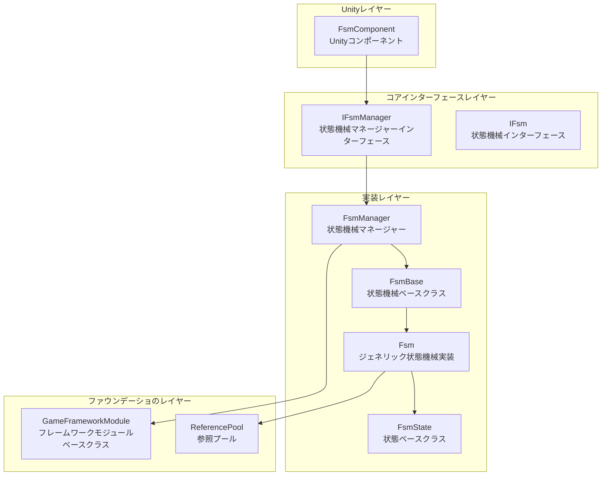
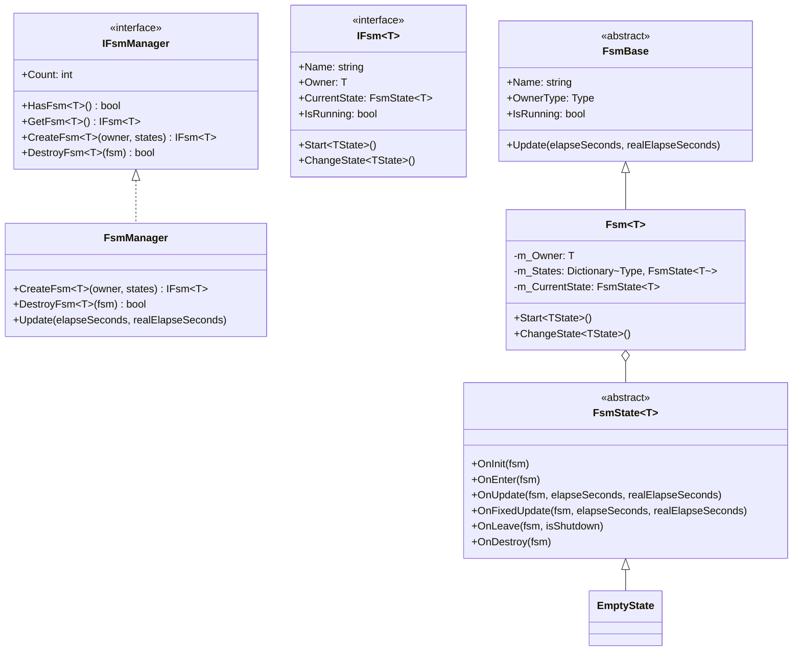
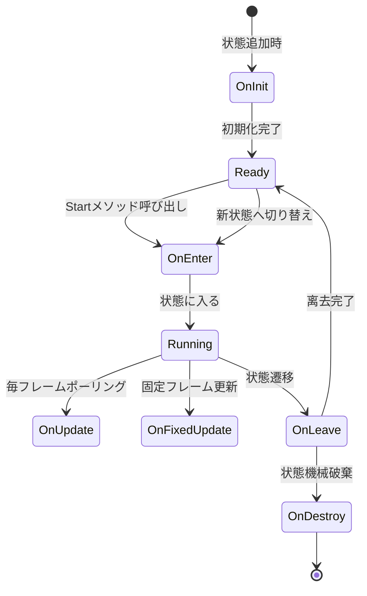
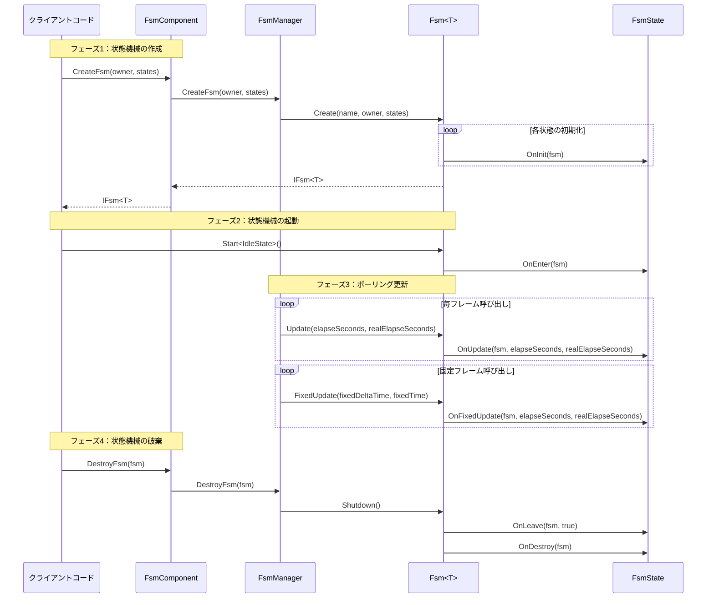

# 概要

GameFrameX 有限状態機械（FSM）コンポーネントは、GameFrameX ゲームフレームワークのコアモジュールの1つであり、游戏オブジェクトの状態遷移を管理するための完全な有限状態機械の実装を提供します。このコンポーネントはGame Frameworkに基づいて開発されており、ジェネリック型制約をサポートし、状態のライフサイクル管理、状態データストレージ、状態遷移などのコア機能を提供します。

## プロジェクト紹介

有限状態機械は、行動設計パターンの一種であり、オブジェクトの内部状態が変化した際に行動が変化することを可能にします。FSMコンポーネントはオブジェクトの状態を独立した状態クラスとして封装し、状態遷移ロジックを明確かつ制御可能にします。ゲーム内のキャラクター行動、AI状態機械、UIフロー制御などのシナリオに特に適しています。

**コア機能：**

- **ジェネリック状態機械**：任意の参照型を状態機械の所有者にとして使用可能
- **完全なライフサイクル**：状態の初期化、エントリ、更新、固定更新、リーブ、破棄などのコールバックを提供
- **データストレージ**：状態機械内での状態関連データの保存と取得をサポート
- **状態遷移**：タイプセーフで柔軟な状態遷移メカニズムを提供
- **固定フレーム更新**：FixedUpdate物理更新をサポート
- **オブジェクトプール統合**：参照プール技術を使用してメモリ割り当てを最適化

## システムアーキテクチャ

FSMコンポーネントは階層型アーキテクチャ設計を採用し、インターフェース抽象化によって疎結合を実現しています。



**アーキテクチャ説明：**

| レイヤー | コンポーネント | 責務 |
|------|------|------|
| Unityレイヤー | FsmComponent | Unity MonoBehaviourの封装を提供し、Unityライフサイクルに統合 |
| コアインターフェースレイヤー | IFsmManager, IFsm | 状態機械管理と状態機械の抽象インターフェースを定義 |
| 実装レイヤー | FsmManager, Fsm, FsmState | 状態機械マネージャー、ジェネリック状態機械、状態ベースクラスの具体的な実装 |
| ファウンデーショのレイヤー | GameFrameworkModule, ReferencePool | フレームワーク基本モジュールとオブジェクトプールサポート |

## コアコンポーネント

FSMコンポーネントは以下のコアタイプで構成されています：



**コンポーネント責務：**

| タイプ | 説明 |
|------|------|
| **FsmComponent** | Unityコンポーネント、FsmManagerを封装し、Editorと実行時アクセスを提供 |
| **FsmManager** | 状態機械マネージャー、状態機械の作成、取得、破棄を担当し、すべての状態機械インスタンスを管理 |
| **Fsm** | ジェネリック状態機械実装クラス、状態コレクション、状態データ、状態遷移を管理 |
| **FsmState** | 状態ベースクラス、状態のライフサイクルコールバックメソッドを定義 |
| **FsmBase** | 状態機械抽象ベースクラス、共通プロパティとメソッドを定義 |

## 状態ライフサイクル

状態機械の各状態には、完全なライフサイクルコールバックがあります：



**ライフサイクルコールバック：**

| コールバックメソッド | 呼び出しタイミング | 用途 |
|----------|----------|------|
| `OnInit` | 状態が状態機械に追加された時 | 状態データの初期化、状態パラメータの設定 |
| `OnEnter` | 状態に入る時 | 状態エントリロジック、アニメ再生、サウンド再生など |
| `OnUpdate` | 毎フレームポーリング時 | 状態行動ロジック、条件判断、状態遷移チェック |
| `OnFixedUpdate` | 固定フレーム更新時 | 物理関連ロジック |
| `OnLeave` | 状態を離れる時 | 状態退出クリーンアップ、リソース解放 |
| `OnDestroy` | 状態機械破棄時 | 最終クリーンアップ作業 |

## クイックスタート

以下はFSMコンポーネントの基本的な使用例です：

### 状態の定義

まず、`FsmState<T>`を継承する具体的な状態クラスを定義します：

```csharp
using GameFrameX.Fsm.Runtime;

// 状態機械の所有者をとするキャラクタークラスを定義
public class Character
{
    public string Name;
}

// 待機状態
public class IdleState : FsmState<Character>
{
    protected internal override void OnEnter(IFsm<Character> fsm)
    {
        base.OnEnter(fsm);
        UnityEngine.Debug.Log("待機状態に入る");
    }

    protected internal override void OnUpdate(IFsm<Character> fsm, float elapseSeconds, float realElapseSeconds)
    {
        base.OnUpdate(fsm, elapseSeconds, realElapseSeconds);
        // 移動状態に入るべきかどうか検出
    }
}

// 移動状態
public class MoveState : FsmState<Character>
{
    protected internal override void OnEnter(IFsm<Character> fsm)
    {
        base.OnEnter(fsm);
        UnityEngine.Debug.Log("移動状態に入る");
    }

    protected internal override void OnLeave(IFsm<Character> fsm, bool isShutdown)
    {
        base.OnLeave(fsm, isShutdown);
        UnityEngine.Debug.Log("移動状態を離れる");
    }
}
```

> Source: [README.md](https://github.com/GameFrameX/com.gameframex.unity.fsm/blob/main/README.md#L43-L78)

### 状態機械の作成と使用

```csharp
// キャラクターを作成
var character = new Character { Name = "Hero" };

// FsmComponent経由で状態機械を作成
var fsm = fsmComponent.CreateFsm(character,
    new IdleState(),
    new MoveState());

// 状態機械を起動、待機状態から開始
fsm.Start<IdleState>();

// 状態内部で別の状態に切り替え
// MoveState newState = fsm.GetState<MoveState>();
// newState.ChangeState<MoveState>(fsm);

// 状態機械を破棄
fsmComponent.DestroyFsm(fsm);
```

> Source: [README.md](https://github.com/GameFrameX/com.gameframex.unity.fsm/blob/main/README.md#L40-L65)

## コアフロー

FSMコンポーネントのワークフローは、作成、ポーリング、破棄の3つの主要フェーズ涉及します：



## 状態データ管理

FSMコンポーネントは状態データストレージ機能を提供し、状態機械内でデータを保存および取得できます：

```csharp
// データを設定
fsm.SetData("Health", new VarInt(100));
fsm.SetData("Speed", new VarFloat(5.0f));

// データを取得
VarInt health = fsm.GetData<VarInt>("Health");
int healthValue = health.Value;

// データが存在するか確認
if (fsm.HasData("Speed"))
{
    // データが存在
}

// データを削除
fsm.RemoveData("Health");
```

> Source: [Fsm.cs](https://github.com/GameFrameX/com.gameframex.unity.fsm/blob/main/Runtime/Fsm/Fsm.cs#L445-L507)

## Unity統合

FsmComponentはUnityコンポーネントとしてゲームシーンに統合され、状態機械のライフサイクルを自動的に管理します：

```csharp
[DisallowMultipleComponent]
[AddComponentMenu("Game Framework/FSM")]
public sealed class FsmComponent : GameFrameworkComponent
{
    private IFsmManager m_FsmManager = null;

    protected override void Awake()
    {
        base.Awake();
        m_FsmManager = GameFrameworkEntry.GetModule<IFsmManager>();
    }

    private void FixedUpdate()
    {
        m_FsmManager.FixedUpdate(Time.fixedDeltaTime, Time.fixedTime);
    }
}
```

> Source: [FsmComponent.cs](https://github.com/GameFrameX/com.gameframex.unity.fsm/blob/main/Runtime/Fsm/FsmComponent.cs#L22-L53)

## 関連リンク

- [インストール](./2-installation)
- [クイックスタート](./3-getting-started)
- [コアコンセプト](./04.features.md)
- [APIリファレンス](./5-api-reference)
- [トラブルシューティング](./6-troubleshooting)
- [GitHubリポジトリ](https://github.com/GameFrameX/com.gameframex.unity.fsm.git)
- [GameFrameX公式サイト](https://gameframex.doc.alianblank.com)
