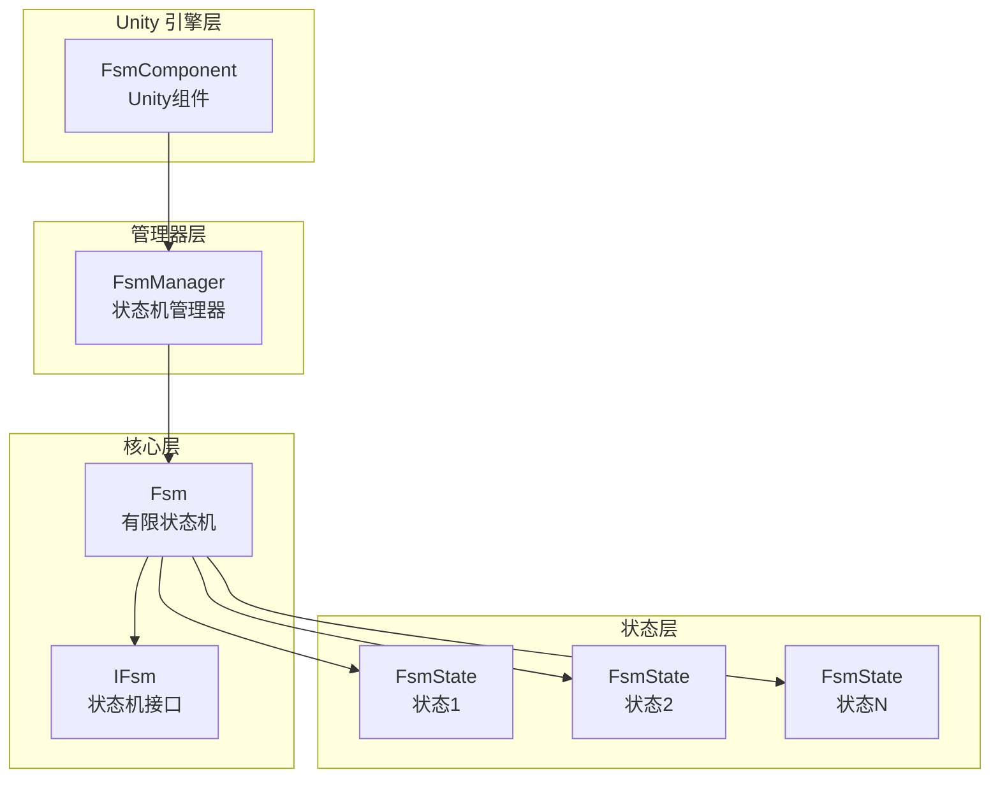
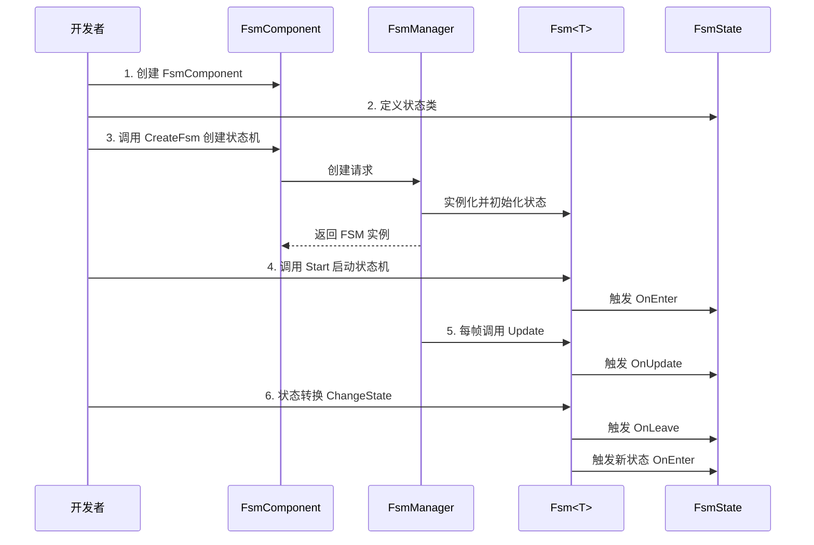

# クイックスタート

本ガイド将帮助您快速上手使用 GameFrameX FSM 有限ステータス机コンポーネント。通过几个シンプル的ステップ，您就〜できます在 Unity プロジェクト中作成和管理有限ステータス机。

## 概要

GameFrameX FSM は轻量级但機能強力的有限ステータス机系统，专为 Unity 游戏开发設計。它提供します一种结构化的方法来管理游戏对象的ステータス转换，特别適しています：
- 角色行为ステータス机（待机、行走、攻击、死亡等）
- UI 界面ステータス管理
- 游戏フロー控制
- AI 行为逻辑

## コアコンセプト

在开始之前，理解する以下コアコンセプト会很有帮助：

| コンセプト | 説明 |
|------|------|
| **FsmComponent** | Unity コンポーネント，用于在シーン中管理ステータス机 |
| **FsmManager** | ステータス机マネージャー，负责作成、破棄和アップデート所有ステータス机 |
| **FsmState<T>** | ステータス基底クラス，定義ステータス的ライフサイクル钩子 |
| **IFsm<T>** | ステータス机インターフェース，提供ステータス机操作メソッド |
| **Owner** | ステータス机持有者，通常是游戏对象或マネージャー类 |

## システムアーキテクチャ



### コンポーネント职责

| コンポーネント | 职责 |
|------|------|
| **FsmComponent** | 作为 Unity コンポーネント，提供 FsmManager 的初期化和 Update 轮询 |
| **FsmManager** | 管理所有 FSM インスタンス，提供作成、取得、破棄メソッド |
| **Fsm<T>** | 具体的ステータス机実装，管理ステータス集合和ステータス转换 |
| **FsmState<T>** | 定義ステータス的コールバックメソッド，サブクラス実装具体逻辑 |

## 使用フロー



## 快速例

### ステップ 1：追加 FsmComponent

在 Unity シーン中作成一个空物体，次に追加 `FsmComponent` コンポーネント：

```csharp
// FsmComponent 是 Unity 组件，挂载到 GameObject 上即可使用
// 在 Unity 编辑器中：GameObject -> Add Component -> Game Framework -> FSM
```
> Source: [FsmComponent.cs](https://github.com/GameFrameX/com.gameframex.unity.fsm/blob/main/Runtime/Fsm/FsmComponent.cs#L20-L22)

### ステップ 2：定義ステータス类

作成具体的ステータス类，継承 `FsmState<T>`：

```csharp
using GameFrameX.Fsm.Runtime;

// 定义状态机持有者类型
public class Player
{
    public string Name;
}

// 待机状态
public class IdleState : FsmState<Player>
{
    protected internal override void OnEnter(IFsm<Player> fsm)
    {
        base.OnEnter(fsm);
        UnityEngine.Debug.Log("玩家进入待机状态");
    }

    protected internal override void OnUpdate(IFsm<Player> fsm, float elapseSeconds, float realElapseSeconds)
    {
        base.OnUpdate(fsm, elapseSeconds, realElapseSeconds);
        // 在这里检测是否需要切换到其他状态
        // 例如：检测到移动输入时切换到行走状态
    }

    protected internal override void OnLeave(IFsm<Player> fsm, bool isShutdown)
    {
        base.OnLeave(fsm, isShutdown);
        UnityEngine.Debug.Log("玩家离开待机状态");
    }
}

// 行走状态
public class RunState : FsmState<Player>
{
    protected internal override void OnEnter(IFsm<Player> fsm)
    {
        base.OnEnter(fsm);
        UnityEngine.Debug.Log("玩家进入行走状态");
    }

    protected internal override void OnLeave(IFsm<Player> fsm, bool isShutdown)
    {
        base.OnLeave(fsm, isShutdown);
        UnityEngine.Debug.Log("玩家离开行走状态");
    }
}
```
> Source: [FsmState.cs](https://github.com/GameFrameX/com.gameframex.unity.fsm/blob/main/Runtime/Fsm/FsmState.cs#L17-L77)

### ステップ 3：作成并启动ステータス机

```csharp
using UnityEngine;
using GameFrameX.Fsm.Runtime;

public class PlayerController : MonoBehaviour
{
    private FsmComponent fsmComponent;
    private IFsm<Player> playerFsm;
    private Player player;

    private void Start()
    {
        // 获取 FsmComponent 组件
        fsmComponent = GetComponent<FsmComponent>();
        
        // 创建玩家对象
        player = new Player { Name = "Hero" };
        
        // 创建状态机（使用 params 参数）
        playerFsm = fsmComponent.CreateFsm(player, 
            new IdleState(), 
            new RunState());
        
        // 启动状态机，进入第一个状态
        playerFsm.Start<IdleState>();
    }

    private void Update()
    {
        // 状态机由 FsmComponent 自动更新
        // 这里可以处理外部输入，触发状态转换
    }

    // 切换到行走状态
    public void StartRun()
    {
        ChangeState<RunState>(playerFsm);
    }

    // 切换到待机状态
    public void StopRun()
    {
        ChangeState<IdleState>(playerFsm);
    }

    private void OnDestroy()
    {
        // 场景销毁时清理状态机
        if (fsmComponent != null && playerFsm != null)
        {
            fsmComponent.DestroyFsm(playerFsm);
        }
    }
}
```
> Source: [Fsm.cs](https://github.com/GameFrameX/com.gameframex.unity.fsm/blob/main/Runtime/Fsm/Fsm.cs#L230-L249)

### ステップ 4：在ステータス中进行ステータス转换

在ステータス类内部切换ステータス：

```csharp
public class IdleState : FsmState<Player>
{
    protected internal override void OnUpdate(IFsm<Player> fsm, float elapseSeconds, float realElapseSeconds)
    {
        base.OnUpdate(fsm, elapseSeconds, realElapseSeconds);
        
        // 假设有一个检测移动输入的方法
        if (Input.GetKey(KeyCode.W))
        {
            // 切换到行走状态
            ChangeState<RunState>(fsm);
        }
    }
}
```
> Source: [FsmState.cs](https://github.com/GameFrameX/com.gameframex.unity.fsm/blob/main/Runtime/Fsm/FsmState.cs#L84-L93)

## 高级用法

### 使用数据存储

FSM 提供します一个键值对数据存储系统，〜できます在ステータス机中保存和读取数据：

```csharp
// 设置数据
playerFsm.SetData("LastAttackTime", 0f);
playerFsm.SetData("Health", 100);

// 读取数据
float lastAttackTime = playerFsm.GetData<float>("LastAttackTime");
int health = playerFsm.GetData<int>("Health");

// 检查数据是否存在
if (playerFsm.HasData("Health"))
{
    // 数据存在
}
```
> Source: [Fsm.cs](https://github.com/GameFrameX/com.gameframex.unity.fsm/blob/main/Runtime/Fsm/Fsm.cs#L390-L481)

### 取得当前ステータス情報

```csharp
// 获取当前状态名称
string currentStateName = playerFsm.CurrentStateName;

// 获取当前状态持续时间
float stateTime = playerFsm.CurrentStateTime;

// 获取当前状态实例
FsmState<Player> currentState = playerFsm.CurrentState;

// 检查状态机是否正在运行
bool isRunning = playerFsm.IsRunning;

// 获取状态数量
int stateCount = playerFsm.FsmStateCount;
```
> Source: [Fsm.cs](https://github.com/GameFrameX/com.gameframex.unity.fsm/blob/main/Runtime/Fsm/Fsm.cs#L56-L102)

### ステータス机破棄

```csharp
// 方法1：通过泛型销毁
fsmComponent.DestroyFsm<Player>();

// 方法2：通过实例销毁
fsmComponent.DestroyFsm(playerFsm);

// 方法3：通过名称销毁
fsmComponent.DestroyFsm<Player>("MyFsm");
```
> Source: [FsmComponent.cs](https://github.com/GameFrameX/com.gameframex.unity.fsm/blob/main/Runtime/Fsm/FsmComponent.cs#L206-L267)

## 常见例：角色ステータス机

以下は典型的角色ステータス机完全な例：

```csharp
// 角色类
public class Character
{
    public string Name;
    public int Health = 100;
}

// 状态定义
public class CharacterIdleState : FsmState<Character> { }
public class CharacterWalkState : FsmState<Character> { }
public class CharacterAttackState : FsmState<Character> { }
public class CharacterDeadState : FsmState<Character> { }

// 使用
public class CharacterController : MonoBehaviour
{
    private FsmComponent fsmComponent;
    private IFsm<Character> characterFsm;

    private void Start()
    {
        fsmComponent = GetComponent<FsmComponent>();
        var character = new Character { Name = "Hero" };
        
        // 创建包含所有状态的状态机
        characterFsm = fsmComponent.CreateFsm(character,
            new CharacterIdleState(),
            new CharacterWalkState(),
            new CharacterAttackState(),
            new CharacterDeadState());
        
        // 启动初始状态
        characterFsm.Start<CharacterIdleState>();
    }

    private void Update()
    {
        // 外部控制状态转换
        if (Input.GetKeyDown(KeyCode.W))
            ChangeState<CharacterWalkState>(characterFsm);
        else if (Input.GetKeyDown(KeyCode.J))
            ChangeState<CharacterAttackState>(characterFsm);
        else if (Input.GetKeyDown(KeyCode.K))
            ChangeState<CharacterDeadState>(characterFsm);
    }
}
```
> Source: [FsmComponent.cs](https://github.com/GameFrameX/com.gameframex.unity.fsm/blob/main/Runtime/Fsm/FsmComponent.cs#L156-L204)

## ベストプラクティス

### 1. ステータス数量控制

お勧め每个ステータス机的ステータス数量控制在 5-10 个以内。もしステータス过多，考虑拆分为多个独立的ステータス机。

### 2. ステータス切换逻辑

- **外部切换**：在 MonoBehaviour 的 Update 中根据输入切换ステータス
- **内部切换**：在 FsmState 的 OnUpdate 中根据条件自动切换

### 3. 数据管理

使用 FSM 的数据存储機能，避免在 MonoBehaviour 中存储与ステータス相关的数据，这样〜できます：
- 保持ステータス逻辑的完全な性
- 便于ステータス切换时数据传递
- 更容易デバッグ和追踪

### 4. リソース清理

確認してください在 OnDestroy 或シーン切换时破棄不再使用的ステータス机：

```csharp
private void OnDestroy()
{
    if (fsmComponent != null && playerFsm != null)
    {
        fsmComponent.DestroyFsm(playerFsm);
    }
}
```

## 関連リンク

- [コアコンセプト](./04.features.md) - 深入理解する FSM 的コア設計
- [API リファレンス](./5-api-reference) - 完全な的 API ドキュメント
- [インストールガイド](./2-installation) - インストール和設定
- [概要](./1-overview) - プロジェクト整体介绍
