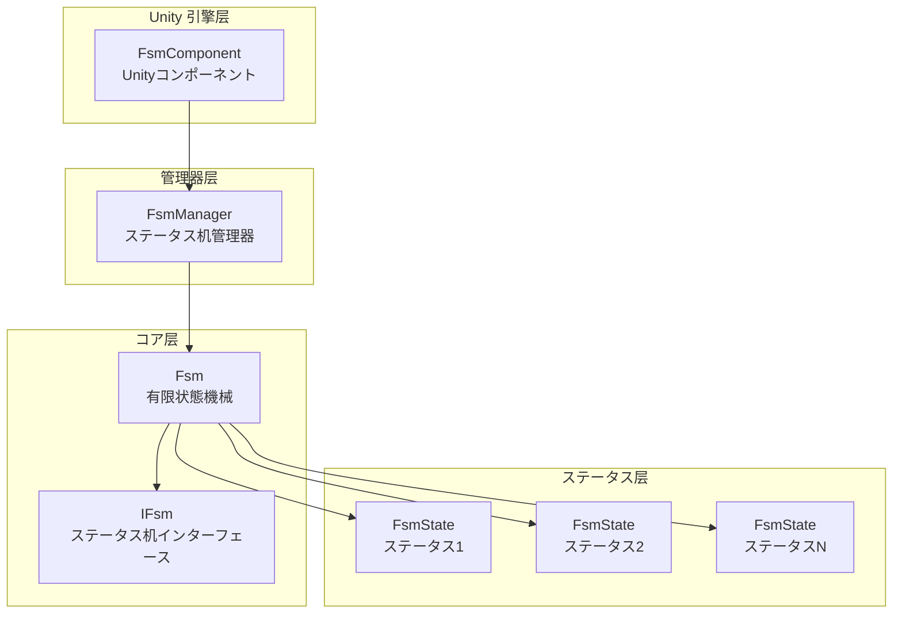
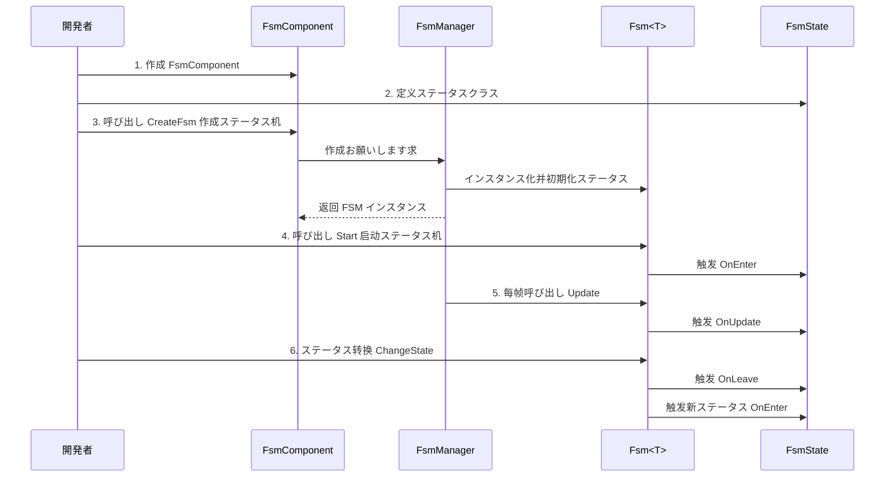

# 快速开始

本指南将帮助您快速上手使用 GameFrameX FSM 有限状態機械コンポーネント。を通じて几个简单的手順，您就可能在 Unity プロジェクト中作成和管理有限状態機械。

## 概要

GameFrameX FSM は轻量级但機能强大的有限状態機械系统，专为 Unity ゲーム开发设计。它提供します一种结构化的方法来管理ゲーム对象的ステータス转换，特别适に使用：
- 角色行为ステータス机（待机、行走、攻击、死亡等）
- UI 界面ステータス管理
- ゲームフロー控制
- AI 行为逻辑

## コアコンセプト

在开始之前，了解以下コア概念会很有帮助：

| 概念 | 説明 |
|------|------|
| **FsmComponent** | Unity コンポーネント，に使用在シーン中管理ステータス机 |
| **FsmManager** | ステータス机管理器，负责作成、销毁和更新所有ステータス机 |
| **FsmState<T>** | ステータス基クラス，定义ステータス的生命周期钩子 |
| **IFsm<T>** | ステータス机インターフェース，提供ステータス机操作メソッド |
| **Owner** | ステータス机持有者，通常是ゲーム对象或管理器クラス |

## 系统架构



### コンポーネント职责

| コンポーネント | 职责 |
|------|------|
| **FsmComponent** | 作为 Unity コンポーネント，提供 FsmManager 的初期化和 Update 轮询 |
| **FsmManager** | 管理所有 FSM インスタンス，提供作成、取得、销毁メソッド |
| **Fsm<T>** | 具体的ステータス机実装，管理ステータス集合和ステータス转换 |
| **FsmState<T>** | 定义ステータス的回调メソッド，サブクラス実装具体逻辑 |

## 使用フロー



## 快速示例

### 手順 1：添加 FsmComponent

在 Unity シーン中作成一个空物体，然后添加 `FsmComponent` コンポーネント：

```csharp
// FsmComponent 是 Unity コンポーネント，挂载到 GameObject 上即可使用
// 在 Unity 编辑器中：GameObject -> Add Component -> Game Framework -> FSM
```
> Source: [FsmComponent.cs](https://github.com/GameFrameX/com.gameframex.unity.fsm/blob/main/Runtime/Fsm/FsmComponent.cs#L20-L22)

### 手順 2：定义ステータスクラス

作成具体的ステータスクラス，继承 `FsmState<T>`：

```csharp
using GameFrameX.Fsm.Runtime;

// 定义ステータス机持有者クラス型
public class Player
{
    public string Name;
}

// 待机ステータス
public class IdleState : FsmState<Player>
{
    protected internal override void OnEnter(IFsm<Player> fsm)
    {
        base.OnEnter(fsm);
        UnityEngine.Debug.Log("玩家进入待机ステータス");
    }

    protected internal override void OnUpdate(IFsm<Player> fsm, float elapseSeconds, float realElapseSeconds)
    {
        base.OnUpdate(fsm, elapseSeconds, realElapseSeconds);
        // 在这里检测是否必要切换到其他ステータス
        // 例如：检测到移动输入时切换到行走ステータス
    }

    protected internal override void OnLeave(IFsm<Player> fsm, bool isShutdown)
    {
        base.OnLeave(fsm, isShutdown);
        UnityEngine.Debug.Log("玩家离开待机ステータス");
    }
}

// 行走ステータス
public class RunState : FsmState<Player>
{
    protected internal override void OnEnter(IFsm<Player> fsm)
    {
        base.OnEnter(fsm);
        UnityEngine.Debug.Log("玩家进入行走ステータス");
    }

    protected internal override void OnLeave(IFsm<Player> fsm, bool isShutdown)
    {
        base.OnLeave(fsm, isShutdown);
        UnityEngine.Debug.Log("玩家离开行走ステータス");
    }
}
```
> Source: [FsmState.cs](https://github.com/GameFrameX/com.gameframex.unity.fsm/blob/main/Runtime/Fsm/FsmState.cs#L17-L77)

### 手順 3：作成并启动ステータス机

```csharp
using UnityEngine;
using GameFrameX.Fsm.Runtime;

public class PlayerController : MonoBehaviour
{
    private FsmComponent fsmComponent;
    private IFsm<Player> playerFsm;
    private Player player;

    private void Start()
    {
        // 取得 FsmComponent コンポーネント
        fsmComponent = GetComponent<FsmComponent>();
        
        // 作成玩家对象
        player = new Player { Name = "Hero" };
        
        // 作成ステータス机（使用 params 参数）
        playerFsm = fsmComponent.CreateFsm(player, 
            new IdleState(), 
            new RunState());
        
        // 启动ステータス机，进入第一个ステータス
        playerFsm.Start<IdleState>();
    }

    private void Update()
    {
        // ステータス机由 FsmComponent 自动更新
        // 这里可能处理外部输入，触发ステータス转换
    }

    // 切换到行走ステータス
    public void StartRun()
    {
        ChangeState<RunState>(playerFsm);
    }

    // 切换到待机ステータス
    public void StopRun()
    {
        ChangeState<IdleState>(playerFsm);
    }

    private void OnDestroy()
    {
        // シーン销毁时清理ステータス机
        if (fsmComponent != null && playerFsm != null)
        {
            fsmComponent.DestroyFsm(playerFsm);
        }
    }
}
```
> Source: [Fsm.cs](https://github.com/GameFrameX/com.gameframex.unity.fsm/blob/main/Runtime/Fsm/Fsm.cs#L230-L249)

### 手順 4：在ステータス中进行ステータス转换

在ステータスクラス内部切换ステータス：

```csharp
public class IdleState : FsmState<Player>
{
    protected internal override void OnUpdate(IFsm<Player> fsm, float elapseSeconds, float realElapseSeconds)
    {
        base.OnUpdate(fsm, elapseSeconds, realElapseSeconds);
        
        // 假设有一个检测移动输入的メソッド
        if (Input.GetKey(KeyCode.W))
        {
            // 切换到行走ステータス
            ChangeState<RunState>(fsm);
        }
    }
}
```
> Source: [FsmState.cs](https://github.com/GameFrameX/com.gameframex.unity.fsm/blob/main/Runtime/Fsm/FsmState.cs#L84-L93)

## 高级用法

### 使用数据存储

FSM 提供します一个键值对数据存储系统，可能在ステータス机中保存和读取数据：

```csharp
// 設定数据
playerFsm.SetData("LastAttackTime", 0f);
playerFsm.SetData("Health", 100);

// 读取数据
float lastAttackTime = playerFsm.GetData<float>("LastAttackTime");
int health = playerFsm.GetData<int>("Health");

// 检查数据是否存在
if (playerFsm.HasData("Health"))
{
    // 数据存在
}
```
> Source: [Fsm.cs](https://github.com/GameFrameX/com.gameframex.unity.fsm/blob/main/Runtime/Fsm/Fsm.cs#L390-L481)

### 取得当前ステータス信息

```csharp
// 取得当前ステータス名称
string currentStateName = playerFsm.CurrentStateName;

// 取得当前ステータス持续时间
float stateTime = playerFsm.CurrentStateTime;

// 取得当前ステータスインスタンス
FsmState<Player> currentState = playerFsm.CurrentState;

// 检查ステータス机是否正在运行
bool isRunning = playerFsm.IsRunning;

// 取得ステータス数量
int stateCount = playerFsm.FsmStateCount;
```
> Source: [Fsm.cs](https://github.com/GameFrameX/com.gameframex.unity.fsm/blob/main/Runtime/Fsm/Fsm.cs#L56-L102)

### ステータス机销毁

```csharp
// メソッド1：を通じて泛型销毁
fsmComponent.DestroyFsm<Player>();

// メソッド2：を通じてインスタンス销毁
fsmComponent.DestroyFsm(playerFsm);

// メソッド3：を通じて名称销毁
fsmComponent.DestroyFsm<Player>("MyFsm");
```
> Source: [FsmComponent.cs](https://github.com/GameFrameX/com.gameframex.unity.fsm/blob/main/Runtime/Fsm/FsmComponent.cs#L206-L267)

## 常见示例：角色ステータス机

以下は典型的角色ステータス机完整示例：

```csharp
// 角色クラス
public class Character
{
    public string Name;
    public int Health = 100;
}

// ステータス定义
public class CharacterIdleState : FsmState<Character> { }
public class CharacterWalkState : FsmState<Character> { }
public class CharacterAttackState : FsmState<Character> { }
public class CharacterDeadState : FsmState<Character> { }

// 使用
public class CharacterController : MonoBehaviour
{
    private FsmComponent fsmComponent;
    private IFsm<Character> characterFsm;

    private void Start()
    {
        fsmComponent = GetComponent<FsmComponent>();
        var character = new Character { Name = "Hero" };
        
        // 作成包含所有ステータス的ステータス机
        characterFsm = fsmComponent.CreateFsm(character,
            new CharacterIdleState(),
            new CharacterWalkState(),
            new CharacterAttackState(),
            new CharacterDeadState());
        
        // 启动初始ステータス
        characterFsm.Start<CharacterIdleState>();
    }

    private void Update()
    {
        // 外部控制ステータス转换
        if (Input.GetKeyDown(KeyCode.W))
            ChangeState<CharacterWalkState>(characterFsm);
        else if (Input.GetKeyDown(KeyCode.J))
            ChangeState<CharacterAttackState>(characterFsm);
        else if (Input.GetKeyDown(KeyCode.K))
            ChangeState<CharacterDeadState>(characterFsm);
    }
}
```
> Source: [FsmComponent.cs](https://github.com/GameFrameX/com.gameframex.unity.fsm/blob/main/Runtime/Fsm/FsmComponent.cs#L156-L204)

## 最佳实践

### 1. ステータス数量控制

建议每个ステータス机的ステータス数量控制在 5-10 个以内。如果ステータス过多，考虑拆分为多个独立的ステータス机。

### 2. ステータス切换逻辑

- **外部切换**：在 MonoBehaviour 的 Update 中に基づいて输入切换ステータス
- **内部切换**：在 FsmState 的 OnUpdate 中に基づいて条件自动切换

### 3. 数据管理

使用 FSM 的数据存储機能，避免在 MonoBehaviour 中存储与ステータス関連的数据，这样可能：
- 保持ステータス逻辑的完整性
- 便于ステータス切换时数据传递
- 更容易调试和追踪

### 4. リソース清理

确保在 OnDestroy 或シーン切换时销毁不再使用的ステータス机：

```csharp
private void OnDestroy()
{
    if (fsmComponent != null && playerFsm != null)
    {
        fsmComponent.DestroyFsm(playerFsm);
    }
}
```

## 関連リンク

- [コア概念](./04.features.md) - 深入了解 FSM 的コア设计
- [API 参考](./5-api-reference) - 完整的 API 文档
- [安装指南](./2-installation) - 安装和配置
- [概述](./1-overview) - プロジェクト整体介绍
