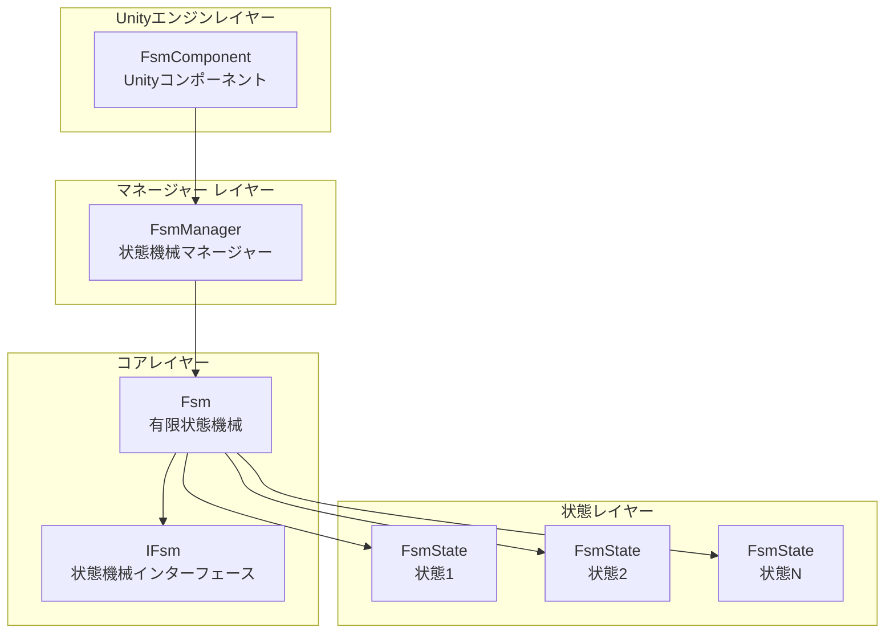
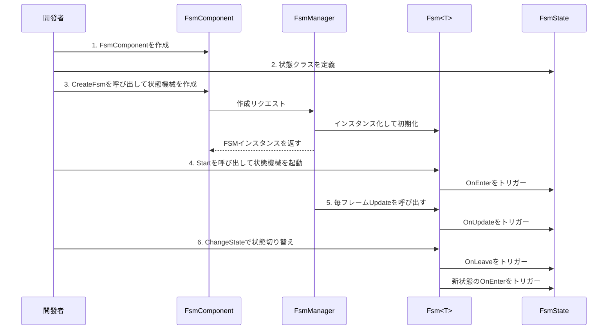

# クイックスタート

本ガイドでは、GameFrameX FSM有限状態機械コンポーネントを快速に使い始める方法を説明します。數個のシンプルな手順で、Unityプロジェクト内で有限状態機械を作成・管理できます。

## 概要

GameFrameX FSMは、軽量でありながら強力な有限状態機械システムであり、Unityゲーム開発向けに設計されています。ゲームオブジェクトの状態切り替えを管理するための構造化 방법을提倛しており、特に以下に適しています：
- キャラクター行動状態機械（待機、歩行、攻撃、死亡など）
- UI画面状態管理
- ゲームフロー制御
- AI行動ロジック

## コアコンセプト

開始する前に、以下のコアコンセプトを理解しておくと 도움이ります：

| コンセプト | 説明 |
|------|------|
| **FsmComponent** | Unityコンポーネント、シーン内で状態機械を管理するために使用 |
| **FsmManager** | 状態機械マネージャー、すべての状態機械の作成、破棄、更新を担当 |
| **FsmState<T>** | 状態ベースクラス、状態のライフサイクルフックを定義 |
| **IFsm<T>** | 状態機械インターフェース、状態機械操作方法を提供 |
| **Owner** | 状態機械の所有者、通常はゲームオブジェクトまたはマネージャー类 |

## システムアーキテクチャ



### コンポーネント責務

| コンポーネント | 責務 |
|------|------|
| **FsmComponent** | Unityコンポーネントとして、FsmManagerの初期化とUpdateポーリングを提供 |
| **FsmManager** | すべてのFSMインスタンスを管理し、作成、取得、破棄方法を提供 |
| **Fsm<T>** | 具体的な状態機械実装、状態コレクションと状態切り替えを管理 |
| **FsmState<T>** | 状態のコールバックメソッドを定義し、サブクラスで具体的なロジックを実装 |

## 使用フロー



## クイック例

### 手順1：FsmComponentを追加

Unityシーンに空のゲームオブジェクトを作成し、`FsmComponent` コンポーネントを追加します：

```csharp
// FsmComponentはUnityコンポーネントであり、GameObjectにマウントして使用可能
// Unityエディター内：GameObject -> Add Component -> Game Framework -> FSM
```
> Source: [FsmComponent.cs](https://github.com/GameFrameX/com.gameframex.unity.fsm/blob/main/Runtime/Fsm/FsmComponent.cs#L20-L22)

### 手順2：状態クラスを定義

具体的な状態クラスを継承し、`FsmState<T>`を作成します：

```csharp
using GameFrameX.Fsm.Runtime;

// 状態機械の所有者タイプを定義
public class Player
{
    public string Name;
}

// 待機状態
public class IdleState : FsmState<Player>
{
    protected internal override void OnEnter(IFsm<Player> fsm)
    {
        base.OnEnter(fsm);
        UnityEngine.Debug.Log("プレイヤーが待機状態に入る");
    }

    protected internal override void OnUpdate(IFsm<Player> fsm, float elapseSeconds, float realElapseSeconds)
    {
        base.OnUpdate(fsm, elapseSeconds, realElapseSeconds);
        // ここで他の状態に切り替える必要があるかどうかを検出
        // 例如：移動入力を検出したら歩行状態に切り替え
    }

    protected internal override void OnLeave(IFsm<Player> fsm, bool isShutdown)
    {
        base.OnLeave(fsm, isShutdown);
        UnityEngine.Debug.Log("プレイヤーが待機状態を離れる");
    }
}

// 歩行状態
public class RunState : FsmState<Player>
{
    protected internal override void OnEnter(IFsm<Player> fsm)
    {
        base.OnEnter(fsm);
        UnityEngine.Debug.Log("プレイヤーが歩行状態に入る");
    }

    protected internal override void OnLeave(IFsm<Player> fsm, bool isShutdown)
    {
        base.OnLeave(fsm, isShutdown);
        UnityEngine.Debug.Log("プレイヤーが歩行状態を離れる");
    }
}
```
> Source: [FsmState.cs](https://github.com/GameFrameX/com.gameframex.unity.fsm/blob/main/Runtime/Fsm/FsmState.cs#L17-L77)

### 手順3：状態機械を作成して起動

```csharp
using UnityEngine;
using GameFrameX.Fsm.Runtime;

public class PlayerController : MonoBehaviour
{
    private FsmComponent fsmComponent;
    private IFsm<Player> playerFsm;
    private Player player;

    private void Start()
    {
        // FsmComponentコンポーネントを取得
        fsmComponent = GetComponent<FsmComponent>();
        
        // プレイヤーオブジェクトを作成
        player = new Player { Name = "Hero" };
        
        // 状態機械を作成（paramsパラメータを使用）
        playerFsm = fsmComponent.CreateFsm(player, 
            new IdleState(), 
            new RunState());
        
        // 状態機械を起動、最初の状態に入る
        playerFsm.Start<IdleState>();
    }

    private void Update()
    {
        // 状態機械はFsmComponentによって自動的に更新される
        // ここで外部入力を処理し、状態切り替えをトリガー可能
    }

    // 歩行状態に切り替え
    public void StartRun()
    {
        ChangeState<RunState>(playerFsm);
    }

    // 待機状態に切り替え
    public void StopRun()
    {
        ChangeState<IdleState>(playerFsm);
    }

    private void OnDestroy()
    {
        // シーン破棄時に状態機械をクリーンアップ
        if (fsmComponent != null && playerFsm != null)
        {
            fsmComponent.DestroyFsm(playerFsm);
        }
    }
}
```
> Source: [Fsm.cs](https://github.com/GameFrameX/com.gameframex.unity.fsm/blob/main/Runtime/Fsm/Fsm.cs#L230-L249)

### 手順4：状態内部で状態切り替え

状態クラス内部で状態を切り替えます：

```csharp
public class IdleState : FsmState<Player>
{
    protected internal override void OnUpdate(IFsm<Player> fsm, float elapseSeconds, float realElapseSeconds)
    {
        base.OnUpdate(fsm, elapseSeconds, realElapseSeconds);
        
        // 移動入力を検出するメソッドがあると假设
        if (Input.GetKey(KeyCode.W))
        {
            // 歩行状態に切り替え
            ChangeState<RunState>(fsm);
        }
    }
}
```
> Source: [FsmState.cs](https://github.com/GameFrameX/com.gameframex.unity.fsm/blob/main/Runtime/Fsm/FsmState.cs#L84-L93)

## 上級用法

### データストレージの使用

FSMはキーと値のペアデータストレージシステムを提供し、状態機械内でデータを保存および読み取りできます：

```csharp
// データを設定
playerFsm.SetData("LastAttackTime", 0f);
playerFsm.SetData("Health", 100);

// データを読み取り
float lastAttackTime = playerFsm.GetData<float>("LastAttackTime");
int health = playerFsm.GetData<int>("Health");

// データが存在するか確認
if (playerFsm.HasData("Health"))
{
    // データが存在
}
```
> Source: [Fsm.cs](https://github.com/GameFrameX/com.gameframex.unity.fsm/blob/main/Runtime/Fsm/Fsm.cs#L390-L481)

### 現在の状態情報の取得

```csharp
// 現在の状態名称を取得
string currentStateName = playerFsm.CurrentStateName;

// 現在の状態継続時間を取得
float stateTime = playerFsm.CurrentStateTime;

// 現在の状態インスタンスを取得
FsmState<Player> currentState = playerFsm.CurrentState;

// 状態機械が実行中かどうか確認
bool isRunning = playerFsm.IsRunning;

// 状態数を取得
int stateCount = playerFsm.FsmStateCount;
```
> Source: [Fsm.cs](https://github.com/GameFrameX/com.gameframex.unity.fsm/blob/main/Runtime/Fsm/Fsm.cs#L56-L102)

### 状態機械の破棄

```csharp
// 方法1：ジェネリックで破棄
fsmComponent.DestroyFsm<Player>();

// 方法2：インスタンスで破棄
fsmComponent.DestroyFsm(playerFsm);

// 方法3：名称で破棄
fsmComponent.DestroyFsm<Player>("MyFsm");
```
> Source: [FsmComponent.cs](https://github.com/GameFrameX/com.gameframex.unity.fsm/blob/main/Runtime/Fsm/FsmComponent.cs#L206-L267)

## 一般的な例：キャラクター状態機械

以下は典型的なキャラクター状態機械の完全な例です：

```csharp
// キャラクタークラス
public class Character
{
    public string Name;
    public int Health = 100;
}

// 状態を定義
public class CharacterIdleState : FsmState<Character> { }
public class CharacterWalkState : FsmState<Character> { }
public class CharacterAttackState : FsmState<Character> { }
public class CharacterDeadState : FsmState<Character> { }

// 使用
public class CharacterController : MonoBehaviour
{
    private FsmComponent fsmComponent;
    private IFsm<Character> characterFsm;

    private void Start()
    {
        fsmComponent = GetComponent<FsmComponent>();
        var character = new Character { Name = "Hero" };
        
        // すべての状態を含む状態機械を作成
        characterFsm = fsmComponent.CreateFsm(character,
            new CharacterIdleState(),
            new CharacterWalkState(),
            new CharacterAttackState(),
            new CharacterDeadState());
        
        // 初期状態を起動
        characterFsm.Start<CharacterIdleState>();
    }

    private void Update()
    {
        // 外部制御状態切り替え
        if (Input.GetKeyDown(KeyCode.W))
            ChangeState<CharacterWalkState>(characterFsm);
        else if (Input.GetKeyDown(KeyCode.J))
            ChangeState<CharacterAttackState>(characterFsm);
        else if (Input.GetKeyDown(KeyCode.K))
            ChangeState<CharacterDeadState>(characterFsm);
    }
}
```
> Source: [FsmComponent.cs](https://github.com/GameFrameX/com.gameframex.unity.fsm/blob/main/Runtime/Fsm/FsmComponent.cs#L156-L204)

## ベストプラクティス

### 1. 状態数の制御

各状態機械の状態数を5〜10個以内に制御することを推奨します。状態が多すぎる場合は、複数の獨立した状態機械に分割することを検討してください。

### 2. 状態切り替えロジック

- **外部切り替え**：MonoBehaviourのUpdateで入力に基づいて状態を切り替え
- **内部切り替え**：FsmStateのOnUpdateで条件に基づいて自動的に切り替え

### 3. データ管理

FSMのデータストレージ機能を使用し、MonoBehaviour内で状態関連データを存储しないようにしてください。これにより：
- 状態ロジックの完全性を維持
- 状態切り替え時のデータ伝递が容易
- デバッグと追跡が更容易

### 4. リソースクリーンアップ

OnDestroyまたはシーン切り替え時に、使用しなくなった状態機械を破棄してください：

```csharp
private void OnDestroy()
{
    if (fsmComponent != null && playerFsm != null)
    {
        fsmComponent.DestroyFsm(playerFsm);
    }
}
```

## 関連リンク

- [コアコンセプト](./04.features.md) - FSMのコアデザインを深く理解
- [APIリファレンス](./5-api-reference) - 完全なAPIドキュメント
- [インストール](./2-installation) - インストールと設定
- [概要](./1-overview) - プロジェクト全体の紹介
