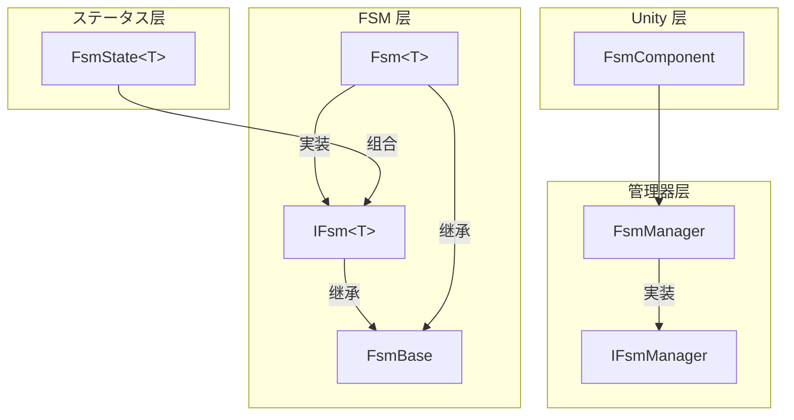
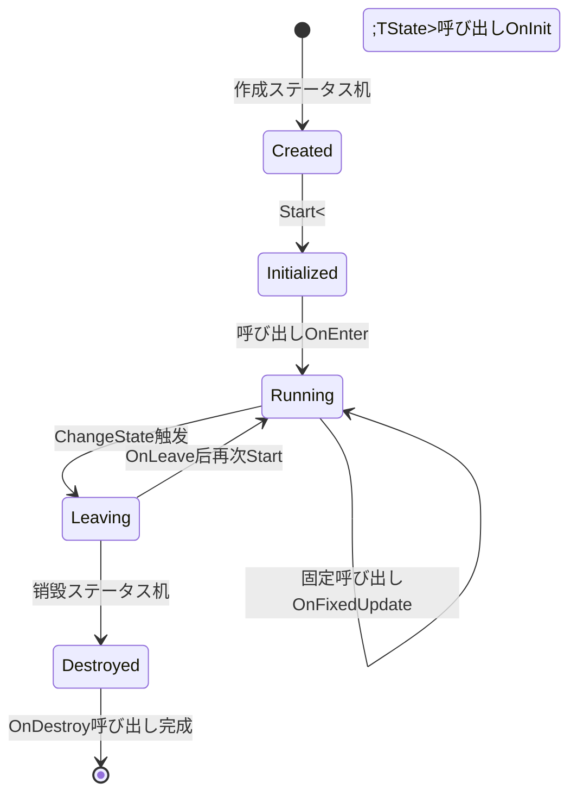
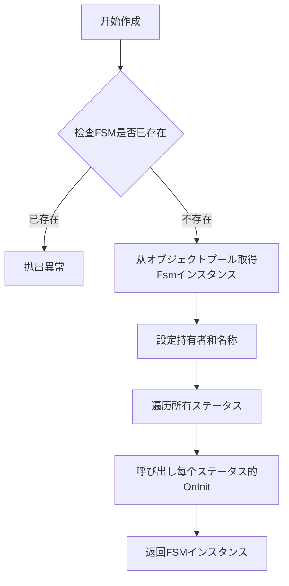

# コア概念

本文档详细介绍 GameFrameX 有限状態機械（FSM）コンポーネント的コア概念、アーキテクチャ設計和关键机制。FSM コンポーネント为 Unity ゲーム开发提供します健壮的ステータス管理能力，サポートステータス生命周期管理、ステータス转换和数据存储等機能。

## 概要

有限状態機械（Finite State Machine，简称 FSM）是一种行为设计模式，它允许对象在有限个ステータス之间进行切换。在ゲーム开发中，FSM 广泛应に使用 AI 行为管理、ゲームフロー控制、角色ステータス切换等シーン。

GameFrameX FSM コンポーネント基づく Game Framework アーキテクチャ設計，提供以下コア能力：

- **泛型ステータス机** - サポート强クラス型的ステータス机定义，编译时クラス型检查
- **ステータス生命周期管理** - 完整的ステータス初期化、进入、更新、离开、销毁回调
- **ステータス数据存储** - 内置键值对数据存储机制
- **オブジェクトプールサポート** - 自动内存管理和对象复用
- **Unity コンポーネント集成** - 提供 FsmComponent 便于在 Unity シーン中使用

## 系统架构

GameFrameX FSM 采用分层アーキテクチャ設計，从底层到上层依次为：ステータス层、FSM 层和管理器层。这种分层设计确保了职责分离和代码可维护性。



### 各层职责

**ステータス层（FsmState<T>）** 是ステータス的具体実装基クラス。開発者を通じて继承该クラス来定义具体的ステータス，每个ステータス実装自己的业务逻辑。ステータス层定义了ステータス的六个生命周期回调メソッド，に使用响应ステータス机的各种イベント。

**FSM 层（IFsm<T> 和 Fsm<T>）** 是ステータス机的コア実装。IFsm<T> インターフェース定义了ステータス机的所有操作，包括ステータス查询、ステータス转换、数据存取等。Fsm<T> 是该インターフェース的泛型実装，维护ステータス集合、当前ステータス、ステータス持续时间等运行时数据。

**管理器层（IFsmManager 和 FsmManager）** 负责管理整个系统的 FSM インスタンス。FsmManager を継承 GameFrameworkModule，作为ゲームフレームワーク的一个模块提供服务。它维护所有 FSM インスタンス的引用，负责作成、查询、销毁和轮询更新。

## コアコンポーネント

### FsmState<T> ステータス基クラス

FsmState<T> 是所有具体ステータス的抽象基底クラス。它定义了ステータス的六个生命周期回调メソッド，这些メソッド由ステータス机在适当的时机自动呼び出し。開発者只需重写必要的メソッド，无需关注呼び出し时机。

```csharp
public abstract class FsmState<T> where T : class
{
    // ステータス初期化时呼び出し
    protected internal virtual void OnInit(IFsm<T> fsm) { }
    
    // ステータス进入时呼び出し
    protected internal virtual void OnEnter(IFsm<T> fsm) { }
    
    // ステータス每帧更新时呼び出し
    protected internal virtual void OnUpdate(IFsm<T> fsm, float elapseSeconds, float realElapseSeconds) { }
    
    // ステータス固定更新时呼び出し（物理関連）
    protected internal virtual void OnFixedUpdate(IFsm<T> fsm, float elapseSeconds, float realElapseSeconds) { }
    
    // ステータス离开时呼び出し
    protected internal virtual void OnLeave(IFsm<T> fsm, bool isShutdown) { }
    
    // ステータス销毁时呼び出し
    protected internal virtual void OnDestroy(IFsm<T> fsm) { }
    
    // 切换到其他ステータス
    public void ChangeToState<TState>(IFsm<T> fsm) where TState : FsmState<T>
    protected void ChangeState<TState>(IFsm<T> fsm) where TState : FsmState<T>
}
```

> Source: [FsmState.cs](https://github.com/GameFrameX/com.gameframex.unity.fsm/blob/main/Runtime/Fsm/FsmState.cs#L17-L136)

**设计意图**：使用模板メソッド模式定义ステータス的标准行为フレームワーク。每个ステータス只需关注自己的特定逻辑，ステータス机负责在正确的时机呼び出し正确的メソッド。这种设计将ステータス的通用行为抽象到基クラス，具体行为留给サブクラス実装。

### IFsm<T> ステータス机インターフェース

IFsm<T> インターフェース定义了ステータス机的完整操作集合。を通じて泛型参数 T，ステータス机可能クラス型安全地持有任意クラス型的对象。

```csharp
public interface IFsm<T> where T : class
{
    // プロパティ
    string Name { get; }
    string FullName { get; }
    T Owner { get; }
    int FsmStateCount { get; }
    bool IsRunning { get; }
    bool IsDestroyed { get; }
    FsmState<T> CurrentState { get; }
    float CurrentStateTime { get; }
    
    // メソッド
    void Start<TState>() where TState : FsmState<T>;
    void Start(Type stateType);
    bool HasState<TState>() where TState : FsmState<T>;
    TState GetState<TState>() where TState : FsmState<T>;
    FsmState<T>[] GetAllStates();
    bool HasData(string name);
    TData GetData<TData>(string name) where TData : Variable;
    void SetData<TData>(string name, TData data) where TData : Variable;
    bool RemoveData(string name);
}
```

> Source: [IFsm.cs](https://github.com/GameFrameX/com.gameframex.unity.fsm/blob/main/Runtime/Fsm/IFsm.cs#L18-L179)

**设计意图**：インターフェース隔离原则的典型应用。を通じて IFsm<T> インターフェース，ステータス可能在运行时取得ステータス机的完整控制权，包括切换ステータス、存储数据等。这种设计使得ステータスクラス可能完全控制ステータス机的行为。

### FsmManager ステータス机管理器

FsmManager 是系统的コア管理器，负责所有 FSM インスタンス的生命周期管理。

```csharp
public sealed class FsmManager : GameFrameworkModule, IFsmManager
{
    // 作成ステータス机
    public IFsm<T> CreateFsm<T>(T owner, params FsmState<T>[] states) where T : class;
    public IFsm<T> CreateFsm<T>(string name, T owner, params FsmState<T>[] states) where T : class;
    
    // 取得ステータス机
    public IFsm<T> GetFsm<T>() where T : class;
    public IFsm<T> GetFsm<T>(string name) where T : class;
    
    // 检查ステータス机存在
    public bool HasFsm<T>() where T : class;
    
    // 销毁ステータス机
    public bool DestroyFsm<T>(IFsm<T> fsm) where T : class;
    
    // 轮询更新
    public void FixedUpdate(float fixedDeltaTime, float fixedTime);
}
```

> Source: [FsmManager.cs](https://github.com/GameFrameX/com.gameframex.unity.fsm/blob/main/Runtime/Fsm/FsmManager.cs#L18-L436)

**设计意图**：单例管理器模式在ゲーム开发中的典型应用。FsmManager 作为ゲームフレームワーク的一个模块，自动参与ゲームフレームワーク的初期化和关闭フロー。を通じて GameFrameworkEntry 取得模块インスタンス，确保模块在系统中全局唯一。

### FsmComponent Unity コンポーネント

FsmComponent 是面向 Unity 引擎的コンポーネント封装，提供编辑器友好的ステータス机管理方法。

```csharp
[DisallowMultipleComponent]
[AddComponentMenu("Game Framework/FSM")]
public sealed class FsmComponent : GameFrameworkComponent
{
    // 所有操作都委托给 m_FsmManager
    private IFsmManager m_FsmManager = null;
    
    protected override void Awake()
    {
        base.Awake();
        m_FsmManager = GameFrameworkEntry.GetModule<IFsmManager>();
    }
    
    private void FixedUpdate()
    {
        m_FsmManager.FixedUpdate(Time.fixedDeltaTime, Time.fixedTime);
    }
}
```

> Source: [FsmComponent.cs](https://github.com/GameFrameX/com.gameframex.unity.fsm/blob/main/Runtime/Fsm/FsmComponent.cs#L22-L53)

**设计意图**：适配器模式的体现。FsmComponent 将底层的 FsmManager 機能适配为 Unity コンポーネント形式，開発者可能直接在 Unity 编辑器中添加和管理ステータス机コンポーネント，无需手动编写初期化代码。

## ステータス生命周期

理解ステータス的六个生命周期回调是正确使用 FSM 的关键。每个回调都有其特定的设计目的和呼び出し时机。



### 生命周期详解

**OnInit - 初期化阶段**

当ステータス机作成时，所有ステータス都会呼び出し一次 OnInit メソッド。此时ステータス机尚未启动，当前ステータス为 null。这个阶段适合进行ステータス的静态初期化，例如缓存其他ステータス的引用。

```csharp
protected internal override void OnInit(IFsm<Character> fsm)
{
    // 缓存常驻ステータス引用
    var idleState = fsm.GetState<IdleState>();
    var runState = fsm.GetState<RunState>();
    // ...
}
```

**OnEnter - 进入阶段**

当ステータス被設定为当前ステータス时呼び出し。在ステータス转换完成后、新ステータス开始执行前呼び出し。适合执行ステータス的进入逻辑，如播放动画、設定参数等。

```csharp
protected internal override void OnEnter(IFsm<Character> fsm)
{
    // 播放进入动画
    Owner.PlayAnimation("Idle");
    // 重置ステータス数据
    fsm.SetData("AttackCount", 0);
}
```

**OnUpdate - 更新阶段**

每帧呼び出し一次，接收逻辑流逝时间（elapseSeconds）和真实流逝时间（realElapseSeconds）。适合放置必要每帧执行的逻辑，如输入检测、AI 决策等。

```csharp
protected internal override void OnUpdate(IFsm<Character> fsm, float elapseSeconds, float realElapseSeconds)
{
    // 检测是否必要切换ステータス
    if (fsm.GetData<bool>("IsHurt"))
    {
        ChangeState<HurtState>(fsm);
    }
}
```

**OnFixedUpdate - 固定更新阶段**

与 OnUpdate クラス似，但按照固定时间间隔呼び出し，适合物理関連的逻辑。

**OnLeave - 离开阶段**

当ステータス即将离开时呼び出し。参数 isShutdown 表示是正常ステータス转换（false）还是ステータス机关闭（true）。适合执行清理工作，如停止动画、保存ステータス等。

```csharp
protected internal override void OnLeave(IFsm<Character> fsm, bool isShutdown)
{
    // 保存ステータス数据
    var attackCount = fsm.GetData<int>("AttackCount");
    // 停止当前动画
    Owner.StopAnimation();
}
```

**OnDestroy - 销毁阶段**

当ステータス机被销毁时呼び出し。这是ステータス的最后一个生命周期回调，适合执行最终的清理工作，释放所有リソース。

## ステータス转换机制

ステータス转换是 FSM 的コア機能。FsmState<T> 提供します三种切换ステータス的メソッド，适に使用不同的使用シーン。

```mermaid
sequenceDiagram
    participant StateA as 当前ステータス
    participant FSM as Fsm<T>
    participant StateB as 目标ステータス
    
    StateA->>FSM: OnUpdate 检测转换条件
    StateA->>FSM: ChangeState&lt;TargetState&gt;(fsm)
    FSM->>StateA: OnLeave(this, false)
    FSM->>FSM: 重置 CurrentStateTime
    FSM->>FSM: 更新 CurrentState
    FSM->>StateB: OnEnter(this)
```

### ステータス转换メソッド

**公开メソッド（公开给外部呼び出し者）**

```csharp
// 在 FsmState 内部呼び出し
public void ChangeToState<TState>(IFsm<T> fsm) where TState : FsmState<T>
```

> Source: [FsmState.cs](https://github.com/GameFrameX/com.gameframex.unity.fsm/blob/main/Runtime/Fsm/FsmState.cs#L84-L93)

此メソッド允许从ステータス内部触发ステータス转换。它首先呼び出し旧ステータス的 OnLeave メソッド，然后更新当前ステータス引用，最后呼び出し新ステータス的 OnEnter メソッド。

**受保护メソッド（供サブクラス呼び出し）**

```csharp
// 供サブクラス在 OnUpdate 等メソッド中呼び出し
protected void ChangeState<TState>(IFsm<T> fsm) where TState : FsmState<T>
```

这是最常用的ステータス切换方法。開発者通常在 OnUpdate メソッド中检测转换条件，然后呼び出し此メソッド切换到下一个ステータス。

**クラス型参数メソッド**

```csharp
// を通じて Type 对象切换ステータス
protected void ChangeState(IFsm<T> fsm, Type stateType)
```

适に使用必要动态决定目标ステータスクラス型的シーン，如に基づいて配置表或运行时数据选择ステータス。

## ステータス数据存储

FSM 提供します内置的键值对数据存储机制，允许在ステータス机和ステータス之间共享数据。这一设计避免了使用全局变量或额外的数据传递机制。

### 数据存储インターフェース

```csharp
// 检查数据是否存在
bool HasData(string name);

// 取得数据
TData GetData<TData>(string name) where TData : Variable;
Variable GetData(string name);

// 設定数据
void SetData<TData>(string name, TData data) where TData : Variable;
void SetData(string name, Variable data);

// 移除数据
bool RemoveData(string name);
```

> Source: [IFsm.cs](https://github.com/GameFrameX/com.gameframex.unity.fsm/blob/main/Runtime/Fsm/IFsm.cs#L136-L178)

### 使用例

```csharp
// 存储数据
fsm.SetData("Score", new Variable<int>(100));
fsm.SetData("PlayerName", new Variable<string>("Hero"));

// 读取数据
var score = fsm.GetData<Variable<int>>("Score");
var playerName = fsm.GetData<Variable<string>>("PlayerName");

// 检查存在
if (fsm.HasData("Power"))
{
    var power = fsm.GetData<Variable<int>>("Power");
}
```

**设计意图**：使用 Variable 包装原始クラス型，実装更灵活的数据存储。を通じて ReferencePool，数据对象可能在使用完毕后回收再利用，减少垃圾回收压力。

## ステータス机作成フロー

作成ステータス机是使用 FSM 的第一步。理解作成フロー有助于正确初期化ステータス机。



### 作成代码示例

```csharp
// 方法1：不指定名称
IFsm<Character> fsm = FsmManager.Instance.CreateFsm(character,
    new IdleState(),
    new RunState(),
    new JumpState(),
    new AttackState());

// 方法2：指定名称（に使用同一クラス型多个FSM）
IFsm<Character> fsm = FsmManager.Instance.CreateFsm("PlayerFSM", character,
    new IdleState(),
    new RunState(),
    new JumpState(),
    new AttackState());

// 方法3：使用List
var states = new List<FsmState<Character>>
{
    new IdleState(),
    new RunState(),
    new JumpState()
};
IFsm<Character> fsm = FsmManager.Instance.CreateFsm(character, states);

// 启动ステータス机
fsm.Start<IdleState>();
```

> Source: [FsmManager.cs](https://github.com/GameFrameX/com.gameframex.unity.fsm/blob/main/Runtime/Fsm/FsmManager.cs#L268-L325)

**重要ヒント**：作成ステータス机时必須至少添加一个ステータス，否则会抛出異常。ステータス机作成后必要显式呼び出し Start メソッド才能启动。

## 内存管理

GameFrameX FSM コンポーネント采用オブジェクトプール技术进行内存优化，减少ゲーム运行时的垃圾回收压力。

### オブジェクトプール机制

FSM インスタンス和ステータス数据都を通じて ReferencePool 进行管理：

```csharp
// 作成时从オブジェクトプール取得
Fsm<T> fsm = ReferencePool.Acquire<Fsm<T>>();

// 销毁时返回オブジェクトプール
internal override void Shutdown()
{
    ReferencePool.Release(this);
}
```

> Source: [Fsm.cs](https://github.com/GameFrameX/com.gameframex.unity.fsm/blob/main/Runtime/Fsm/Fsm.cs#L123-L145)

### 清理フロー

```csharp
public void Clear()
{
    // 1. 呼び出し当前ステータス的 OnLeave（shutdown 为 true）
    if (m_CurrentState != null)
    {
        m_CurrentState.OnLeave(this, true);
    }
    
    // 2. 呼び出し所有ステータス的 OnDestroy
    foreach (KeyValuePair<Type, FsmState<T>> state in m_States)
    {
        state.Value.OnDestroy(this);
    }
    
    // 3. 清理数据（返回オブジェクトプール）
    if (m_Datas != null)
    {
        foreach (KeyValuePair<string, Variable> data in m_Datas)
        {
            ReferencePool.Release(data.Value);
        }
    }
    
    // 4. 释放 FSM インスタンス到オブジェクトプール
    ReferencePool.Release(this);
}
```

> Source: [Fsm.cs](https://github.com/GameFrameX/com.gameframex.unity.fsm/blob/main/Runtime/Fsm/Fsm.cs#L193-L227)

**设计意图**：正确的リソース清理对于长时间运行的ゲーム至关重要。FSM 在清理时会遍历呼び出し所有ステータス的销毁回调，确保リソース被正确释放。同时，を通じてオブジェクトプール复用对象，避免频繁的内存分配和垃圾回收。

## 使用シーン与最佳实践

### 典型使用シーン

**角色 AI ステータス管理**

FSM 最典型的应用シーン是角色 AI 行为控制。每个行为ステータス（待机、巡逻、追击、攻击、撤退等）对应一个 FsmState サブクラス，ステータス机负责管理ステータス之间的转换逻辑。

```csharp
// 角色ステータス机示例
public class CharacterAI : MonoBehaviour
{
    private IFsm<Character> _fsm;
    
    void Start()
    {
        _fsm = FsmManager.Instance.CreateFsm(this,
            new IdleState(),
            new PatrolState(),
            new ChaseState(),
            new AttackState());
        _fsm.Start<IdleState>();
    }
    
    void Update()
    {
        // FsmManager 会自动呼び出し Update
    }
}
```

**ゲームフロー控制**

FSM 也可に使用管理ゲーム整体フロー，如主菜单、开始ゲーム、暂停、结算等ステータス的切换。

**UI 界面ステータス管理**

复杂的 UI 界面可能使用 FSM 管理不同的显示ステータス，确保ステータス切换的有序进行。

### 最佳实践

**1. ステータス数量控制**

建议每个 FSM 管理的ステータス数量控制在 10 个以内。如果ステータス过多，考虑拆分多个 FSM。

**2. ステータス职责单一**

每个ステータスべき只负责一种行为逻辑。复杂逻辑べき分解为多个ステータス。

**3. 避免在 OnUpdate 中进行大量计算**

OnUpdate 每帧都会被呼び出し，べき保持轻量。复杂的计算べき安排在其他时机。

**4. 正确実装ステータス转换条件**

ステータス转换条件べき清晰明确，避免条件重叠导致的ステータス不确定性问题。

**5. 及时销毁不必要的 FSM**

当不再必要ステータス机时，べき呼び出し DestroyFsm メソッド释放リソース。

```csharp
// 销毁ステータス机
FsmManager.Instance.DestroyFsm(fsm);
```

## 関連リンク

- [快速开始](./3-getting-started) - 快速上手 FSM コンポーネント
- [API 参考](./5-api-reference) - 完整的 API 文档
- [安装指南](./2-installation) - 安装和配置 FSM コンポーネント
- [常见问题](./6-troubleshooting) - 常见问题解答
