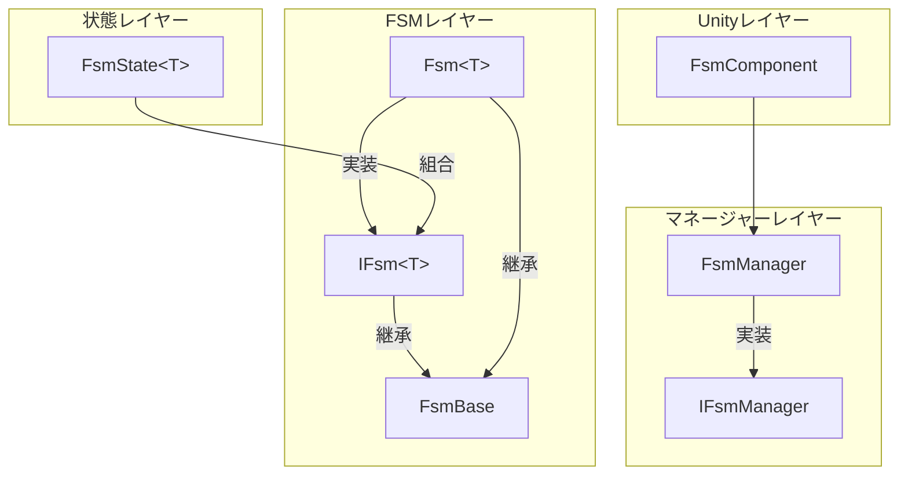
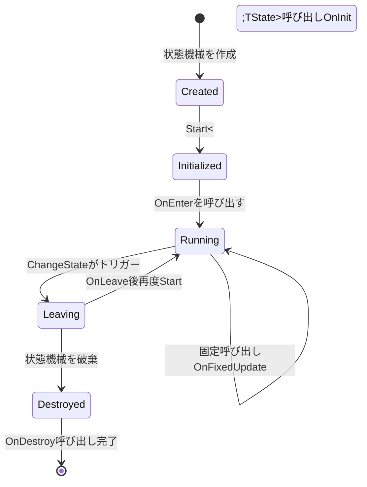
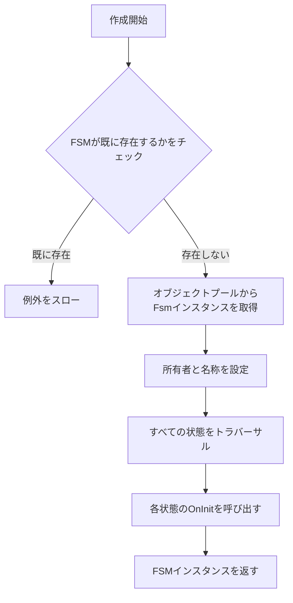

# コアコンセプト

本ドキュメントでは、GameFrameX有限状態機械（FSM）コンポーネントのコアコンセプト、アーキテクチャ設計、主要メカニズムについて詳しく説明します。FSMコンポーネントはUnityゲーム開発に堅牢な状態管理能力を提供し、状態ライフサイクル管理、状態切り替え、データストレージなどの機能をサポートしています。

## 概要

有限状態機械（Finite State Machine、略してFSM）は行動設計パターンの一種であり、オブジェクトが有限個の状態間での切り替えを可能にします。ゲーム開発において、FSMはAI行動管理、ゲームフロー制御、キャラクター状態切り替えなどのシナリオに広く应用されています。

GameFrameX FSMコンポーネントはGame Frameworkアーキテクチャに基づいて設計されており、以下のコア機能を提供します：

- **ジェネリック状態機械** - タイプセーフな状態機械定義、コンパイル時型チェック
- **状態ライフサイクル管理** - 完全な状態初期化、エントリ、更新、离开、破棄コールバック
- **状態データストレージ** - 内蔵のキーとバリューのデータストレージメカニズム
- **オブジェクトプールサポート** - 自動メモリ管理与オブジェクト再利用
- **Unityコンポーネント統合** - FsmComponentを提供し、Unityシーンでの使用を容易にする

## システムアーキテクチャ

GameFrameX FSMは階層型アーキテクチャ設計を採用し、底层から上层へと状態レイヤー、FSMレイヤー、マネージャー レイヤー依次配置します。この階層設計は責務の分離とコードの保守性を確保します。



### 各レイヤーの責務

**状態レイヤー（`FsmState<T>`）** は状態の具体的な実装ベースクラスです。開発者はこのクラスを継承して具体的な状態を定義し、各状態は独自のビジネスロジックを実装します。状態レイヤーには6つのライフサイクルコールバックメソッドが定義されており、状態機械の各种イベントに応答します。

**FSMレイヤー（`IFsm<T>` と `Fsm<T>`）** は状態機械のコア実装です。`IFsm<T>`インターフェースは状態機械のすべての操作を定義し、状態查询、状態切り替え、データアクセスなどが含まれます。`Fsm<T>`はこのインターフェースのジェネリック実装であり、状態コレクション、現在の狀態、状態継続時間などのランタイムデータを維持します。

**マネージャーレイヤー（IFsmManager と FsmManager）** はシステム全体のFSMインスタンス管理を担当します。FsmManagerはGameFrameworkModuleから継承し、ゲームフレームワークのモジュールとしてサービスを提供します。すべてのFSMインスタンスの参照を維持し、作成、查询、破棄、ポーリング更新を担当します。

## コアコンポーネント

### `FsmState<T>` 状態ベースクラス

`FsmState<T>` はすべての具体的な状態の抽象ベースクラスです。6つのライフサイクルコールバックメソッドが定義されており、状態機械が適切なタイミングで自動的に呼び出します。開発者は必要なメソッドのみをオーバーライドすればよく、呼び出しタイミング的关注は不要です。

```csharp
public abstract class FsmState<T> where T : class
{
    // 状態初期化時に呼び出し
    protected internal virtual void OnInit(IFsm<T> fsm) { }
    
    // 状態入る時に呼び出し
    protected internal virtual void OnEnter(IFsm<T> fsm) { }
    
    // 状態毎フレーム更新時に呼び出し
    protected internal virtual void OnUpdate(IFsm<T> fsm, float elapseSeconds, float realElapseSeconds) { }
    
    // 状態固定更新時に呼び出し（物理関連）
    protected internal virtual void OnFixedUpdate(IFsm<T> fsm, float elapseSeconds, float realElapseSeconds) { }
    
    // 状態を離れる時に呼び出し
    protected internal virtual void OnLeave(IFsm<T> fsm, bool isShutdown) { }
    
    // 状態破棄時に呼び出し
    protected internal virtual void OnDestroy(IFsm<T> fsm) { }
    
    // 他の状態へ切り替え
    public void ChangeToState<TState>(IFsm<T> fsm) where TState : FsmState<T>
    protected void ChangeState<TState>(IFsm<T> fsm) where TState : FsmState<T>
}
```

> Source: [FsmState.cs](https://github.com/GameFrameX/com.gameframex.unity.fsm/blob/main/Runtime/Fsm/FsmState.cs#L17-L136)

**設計意図**：テンプレートメソッドパターンを使用して状態の標準動作フレームワークを定義します。各状態は自分の特定のロジックのみ的关注すればよく、状態機械は正しいタイミングで正しいメソッドを呼び出す負責です。この設計により、状態の共通動作がベースクラスに抽象化され、具体的な動作はサブクラス実装に委譲されます。

### `IFsm<T>` 状態機械インターフェース

`IFsm<T>` インターフェースは状態機械の完全な操作セットを定義します。ジェネリックパラメータTを通じて、状態機械はタイプセーフに任意の型のオブジェクトを保持できます。

```csharp
public interface IFsm<T> where T : class
{
    // プロパティ
    string Name { get; }
    string FullName { get; }
    T Owner { get; }
    int FsmStateCount { get; }
    bool IsRunning { get; }
    bool IsDestroyed { get; }
    FsmState<T> CurrentState { get; }
    float CurrentStateTime { get; }
    
    // メソッド
    void Start<TState>() where TState : FsmState<T>;
    void Start(Type stateType);
    bool HasState<TState>() where TState : FsmState<T>;
    TState GetState<TState>() where TState : FsmState<T>;
    FsmState<T>[] GetAllStates();
    bool HasData(string name);
    TData GetData<TData>(string name) where TData : Variable;
    void SetData<TData>(string name, TData data) where TData : Variable;
    bool RemoveData(string name);
}
```

> Source: [IFsm.cs](https://github.com/GameFrameX/com.gameframex.unity.fsm/blob/main/Runtime/Fsm/IFsm.cs#L18-L179)

**設計意図**：インターフェース分離原則の典型的な応用です。`IFsm<T>`インターフェースを通じて、状態は実行時に状態機械の完全な制御権を取得でき、状態の切り替え、データの存储などが含まれます。この設計により、状態クラスは状態機械の動作を完全に制御できます。

### FsmManager 状態機械マネージャー

FsmManagerはシステムのコアマネージャーであり、すべてのFSMインスタンスのライフサイクル管理を担当します。

```csharp
public sealed class FsmManager : GameFrameworkModule, IFsmManager
{
    // 状態機械を作成
    public IFsm<T> CreateFsm<T>(T owner, params FsmState<T>[] states) where T : class;
    public IFsm<T> CreateFsm<T>(string name, T owner, params FsmState<T>[] states) where T : class;
    
    // 状態機械を取得
    public IFsm<T> GetFsm<T>() where T : class;
    public IFsm<T> GetFsm<T>(string name) where T : class;
    
    // 状態機械存在を確認
    public bool HasFsm<T>() where T : class;
    
    // 状態機械を破棄
    public bool DestroyFsm<T>(IFsm<T> fsm) where T : class;
    
    // ポーリング更新
    public void FixedUpdate(float fixedDeltaTime, float fixedTime);
}
```

> Source: [FsmManager.cs](https://github.com/GameFrameX/com.gameframex.unity.fsm/blob/main/Runtime/Fsm/FsmManager.cs#L18-L436)

**設計意図**：シングルトンマネージャーパターンのゲーム開発における典型的な応用です。FsmManagerはゲームフレームワークのモジュールとして、 게임 프레임워크の初期化と关闭流程に自動的に参加します。GameFrameworkEntryを通じてモジュールインスタンスを取得し、モジュールがシステム内でグローバルに一意であることを確保します。

### FsmComponent Unityコンポーネント

FsmComponentはUnityエンジン向けのコンポーネント封装であり、エディターに優しい状態機械管理方法を提供します。

```csharp
[DisallowMultipleComponent]
[AddComponentMenu("Game Framework/FSM")]
public sealed class FsmComponent : GameFrameworkComponent
{
    // すべての操作はm_FsmManagerに委任
    private IFsmManager m_FsmManager = null;
    
    protected override void Awake()
    {
        base.Awake();
        m_FsmManager = GameFrameworkEntry.GetModule<IFsmManager>();
    }
    
    private void FixedUpdate()
    {
        m_FsmManager.FixedUpdate(Time.fixedDeltaTime, Time.fixedTime);
    }
}
```

> Source: [FsmComponent.cs](https://github.com/GameFrameX/com.gameframex.unity.fsm/blob/main/Runtime/Fsm/FsmComponent.cs#L22-L53)

**設計意図**：アダプター パターンの体現です。FsmComponentは底層のFsmManager機能をUnityコンポーネント形式に adapteし、開発者はUnityエディター内で直接状態機械コンポーネントを追加・管理でき、手動で初期化コードを記述する必要がありません。

## 状態ライフサイクル

状態の6つのライフサイクルコールバックを理解することは、FSMを正しく使用する鍵です。各コールバックには特定design目的と呼び出しタイミングがあります。



### ライフサイクル详解

**OnInit - 初期化フェーズ**

状態機械作成時、すべての状態にOnInitメソッドが一度呼び出されます。この時点で状態機械はまだ起動しておらず、現在の状态はnullです。このフェーズでは、静的な状態の初期化に適しています，例如は他の状態の参照をキャッシュします。

```csharp
protected internal override void OnInit(IFsm<Character> fsm)
{
    // 常駐状態の参照をキャッシュ
    var idleState = fsm.GetState<IdleState>();
    var runState = fsm.GetState<RunState>();
    // ...
}
```

**OnEnter - エントリフェーズ**

状態が現在の状態に設定された時に呼び出されます。状態切り替えが完了し、新状態が実行を開始する前に呼び出されます。状態のエントリロジックを実行に適しています，例如はアニメを再生、パラメータを設定など。

```csharp
protected internal override void OnEnter(IFsm<Character> fsm)
{
    // エントリアニメを再生
    Owner.PlayAnimation("Idle");
    // 状態データをリセット
    fsm.SetData("AttackCount", 0);
}
```

**OnUpdate - 更新フェーズ**

毎フレーム呼び出され、論理経過時間（elapseSeconds）と実際の経過時間（realElapseSeconds）を受信します。毎フレーム実行する必要があるロジックに適しています，例如は入力検出、AI意思決定など。

```csharp
protected internal override void OnUpdate(IFsm<Character> fsm, float elapseSeconds, float realElapseSeconds)
{
    // 状態を切り替える必要があるかどうか検出
    if (fsm.GetData<bool>("IsHurt"))
    {
        ChangeState<HurtState>(fsm);
    }
}
```

**OnFixedUpdate - 固定更新フェーズ**

OnUpdateに類似하지만、固定時間間隔で呼び出され、物理関連のロジックに適しています。

**OnLeave - 离开フェーズ**

状態が離れよう”时 호출됩니다。パラメータ isShutdownは正常な状態切り替え（false）还是状態機械关闭（true）を示します。クリーンアップ作業を実行に適しています，例如はアニメを停止、状態を保存など。

```csharp
protected internal override void OnLeave(IFsm<Character> fsm, bool isShutdown)
{
    // 状態データを保存
    var attackCount = fsm.GetData<int>("AttackCount");
    // 現在のアニメを停止
    Owner.StopAnimation();
}
```

**OnDestroy - 破棄フェーズ**

状態機械が破棄された時に呼び出されます。これは状態の最後のライフサイクルコールバックであり、最終的なクリーンアップ作業を実行に適しており、すべてのリソースを解放します。

## 状態切り替えメカニズム

状態切り替えはFSMのコア機能です。`FsmState<T>`は3種類の状態切り替え方法を提供しており、異なる使用シナリオに適しています。

```mermaid
sequenceDiagram
    participant StateA as 現在の状態
    participant FSM as Fsm<T>
    participant StateB as 目標状態
    
    StateA->>FSM: OnUpdateで切り替え条件を検出
    StateA->>FSM: ChangeState&lt;TargetState&gt;(fsm)
    FSM->>StateA: OnLeave(this, false)
    FSM->>FSM: CurrentStateTimeをリセット
    FSM->>FSM: CurrentStateを更新
    FSM->>StateB: OnEnter(this)
```

### 状態切り替え方法

**公開メソッド（外部呼び出し元に公開）**

```csharp
// FsmState内部で呼び出し
public void ChangeToState<TState>(IFsm<T> fsm) where TState : FsmState<T>
```

> Source: [FsmState.cs](https://github.com/GameFrameX/com.gameframex.unity.fsm/blob/main/Runtime/Fsm/FsmState.cs#L84-L93)

このメソッドは、状態内部から状態切り替えをトリガーすることを許可します。最初に旧状態のOnLeaveメソッドを呼び出し、次に現在の状态参照を更新し、最後に新状態のOnEnterメソッドを呼び出します。

**保護メソッド（サブクラスが呼び出し）**

```csharp
// サブクラスがOnUpdateなどのメソッド内で呼び出し
protected void ChangeState<TState>(IFsm<T> fsm) where TState : FsmState<T>
```

最も一般的に使用される状態切り替え方式です。開発者は通常OnUpdateメソッド内で切り替え条件を検出し、このメソッドを呼び出して次の状態に切り替えます。

**型パラメータメソッド**

```csharp
// Typeオブジェクトで状態を切り替え
protected void ChangeState(IFsm<T> fsm, Type stateType)
```

目标状態タイプを動的に決定する必要があるシナリオに適しています，例如は設定テーブルや実行時データに基づいて状態を選択する場合。

## 状態データストレージ

FSMは内置のキーとバリューのデータストレージメカニズムを提供し、状態機械と状態の間でデータを共有できます。この設計はグローバル変数や追加のデータ 전달メカニズムの使用を避けます。

### データストレージインターフェース

```csharp
// データが存在するか確認
bool HasData(string name);

// データを取得
TData GetData<TData>(string name) where TData : Variable;
Variable GetData(string name);

// データを設定
void SetData<TData>(string name, TData data) where TData : Variable;
void SetData(string name, Variable data);

// データを削除
bool RemoveData(string name);
```

> Source: [IFsm.cs](https://github.com/GameFrameX/com.gameframex.unity.fsm/blob/main/Runtime/Fsm/IFsm.cs#L136-L178)

### 使用例

```csharp
// データを存储
fsm.SetData("Score", new Variable<int>(100));
fsm.SetData("PlayerName", new Variable<string>("Hero"));

// データを読み取り
var score = fsm.GetData<Variable<int>>("Score");
var playerName = fsm.GetData<Variable<string>>("PlayerName");

// 存在を確認
if (fsm.HasData("Power"))
{
    var power = fsm.GetData<Variable<int>>("Power");
}
```

**設計意図**：Variableで元型をラップし、より柔軟なデータストレージを実現します。ReferencePoolを通じて、データオブジェクトは使用後に回収されて再利用でき、ガベージコレクションの壓力を軽減します。

## 状態機械作成フロー

状態機械の作成はFSMを使用する最初のステップです。作成フローを理解することは、状態機械を正しく初期化するのに役立ちます。



### 作成コード例

```csharp
// 方法1：名称を指定しない
IFsm<Character> fsm = FsmManager.Instance.CreateFsm(character,
    new IdleState(),
    new RunState(),
    new JumpState(),
    new AttackState());

// 方法2：名称を指定（同じタイプの複数のFSM用）
IFsm<Character> fsm = FsmManager.Instance.CreateFsm("PlayerFSM", character,
    new IdleState(),
    new RunState(),
    new JumpState(),
    new AttackState());

// 方法3：Listを使用
var states = new List<FsmState<Character>>
{
    new IdleState(),
    new RunState(),
    new JumpState()
};
IFsm<Character> fsm = FsmManager.Instance.CreateFsm(character, states);

// 状態機械を起動
fsm.Start<IdleState>();
```

> Source: [FsmManager.cs](https://github.com/GameFrameX/com.gameframex.unity.fsm/blob/main/Runtime/Fsm/FsmManager.cs#L268-L325)

**重要なヒント**：状態機械を作成する際は少なくとも1つの状態を追加する必要があり、そうでない場合は例外がスローされます。状態機械を作成したら、明示的にStartメソッドを呼び出して起動する必要があります。

## メモリ管理

GameFrameX FSMコンポーネントはオブジェクトプール技術を使用してメモリを最適化し、ゲーム実行時のガベージコレクションの壓力を軽減します。

### オブジェクトプールメカニズム

FSMインスタンスと状態データはすべてReferencePoolを通じて管理されます：

```csharp
// 作成時にオブジェクトプールから取得
Fsm<T> fsm = ReferencePool.Acquire<Fsm<T>>();

// 破棄時にオブジェクトプールに返す
internal override void Shutdown()
{
    ReferencePool.Release(this);
}
```

> Source: [Fsm.cs](https://github.com/GameFrameX/com.gameframex.unity.fsm/blob/main/Runtime/Fsm/Fsm.cs#L123-L145)

### クリーンアップフロー

```csharp
public void Clear()
{
    // 1. 現在の状態のOnLeaveを呼び出す（shutdownはtrue）
    if (m_CurrentState != null)
    {
        m_CurrentState.OnLeave(this, true);
    }
    
    // 2. すべての状態のOnDestroyを呼び出す
    foreach (KeyValuePair<Type, FsmState<T>> state in m_States)
    {
        state.Value.OnDestroy(this);
    }
    
    // 3. データをクリーンアップ（オブジェクトプールに返す）
    if (m_Datas != null)
    {
        foreach (KeyValuePair<string, Variable> data in m_Datas)
        {
            ReferencePool.Release(data.Value);
        }
    }
    
    // 4. FSMインスタンスをオブジェクトプールに解放
    ReferencePool.Release(this);
}
```

> Source: [Fsm.cs](https://github.com/GameFrameX/com.gameframex.unity.fsm/blob/main/Runtime/Fsm/Fsm.cs#L193-L227)

**設計意図**：长时间実行されるゲームにとって正しいリソースクリーンアップは極めて重要です。FSMはクリーンアップ時にすべての状態の破棄コールバックを呼び出して.Iterateし、リソースが正しく解放されることを確保します。同時に、オブジェクトプールを通じてオブジェクトを再利用し、频繁なメモリ割り当てとガベージコレクションを避けます。

## 使用シナリオとベストプラクティス

### 典型的な使用シナリオ

**キャラクターAI状態管理**

FSMの最も典型的な応用シナリオはキャラクターAI行動制御です。各行動状態（待機、パトロール Chase、攻撃、撤退など）に対応するFsmStateサブクラスがあり、状態機械は状態間の切り替えロジックを管理します。

```csharp
// キャラクター状態機械例
public class CharacterAI : MonoBehaviour
{
    private IFsm<Character> _fsm;
    
    void Start()
    {
        _fsm = FsmManager.Instance.CreateFsm(this,
            new IdleState(),
            new PatrolState(),
            new ChaseState(),
            new AttackState());
        _fsm.Start<IdleState>();
    }
    
    void Update()
    {
        // FsmManagerは自動的にUpdateを呼び出す
    }
}
```

**ゲームフロー制御**

FSMはゲーム全体フローの管理にも使用でき、メインダイヤ、開始游戏、を一時停止、決済などの状態の切り替えを管理します。

**UI画面状態管理**

複雑なUI画面はFSMを使用して異なる表示状態を管理し、状態切り替えの秩序性を確保できます。

### ベストプラクティス

**1. 状態数の制御**

各FSMが管理する状態数を10個以内に制御することを推奨します。状態が多すぎる場合は、複数のFSMに分割することを検討してください。

**2. 状態の責務の単一性**

各状態は1種類の行動ロジックのみを担当するべきです。複雑なロジックは複数の状態に分解する必要があります。

**3. OnUpdateでの大量計算の回避**

OnUpdateは毎フレーム呼び出されるため、軽量に保つべきです。複雑な計算は他のタイミングで配置する必要があります。

**4. 状態切り替え条件の正しい実装**

状態切り替え条件は明確であるべきであり、条件の重複导致的狀態不确定性问题を引き起こさないでください。

**5. 不要なFSMのタイムリーな破棄**

状態機械が不要になったら、DestroyFsmメソッドを呼び出してリソースを解放する必要があります。

```csharp
// 状態機械を破棄
FsmManager.Instance.DestroyFsm(fsm);
```

## 関連リンク

- [クイックスタート](./3-getting-started) - FSMコンポーネントのクイックスタート
- [APIリファレンス](./5-api-reference) - 完全なAPIドキュメント
- [インストール](./2-installation) - FSMコンポーネントのインストールと設定
- [トラブルシューティング](./6-troubleshooting) - よくある質問
