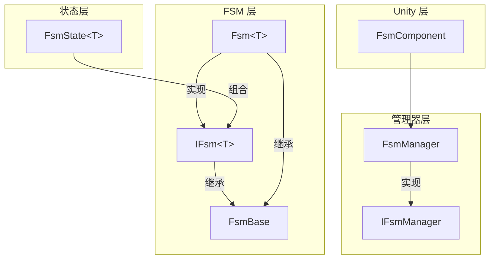
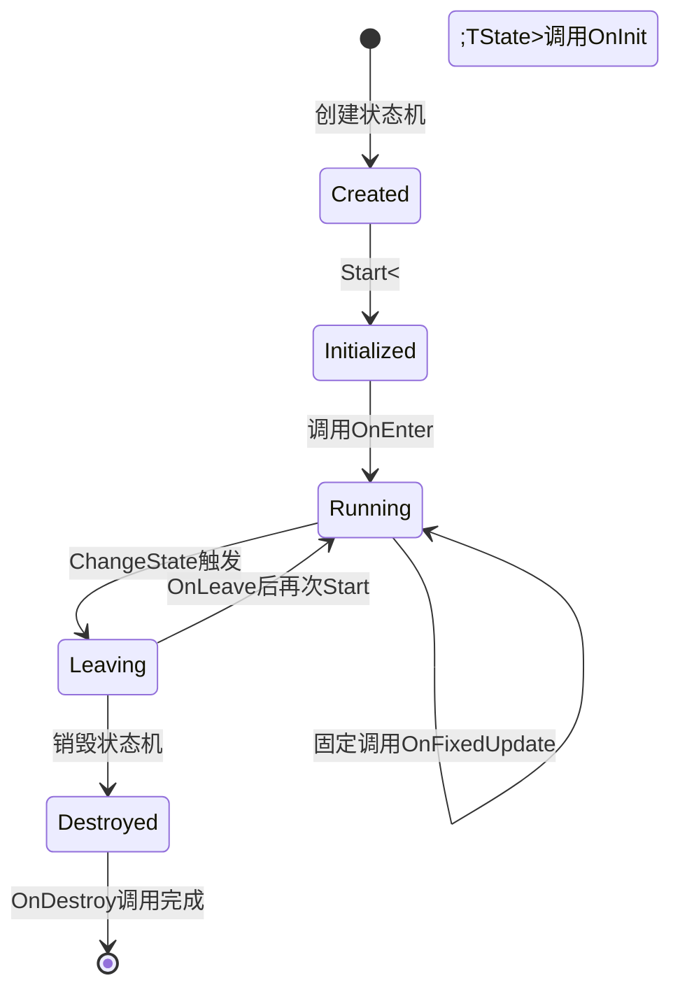
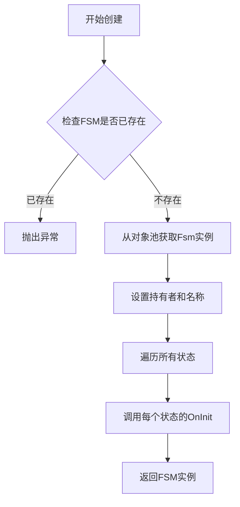

# コアコンセプト

このドキュメント詳細介绍 GameFrameX 有限ステータス机（FSM）コンポーネント的コアコンセプト、アーキテクチャ設計和关键机制。FSM コンポーネント为 Unity 游戏开发提供します健壮的ステータス管理能力，サポートステータスライフサイクル管理、ステータス转换和数据存储等機能。

## 概要

有限ステータス机（Finite State Machine，简称 FSM）は一種の行为設計モード，它允许对象在有限个ステータス之间进行切换。在游戏开发中，FSM 广泛应用于 AI 行为管理、游戏フロー控制、角色ステータス切换等シーン。

GameFrameX FSM コンポーネント基于 Game Framework アーキテクチャ設計，提供以下コア能力：

- **ジェネリックステータス机** - サポート强タイプ的ステータス机定義，コンパイル时タイプ確認
- **ステータスライフサイクル管理** - 完全な的ステータス初期化、进入、アップデート、离开、破棄コールバック
- **ステータス数据存储** - 内置键值对数据存储机制
- **对象池サポート** - 自动内存管理和对象复用
- **Unity コンポーネント集成** - 提供 FsmComponent 便于在 Unity シーン中使用

## システムアーキテクチャ

GameFrameX FSM 采用分层アーキテクチャ設計，从底层到上层依次为：ステータス层、FSM 层和マネージャー层。这种分层設計確認してください了职责分离和コード可维护性。



### 各层职责

**ステータス层（FsmState<T>）** 是ステータス的具体実装基底クラス。開発者通过継承このクラス来定義具体的ステータス，每个ステータス実装自己的业务逻辑。ステータス层定義了ステータス的六个ライフサイクルコールバックメソッド，用于响应ステータス机的各种イベント。

**FSM 层（IFsm<T> 和 Fsm<T>）** 是ステータス机的コア実装。IFsm<T> インターフェース定義了ステータス机的所有操作，含みますステータス查询、ステータス转换、数据存取等。Fsm<T> 是该インターフェース的ジェネリック実装，维护ステータス集合、当前ステータス、ステータス持续时间等ランタイム数据。

**マネージャー层（IFsmManager 和 FsmManager）** 负责管理整个系统的 FSM インスタンス。FsmManager 継承自 GameFrameworkModule，作为游戏フレームワーク的一个モジュール提供服务。它维护所有 FSM インスタンス的参照，负责作成、查询、破棄和轮询アップデート。

## コアコンポーネント

### FsmState<T> ステータス基底クラス

FsmState<T> 是所有具体ステータス的抽象基底クラス。它定義了ステータス的六个ライフサイクルコールバックメソッド，这些メソッド由ステータス机在适当的时机自动呼び出し。開発者只需オーバーライド〜する必要があります的メソッド，无需关注呼び出し时机。

```csharp
public abstract class FsmState<T> where T : class
{
    // 状态初始化时调用
    protected internal virtual void OnInit(IFsm<T> fsm) { }
    
    // 状态进入时调用
    protected internal virtual void OnEnter(IFsm<T> fsm) { }
    
    // 状态每帧更新时调用
    protected internal virtual void OnUpdate(IFsm<T> fsm, float elapseSeconds, float realElapseSeconds) { }
    
    // 状态固定更新时调用（物理相关）
    protected internal virtual void OnFixedUpdate(IFsm<T> fsm, float elapseSeconds, float realElapseSeconds) { }
    
    // 状态离开时调用
    protected internal virtual void OnLeave(IFsm<T> fsm, bool isShutdown) { }
    
    // 状态销毁时调用
    protected internal virtual void OnDestroy(IFsm<T> fsm) { }
    
    // 切换到其他状态
    public void ChangeToState<TState>(IFsm<T> fsm) where TState : FsmState<T>
    protected void ChangeState<TState>(IFsm<T> fsm) where TState : FsmState<T>
}
```

> Source: [FsmState.cs](https://github.com/GameFrameX/com.gameframex.unity.fsm/blob/main/Runtime/Fsm/FsmState.cs#L17-L136)

**設計意图**：使用テンプレートメソッドパターン定義ステータス的標準行为フレームワーク。每个ステータス只需关注自己的特定逻辑，ステータス机负责在正确的时机呼び出し正确的メソッド。这种設計将ステータス的汎用行为抽象到基底クラス，具体行为留给サブクラス実装。

### IFsm<T> ステータス机インターフェース

IFsm<T> インターフェース定義了ステータス机的完全な操作集合。通过ジェネリックパラメータ T，ステータス机〜できますタイプ安全地持有任意タイプ的对象。

```csharp
public interface IFsm<T> where T : class
{
    // 属性
    string Name { get; }
    string FullName { get; }
    T Owner { get; }
    int FsmStateCount { get; }
    bool IsRunning { get; }
    bool IsDestroyed { get; }
    FsmState<T> CurrentState { get; }
    float CurrentStateTime { get; }
    
    // 方法
    void Start<TState>() where TState : FsmState<T>;
    void Start(Type stateType);
    bool HasState<TState>() where TState : FsmState<T>;
    TState GetState<TState>() where TState : FsmState<T>;
    FsmState<T>[] GetAllStates();
    bool HasData(string name);
    TData GetData<TData>(string name) where TData : Variable;
    void SetData<TData>(string name, TData data) where TData : Variable;
    bool RemoveData(string name);
}
```

> Source: [IFsm.cs](https://github.com/GameFrameX/com.gameframex.unity.fsm/blob/main/Runtime/Fsm/IFsm.cs#L18-L179)

**設計意图**：インターフェース隔离原则的典型应用。通过 IFsm<T> インターフェース，ステータス〜できます在ランタイム取得ステータス机的完全な控制权，含みます切换ステータス、存储数据等。这种設計使得ステータス类〜できます完全控制ステータス机的行为。

### FsmManager ステータス机マネージャー

FsmManager 是系统的コアマネージャー，负责所有 FSM インスタンス的ライフサイクル管理。

```csharp
public sealed class FsmManager : GameFrameworkModule, IFsmManager
{
    // 创建状态机
    public IFsm<T> CreateFsm<T>(T owner, params FsmState<T>[] states) where T : class;
    public IFsm<T> CreateFsm<T>(string name, T owner, params FsmState<T>[] states) where T : class;
    
    // 获取状态机
    public IFsm<T> GetFsm<T>() where T : class;
    public IFsm<T> GetFsm<T>(string name) where T : class;
    
    // 检查状态机存在
    public bool HasFsm<T>() where T : class;
    
    // 销毁状态机
    public bool DestroyFsm<T>(IFsm<T> fsm) where T : class;
    
    // 轮询更新
    public void FixedUpdate(float fixedDeltaTime, float fixedTime);
}
```

> Source: [FsmManager.cs](https://github.com/GameFrameX/com.gameframex.unity.fsm/blob/main/Runtime/Fsm/FsmManager.cs#L18-L436)

**設計意图**：单例マネージャーモード在游戏开发中的典型应用。FsmManager 作为游戏フレームワーク的一个モジュール，自动参与游戏フレームワーク的初期化和閉じるフロー。通过 GameFrameworkEntry 取得モジュールインスタンス，確認してくださいモジュール在系统中全局唯一。

### FsmComponent Unity コンポーネント

FsmComponent 是面向 Unity 引擎的コンポーネントカプセル化，提供エディタ使いやすい的ステータス机管理方法。

```csharp
[DisallowMultipleComponent]
[AddComponentMenu("Game Framework/FSM")]
public sealed class FsmComponent : GameFrameworkComponent
{
    // 所有操作都委托给 m_FsmManager
    private IFsmManager m_FsmManager = null;
    
    protected override void Awake()
    {
        base.Awake();
        m_FsmManager = GameFrameworkEntry.GetModule<IFsmManager>();
    }
    
    private void FixedUpdate()
    {
        m_FsmManager.FixedUpdate(Time.fixedDeltaTime, Time.fixedTime);
    }
}
```

> Source: [FsmComponent.cs](https://github.com/GameFrameX/com.gameframex.unity.fsm/blob/main/Runtime/Fsm/FsmComponent.cs#L22-L53)

**設計意图**：适配器モード的体现。FsmComponent 将底层的 FsmManager 機能适配为 Unity コンポーネント形式，開発者〜できます直接在 Unity エディタ中追加和管理ステータス机コンポーネント，无需手动编写初期化コード。

## ステータスライフサイクル

理解ステータス的六个ライフサイクルコールバック是正确使用 FSM 的关键。每个コールバック都有其特定的設計目的和呼び出し时机。



### ライフサイクル详解

**OnInit - 初期化フェーズ**

当ステータス机作成时，所有ステータス都会呼び出し一次 OnInit メソッド。此时ステータス机尚未启动，当前ステータス为 null。这个フェーズ适合进行ステータス的静态初期化，例えば缓存其他ステータス的参照。

```csharp
protected internal override void OnInit(IFsm<Character> fsm)
{
    // 缓存常驻状态引用
    var idleState = fsm.GetState<IdleState>();
    var runState = fsm.GetState<RunState>();
    // ...
}
```

**OnEnter - 进入フェーズ**

当ステータス被設定为当前ステータス时呼び出し。在ステータス转换完成后、新ステータス开始执行前呼び出し。适合执行ステータス的进入逻辑，如再生动画、設定パラメータ等。

```csharp
protected internal override void OnEnter(IFsm<Character> fsm)
{
    // 播放进入动画
    Owner.PlayAnimation("Idle");
    // 重置状态数据
    fsm.SetData("AttackCount", 0);
}
```

**OnUpdate - アップデートフェーズ**

每帧呼び出し一次，受信逻辑流逝时间（elapseSeconds）和真实流逝时间（realElapseSeconds）。适合放置〜する必要があります每帧执行的逻辑，如输入检测、AI 决策等。

```csharp
protected internal override void OnUpdate(IFsm<Character> fsm, float elapseSeconds, float realElapseSeconds)
{
    // 检测是否需要切换状态
    if (fsm.GetData<bool>("IsHurt"))
    {
        ChangeState<HurtState>(fsm);
    }
}
```

**OnFixedUpdate - 固定アップデートフェーズ**

与 OnUpdate 类似，但按照固定时间间隔呼び出し，适合物理相关的逻辑。

**OnLeave - 离开フェーズ**

当ステータスつまり将离开时呼び出し。パラメータ isShutdown 表示是正常ステータス转换（false）还是ステータス机閉じる（true）。适合执行清理工作，如停止动画、保存ステータス等。

```csharp
protected internal override void OnLeave(IFsm<Character> fsm, bool isShutdown)
{
    // 保存状态数据
    var attackCount = fsm.GetData<int>("AttackCount");
    // 停止当前动画
    Owner.StopAnimation();
}
```

**OnDestroy - 破棄フェーズ**

当ステータス机被破棄时呼び出し。这是ステータス的最後に一个ライフサイクルコールバック，适合执行最终的清理工作，解放所有リソース。

## ステータス转换机制

ステータス转换是 FSM 的コア機能。FsmState<T> 提供します三种切换ステータス的メソッド，適しています不同的使用シーン。

```mermaid
sequenceDiagram
    participant StateA as 当前状态
    participant FSM as Fsm<T>
    participant StateB as 目标状态
    
    StateA->>FSM: OnUpdate 检测转换条件
    StateA->>FSM: ChangeState&lt;TargetState&gt;(fsm)
    FSM->>StateA: OnLeave(this, false)
    FSM->>FSM: 重置 CurrentStateTime
    FSM->>FSM: 更新 CurrentState
    FSM->>StateB: OnEnter(this)
```

### ステータス转换メソッド

**公开メソッド（公开给外部呼び出し者）**

```csharp
// 在 FsmState 内部调用
public void ChangeToState<TState>(IFsm<T> fsm) where TState : FsmState<T>
```

> Source: [FsmState.cs](https://github.com/GameFrameX/com.gameframex.unity.fsm/blob/main/Runtime/Fsm/FsmState.cs#L84-L93)

此メソッド允许从ステータス内部トリガーステータス转换。它まず呼び出し旧ステータス的 OnLeave メソッド，次にアップデート当前ステータス参照，最後に呼び出し新ステータス的 OnEnter メソッド。

**受保护メソッド（供サブクラス呼び出し）**

```csharp
// 供子类在 OnUpdate 等方法中调用
protected void ChangeState<TState>(IFsm<T> fsm) where TState : FsmState<T>
```

这是最常用的ステータス切换方法。開発者通常在 OnUpdate メソッド中检测转换条件，次に呼び出し此メソッド切换到下一个ステータス。

**タイプパラメータメソッド**

```csharp
// 通过 Type 对象切换状态
protected void ChangeState(IFsm<T> fsm, Type stateType)
```

適しています〜する必要があります动态决定目标ステータスタイプ的シーン，如根据設定表或ランタイム数据选择ステータス。

## ステータス数据存储

FSM 提供します内置的键值对数据存储机制，允许在ステータス机和ステータス之间共享数据。这一設計避免了使用全局变量或额外的数据传递机制。

### 数据存储インターフェース

```csharp
// 检查数据是否存在
bool HasData(string name);

// 获取数据
TData GetData<TData>(string name) where TData : Variable;
Variable GetData(string name);

// 设置数据
void SetData<TData>(string name, TData data) where TData : Variable;
void SetData(string name, Variable data);

// 移除数据
bool RemoveData(string name);
```

> Source: [IFsm.cs](https://github.com/GameFrameX/com.gameframex.unity.fsm/blob/main/Runtime/Fsm/IFsm.cs#L136-L178)

### 使用例

```csharp
// 存储数据
fsm.SetData("Score", new Variable<int>(100));
fsm.SetData("PlayerName", new Variable<string>("Hero"));

// 读取数据
var score = fsm.GetData<Variable<int>>("Score");
var playerName = fsm.GetData<Variable<string>>("PlayerName");

// 检查存在
if (fsm.HasData("Power"))
{
    var power = fsm.GetData<Variable<int>>("Power");
}
```

**設計意图**：使用 Variable パッケージ装原始タイプ，実装更柔軟的数据存储。通过 ReferencePool，数据对象〜できます在使用完毕后回收再利用，减少垃圾回收压力。

## ステータス机作成フロー

作成ステータス机是使用 FSM 的第1步。理解作成フロー有助于正确初期化ステータス机。



### 作成コード例

```csharp
// 方式1：不指定名称
IFsm<Character> fsm = FsmManager.Instance.CreateFsm(character,
    new IdleState(),
    new RunState(),
    new JumpState(),
    new AttackState());

// 方式2：指定名称（用于同一类型多个FSM）
IFsm<Character> fsm = FsmManager.Instance.CreateFsm("PlayerFSM", character,
    new IdleState(),
    new RunState(),
    new JumpState(),
    new AttackState());

// 方式3：使用List
var states = new List<FsmState<Character>>
{
    new IdleState(),
    new RunState(),
    new JumpState()
};
IFsm<Character> fsm = FsmManager.Instance.CreateFsm(character, states);

// 启动状态机
fsm.Start<IdleState>();
```

> Source: [FsmManager.cs](https://github.com/GameFrameX/com.gameframex.unity.fsm/blob/main/Runtime/Fsm/FsmManager.cs#L268-L325)

**重要なヒント**：作成ステータス机时〜しなければなりません至少追加一个ステータス，否则会抛出例外。ステータス机作成后〜する必要があります显式呼び出し Start メソッド才能启动。

## 内存管理

GameFrameX FSM コンポーネント采用对象池技术进行内存最適化，减少游戏ランタイム的垃圾回收压力。

### 对象池机制

FSM インスタンス和ステータス数据都通过 ReferencePool 进行管理：

```csharp
// 创建时从对象池获取
Fsm<T> fsm = ReferencePool.Acquire<Fsm<T>>();

// 销毁时返回对象池
internal override void Shutdown()
{
    ReferencePool.Release(this);
}
```

> Source: [Fsm.cs](https://github.com/GameFrameX/com.gameframex.unity.fsm/blob/main/Runtime/Fsm/Fsm.cs#L123-L145)

### 清理フロー

```csharp
public void Clear()
{
    // 1. 调用当前状态的 OnLeave（shutdown 为 true）
    if (m_CurrentState != null)
    {
        m_CurrentState.OnLeave(this, true);
    }
    
    // 2. 调用所有状态的 OnDestroy
    foreach (KeyValuePair<Type, FsmState<T>> state in m_States)
    {
        state.Value.OnDestroy(this);
    }
    
    // 3. 清理数据（返回对象池）
    if (m_Datas != null)
    {
        foreach (KeyValuePair<string, Variable> data in m_Datas)
        {
            ReferencePool.Release(data.Value);
        }
    }
    
    // 4. 释放 FSM 实例到对象池
    ReferencePool.Release(this);
}
```

> Source: [Fsm.cs](https://github.com/GameFrameX/com.gameframex.unity.fsm/blob/main/Runtime/Fsm/Fsm.cs#L193-L227)

**設計意图**：正确的リソース清理对于长时间运行的游戏至关重要な。FSM 在清理时会遍历呼び出し所有ステータス的破棄コールバック，確認してくださいリソース被正确解放。同時に，通过对象池复用对象，避免频繁的内存分配和垃圾回收。

## 使用シーン与最佳实践

### 典型使用シーン

**角色 AI ステータス管理**

FSM 最典型的应用シーン是角色 AI 行为控制。每个行为ステータス（待机、巡逻、追击、攻击、撤退等）对应一个 FsmState サブクラス，ステータス机负责管理ステータス之间的转换逻辑。

```csharp
// 角色状态机示例
public class CharacterAI : MonoBehaviour
{
    private IFsm<Character> _fsm;
    
    void Start()
    {
        _fsm = FsmManager.Instance.CreateFsm(this,
            new IdleState(),
            new PatrolState(),
            new ChaseState(),
            new AttackState());
        _fsm.Start<IdleState>();
    }
    
    void Update()
    {
        // FsmManager 会自动调用 Update
    }
}
```

**游戏フロー控制**

FSM 也可用于管理游戏整体フロー，如主メニュー、开始游戏、暂停、结算等ステータス的切换。

**UI 界面ステータス管理**

複雑的 UI 界面〜できます使用 FSM 管理不同的显示ステータス，確認してくださいステータス切换的有序进行。

### ベストプラクティス

**1. ステータス数量控制**

お勧め每个 FSM 管理的ステータス数量控制在 10 个以内。もしステータス过多，考虑拆分多个 FSM。

**2. ステータス职责单一**

每个ステータス〜すべき只负责一种行为逻辑。複雑逻辑〜すべき分解为多个ステータス。

**3. 避免在 OnUpdate 中进行大量计算**

OnUpdate 每帧都会被呼び出し，〜すべき保持轻量。複雑的计算〜すべき安排在其他时机。

**4. 正确実装ステータス转换条件**

ステータス转换条件〜すべき清晰明确，避免条件重叠导致的ステータス不确定性問題。

**5. 及时破棄不〜する必要があります的 FSM**

当不再〜する必要がありますステータス机时，〜すべき呼び出し DestroyFsm メソッド解放リソース。

```csharp
// 销毁状态机
FsmManager.Instance.DestroyFsm(fsm);
```

## 関連リンク

- [快速开始](./3-getting-started) - 快速上手 FSM コンポーネント
- [API リファレンス](./5-api-reference) - 完全な的 API ドキュメント
- [インストールガイド](./2-installation) - インストール和設定 FSM コンポーネント
- [常见問題](./6-troubleshooting) - 常见問題解答
